# Arquitetura da Stack de Observabilidade

## Visão Geral

Esta stack de observabilidade implementa uma solução completa de monitoramento baseada em Prometheus, Grafana e Alertmanager, com suporte a múltiplos exporters para coleta de métricas de infraestrutura, aplicações e dispositivos de rede. A arquitetura foi projetada para ser escalável, confiável e fácil de manter.

## Diagrama de Arquitetura Geral

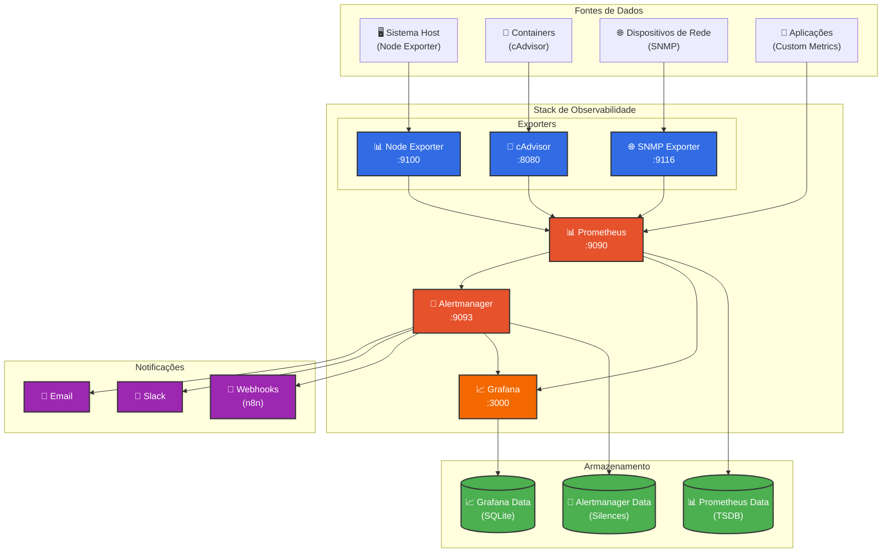

## Fluxo de Dados Detalhado

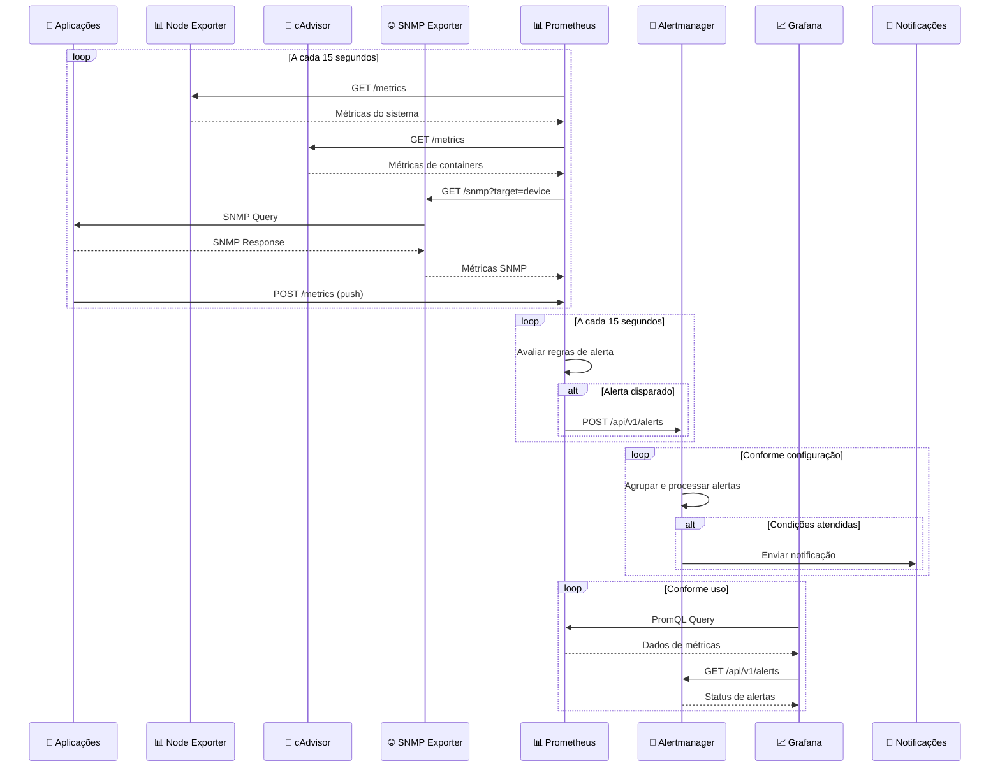

## Componentes da Arquitetura

### 1. Prometheus (Servidor Central de Métricas)

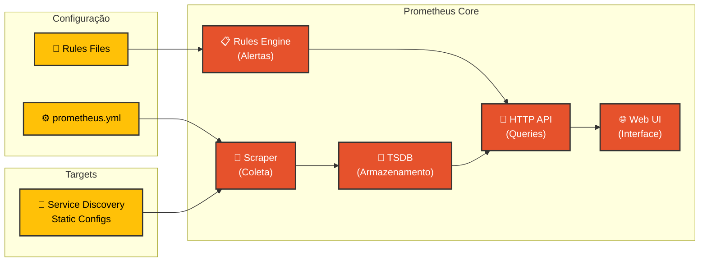

**Características:**
- **Modelo Pull**: Coleta ativa de métricas dos targets
- **TSDB**: Banco de dados otimizado para séries temporais
- **PromQL**: Linguagem de query poderosa e flexível
- **Service Discovery**: Descoberta automática de targets
- **Alerting**: Engine integrado para avaliação de regras

**Configurações Críticas:**
- **Retenção**: 15 dias (configurável)
- **Scrape Interval**: 15 segundos (balanceado)
- **Evaluation Interval**: 15 segundos (alertas)
- **Storage**: Volume persistente para dados

### 2. Grafana (Visualização e Dashboards)

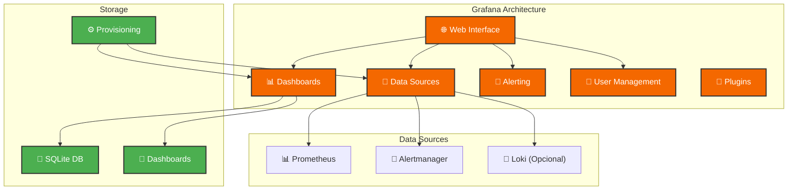

**Características:**
- **Multi-Datasource**: Suporte a múltiplas fontes de dados
- **Provisioning**: Configuração automática via arquivos
- **Alerting**: Sistema de alertas integrado (complementar)
- **Plugins**: Extensibilidade via plugins
- **RBAC**: Controle de acesso baseado em roles

**Configurações Importantes:**
- **Admin Password**: Configurável via variável de ambiente
- **Plugins**: Instalação automática via GF_INSTALL_PLUGINS
- **Provisioning**: Datasources e dashboards automáticos
- **Persistence**: Volume para dados e configurações

### 3. Alertmanager (Gerenciamento de Alertas)

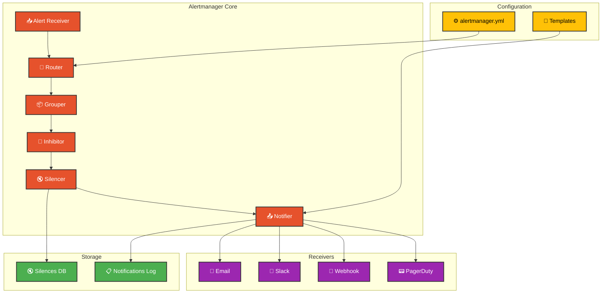

**Características:**
- **Routing**: Roteamento inteligente baseado em labels
- **Grouping**: Agrupamento de alertas relacionados
- **Inhibition**: Supressão de alertas redundantes
- **Silencing**: Silenciamento manual de alertas
- **Templates**: Personalização de mensagens

**Fluxo de Processamento:**
1. **Recepção**: Alertas do Prometheus
2. **Roteamento**: Baseado em labels e regras
3. **Agrupamento**: Por critérios configuráveis
4. **Inibição**: Supressão de alertas relacionados
5. **Silenciamento**: Verificação de silêncios ativos
6. **Notificação**: Envio para receivers configurados

### 4. Exporters (Coletores de Métricas)

#### Node Exporter

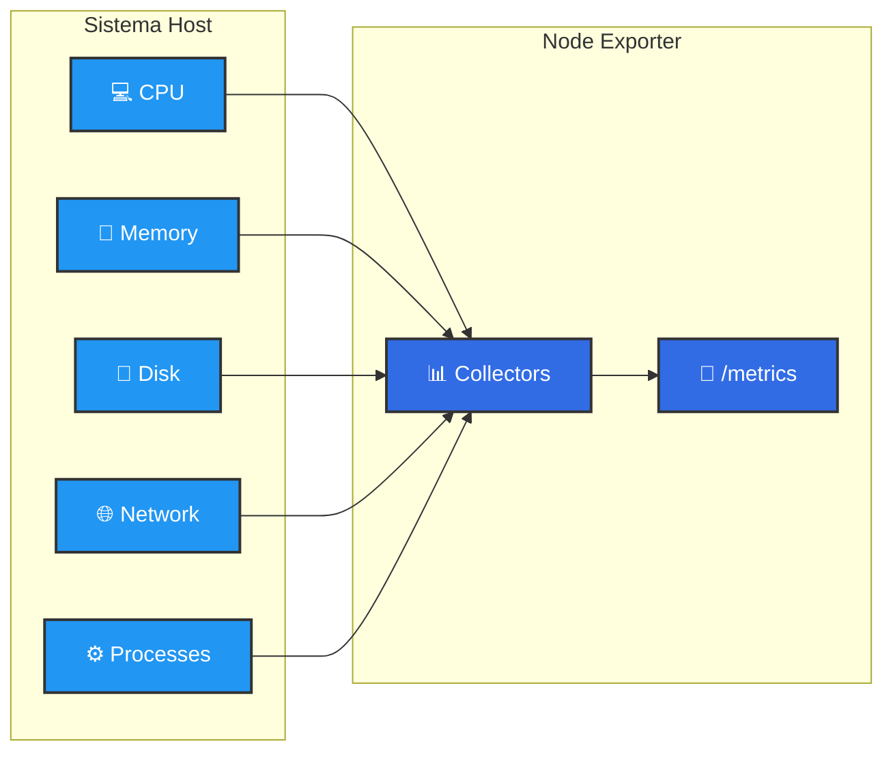

**Coletores Principais:**
- **cpu**: Uso de CPU por core e modo
- **memory**: Memória total, disponível, buffers, cache
- **filesystem**: Uso de disco por ponto de montagem
- **network**: Estatísticas de interfaces de rede
- **loadavg**: Load average do sistema
- **systemd**: Status de serviços systemd

#### cAdvisor

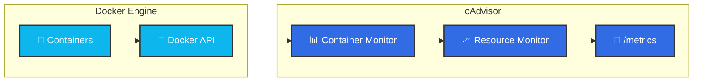

**Métricas Principais:**
- **container_cpu_usage_seconds_total**: Uso de CPU por container
- **container_memory_usage_bytes**: Uso de memória
- **container_network_***: Estatísticas de rede
- **container_fs_***: Uso de filesystem
- **container_last_seen**: Última vez visto

#### SNMP Exporter

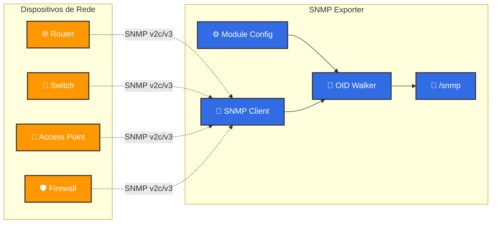

**Módulos Configurados:**
- **if_mib**: Interfaces de rede padrão
- **unifi_ap**: Access Points UniFi
- **pfsense**: Firewall pfSense
- **cisco_switch**: Switches Cisco
- **mikrotik**: Dispositivos MikroTik

## Rede e Conectividade

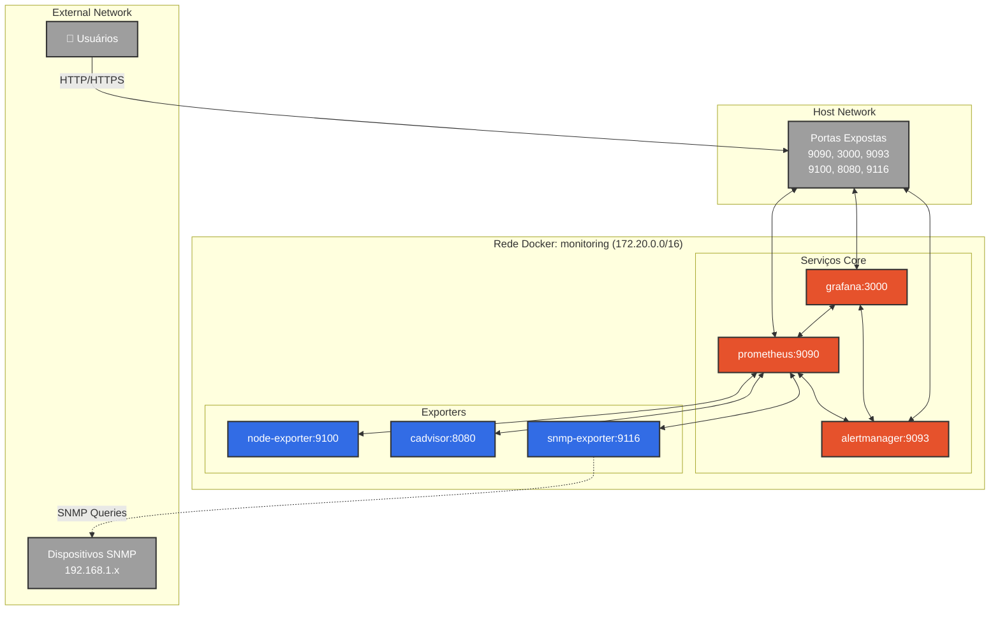

**Características da Rede:**
- **Rede Isolada**: Subnet dedicada 172.20.0.0/16
- **Service Discovery**: Resolução por nome de container
- **Port Mapping**: Exposição seletiva de portas
- **Firewall**: Controle de acesso via iptables/Docker

## Armazenamento e Persistência

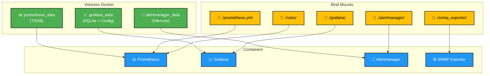

**Estratégia de Armazenamento:**
- **Volumes Nomeados**: Para dados que precisam persistir
- **Bind Mounts**: Para configurações editáveis
- **Backup Strategy**: Volumes podem ser facilmente backupeados
- **Performance**: Volumes locais otimizados

## Fluxo de Alertas

```mermaid
flowchart TD
    START(["🎯 Métrica Coletada"]) --> EVAL{"📊 Avaliação de Regra"}
    EVAL -->|Condição Atendida| FIRE["🔥 Alerta Disparado"]
    EVAL -->|Condição Normal| NORMAL["✅ Estado Normal"]
    
    FIRE --> ROUTE{"🔀 Roteamento"}
    ROUTE -->|Severidade Critical| CRITICAL["🚨 Rota Crítica"]
    ROUTE -->|Team Infrastructure| INFRA["🏗️ Rota Infraestrutura"]
    ROUTE -->|Team Application| APP["💻 Rota Aplicação"]
    ROUTE -->|Default| DEFAULT["📧 Rota Padrão"]
    
    CRITICAL --> GROUP_C["📦 Agrupamento<br/>(0s wait)"]
    INFRA --> GROUP_I["📦 Agrupamento<br/>(30s wait)"]
    APP --> GROUP_A["📦 Agrupamento<br/>(1m wait)"]
    DEFAULT --> GROUP_D["📦 Agrupamento<br/>(10s wait)"]
    
    GROUP_C --> INHIBIT{"🚫 Inibição"}
    GROUP_I --> INHIBIT
    GROUP_A --> INHIBIT
    GROUP_D --> INHIBIT
    
    INHIBIT -->|Não Inibido| SILENCE{"🔇 Silenciamento"}
    INHIBIT -->|Inibido| SUPPRESS["🚫 Suprimido"]
    
    SILENCE -->|Não Silenciado| NOTIFY["📤 Notificação"]
    SILENCE -->|Silenciado| MUTE["🔇 Silenciado"]
    
    NOTIFY --> EMAIL_N["📧 Email"]
    NOTIFY --> SLACK_N["💬 Slack"]
    NOTIFY --> WEBHOOK_N["🔗 Webhook"]
    
    NORMAL --> RESOLVE{"✅ Resolução"}
    RESOLVE -->|Alerta Ativo| RESOLVE_NOTIFY["📤 Notificação de Resolução"]
    RESOLVE -->|Sem Alerta| END(["🏁 Fim"])
    
    RESOLVE_NOTIFY --> END
    EMAIL_N --> END
    SLACK_N --> END
    WEBHOOK_N --> END
    SUPPRESS --> END
    MUTE --> END
    
    classDef start fill:#4caf50,stroke:#333,stroke-width:2px,color:#fff
    classDef decision fill:#ff9800,stroke:#333,stroke-width:2px,color:#fff
    classDef process fill:#2196f3,stroke:#333,stroke-width:2px,color:#fff
    classDef notification fill:#9c27b0,stroke:#333,stroke-width:2px,color:#fff
    classDef end fill:#f44336,stroke:#333,stroke-width:2px,color:#fff
    
    class START,END start
    class EVAL,ROUTE,INHIBIT,SILENCE,RESOLVE decision
    class FIRE,CRITICAL,INFRA,APP,DEFAULT,GROUP_C,GROUP_I,GROUP_A,GROUP_D,NOTIFY,RESOLVE_NOTIFY process
    class EMAIL_N,SLACK_N,WEBHOOK_N notification
    class NORMAL,SUPPRESS,MUTE end
```

## Segurança e Controle de Acesso

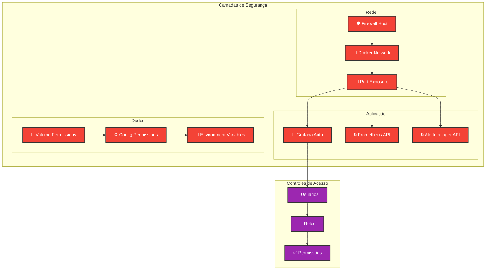

**Medidas de Segurança:**
- **Network Isolation**: Rede Docker isolada
- **Port Control**: Exposição mínima necessária
- **Authentication**: Grafana com autenticação obrigatória
- **Authorization**: Controle de acesso baseado em roles
- **Secrets Management**: Variáveis de ambiente para credenciais
- **File Permissions**: Controle de acesso a arquivos de configuração

## Escalabilidade e Alta Disponibilidade

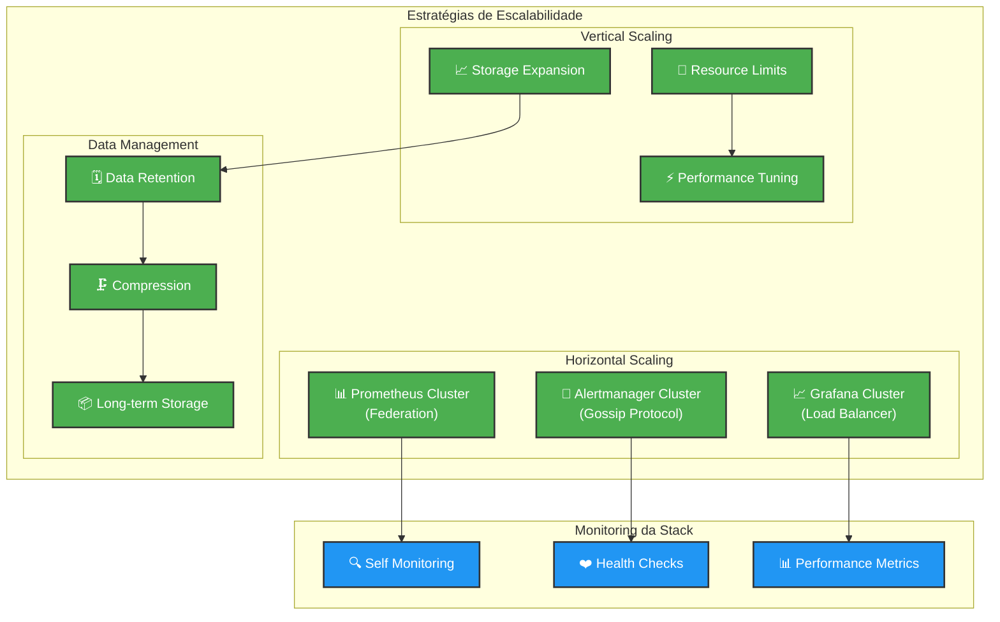

## Considerações de Performance

### 1. Otimizações do Prometheus

- **Scrape Interval**: 15s (balanceado)
- **Retention**: 15 dias (ajustável)
- **Memory**: 1GB limit (escalável)
- **Storage**: SSD recomendado
- **Query Optimization**: Uso eficiente de PromQL

### 2. Otimizações do Grafana

- **Caching**: Cache de queries habilitado
- **Concurrent Queries**: Limitado para evitar sobrecarga
- **Dashboard Optimization**: Queries eficientes
- **Refresh Intervals**: Configurados adequadamente

### 3. Otimizações de Rede

- **SNMP Timeouts**: Configurados por tipo de dispositivo
- **Scrape Timeouts**: Balanceados com intervals
- **Network Isolation**: Reduz latência interna
- **DNS Resolution**: Otimizado via Docker

## Manutenção e Operação

### 1. Backup Strategy

```bash
# Backup de volumes
docker run --rm -v prometheus_data:/data -v $(pwd):/backup alpine tar czf /backup/prometheus_backup.tar.gz -C /data .

# Backup de configurações
tar czf config_backup.tar.gz prometheus.yml alertmanager/ grafana/ snmp_exporter/ rules/
```

### 2. Monitoring da Stack

- **Self-monitoring**: Prometheus monitora a si mesmo
- **Health checks**: Verificações automáticas de saúde
- **Alertas meta**: Alertas sobre a própria stack
- **Performance metrics**: Métricas de performance dos componentes

### 3. Atualizações

- **Rolling updates**: Atualizações sem downtime
- **Version pinning**: Controle de versões específicas
- **Testing**: Ambiente de teste para validação
- **Rollback**: Estratégia de rollback rápido

Esta arquitetura fornece uma base sólida para observabilidade, com foco em confiabilidade, escalabilidade e facilidade de manutenção.