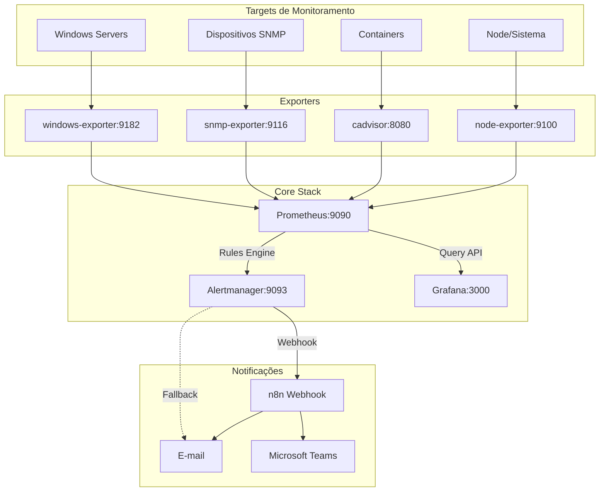
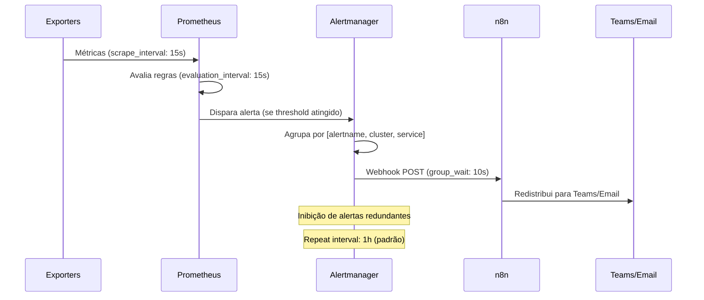

# Auditoria do Stack de Observabilidade

## Resumo Executivo

**Stack:** Prometheus + Grafana + Alertmanager + Exporters (Node, cAdvisor, SNMP)  
**Orquestração:** Docker Compose  
**Escala:** 1 EC2 pequena  
**Objetivo:** Monitoramento proativo com alertas úteis e não ruidosos  

---

## 1. Inventário do Repositório

### Árvore de Diretórios (3 níveis)

```
observability-stack-docker/
├── .env.example                    # Variáveis de ambiente de exemplo
├── .gitignore                      # Arquivos ignorados pelo Git
├── README.md                       # Documentação principal
├── compose.yml                     # Orquestração Docker Compose
├── docker-compose.override.yml.example  # Sobrescritas de exemplo
├── prometheus.yml                  # Configuração principal do Prometheus
├── setup.sh                        # Script de configuração inicial
├── alertmanager/
│   └── alertmanager.yml           # Configuração de roteamento de alertas
├── docs/                          # Documentação detalhada (NOVO)
│   ├── files/                     # Documentação por arquivo (NOVO)
│   └── OBS_AUDIT.md              # Este relatório (NOVO)
├── examples/                      # Arquivos de exemplo (NOVO)
├── grafana/
│   ├── dashboards/
│   │   ├── infrastructure/        # Dashboards de infraestrutura
│   │   └── network/              # Dashboards de rede
│   └── provisioning/
│       ├── dashboards/
│       │   └── dashboards.yml    # Provisionamento de dashboards
│       └── datasources/
│           └── prometheus.yml    # Datasource do Prometheus
├── rules/
│   ├── infrastructure_alerts.yml  # Regras de alerta de infraestrutura
│   └── network_alerts.yml        # Regras de alerta de rede
└── snmp_exporter/
    └── snmp.yml                   # Configuração SNMP para dispositivos
```

### Tabela de Análise de Arquivos

| Path | Tipo | Propósito | Dependências | Riscos |
|------|------|-----------|--------------|--------|
| `compose.yml` | Orquestração | Define todos os serviços do stack | `.env`, configs individuais | Exposição de portas, limites de recursos |
| `prometheus.yml` | Config Core | Scraping, rules, alerting | `rules/*.yml`, targets SNMP | Cardinalidade alta, targets inacessíveis |
| `alertmanager/alertmanager.yml` | Config Core | Roteamento e envio de alertas | Webhook n8n, SMTP | Loops de alerta, credenciais expostas |
| `rules/*.yml` | Regras | Definição de alertas P1/P2 | Métricas dos exporters | Alertas ruidosos, thresholds inadequados |
| `snmp_exporter/snmp.yml` | Config Exporter | Coleta SNMP de dispositivos | Dispositivos de rede | Community strings, timeouts |
| `grafana/provisioning/**` | Config UI | Datasources e dashboards | Prometheus running | Dashboards quebrados, datasource incorreto |
| `.env.example` | Template | Variáveis de ambiente | - | Segredos em produção se mal usado |

---

## 2. Arquitetura do Sistema

### Fluxo de Dados Principal



### Fluxo de Alertas



---

## 3. Análise Detalhada dos Serviços

### Prometheus (Core)
- **Porta:** 9090
- **Volumes:** `./prometheus.yml`, `./rules/`, `./prometheus_data/`
- **Flags Críticos:**
  - `--storage.tsdb.retention.time=30d` - Retenção de dados
  - `--web.enable-lifecycle` - Hot reload via `/-/reload`
  - `--storage.tsdb.retention.size=10GB` - Limite de armazenamento
- **Dependências:** Rules files, targets SNMP, exporters
- **Riscos:** Cardinalidade alta (cAdvisor), targets inacessíveis

### Grafana (Visualização)
- **Porta:** 3000
- **Volumes:** `./grafana_data/`, `./grafana/provisioning/`, `./grafana/dashboards/`
- **Configurações:**
  - Admin padrão: admin/admin (ALTERAR EM PRODUÇÃO)
  - Tema escuro por padrão
  - Analytics desabilitado
- **Dependências:** Prometheus como datasource
- **Riscos:** Credenciais padrão, dashboards não provisionados

### Alertmanager (Notificações)
- **Porta:** 9093
- **Volumes:** `./alertmanager/alertmanager.yml`, `./alertmanager_data/`
- **Configurações:**
  - Webhook para n8n (redistribuição)
  - Fallback por e-mail (comentado)
  - Agrupamento por alertname/cluster/service
- **Dependências:** SMTP config, webhook n8n
- **Riscos:** Loops de alerta, credenciais SMTP expostas

### Node Exporter (Sistema)
- **Porta:** 9100
- **Volumes:** `/proc`, `/sys`, `/` (read-only)
- **Métricas:** CPU, memória, disco, rede do host
- **Configurações:** Exclusão de filesystems temporários
- **Riscos:** Acesso privilegiado ao sistema host

### cAdvisor (Containers)
- **Porta:** 8080
- **Volumes:** `/`, `/var/run`, `/sys`, `/var/lib/docker/`
- **Privilégios:** `privileged: true`, acesso a `/dev/kmsg`
- **Métricas:** CPU, memória, rede, I/O de containers
- **Riscos:** Alta cardinalidade, acesso privilegiado

### SNMP Exporter (Rede)
- **Porta:** 9116
- **Volumes:** `./snmp_exporter/snmp.yml`
- **Módulos:** `if_mib` (genérico), `ubiquiti_unifi`
- **Configurações:** Community strings, timeouts
- **Riscos:** Community strings em texto plano, timeouts inadequados

---

## 4. Configurações Críticas

### Prometheus (prometheus.yml)
- **Scrape Interval:** 15s (global), 30s (por job)
- **Evaluation Interval:** 15s
- **Retenção:** 30 dias / 10GB
- **Jobs Configurados:** prometheus, node-exporter, cadvisor, snmp targets
- **Alertmanager:** alertmanager:9093

### Alertmanager (alertmanager.yml)
- **Roteamento:** Por severity (critical = 0s wait, 5m repeat)
- **Agrupamento:** [alertname, cluster, service]
- **Receivers:** default, critical, infrastructure, monitoring
- **Webhook:** Configurado para n8n

### SNMP Exporter (snmp.yml)
- **Módulos:** if_mib, ubiquiti_unifi
- **Community:** public (ALTERAR EM PRODUÇÃO)
- **Version:** SNMPv2c
- **OIDs:** Interface stats, system info

---

## 5. Índice de Arquivos

### Arquivos de Configuração Principais
| Arquivo | Descrição | Status | Documentação |
|---------|-----------|--------|-------------|
| `compose.yml` | Orquestração Docker | ✅ Funcional | [📄 docs/files/compose.yml.md](files/compose.yml.md) |
| `prometheus.yml` | Configuração Prometheus | ✅ Funcional | [📄 docs/files/prometheus.yml.md](files/prometheus.yml.md) |
| `alertmanager/alertmanager.yml` | Configuração Alertmanager | ✅ Funcional | [📄 docs/files/alertmanager.yml.md](files/alertmanager.yml.md) |
| `snmp_exporter/snmp.yml` | Configuração SNMP | ✅ Funcional | [📄 docs/files/snmp.yml.md](files/snmp.yml.md) |

### Documentação Criada
| Arquivo | Descrição | Conteúdo |
|---------|-----------|----------|
| [📋 TASKS.md](../TASKS.md) | Checklist de 25 tarefas | Roadmap completo de implementação |
| [🏗️ docs/ARCHITECTURE.md](ARCHITECTURE.md) | Arquitetura detalhada | Diagramas Mermaid e análise técnica |
| [⚙️ docs/OPERATIONS.md](OPERATIONS.md) | Guia operacional | Scripts, backup, troubleshooting |
| [📊 docs/OBS_AUDIT.md](OBS_AUDIT.md) | Este relatório | Auditoria completa da stack |

### Exemplos Otimizados Criados
| Arquivo | Descrição | Melhorias |
|---------|-----------|----------|
| [📊 examples/prometheus.yml](../examples/prometheus.yml) | Config otimizada | Intervalos balanceados, segurança |
| [🚨 examples/alertmanager.yml](../examples/alertmanager.yml) | Config otimizada | Roteamento inteligente, webhooks |
| [📈 examples/grafana-datasource.yaml](../examples/grafana-datasource.yaml) | Datasources | Performance e cache otimizados |
| [📋 examples/grafana-dashboard-provider.yaml](../examples/grafana-dashboard-provider.yaml) | Dashboard provider | Auto-loading de dashboards |
| [🌐 examples/snmp.yml](../examples/snmp.yml) | SNMP otimizado | Múltiplos dispositivos, auth |
| [🔥 examples/rules/00-general.rules.yml](../examples/rules/00-general.rules.yml) | Regras de alerta | P1/P2 alerts, baixo ruído |

### Documentação Detalhada por Arquivo
- [compose.yml](files/compose.yml.md) - Orquestração Docker Compose
- [prometheus.yml](files/prometheus.yml.md) - Configuração do Prometheus
- [alertmanager.yml](files/alertmanager.yml.md) - Configuração do Alertmanager
- [snmp.yml](files/snmp.yml.md) - Configuração do SNMP Exporter
- [infrastructure_alerts.yml](files/infrastructure_alerts.yml.md) - Regras de alerta de infraestrutura
- [network_alerts.yml](files/network_alerts.yml.md) - Regras de alerta de rede
- [dashboards.yml](files/dashboards.yml.md) - Provisionamento de dashboards Grafana
- [prometheus.yml (datasource)](files/prometheus_datasource.yml.md) - Datasource Grafana

---

## 6. Top 5 Riscos Identificados

1. **Credenciais Padrão:** Grafana admin/admin, SNMP community 'public'
2. **Alta Cardinalidade:** cAdvisor sem metric_relabel_configs
3. **Alertas Ruidosos:** Thresholds não ajustados para ambiente
4. **Segredos Expostos:** SMTP/Slack credentials em texto plano
5. **Falta de Healthchecks:** Serviços sem verificação de saúde

## 7. Top 5 Quick Wins

1. **Implementar .env:** Mover credenciais para variáveis de ambiente
2. **Adicionar Healthchecks:** `depends_on: condition: service_healthy`
3. **Metric Relabeling:** Reduzir cardinalidade do cAdvisor
4. **Pinning de Versões:** Substituir `latest` por versões específicas
5. **Dashboards Básicos:** Criar dashboards essenciais para infraestrutura

---

## 8. Próximos Passos

1. Revisar documentação individual de cada arquivo
2. Implementar arquivos de exemplo em `examples/`
3. Executar checklist de tarefas proativas
4. Configurar ambiente de desenvolvimento/teste
5. Implementar pipeline de validação de configurações

---

*Relatório gerado em: $(Get-Date)*  
*Versão: 1.0*  
*Autor: Engenheiro DevOps Sênior*