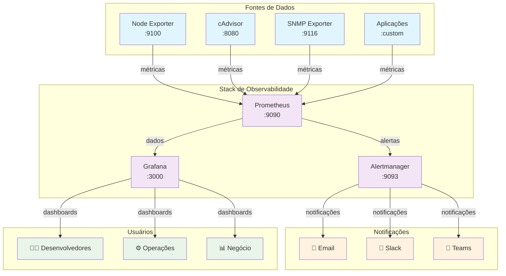

# 📚 EXPLICAÇÃO COMPLETA DO STACK DE OBSERVABILIDADE

> **Instrutor:** Engenheiro DevOps Sênior de Observabilidade  
> **Objetivo:** Explicar detalhadamente como funciona este repositório de observabilidade

---

## 📋 ÍNDICE

1. [Inventário do Repositório](#1-inventário-do-repositório)
2. [Explicação Arquitetural](#2-explicação-arquitetural)
3. [Explicação Detalhada dos Arquivos](#3-explicação-detalhada-dos-arquivos)
4. [Operação e Manutenção](#4-operação-e-manutenção)
5. [Glossário Didático](#5-glossário-didático)

---

## 1. INVENTÁRIO DO REPOSITÓRIO

### 🌳 Árvore de Diretórios (3 níveis)

```
observability-stack-docker/
├── compose.yml                          # Orquestração principal dos serviços
├── .env.example                         # Variáveis de ambiente de exemplo
├── prometheus.yml                       # Configuração principal do Prometheus
├── alertmanager/
│   ├── alertmanager.yml                # Configuração do Alertmanager
│   └── templates/                      # Templates de notificação
├── grafana/
│   ├── provisioning/
│   │   ├── datasources/               # Configuração automática de datasources
│   │   └── dashboards/                # Configuração automática de dashboards
│   └── dashboards/                    # Arquivos JSON dos dashboards
├── rules/
│   ├── infrastructure_alerts.yml      # Regras de alerta de infraestrutura
│   ├── docker_alerts.yml             # Regras de alerta para containers
│   └── snmp_alerts.yml               # Regras de alerta para dispositivos SNMP
├── snmp_exporter/
│   └── snmp.yml                       # Configuração do SNMP Exporter
├── examples/
│   ├── prometheus.yml                 # Exemplo de configuração modular
│   ├── alertmanager.yml              # Exemplo de configuração modular
│   ├── grafana-datasource.yaml       # Exemplo de datasource otimizado
│   ├── targets/                       # Arquivos de targets organizados
│   │   ├── node-exporters.yml        # Targets de servidores
│   │   ├── snmp-switches.yml         # Targets de dispositivos de rede
│   │   └── cadvisor.yml              # Targets de containers Docker
│   ├── rules/                         # Regras organizadas por categoria
│   └── validation/                    # Scripts de validação
├── docs/
│   ├── ARCHITECTURE.md               # Documentação da arquitetura
│   ├── OPERATIONS.md                 # Guia operacional
│   └── PROMETHEUS_MODULAR.md         # Documentação da estrutura modular
└── data/                             # Volumes persistentes (criado em runtime)
    ├── prometheus/
    ├── grafana/
    └── alertmanager/
```

### 📊 Tabela de Arquivos Principais

| **Path** | **Tipo** | **Propósito** | **Dependências** | **Riscos** |
|----------|----------|---------------|------------------|------------|
| `compose.yml` | YAML | Orquestração de todos os serviços | Docker, .env | Alto - falha afeta todo stack |
| `prometheus.yml` | YAML | Configuração central do Prometheus | rules/, targets | Alto - coleta de métricas |
| `alertmanager/alertmanager.yml` | YAML | Roteamento e envio de alertas | SMTP, Slack configs | Médio - notificações |
| `rules/*.yml` | YAML | Definição de alertas e regras | Prometheus | Médio - alertas críticos |
| `snmp_exporter/snmp.yml` | YAML | Configuração SNMP para rede | Dispositivos SNMP | Baixo - monitoramento rede |
| `grafana/provisioning/` | YAML | Configuração automática Grafana | Prometheus datasource | Baixo - visualização |
| `.env` | ENV | Variáveis de ambiente | Todos os serviços | Alto - credenciais e configs |
| `examples/targets/*.yml` | YAML | Definição de alvos de monitoramento | Exporters nos hosts | Médio - descoberta de serviços |

---

## 2. EXPLICAÇÃO ARQUITETURAL

### 🎯 Como Funciona o Stack de Observabilidade

Imagine o stack de observabilidade como uma **fábrica de informações** sobre sua infraestrutura. Cada componente tem um papel específico:

#### **Fluxo de Dados Simplificado:**
1. **Exporters** → Coletam métricas dos sistemas
2. **Prometheus** → Armazena e processa as métricas
3. **Alertmanager** → Recebe alertas e os distribui
4. **Grafana** → Visualiza os dados em dashboards

### 🔄 Diagrama de Arquitetura



### 🐳 Explicação dos Serviços Docker Compose

Vamos analisar cada serviço definido no `compose.yml`:

#### **Prometheus (Coletor Central)**
```yaml
prometheus:
  image: prom/prometheus:latest
  ports: ["9090:9090"]           # Interface web
  volumes:
    - ./prometheus.yml:/etc/prometheus/prometheus.yml  # Config principal
    - ./rules:/etc/prometheus/rules                    # Regras de alerta
    - prometheus_data:/prometheus                      # Dados persistentes
  command:
    - '--config.file=/etc/prometheus/prometheus.yml'  # Arquivo de config
    - '--storage.tsdb.path=/prometheus'               # Onde salvar dados
    - '--web.console.libraries=/etc/prometheus/console_libraries'
    - '--web.console.templates=/etc/prometheus/consoles'
    - '--storage.tsdb.retention.time=30d'             # Retenção de dados
    - '--web.enable-lifecycle'                        # Permite reload via API
```

**Parâmetros Importantes:**
- **ports**: Expõe interface web na porta 9090
- **volumes**: Monta configurações e dados persistentes
- **--storage.tsdb.retention.time**: Define por quanto tempo manter os dados
- **--web.enable-lifecycle**: Permite recarregar configuração sem restart

#### **Alertmanager (Gerenciador de Alertas)**
```yaml
alertmanager:
  image: prom/alertmanager:latest
  ports: ["9093:9093"]
  volumes:
    - ./alertmanager:/etc/alertmanager
    - alertmanager_data:/alertmanager
  command:
    - '--config.file=/etc/alertmanager/alertmanager.yml'
    - '--storage.path=/alertmanager'
    - '--web.external-url=http://localhost:9093'
```

#### **Grafana (Visualização)**
```yaml
grafana:
  image: grafana/grafana:latest
  ports: ["3000:3000"]
  environment:
    - GF_SECURITY_ADMIN_PASSWORD=${GRAFANA_ADMIN_PASSWORD}
  volumes:
    - grafana_data:/var/lib/grafana
    - ./grafana/provisioning:/etc/grafana/provisioning
```

#### **Exporters (Coletores de Métricas)**

**Node Exporter** - Métricas do sistema operacional:
```yaml
node-exporter:
  image: prom/node-exporter:latest
  ports: ["9100:9100"]
  volumes:
    - /proc:/host/proc:ro
    - /sys:/host/sys:ro
    - /:/rootfs:ro
```

**cAdvisor** - Métricas de containers:
```yaml
cadvisor:
  image: gcr.io/cadvisor/cadvisor:latest
  ports: ["8080:8080"]
  volumes:
    - /:/rootfs:ro
    - /var/run:/var/run:ro
    - /sys:/sys:ro
    - /var/lib/docker/:/var/lib/docker:ro
```

---

## 3. EXPLICAÇÃO DETALHADA DOS ARQUIVOS

### 📄 Capítulo 3.1: Arquivo Principal - compose.yml

**Papel no Stack:** Este é o "maestro" que orquestra todos os serviços do stack de observabilidade.

**Lógica de Funcionamento:**
- Define todos os serviços e suas interdependências
- Configura redes internas para comunicação entre serviços
- Gerencia volumes persistentes para dados
- Estabelece variáveis de ambiente e configurações

**Principais Seções:**

1. **Services**: Define cada componente (Prometheus, Grafana, etc.)
2. **Networks**: Cria rede interna para comunicação
3. **Volumes**: Gerencia armazenamento persistente

**Dependências:**
- Arquivos de configuração (prometheus.yml, alertmanager.yml)
- Arquivo .env com variáveis de ambiente
- Diretórios de dados para persistência

**Boas Práticas Implementadas:**
- Uso de volumes nomeados para persistência
- Separação de configurações em arquivos externos
- Definição de restart policies para alta disponibilidade
- Uso de redes customizadas para isolamento

### 📄 Capítulo 3.2: Configuração do Prometheus - prometheus.yml

**Papel no Stack:** É o "cérebro" do sistema de monitoramento, definindo o que monitorar e como processar os dados.

**Estrutura Principal:**

```yaml
global:
  scrape_interval: 15s          # Frequência de coleta
  evaluation_interval: 15s      # Frequência de avaliação de regras

scrape_configs:                 # Define o que monitorar
  - job_name: 'prometheus'
    static_configs:
      - targets: ['localhost:9090']

rule_files:                     # Arquivos de regras de alerta
  - "rules/*.yml"

alerting:
  alertmanagers:
    - static_configs:
        - targets: ['alertmanager:9093']
```

**Seções Importantes:**

1. **global**: Configurações que se aplicam a todo o Prometheus
2. **scrape_configs**: Define jobs de coleta de métricas
3. **rule_files**: Aponta para arquivos de regras de alerta
4. **alerting**: Configura conexão com Alertmanager

**Como Funciona a Coleta:**
- Prometheus faz requisições HTTP para os exporters
- Cada job define um grupo de targets (alvos)
- Métricas são armazenadas em formato time-series
- Labels permitem filtrar e agrupar dados

### 📄 Capítulo 3.3: Regras de Alerta - rules/infrastructure_alerts.yml

**Papel no Stack:** Define quando e como gerar alertas baseados nas métricas coletadas.

**Estrutura de uma Regra:**

```yaml
groups:
  - name: infrastructure.rules
    rules:
      - alert: InstanceDown          # Nome do alerta
        expr: up == 0               # Condição (PromQL)
        for: 1m                     # Duração mínima
        labels:
          severity: critical        # Severidade
        annotations:
          summary: "Instância down" # Descrição curta
          description: "Detalhes"   # Descrição completa
```

**Componentes de uma Regra:**
- **alert**: Nome único do alerta
- **expr**: Query PromQL que define a condição
- **for**: Tempo que a condição deve persistir
- **labels**: Metadados para roteamento
- **annotations**: Informações para notificações

**Boas Práticas Implementadas:**
- Severidades padronizadas (critical, warning, info)
- Descrições claras e acionáveis
- Agrupamento lógico por domínio (infrastructure, docker, snmp)

### 📄 Capítulo 3.4: Configuração do Alertmanager - alertmanager/alertmanager.yml

**Papel no Stack:** Gerencia o roteamento e envio de notificações de alertas.

**Estrutura Principal:**

```yaml
global:                    # Configurações globais (SMTP, etc.)
  smtp_smarthost: 'smtp.company.com:587'
  smtp_from: 'alerts@company.com'

route:                     # Árvore de roteamento
  group_by: ['alertname']
  group_wait: 10s
  group_interval: 10s
  repeat_interval: 1h
  receiver: 'default'
  routes:                  # Rotas específicas
    - match:
        severity: critical
      receiver: 'critical-alerts'

receivers:                 # Destinos das notificações
  - name: 'critical-alerts'
    email_configs:
      - to: 'ops@company.com'
```

**Conceitos Importantes:**
- **Grouping**: Agrupa alertas similares
- **Routing**: Direciona alertas para receivers específicos
- **Throttling**: Controla frequência de notificações
- **Silencing**: Permite suprimir alertas temporariamente

### 📄 Capítulo 3.5: Configuração SNMP - snmp_exporter/snmp.yml

**Papel no Stack:** Define como coletar métricas de dispositivos de rede via protocolo SNMP.

**Estrutura de um Módulo:**

```yaml
if_mib:                    # Nome do módulo
  walk:                    # OIDs para coletar
    - 1.3.6.1.2.1.2.2.1.2 # ifDescr
    - 1.3.6.1.2.1.2.2.1.8 # ifOperStatus
  lookups:                 # Mapeamentos
    - source_indexes: [ifIndex]
      lookup: 1.3.6.1.2.1.2.2.1.2
  version: 2             # Versão SNMP
  auth:
    community: public    # Community string
```

**Componentes:**
- **walk**: Lista de OIDs para coletar
- **lookups**: Mapeamento de índices para nomes
- **overrides**: Conversões de tipo de dados
- **auth**: Configurações de autenticação

### 📄 Capítulo 3.6: Provisionamento do Grafana

**Datasources (grafana/provisioning/datasources/prometheus.yml):**

```yaml
apiVersion: 1
datasources:
  - name: Prometheus
    type: prometheus
    url: http://prometheus:9090
    isDefault: true
    jsonData:
      httpMethod: POST
      manageAlerts: true
```

**Dashboards (grafana/provisioning/dashboards/dashboards.yml):**

```yaml
apiVersion: 1
providers:
  - name: 'default'
    type: file
    options:
      path: /var/lib/grafana/dashboards
```

**Benefícios do Provisionamento:**
- Configuração automática na inicialização
- Versionamento de configurações
- Consistência entre ambientes
- Facilita automação e CI/CD

### 📄 Capítulo 3.7: Targets Organizados (examples/targets/)

**node-exporters.yml** - Servidores:
```yaml
- targets: ['10.0.1.10:9100', '10.0.1.11:9100']
  labels:
    environment: 'production'
    service: 'web'
    team: 'infrastructure'
```

**snmp-switches.yml** - Dispositivos de rede:
```yaml
- targets: ['10.0.0.1', '10.0.0.2']
  labels:
    device_type: 'switch'
    vendor: 'cisco'
    snmp_module: 'cisco_ios'
```

**Vantagens da Organização:**
- Separação por tipo de dispositivo
- Labels consistentes para filtragem
- Facilita manutenção e adição de novos targets
- Permite validação independente

---

## 4. OPERAÇÃO E MANUTENÇÃO

### 🔧 Validação de Configurações

#### **Prometheus - Usando promtool**

```bash
# Validar arquivo de configuração principal
promtool check config prometheus.yml

# Validar regras de alerta
promtool check rules rules/*.yml

# Testar query PromQL
promtool query instant http://localhost:9090 'up'

# Validar targets específicos
promtool check config --syntax-only prometheus.yml
```

**O que o promtool verifica:**
- Sintaxe YAML correta
- Estrutura de configuração válida
- Queries PromQL nas regras
- Referências a arquivos existentes

#### **Alertmanager - Usando amtool**

```bash
# Validar configuração
amtool check-config alertmanager/alertmanager.yml

# Testar roteamento de alertas
amtool config routes test --config.file=alertmanager/alertmanager.yml

# Listar receivers configurados
amtool config show --config.file=alertmanager/alertmanager.yml

# Simular alerta
amtool alert add alertname="TestAlert" severity="warning"
```

### 🔄 Hot Reload (Recarga sem Parada)

#### **Prometheus:**
```bash
# Recarregar configuração via API
curl -X POST http://localhost:9090/-/reload

# Verificar status da configuração
curl http://localhost:9090/api/v1/status/config
```

#### **Alertmanager:**
```bash
# Recarregar configuração
curl -X POST http://localhost:9093/-/reload

# Verificar status
curl http://localhost:9093/api/v1/status
```

**Quando usar Hot Reload:**
- Alterações em regras de alerta
- Modificações em scrape_configs
- Ajustes em roteamento do Alertmanager
- **Não funciona para:** mudanças em command line flags

### 💾 Gerenciamento de Volumes e Dados

#### **Estrutura de Dados:**
```
data/
├── prometheus/          # Dados do Prometheus (TSDB)
│   ├── chunks_head/    # Dados em memória
│   ├── wal/           # Write-Ahead Log
│   └── 01ABCD.../     # Blocos de dados
├── grafana/            # Configurações e dashboards
│   ├── grafana.db     # Banco SQLite
│   └── plugins/       # Plugins instalados
└── alertmanager/       # Estado do Alertmanager
    └── nflog          # Log de notificações
```

#### **Backup Essencial:**
```bash
# Parar serviços
docker-compose down

# Backup dos volumes
tar -czf backup-$(date +%Y%m%d).tar.gz data/

# Backup das configurações
tar -czf config-backup-$(date +%Y%m%d).tar.gz \
  prometheus.yml alertmanager/ grafana/provisioning/ rules/

# Reiniciar serviços
docker-compose up -d
```

### 📊 Monitoramento dos Logs

#### **Logs Importantes para Acompanhar:**

```bash
# Logs do Prometheus
docker-compose logs -f prometheus

# Logs do Alertmanager
docker-compose logs -f alertmanager

# Logs do Grafana
docker-compose logs -f grafana

# Todos os logs
docker-compose logs -f
```

#### **Sinais de Problemas:**
- **Prometheus**: "context deadline exceeded", "target down"
- **Alertmanager**: "failed to send notification", "config reload failed"
- **Grafana**: "database locked", "plugin not found"

### 🔍 Troubleshooting Comum

#### **Problema: Targets Down**
```bash
# Verificar conectividade
telnet <target-ip> <port>

# Testar endpoint manualmente
curl http://<target-ip>:<port>/metrics

# Verificar logs do exporter
docker logs <exporter-container>
```

#### **Problema: Alertas Não Chegam**
```bash
# Verificar se alerta está ativo no Prometheus
curl http://localhost:9090/api/v1/alerts

# Verificar roteamento no Alertmanager
curl http://localhost:9093/api/v1/alerts

# Testar configuração SMTP
amtool config routes test --config.file=alertmanager.yml
```

#### **Problema: Grafana Não Conecta**
```bash
# Verificar datasource
curl http://localhost:3000/api/datasources

# Testar conectividade com Prometheus
curl http://prometheus:9090/api/v1/query?query=up
```

### 📈 Manutenção Preventiva

#### **Rotinas Semanais:**
- Verificar espaço em disco dos volumes
- Revisar alertas ativos e silenciados
- Validar configurações após mudanças
- Backup das configurações

#### **Rotinas Mensais:**
- Backup completo dos dados
- Revisão de regras de retenção
- Atualização de dashboards
- Limpeza de dados antigos

#### **Comandos de Manutenção:**
```bash
# Verificar uso de espaço
du -sh data/*

# Limpar dados antigos (cuidado!)
docker exec prometheus rm -rf /prometheus/01ABCD*

# Verificar saúde dos serviços
docker-compose ps
docker-compose top
```

---

## 5. GLOSSÁRIO DIDÁTICO

### 📚 Conceitos Fundamentais

**Alert (Alerta)**  
Uma condição que indica um problema ou situação que requer atenção. É gerado quando uma regra de alerta é ativada por uma métrica que atende aos critérios definidos.

**Alertmanager**  
Serviço responsável por receber alertas do Prometheus e gerenciar seu envio para diferentes canais (email, Slack, etc.). Ele agrupa, roteia e controla a frequência das notificações.

**Annotation (Anotação)**  
Informações descritivas adicionadas aos alertas, como resumo e descrição detalhada. Não são usadas para roteamento, apenas para fornecer contexto.

**cAdvisor (Container Advisor)**  
Exporter que coleta métricas de containers Docker, incluindo uso de CPU, memória, rede e I/O. Essencial para monitoramento de ambientes containerizados.

**Dashboard**  
Interface visual no Grafana que apresenta métricas em forma de gráficos, tabelas e outros elementos visuais. Permite monitoramento em tempo real e análise histórica.

**Datasource (Fonte de Dados)**  
Conexão configurada no Grafana para acessar dados de sistemas externos como Prometheus. Define como e onde buscar as métricas para visualização.

**Exporter**  
Aplicação que coleta métricas de sistemas específicos e as expõe em formato que o Prometheus pode coletar. Exemplos: node_exporter, snmp_exporter.

**Grafana**  
Plataforma de visualização e análise que cria dashboards interativos a partir de dados de múltiplas fontes. É a "interface visual" do stack de observabilidade.

**Hot Reload**  
Capacidade de recarregar configurações sem reiniciar o serviço. Permite aplicar mudanças rapidamente sem interrupção do monitoramento.

**Instance (Instância)**  
Um endpoint específico de onde o Prometheus coleta métricas. Geralmente identificado por IP:porta, representa um serviço ou aplicação monitorada.

**Job**  
Grupo de instâncias com o mesmo propósito de monitoramento. Por exemplo, todas as instâncias de um serviço web formam um job chamado "web-servers".

**Label (Rótulo)**  
Par chave-valor que adiciona metadados às métricas. Permite filtrar, agrupar e rotear dados. Exemplo: `environment="production"`, `service="web"`.

**Metric (Métrica)**  
Medida numérica coletada ao longo do tempo. Representa o estado de um sistema, como uso de CPU, memória disponível, ou número de requisições.

**Node Exporter**  
Exporter oficial que coleta métricas do sistema operacional Linux/Unix, incluindo CPU, memória, disco, rede e outros recursos do hardware.

**Notification (Notificação)**  
Mensagem enviada pelo Alertmanager quando um alerta é ativado. Pode ser enviada via email, Slack, webhook ou outros canais configurados.

**OID (Object Identifier)**  
Identificador único usado no protocolo SNMP para referenciar objetos específicos em dispositivos de rede. Exemplo: `1.3.6.1.2.1.2.2.1.8` para status de interface.

**Prometheus**  
Sistema de monitoramento que coleta, armazena e processa métricas em formato time-series. É o "coração" do stack, responsável pela coleta e armazenamento de dados.

**PromQL (Prometheus Query Language)**  
Linguagem de consulta específica do Prometheus para extrair e manipular dados de métricas. Permite criar queries complexas para alertas e visualizações.

**Provisioning (Provisionamento)**  
Configuração automática de componentes (datasources, dashboards) no Grafana através de arquivos YAML, eliminando configuração manual via interface.

**Receiver (Receptor)**  
Destino configurado no Alertmanager para onde os alertas são enviados. Pode ser email, Slack, webhook ou qualquer sistema que aceite notificações.

**Retention (Retenção)**  
Período de tempo que os dados são mantidos no armazenamento antes de serem automaticamente removidos. Balanceia entre histórico disponível e uso de espaço.

**Route (Rota)**  
Regra no Alertmanager que determina para qual receiver um alerta deve ser enviado, baseado em labels e condições específicas.

**Rule (Regra)**  
Definição que especifica quando um alerta deve ser gerado. Inclui condição PromQL, duração mínima e metadados como severidade e descrição.

**Scrape (Coleta)**  
Processo pelo qual o Prometheus faz requisições HTTP para exporters para coletar métricas. Acontece em intervalos regulares definidos na configuração.

**Scrape Config**  
Configuração que define como o Prometheus deve coletar métricas de um grupo de targets, incluindo intervalo, timeout e transformações.

**Severity (Severidade)**  
Nível de importância de um alerta (critical, warning, info). Usado para roteamento e priorização de notificações no Alertmanager.

**Silence (Silenciamento)**  
Supressão temporária de alertas no Alertmanager. Útil durante manutenções programadas ou quando um problema já é conhecido.

**SNMP (Simple Network Management Protocol)**  
Protocolo usado para monitorar e gerenciar dispositivos de rede como switches, roteadores e firewalls. Permite coleta de métricas via OIDs.

**Target (Alvo)**  
Endpoint específico (IP:porta) de onde o Prometheus coleta métricas. Cada target representa uma instância de um serviço ou aplicação.

**Template**  
Arquivo que define o formato das notificações enviadas pelo Alertmanager. Permite personalizar aparência e conteúdo das mensagens.

**Time Series (Série Temporal)**  
Sequência de pontos de dados indexados por tempo. Formato fundamental usado pelo Prometheus para armazenar métricas históricas.

**TSDB (Time Series Database)**  
Banco de dados otimizado para armazenar e consultar dados de séries temporais. O Prometheus usa seu próprio TSDB interno.

**Up**  
Métrica especial do Prometheus que indica se um target está acessível (1) ou não (0). Fundamental para alertas de disponibilidade.

**Volume**  
Armazenamento persistente no Docker que mantém dados mesmo quando containers são recriados. Essencial para preservar métricas e configurações.

**WAL (Write-Ahead Log)**  
Log de transações do Prometheus que garante durabilidade dos dados. Permite recuperação em caso de falha antes da gravação definitiva.

---

## 🎓 CONCLUSÃO

Este stack de observabilidade representa uma solução completa e profissional para monitoramento de infraestrutura. A arquitetura modular permite:

- **Escalabilidade**: Fácil adição de novos componentes
- **Manutenibilidade**: Configurações organizadas e versionadas
- **Confiabilidade**: Validação automática e backup de dados
- **Flexibilidade**: Adaptação para diferentes ambientes

Cada arquivo e configuração foi pensado para trabalhar em conjunto, criando um sistema robusto de observabilidade que atende desde pequenas infraestruturas até ambientes empresariais complexos.

**Próximos Passos Recomendados:**
1. Implementar em ambiente de teste
2. Personalizar alertas para sua infraestrutura
3. Criar dashboards específicos para suas necessidades
4. Integrar com sistemas de CI/CD
5. Estabelecer rotinas de backup e manutenção

---

*Documento criado por: Engenheiro DevOps Sênior de Observabilidade*  
*Data: Janeiro 2025*  
*Versão: 1.0*