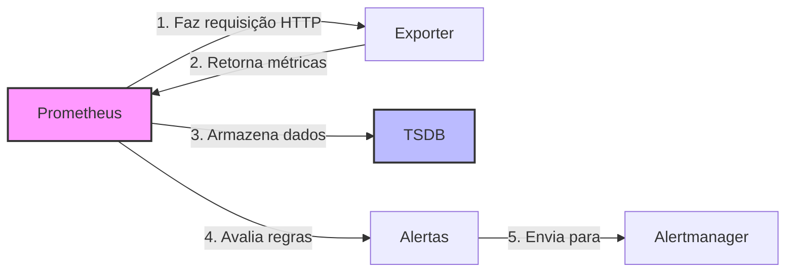

# 📊 PROMETHEUS - GUIA COMPLETO PARA INICIANTES

> **Instrutor:** Engenheiro DevOps Sênior  
> **Objetivo:** Ensinar como configurar e usar o Prometheus do zero

---

## 📋 ÍNDICE

1. [O que é o Prometheus?](#1-o-que-é-o-prometheus)
2. [Como Funciona](#2-como-funciona)
3. [Configuração Passo a Passo](#3-configuração-passo-a-passo)
4. [Entendendo o arquivo prometheus.yml](#4-entendendo-o-arquivo-prometheusyml)
5. [Coletando Métricas](#5-coletando-métricas)
6. [Queries PromQL](#6-queries-promql)
7. [Regras de Alerta](#7-regras-de-alerta)
8. [Troubleshooting](#8-troubleshooting)
9. [Exercícios Práticos](#9-exercícios-práticos)

---

## 1. O QUE É O PROMETHEUS?

### 🎯 Definição Simples

O **Prometheus** é como um "coletor de informações" que fica perguntando constantemente para seus sistemas: "Como você está?". Ele coleta essas respostas (métricas) e as guarda organizadamente para você poder:

- Ver gráficos de como seus sistemas estão funcionando
- Receber alertas quando algo está errado
- Analisar problemas que aconteceram no passado

### 🏗️ Analogia do Mundo Real

Imagine que você é gerente de uma fábrica e quer saber:
- Quantos produtos foram feitos por hora?
- Qual máquina está com problema?
- Quando a temperatura ficou muito alta?

O Prometheus é como ter **inspetores automáticos** que:
1. Visitam cada máquina a cada 15 segundos
2. Anotam todas as informações em um caderno especial
3. Te avisam quando algo está fora do normal

### 🔧 No Contexto de TI

```
Prometheus coleta métricas de:
├── Servidores (CPU, memória, disco)
├── Aplicações (requisições, erros, latência)
├── Bancos de dados (conexões, queries)
├── Containers Docker (uso de recursos)
└── Dispositivos de rede (tráfego, status)
```

---

## 2. COMO FUNCIONA

### 🔄 Ciclo de Funcionamento



### 📊 Modelo Pull vs Push

**Prometheus usa modelo PULL:**
- ✅ Prometheus vai buscar as métricas (como um jornalista fazendo entrevistas)
- ✅ Controle total sobre quando e como coletar
- ✅ Detecta quando um serviço está down

**Outros sistemas usam PUSH:**
- ❌ Serviços enviam métricas (como receber cartas)
- ❌ Difícil saber se um serviço parou de enviar dados

### 🎯 Componentes Principais

1. **Prometheus Server**: O "cérebro" que coleta e armazena
2. **Exporters**: "Tradutores" que expõem métricas de sistemas
3. **TSDB**: Banco de dados otimizado para séries temporais
4. **PromQL**: Linguagem para fazer perguntas aos dados
5. **Web UI**: Interface para visualizar e testar queries

---

## 3. CONFIGURAÇÃO PASSO A PASSO

### 🚀 Primeira Execução

#### Passo 1: Verificar se está funcionando
```bash
# Iniciar o stack
docker-compose up -d prometheus

# Verificar se subiu
docker-compose ps prometheus

# Ver logs
docker-compose logs prometheus
```

#### Passo 2: Acessar a interface
```
URL: http://localhost:9090
```

**O que você deve ver:**
- Interface web do Prometheus
- Menu "Status" → "Targets" mostra o que está sendo monitorado
- Menu "Graph" permite fazer queries

#### Passo 3: Primeira query
```promql
# Ver se o próprio Prometheus está funcionando
up

# Ver uso de CPU do Prometheus
rate(prometheus_tsdb_symbol_table_size_bytes[5m])
```

### 🔧 Estrutura de Arquivos

```
prometheus/
├── prometheus.yml          # Configuração principal
├── rules/                  # Regras de alerta
│   ├── infrastructure_alerts.yml
│   └── network_alerts.yml
└── data/                   # Dados armazenados (criado automaticamente)
    ├── chunks_head/
    ├── wal/
    └── 01ABCD.../          # Blocos de dados
```

---

## 4. ENTENDENDO O ARQUIVO PROMETHEUS.YML

### 📝 Estrutura Básica

```yaml
# prometheus.yml - Arquivo de configuração principal

# ========================================
# CONFIGURAÇÕES GLOBAIS
# ========================================
global:
  scrape_interval: 15s      # A cada 15s, coleta métricas
  evaluation_interval: 15s  # A cada 15s, avalia regras de alerta
  
  # Labels externos (aparecem em todas as métricas)
  external_labels:
    monitor: 'prometheus-monitor'
    datacenter: 'dc1'

# ========================================
# REGRAS DE ALERTA
# ========================================
rule_files:
  - "rules/*.yml"           # Carrega todas as regras da pasta rules/

# ========================================
# CONFIGURAÇÃO DE ALERTAS
# ========================================
alerting:
  alertmanagers:
    - static_configs:
        - targets:
          - alertmanager:9093   # Onde enviar alertas

# ========================================
# CONFIGURAÇÃO DE COLETA
# ========================================
scrape_configs:
  # Monitorar o próprio Prometheus
  - job_name: 'prometheus'
    static_configs:
      - targets: ['localhost:9090']
  
  # Monitorar servidores Linux
  - job_name: 'node-exporter'
    static_configs:
      - targets: ['node-exporter:9100']
    scrape_interval: 30s    # Sobrescreve o global para este job
```

### 🎯 Seção por Seção

#### **Global - Configurações Gerais**
```yaml
global:
  scrape_interval: 15s      # ⏰ Frequência de coleta
  evaluation_interval: 15s  # ⏰ Frequência de avaliação de regras
  scrape_timeout: 10s       # ⏱️ Timeout para cada coleta
  
  external_labels:          # 🏷️ Labels que aparecem em TODAS as métricas
    cluster: 'production'
    region: 'us-east-1'
```

**Dicas importantes:**
- `scrape_interval`: Menor = mais dados, mais recursos
- `evaluation_interval`: Deve ser igual ou múltiplo do scrape_interval
- `external_labels`: Útil para identificar origem em federações

#### **Rule Files - Arquivos de Regras**
```yaml
rule_files:
  - "rules/infrastructure_alerts.yml"
  - "rules/application_alerts.yml"
  - "rules/*.yml"                      # Carrega todos os .yml da pasta
```

#### **Scrape Configs - Configuração de Coleta**

Esta é a parte mais importante! Define **o que** monitorar:

```yaml
scrape_configs:
  # Job básico
  - job_name: 'meu-servico'
    static_configs:
      - targets: ['192.168.1.10:9100']
  
  # Job com configurações avançadas
  - job_name: 'web-servers'
    static_configs:
      - targets: 
          - '10.0.1.10:9100'
          - '10.0.1.11:9100'
        labels:
          environment: 'production'
          team: 'backend'
    
    # Configurações específicas deste job
    scrape_interval: 30s
    scrape_timeout: 10s
    metrics_path: '/metrics'    # Caminho onde buscar métricas
    
    # Transformações nos dados
    metric_relabel_configs:
      - source_labels: [__name__]
        regex: 'node_cpu_.*'
        target_label: 'cpu_metric'
        replacement: 'true'
```

### 🏷️ Entendendo Labels

Labels são como "etiquetas" que ajudam a organizar e filtrar métricas:

```yaml
# Exemplo de targets com labels
static_configs:
  - targets: ['web-01:9100', 'web-02:9100']
    labels:
      service: 'frontend'       # Todos os targets terão service=frontend
      environment: 'prod'       # Todos os targets terão environment=prod
      datacenter: 'dc1'
  
  - targets: ['api-01:9100', 'api-02:9100']
    labels:
      service: 'backend'
      environment: 'prod'
      datacenter: 'dc1'
```

**Como usar labels em queries:**
```promql
# CPU de todos os servidores frontend
node_cpu_seconds_total{service="frontend"}

# Memória apenas do ambiente de produção
node_memory_MemAvailable_bytes{environment="prod"}

# Combinar múltiplos labels
up{service="backend", datacenter="dc1"}
```

---

## 5. COLETANDO MÉTRICAS

### 🎯 Tipos de Métricas

O Prometheus trabalha com 4 tipos de métricas:

#### **1. Counter (Contador)**
- **O que é**: Número que só aumenta (como odômetro do carro)
- **Exemplo**: Número total de requisições HTTP
- **Uso**: `rate()` para calcular taxa por segundo

```promql
# Métrica counter
http_requests_total 1547

# Como usar (taxa de requisições por segundo)
rate(http_requests_total[5m])
```

#### **2. Gauge (Medidor)**
- **O que é**: Valor que pode subir e descer (como termômetro)
- **Exemplo**: Uso atual de CPU, memória disponível
- **Uso**: Direto, sem funções especiais

```promql
# Métrica gauge
node_memory_MemAvailable_bytes 2147483648

# Como usar (direto)
node_memory_MemAvailable_bytes
```

#### **3. Histogram (Histograma)**
- **O que é**: Distribui valores em "baldes" (buckets)
- **Exemplo**: Tempo de resposta de requisições
- **Uso**: `histogram_quantile()` para percentis

```promql
# Métricas histogram (geradas automaticamente)
http_request_duration_seconds_bucket{le="0.1"} 100
http_request_duration_seconds_bucket{le="0.5"} 150
http_request_duration_seconds_sum 45.2
http_request_duration_seconds_count 200

# Como usar (percentil 95)
histogram_quantile(0.95, rate(http_request_duration_seconds_bucket[5m]))
```

#### **4. Summary (Resumo)**
- **O que é**: Similar ao histogram, mas calcula percentis no cliente
- **Exemplo**: Latência de requisições
- **Uso**: Direto para percentis pré-calculados

```promql
# Métricas summary
http_request_duration_seconds{quantile="0.5"} 0.1
http_request_duration_seconds{quantile="0.95"} 0.3
http_request_duration_seconds_sum 45.2
http_request_duration_seconds_count 200
```

### 📊 Exporters Comuns

#### **Node Exporter - Métricas do Sistema**
```yaml
# No prometheus.yml
- job_name: 'node-exporter'
  static_configs:
    - targets: ['node-exporter:9100']
```

**Métricas importantes:**
```promql
# CPU usage (invertido, pois node_cpu é tempo idle)
100 - (avg(rate(node_cpu_seconds_total{mode="idle"}[5m])) * 100)

# Memória disponível em %
(node_memory_MemAvailable_bytes / node_memory_MemTotal_bytes) * 100

# Espaço em disco usado em %
100 - ((node_filesystem_avail_bytes / node_filesystem_size_bytes) * 100)

# Load average
node_load1

# Uptime em dias
node_time_seconds - node_boot_time_seconds
```

#### **cAdvisor - Métricas de Containers**
```yaml
# No prometheus.yml
- job_name: 'cadvisor'
  static_configs:
    - targets: ['cadvisor:8080']
```

**Métricas importantes:**
```promql
# CPU usage por container
rate(container_cpu_usage_seconds_total[5m])

# Memória usada por container
container_memory_usage_bytes

# I/O de rede por container
rate(container_network_receive_bytes_total[5m])
rate(container_network_transmit_bytes_total[5m])
```

### 🔍 Descobrindo Métricas

#### **Método 1: Interface Web**
1. Acesse http://localhost:9090
2. Vá em "Status" → "Targets"
3. Clique no endpoint de um target
4. Veja todas as métricas disponíveis

#### **Método 2: Linha de Comando**
```bash
# Ver métricas de um exporter
curl http://localhost:9100/metrics

# Filtrar métricas específicas
curl http://localhost:9100/metrics | grep node_cpu
```

#### **Método 3: Autocompletar no Prometheus**
1. Na interface web, vá em "Graph"
2. Comece digitando uma métrica
3. Use Ctrl+Space para autocompletar

---

## 6. QUERIES PROMQL

### 🎯 PromQL Básico

PromQL é a linguagem para "fazer perguntas" aos seus dados.

#### **Queries Simples**
```promql
# Buscar uma métrica específica
up

# Filtrar por label
up{job="prometheus"}

# Múltiplos filtros
up{job="prometheus", instance="localhost:9090"}

# Regex em labels
up{job=~"prometheus|node.*"}

# Negação
up{job!="prometheus"}
```

#### **Operadores Matemáticos**
```promql
# Somar duas métricas
node_memory_MemTotal_bytes + node_memory_MemFree_bytes

# Calcular percentual
(node_memory_MemAvailable_bytes / node_memory_MemTotal_bytes) * 100

# Subtrair
node_memory_MemTotal_bytes - node_memory_MemAvailable_bytes
```

#### **Funções de Tempo**
```promql
# Taxa por segundo (para counters)
rate(http_requests_total[5m])

# Incremento total (para counters)
increase(http_requests_total[1h])

# Derivada (para gauges)
deriv(node_memory_MemAvailable_bytes[5m])

# Delta (diferença)
delta(node_memory_MemAvailable_bytes[5m])
```

### 📊 Funções de Agregação

```promql
# Somar todos os valores
sum(rate(http_requests_total[5m]))

# Média
avg(node_cpu_seconds_total)

# Máximo e mínimo
max(node_memory_MemAvailable_bytes)
min(node_memory_MemAvailable_bytes)

# Contar instâncias
count(up == 1)

# Agrupar por label
sum by (job) (rate(http_requests_total[5m]))

# Agrupar sem label específico
sum without (instance) (rate(http_requests_total[5m]))
```

### 🎯 Queries Práticas

#### **Monitoramento de CPU**
```promql
# CPU usage por instância
100 - (avg by (instance) (rate(node_cpu_seconds_total{mode="idle"}[5m])) * 100)

# Top 5 servidores com maior CPU
topk(5, 100 - (avg by (instance) (rate(node_cpu_seconds_total{mode="idle"}[5m])) * 100))

# Servidores com CPU > 80%
(100 - (avg by (instance) (rate(node_cpu_seconds_total{mode="idle"}[5m])) * 100)) > 80
```

#### **Monitoramento de Memória**
```promql
# Memória disponível em %
(node_memory_MemAvailable_bytes / node_memory_MemTotal_bytes) * 100

# Memória usada em GB
(node_memory_MemTotal_bytes - node_memory_MemAvailable_bytes) / 1024 / 1024 / 1024

# Servidores com pouca memória (< 20%)
(node_memory_MemAvailable_bytes / node_memory_MemTotal_bytes) * 100 < 20
```

#### **Monitoramento de Disco**
```promql
# Espaço livre em %
(node_filesystem_avail_bytes / node_filesystem_size_bytes) * 100

# Partições quase cheias (< 10% livre)
(node_filesystem_avail_bytes / node_filesystem_size_bytes) * 100 < 10

# Crescimento de uso de disco (MB por hora)
derivative(node_filesystem_size_bytes - node_filesystem_avail_bytes[1h]) / 1024 / 1024
```

### 🔍 Dicas de PromQL

#### **1. Use o Console para Testar**
- Sempre teste queries na interface web primeiro
- Use "Table" para ver dados brutos
- Use "Graph" para visualizar tendências

#### **2. Entenda os Ranges**
```promql
# [5m] = últimos 5 minutos
# [1h] = última hora
# [1d] = último dia

# Para counters, sempre use rate() com range
rate(http_requests_total[5m])  # ✅ Correto
http_requests_total           # ❌ Não muito útil

# Para gauges, use direto ou com funções de tempo
node_memory_MemAvailable_bytes     # ✅ Valor atual
avg_over_time(node_memory_MemAvailable_bytes[1h])  # ✅ Média da última hora
```

#### **3. Performance**
```promql
# ✅ Bom: Filtra primeiro, agrega depois
sum(rate(http_requests_total{job="web"}[5m]))

# ❌ Ruim: Agrega tudo, filtra depois
sum(rate(http_requests_total[5m])){job="web"}

# ✅ Bom: Use labels específicos
node_cpu_seconds_total{instance="web-01:9100", mode="idle"}

# ❌ Ruim: Regex desnecessário
node_cpu_seconds_total{instance=~".*web-01.*"}
```

---

## 7. REGRAS DE ALERTA

### 🚨 Conceitos Básicos

Regras de alerta são "condições" que você define. Quando a condição é verdadeira por um tempo específico, o Prometheus gera um alerta.

#### **Estrutura de uma Regra**
```yaml
# rules/infrastructure_alerts.yml
groups:
  - name: infrastructure.rules    # Nome do grupo
    rules:
      - alert: HighCPUUsage      # Nome do alerta
        expr: |                  # Condição PromQL
          100 - (avg by (instance) (
            rate(node_cpu_seconds_total{mode="idle"}[5m])
          ) * 100) > 80
        for: 5m                  # Duração mínima
        labels:                  # Labels do alerta
          severity: warning
          team: infrastructure
        annotations:             # Informações descritivas
          summary: "CPU alta na instância {{ $labels.instance }}"
          description: "CPU está em {{ $value }}% por mais de 5 minutos"
```

### 🎯 Componentes Detalhados

#### **1. Groups (Grupos)**
```yaml
groups:
  - name: infrastructure.rules
    interval: 30s              # Frequência de avaliação (opcional)
    rules:
      # ... regras aqui
  
  - name: application.rules
    rules:
      # ... outras regras
```

**Por que usar grupos?**
- Organização lógica
- Diferentes intervalos de avaliação
- Facilita manutenção

#### **2. Alert Expression (expr)**
```yaml
# Expressão simples
expr: up == 0

# Expressão complexa (use | para múltiplas linhas)
expr: |
  (
    node_memory_MemTotal_bytes - node_memory_MemAvailable_bytes
  ) / node_memory_MemTotal_bytes * 100 > 90

# Com funções de agregação
expr: avg by (job) (up) < 0.8
```

#### **3. For Duration**
```yaml
for: 0s      # Alerta imediatamente
for: 1m      # Aguarda 1 minuto
for: 5m      # Aguarda 5 minutos (comum)
for: 15m     # Aguarda 15 minutos (para alertas menos críticos)
```

**Dica:** Use `for` para evitar alertas por "ruído" temporário.

#### **4. Labels**
```yaml
labels:
  severity: critical     # Severidade (critical, warning, info)
  team: infrastructure   # Equipe responsável
  service: web          # Serviço afetado
  runbook: "https://wiki.company.com/runbook/cpu-high"
```

**Labels importantes:**
- `severity`: Para roteamento no Alertmanager
- `team`: Para saber quem contactar
- `service`: Para contexto
- `runbook`: Link para procedimentos

#### **5. Annotations**
```yaml
annotations:
  summary: "Resumo curto do problema"
  description: "Descrição detalhada com contexto"
  dashboard: "http://grafana.company.com/d/node-exporter"
  runbook_url: "https://wiki.company.com/runbook/high-cpu"
```

**Usando variáveis:**
```yaml
annotations:
  summary: "CPU alta na instância {{ $labels.instance }}"
  description: |
    CPU usage está em {{ $value | humanizePercentage }} na instância {{ $labels.instance }}.
    Job: {{ $labels.job }}
    Duração: {{ $labels.for }}
```

### 📋 Exemplos Práticos

#### **Alertas de Infraestrutura**
```yaml
groups:
  - name: infrastructure.rules
    rules:
      # Instância down
      - alert: InstanceDown
        expr: up == 0
        for: 1m
        labels:
          severity: critical
        annotations:
          summary: "Instância {{ $labels.instance }} está down"
          description: "A instância {{ $labels.instance }} do job {{ $labels.job }} não responde há {{ $for }}."
      
      # CPU alta
      - alert: HighCPUUsage
        expr: |
          100 - (avg by (instance) (
            rate(node_cpu_seconds_total{mode="idle"}[5m])
          ) * 100) > 80
        for: 5m
        labels:
          severity: warning
        annotations:
          summary: "CPU alta na instância {{ $labels.instance }}"
          description: "CPU usage: {{ $value | humanizePercentage }}"
      
      # CPU crítica
      - alert: CriticalCPUUsage
        expr: |
          100 - (avg by (instance) (
            rate(node_cpu_seconds_total{mode="idle"}[5m])
          ) * 100) > 95
        for: 2m
        labels:
          severity: critical
        annotations:
          summary: "CPU crítica na instância {{ $labels.instance }}"
          description: "CPU usage: {{ $value | humanizePercentage }} por {{ $for }}"
      
      # Memória baixa
      - alert: LowMemory
        expr: |
          (node_memory_MemAvailable_bytes / node_memory_MemTotal_bytes) * 100 < 10
        for: 3m
        labels:
          severity: warning
        annotations:
          summary: "Pouca memória na instância {{ $labels.instance }}"
          description: "Memória disponível: {{ $value | humanizePercentage }}"
      
      # Disco cheio
      - alert: DiskSpaceLow
        expr: |
          (node_filesystem_avail_bytes / node_filesystem_size_bytes) * 100 < 15
        for: 5m
        labels:
          severity: warning
        annotations:
          summary: "Pouco espaço em disco na instância {{ $labels.instance }}"
          description: |
            Espaço livre: {{ $value | humanizePercentage }}
            Filesystem: {{ $labels.mountpoint }}
            Device: {{ $labels.device }}
```

#### **Alertas de Aplicação**
```yaml
groups:
  - name: application.rules
    rules:
      # Taxa de erro alta
      - alert: HighErrorRate
        expr: |
          (
            sum(rate(http_requests_total{status=~"5.."}[5m]))
            /
            sum(rate(http_requests_total[5m]))
          ) * 100 > 5
        for: 2m
        labels:
          severity: critical
        annotations:
          summary: "Taxa de erro alta"
          description: "Taxa de erro HTTP 5xx: {{ $value | humanizePercentage }}"
      
      # Latência alta
      - alert: HighLatency
        expr: |
          histogram_quantile(0.95, 
            sum(rate(http_request_duration_seconds_bucket[5m])) by (le)
          ) > 0.5
        for: 3m
        labels:
          severity: warning
        annotations:
          summary: "Latência alta detectada"
          description: "P95 latency: {{ $value }}s"
```

### 🔧 Validação de Regras

#### **Usando promtool**
```bash
# Validar sintaxe
promtool check rules rules/infrastructure_alerts.yml

# Testar regra específica
promtool query instant http://localhost:9090 'up == 0'

# Validar todas as regras
promtool check rules rules/*.yml
```

#### **Na Interface Web**
1. Acesse http://localhost:9090
2. Vá em "Status" → "Rules"
3. Veja todas as regras carregadas
4. Vá em "Alerts" para ver alertas ativos

### 🎯 Boas Práticas

#### **1. Naming Convention**
```yaml
# ✅ Bom: Descritivo e consistente
- alert: HighCPUUsage
- alert: LowDiskSpace
- alert: DatabaseConnectionFailed

# ❌ Ruim: Vago ou inconsistente
- alert: Problem
- alert: cpu_high
- alert: DB_CONN_ERR
```

#### **2. Severidades Padronizadas**
```yaml
# critical: Requer ação imediata (acordar alguém)
labels:
  severity: critical

# warning: Requer atenção (durante horário comercial)
labels:
  severity: warning

# info: Informativo (logs, relatórios)
labels:
  severity: info
```

#### **3. Annotations Úteis**
```yaml
annotations:
  # Resumo claro
  summary: "O que está acontecendo"
  
  # Descrição com contexto
  description: |
    Problema: {{ $labels.alertname }}
    Instância: {{ $labels.instance }}
    Valor atual: {{ $value }}
    Duração: {{ $for }}
  
  # Links úteis
  dashboard: "http://grafana/d/node-exporter?var-instance={{ $labels.instance }}"
  runbook: "https://wiki/runbooks/{{ $labels.alertname }}"
  
  # Ações sugeridas
  action: "Verificar logs em /var/log/app.log"
```

---

## 8. TROUBLESHOOTING

### 🔍 Problemas Comuns

#### **1. Targets Down**

**Sintomas:**
- Target aparece como "DOWN" em Status → Targets
- Métrica `up{job="meu-job"}` retorna 0

**Diagnóstico:**
```bash
# 1. Verificar conectividade
telnet 192.168.1.10 9100

# 2. Testar endpoint manualmente
curl http://192.168.1.10:9100/metrics

# 3. Verificar logs do Prometheus
docker-compose logs prometheus | grep "192.168.1.10"

# 4. Verificar configuração
promtool check config prometheus.yml
```

**Soluções:**
```yaml
# Problema: Timeout muito baixo
scrape_configs:
  - job_name: 'slow-service'
    scrape_timeout: 30s      # Aumentar timeout
    static_configs:
      - targets: ['slow-server:9100']

# Problema: Caminho errado
scrape_configs:
  - job_name: 'custom-app'
    metrics_path: '/custom/metrics'  # Caminho correto
    static_configs:
      - targets: ['app-server:8080']

# Problema: Porta errada
static_configs:
  - targets: ['server:9100']  # ✅ Porta correta do node_exporter
  # - targets: ['server:9000']  # ❌ Porta errada
```

#### **2. Métricas Não Aparecem**

**Diagnóstico:**
```promql
# Verificar se target está up
up{job="meu-job"}

# Listar todas as métricas de um job
{job="meu-job"}

# Verificar métricas específicas
node_cpu_seconds_total{job="meu-job"}
```

**Possíveis causas:**
- Exporter não está expondo a métrica
- Nome da métrica mudou
- Labels diferentes do esperado
- Métrica só aparece quando há dados

#### **3. Alertas Não Disparam**

**Diagnóstico:**
```bash
# 1. Verificar se regra está carregada
curl http://localhost:9090/api/v1/rules

# 2. Testar expressão manualmente
# Na interface web, teste a query da regra

# 3. Verificar logs
docker-compose logs prometheus | grep -i alert

# 4. Validar regras
promtool check rules rules/*.yml
```

**Soluções:**
```yaml
# Problema: Expressão incorreta
# ❌ Ruim
expr: node_cpu_usage > 80  # Métrica não existe

# ✅ Correto
expr: |
  100 - (avg by (instance) (
    rate(node_cpu_seconds_total{mode="idle"}[5m])
  ) * 100) > 80

# Problema: Labels não batem
# ❌ Ruim
expr: up{job="node-exporter"} == 0  # Job name errado

# ✅ Correto
expr: up{job="node"} == 0  # Job name correto
```

#### **4. Performance Lenta**

**Sintomas:**
- Queries demoram muito
- Interface web lenta
- Alto uso de CPU/memória

**Diagnóstico:**
```bash
# Verificar uso de recursos
docker stats prometheus

# Verificar tamanho dos dados
du -sh data/prometheus/

# Verificar queries lentas nos logs
docker-compose logs prometheus | grep "slow query"
```

**Soluções:**
```yaml
# 1. Ajustar retenção
global:
  # Reduzir tempo de retenção
  retention_time: 15d  # Padrão: 15d
  retention_size: 5GB  # Limitar tamanho

# 2. Reduzir frequência de coleta
scrape_configs:
  - job_name: 'less-critical'
    scrape_interval: 60s  # Ao invés de 15s
    static_configs:
      - targets: ['server:9100']

# 3. Filtrar métricas desnecessárias
scrape_configs:
  - job_name: 'filtered'
    static_configs:
      - targets: ['server:9100']
    metric_relabel_configs:
      # Remover métricas que começam com "node_textfile_"
      - source_labels: [__name__]
        regex: 'node_textfile_.*'
        action: drop
```

### 🔧 Comandos de Diagnóstico

#### **Status do Prometheus**
```bash
# Status geral
curl http://localhost:9090/api/v1/status/config

# Targets
curl http://localhost:9090/api/v1/targets

# Regras
curl http://localhost:9090/api/v1/rules

# Alertas ativos
curl http://localhost:9090/api/v1/alerts

# Informações do build
curl http://localhost:9090/api/v1/status/buildinfo
```

#### **Métricas Internas do Prometheus**
```promql
# Uso de memória do Prometheus
prometheus_tsdb_head_memory_usage_bytes

# Número de séries temporais
prometheus_tsdb_symbol_table_size_bytes

# Duração das queries
prometheus_engine_query_duration_seconds

# Targets por estado
prometheus_sd_discovered_targets

# Taxa de ingestão
rate(prometheus_tsdb_head_samples_appended_total[5m])
```

### 🚨 Logs Importantes

#### **Logs de Erro Comuns**
```bash
# Erro de conectividade
"context deadline exceeded"
"connection refused"
"no such host"

# Erro de configuração
"error loading config"
"invalid configuration"
"unknown field"

# Erro de parsing
"error parsing metric"
"invalid metric name"
"duplicate metric"

# Erro de recursos
"out of memory"
"disk full"
"too many open files"
```

#### **Como Analisar Logs**
```bash
# Logs em tempo real
docker-compose logs -f prometheus

# Filtrar por erro
docker-compose logs prometheus | grep -i error

# Filtrar por target específico
docker-compose logs prometheus | grep "192.168.1.10"

# Últimas 100 linhas
docker-compose logs --tail=100 prometheus
```

---

## 9. EXERCÍCIOS PRÁTICOS

### 🎯 Exercício 1: Primeira Configuração

**Objetivo:** Configurar monitoramento básico de um servidor.

**Passos:**
1. Adicione um novo job no `prometheus.yml`:
```yaml
scrape_configs:
  - job_name: 'meu-servidor'
    static_configs:
      - targets: ['192.168.1.100:9100']
        labels:
          environment: 'test'
          team: 'devops'
```

2. Recarregue a configuração:
```bash
curl -X POST http://localhost:9090/-/reload
```

3. Verifique se o target aparece em Status → Targets

4. Teste algumas queries:
```promql
# Verificar se está up
up{job="meu-servidor"}

# CPU usage
100 - (avg(rate(node_cpu_seconds_total{job="meu-servidor",mode="idle"}[5m])) * 100)

# Memória disponível
node_memory_MemAvailable_bytes{job="meu-servidor"}
```

**Resultado esperado:** Target UP e métricas disponíveis.

### 🎯 Exercício 2: Criando Alertas

**Objetivo:** Criar regras de alerta para o servidor do exercício 1.

**Passos:**
1. Crie o arquivo `rules/meu-servidor.yml`:
```yaml
groups:
  - name: meu-servidor.rules
    rules:
      - alert: MeuServidorDown
        expr: up{job="meu-servidor"} == 0
        for: 1m
        labels:
          severity: critical
          team: devops
        annotations:
          summary: "Meu servidor está down"
          description: "O servidor {{ $labels.instance }} não responde há {{ $for }}"
      
      - alert: MeuServidorCPUAlta
        expr: |
          100 - (avg(rate(node_cpu_seconds_total{job="meu-servidor",mode="idle"}[5m])) * 100) > 50
        for: 2m
        labels:
          severity: warning
          team: devops
        annotations:
          summary: "CPU alta no meu servidor"
          description: "CPU usage: {{ $value | humanizePercentage }}"
```

2. Adicione o arquivo no `prometheus.yml`:
```yaml
rule_files:
  - "rules/*.yml"
```

3. Valide e recarregue:
```bash
promtool check rules rules/meu-servidor.yml
curl -X POST http://localhost:9090/-/reload
```

4. Verifique em Status → Rules

**Resultado esperado:** Regras carregadas e alertas funcionando.

### 🎯 Exercício 3: Queries Avançadas

**Objetivo:** Praticar PromQL com queries úteis.

**Desafios:**

1. **Top 3 servidores com maior uso de CPU:**
```promql
topk(3, 
  100 - (avg by (instance) (
    rate(node_cpu_seconds_total{mode="idle"}[5m])
  ) * 100)
)
```

2. **Memória total de todos os servidores:**
```promql
sum(node_memory_MemTotal_bytes) / 1024 / 1024 / 1024
```

3. **Servidores com uptime > 30 dias:**
```promql
(node_time_seconds - node_boot_time_seconds) / 86400 > 30
```

4. **Taxa de crescimento de uso de disco (GB por dia):**
```promql
derivative(
  node_filesystem_size_bytes - node_filesystem_avail_bytes[1h]
) * 24 / 1024 / 1024 / 1024
```

5. **Previsão de quando o disco ficará cheio:**
```promql
predict_linear(
  node_filesystem_avail_bytes[6h], 
  7 * 24 * 3600  # 7 dias em segundos
) < 0
```

### 🎯 Exercício 4: Monitoramento de Aplicação

**Objetivo:** Monitorar uma aplicação web customizada.

**Cenário:** Sua aplicação expõe métricas em `/metrics`:
```
# HELP http_requests_total Total HTTP requests
# TYPE http_requests_total counter
http_requests_total{method="GET",status="200"} 1547
http_requests_total{method="GET",status="404"} 23
http_requests_total{method="POST",status="200"} 892
http_requests_total{method="POST",status="500"} 5

# HELP http_request_duration_seconds HTTP request duration
# TYPE http_request_duration_seconds histogram
http_request_duration_seconds_bucket{le="0.1"} 1200
http_request_duration_seconds_bucket{le="0.5"} 1450
http_request_duration_seconds_bucket{le="1.0"} 1467
http_request_duration_seconds_bucket{le="+Inf"} 1467
http_request_duration_seconds_sum 245.7
http_request_duration_seconds_count 1467
```

**Tarefas:**

1. **Configurar coleta:**
```yaml
scrape_configs:
  - job_name: 'minha-app'
    static_configs:
      - targets: ['app-server:8080']
    metrics_path: '/metrics'
```

2. **Queries úteis:**
```promql
# Requisições por segundo
sum(rate(http_requests_total[5m]))

# Taxa de erro (4xx + 5xx)
sum(rate(http_requests_total{status=~"[45].."}[5m])) / sum(rate(http_requests_total[5m])) * 100

# Latência P95
histogram_quantile(0.95, sum(rate(http_request_duration_seconds_bucket[5m])) by (le))

# Requisições por método
sum by (method) (rate(http_requests_total[5m]))
```

3. **Alertas para aplicação:**
```yaml
groups:
  - name: application.rules
    rules:
      - alert: HighErrorRate
        expr: |
          sum(rate(http_requests_total{status=~"[45].."}[5m])) / 
          sum(rate(http_requests_total[5m])) * 100 > 5
        for: 2m
        labels:
          severity: critical
        annotations:
          summary: "Taxa de erro alta na aplicação"
          description: "Taxa de erro: {{ $value | humanizePercentage }}"
      
      - alert: HighLatency
        expr: |
          histogram_quantile(0.95, 
            sum(rate(http_request_duration_seconds_bucket[5m])) by (le)
          ) > 1
        for: 3m
        labels:
          severity: warning
        annotations:
          summary: "Latência alta na aplicação"
          description: "P95 latency: {{ $value }}s"
```

### 🏆 Projeto Final: Stack Completo

**Objetivo:** Implementar monitoramento completo de uma infraestrutura fictícia.

**Infraestrutura:**
- 3 servidores web (nginx + app)
- 2 servidores de banco (PostgreSQL)
- 1 load balancer
- 2 switches de rede

**Requisitos:**
1. Monitorar todos os componentes
2. Criar alertas apropriados para cada tipo
3. Organizar em jobs lógicos
4. Usar labels consistentes
5. Criar regras de alerta por severidade

**Estrutura sugerida:**
```yaml
# prometheus.yml
scrape_configs:
  # Servidores web
  - job_name: 'web-servers'
    static_configs:
      - targets: 
          - 'web-01:9100'
          - 'web-02:9100'
          - 'web-03:9100'
        labels:
          tier: 'frontend'
          environment: 'production'
  
  # Aplicações
  - job_name: 'web-apps'
    static_configs:
      - targets:
          - 'web-01:8080'
          - 'web-02:8080'
          - 'web-03:8080'
        labels:
          tier: 'application'
          environment: 'production'
  
  # Bancos de dados
  - job_name: 'databases'
    static_configs:
      - targets:
          - 'db-01:9100'
          - 'db-02:9100'
        labels:
          tier: 'database'
          environment: 'production'
  
  # Load balancer
  - job_name: 'load-balancer'
    static_configs:
      - targets: ['lb-01:9100']
        labels:
          tier: 'loadbalancer'
          environment: 'production'
  
  # Switches (SNMP)
  - job_name: 'network-switches'
    static_configs:
      - targets:
          - 'switch-01'
          - 'switch-02'
        labels:
          tier: 'network'
          environment: 'production'
    metrics_path: /snmp
    params:
      module: [if_mib]
    relabel_configs:
      - source_labels: [__address__]
        target_label: __param_target
      - source_labels: [__param_target]
        target_label: instance
      - target_label: __address__
        replacement: snmp-exporter:9116
```

**Resultado esperado:** Stack completo funcionando com alertas apropriados para cada camada da infraestrutura.

---

## 🎓 CONCLUSÃO

Parabéns! Você completou o guia completo do Prometheus. Agora você sabe:

✅ **O que é e como funciona o Prometheus**  
✅ **Como configurar coleta de métricas**  
✅ **Como escrever queries PromQL**  
✅ **Como criar regras de alerta eficazes**  
✅ **Como fazer troubleshooting de problemas**  
✅ **Como implementar monitoramento completo**  

### 🚀 Próximos Passos

1. **Pratique com dados reais** - Implemente em um ambiente de teste
2. **Explore exporters específicos** - PostgreSQL, MySQL, Redis, etc.
3. **Aprenda Grafana** - Para visualizações avançadas
4. **Estude Alertmanager** - Para gerenciamento de notificações
5. **Implemente em produção** - Com backup e alta disponibilidade

### 📚 Recursos Adicionais

- **Documentação oficial:** https://prometheus.io/docs/
- **PromQL tutorial:** https://prometheus.io/docs/prometheus/latest/querying/basics/
- **Exporters oficiais:** https://prometheus.io/docs/instrumenting/exporters/
- **Best practices:** https://prometheus.io/docs/practices/

---

*Guia criado por: Engenheiro DevOps Sênior*  
*Data: Janeiro 2025*  
*Versão: 1.0*