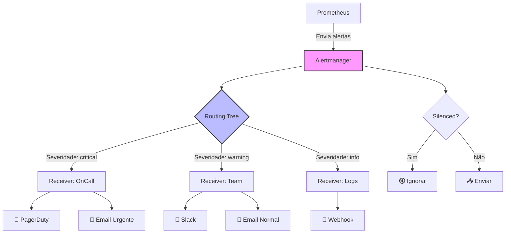
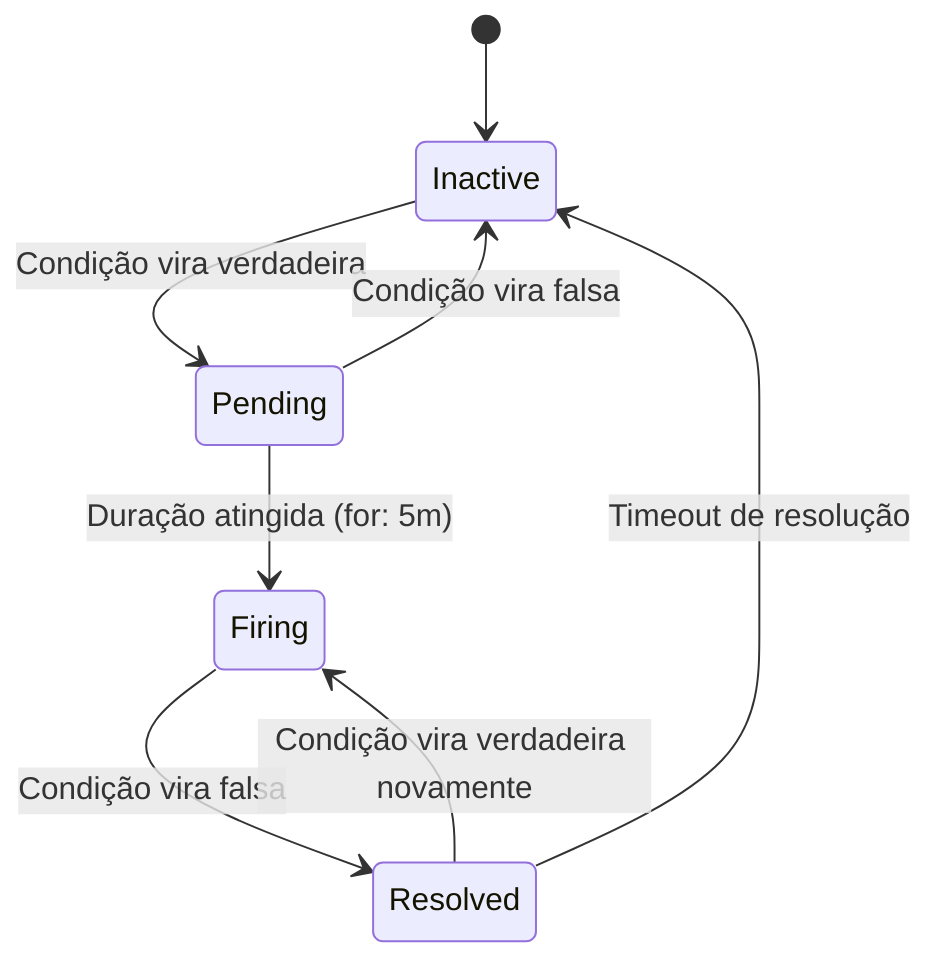

# 🚨 ALERTMANAGER - INTRODUÇÃO

> **Módulo 1:** O que é o Alertmanager e como funciona

---

## 📋 CONTEÚDO DESTE MÓDULO

1. [O que é o Alertmanager?](#1-o-que-é-o-alertmanager)
2. [Como Funciona](#2-como-funciona)
3. [Conceitos Fundamentais](#3-conceitos-fundamentais)
4. [Estados dos Alertas](#4-estados-dos-alertas)

---

## 1. O QUE É O ALERTMANAGER?

### 🎯 Definição Simples

O **Alertmanager** é como um "gerente de notificações inteligente" que recebe alertas do Prometheus e decide:

- **Para quem** enviar cada alerta
- **Como** enviar (email, Slack, SMS, etc.)
- **Quando** enviar (imediatamente, agrupado, etc.)
- **Se deve** enviar (pode estar silenciado)

### 🏗️ Analogia do Mundo Real

Imagine que você é o **porteiro de um prédio** e recebe várias emergências:

```
🔥 Incêndio no 5º andar    → Chama bombeiros IMEDIATAMENTE
💧 Vazamento no 2º andar   → Avisa zelador (pode esperar um pouco)
🔌 Luz queimada no hall    → Anota para manutenção (não é urgente)
🚨 Alarme disparado        → Se for teste, ignora; se real, chama segurança
```

O Alertmanager faz exatamente isso com alertas de TI:
- **Classifica** por severidade
- **Roteia** para a pessoa/equipe certa
- **Agrupa** alertas similares
- **Silencia** durante manutenções
- **Escala** se ninguém responder

### 🔧 No Contexto de Observabilidade

```
Fluxo de Alertas:
Prometheus → Alertmanager → Notificações
    ↓              ↓              ↓
 Detecta      Processa      Entrega
 Problemas    Inteligente   Pessoas
```

**Sem Alertmanager:**
- ❌ Spam de notificações
- ❌ Alertas para pessoas erradas
- ❌ Sem controle de horários
- ❌ Duplicação de notificações

**Com Alertmanager:**
- ✅ Notificações inteligentes
- ✅ Roteamento por equipe/severidade
- ✅ Silenciamento durante manutenções
- ✅ Agrupamento de alertas similares
- ✅ Escalação automática

---

## 2. COMO FUNCIONA

### 🔄 Fluxo de Processamento



### 🔄 Ciclo de Vida de um Alerta

```
1. 🔍 Prometheus detecta problema
2. ⏳ Alerta fica "Pending" por X tempo (for: 5m)
3. 🔥 Se persistir, vira "Firing"
4. 📤 Alertmanager processa e envia notificação
5. ✅ Quando problema resolve, vira "Resolved"
6. 📧 Alertmanager envia notificação de resolução
```

---

## 3. CONCEITOS FUNDAMENTAIS

### 🧠 Os 4 Pilares do Alertmanager

#### **1. Routing (Roteamento)**
- **O que é**: Árvore de decisão que determina onde cada alerta vai
- **Como funciona**: Baseado em labels dos alertas
- **Exemplo**: Alertas com `team=database` vão para o DBA

```yaml
# Exemplo de roteamento
route:
  routes:
    - match:
        team: database
      receiver: 'dba-team'
    - match:
        severity: critical
      receiver: 'oncall-team'
```

#### **2. Grouping (Agrupamento)**
- **O que é**: Junta alertas similares em uma única notificação
- **Como funciona**: Agrupa por labels específicos
- **Exemplo**: 10 servidores down = 1 notificação "Múltiplos servidores down"

```yaml
# Exemplo de agrupamento
route:
  group_by: ['alertname', 'cluster']
  group_wait: 10s
  group_interval: 5m
```

#### **3. Inhibition (Inibição)**
- **O que é**: Suprime alertas menos importantes quando há alertas críticos
- **Como funciona**: Regras que definem quais alertas "cancelam" outros
- **Exemplo**: Se datacenter está down, não avisar sobre servidores individuais

```yaml
# Exemplo de inibição
inhibit_rules:
  - source_match:
      alertname: 'DatacenterDown'
    target_match:
      alertname: 'InstanceDown'
    equal: ['datacenter']
```

#### **4. Silencing (Silenciamento)**
- **O que é**: Temporariamente desabilita alertas específicos
- **Como funciona**: Filtros por labels e tempo
- **Exemplo**: Durante manutenção, silenciar alertas do servidor X

```bash
# Exemplo de silenciamento via CLI
amtool silence add alertname="HighCPU" instance="web-01" \
  --duration="2h" --comment="Manutenção programada"
```

---

## 4. ESTADOS DOS ALERTAS

### ⏰ Estados Possíveis

```
Estados dos Alertas:
├── Inactive 😴   → Condição falsa (tudo OK)
├── Pending ⏳    → Condição verdadeira, aguardando duração mínima
├── Firing 🔥     → Alerta ativo (condição verdadeira por tempo suficiente)
└── Resolved ✅   → Alerta foi resolvido (voltou ao normal)
```

### 📊 Transições de Estado



### 🕐 Exemplo Prático de Transições

```
00:00 - CPU > 80% detectado → Pending
00:01 - CPU volta a 70%     → Inactive (não enviou alerta)
00:05 - CPU > 80% novamente → Pending
00:10 - Ainda > 80%         → Firing (envia alerta após 5min)
00:15 - CPU volta a 60%     → Resolved (envia resolução)
00:20 -                     → Inactive (após timeout)
```

---

## 🎯 RESUMO DO MÓDULO

### ✅ O que você aprendeu:

1. **Alertmanager é um gerente inteligente** de notificações
2. **Processa alertas** do Prometheus com 4 operações principais:
   - **Routing**: Para onde enviar
   - **Grouping**: Como agrupar
   - **Inhibition**: O que suprimir
   - **Silencing**: O que temporariamente ignorar
3. **Alertas têm estados** que transitam conforme as condições
4. **Fluxo completo**: Prometheus → Alertmanager → Notificações

### 🚀 Próximos Passos

Agora que você entende **o que é** o Alertmanager, vamos aprender **como configurá-lo**:

**Próximo módulo:** [02-configuracao.md](02-configuracao.md) - Configuração passo a passo

---

## 🔗 Links Relacionados

- **[Documentação Oficial - Conceitos](https://prometheus.io/docs/alerting/latest/overview/)**
- **[Próximo: Configuração](02-configuracao.md)**
- **[Voltar ao Índice](README.md)**