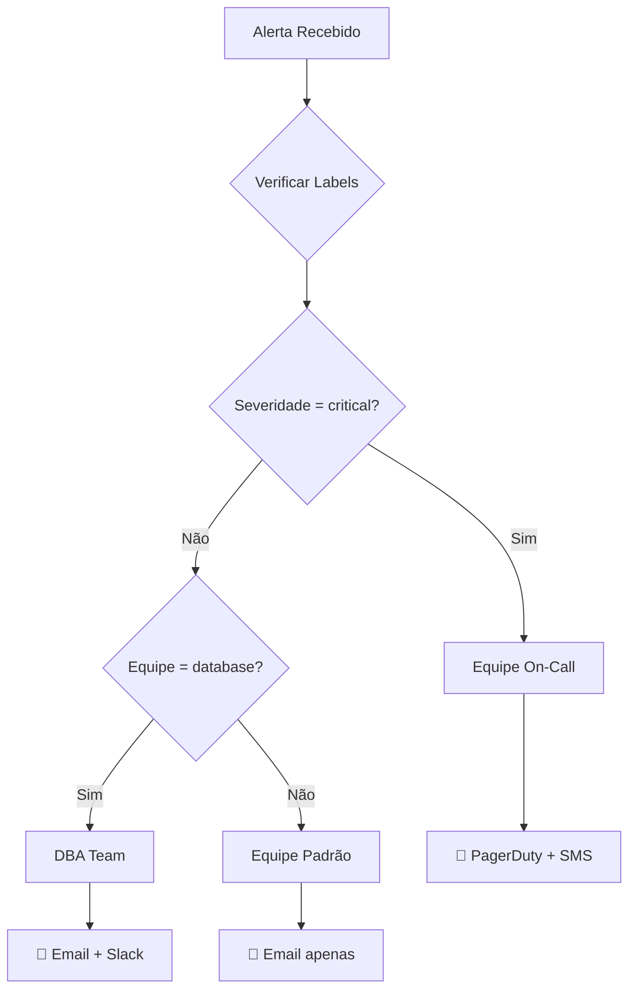

# 🛤️ ALERTMANAGER - ROTEAMENTO DE ALERTAS

> **Módulo 4:** Dominando o sistema de roteamento

---

## 📋 CONTEÚDO DESTE MÓDULO

1. [Conceitos de Roteamento](#1-conceitos-de-roteamento)
2. [Estrutura da Árvore de Rotas](#2-estrutura-da-árvore-de-rotas)
3. [Matchers e Seletores](#3-matchers-e-seletores)
4. [Roteamento por Severidade](#4-roteamento-por-severidade)
5. [Roteamento por Equipe](#5-roteamento-por-equipe)
6. [Roteamento por Horário](#6-roteamento-por-horário)
7. [Casos Práticos](#7-casos-práticos)

---

## 1. CONCEITOS DE ROTEAMENTO

### 🎯 O que é Roteamento?

> **Analogia:** Imagine o Alertmanager como um **correio inteligente**. Cada alerta é uma carta que precisa ser entregue no endereço correto. O roteamento são as **regras do carteiro** para decidir onde entregar cada carta.



### 🌳 Árvore de Decisão

O roteamento funciona como uma **árvore de decisão**:

```yaml
route:
  receiver: 'default'           # 🏠 Rota raiz (fallback)
  group_by: ['alertname']       # 📦 Como agrupar
  
  routes:                       # 🌿 Galhos da árvore
    - match:                    # 🎯 Condição 1
        severity: critical
      receiver: 'oncall-team'
      
    - match:                    # 🎯 Condição 2
        team: database
      receiver: 'dba-team'
      
    - match_re:                 # 🎯 Condição 3 (regex)
        service: '^web-.*'
      receiver: 'web-team'
```

### 🔄 Fluxo de Processamento

```
1. 📨 Alerta chega no Alertmanager
2. 🔍 Verifica labels do alerta
3. 🌳 Percorre árvore de rotas (top-down)
4. ✅ Primeira rota que "bate" é escolhida
5. 📤 Envia para o receiver da rota
6. ⏹️ Para o processamento (não continua)
```

---

## 2. ESTRUTURA DA ÁRVORE DE ROTAS

### 🏗️ Anatomia Completa

```yaml
route:
  # ========================================
  # 🏠 CONFIGURAÇÕES DA ROTA RAIZ
  # ========================================
  receiver: 'default'                    # Receiver padrão
  group_by: ['alertname', 'cluster']     # Como agrupar alertas
  group_wait: 10s                        # Aguardar novos alertas do grupo
  group_interval: 5m                     # Intervalo entre envios do grupo
  repeat_interval: 4h                    # Intervalo para reenvio
  
  # ========================================
  # 🌿 SUB-ROTAS (GALHOS)
  # ========================================
  routes:
    # 🚨 Rota para alertas críticos
    - match:
        severity: critical
      receiver: 'critical-team'
      group_wait: 0s                     # Sem espera para críticos
      repeat_interval: 5m                # Reenvia a cada 5min
      
      # 🌿 Sub-rotas dentro de críticos
      routes:
        - match:
            service: database
          receiver: 'dba-oncall'
        - match:
            service: payment
          receiver: 'payment-oncall'
    
    # ⚠️ Rota para warnings
    - match:
        severity: warning
      receiver: 'team-slack'
      group_wait: 30s
      repeat_interval: 2h
    
    # 📊 Rota para métricas de negócio
    - match_re:
        alertname: '^Business.*'
      receiver: 'business-team'
      group_by: ['department']
```

### 🎯 Ordem de Avaliação

```yaml
# ⚠️ IMPORTANTE: Ordem importa!
routes:
  # ✅ Específico primeiro
  - match:
      severity: critical
      service: payment
    receiver: 'payment-critical'    # Mais específico
  
  # ✅ Geral depois
  - match:
      severity: critical
    receiver: 'general-critical'    # Menos específico
  
  # ❌ Se inverter a ordem, payment nunca chegará ao receiver específico!
```

### 🔄 Herança de Configurações

```yaml
route:
  # 🏠 Configurações da raiz (herdadas por todos)
  group_by: ['alertname']
  group_wait: 10s
  group_interval: 5m
  repeat_interval: 4h
  
  routes:
    - match:
        severity: critical
      receiver: 'critical'
      # 🔄 Herda: group_by, group_interval
      # 🔧 Sobrescreve:
      group_wait: 0s              # Críticos sem espera
      repeat_interval: 1m         # Reenvia mais frequente
      
      routes:
        - match:
            team: database
          receiver: 'dba-critical'
          # 🔄 Herda tudo do pai (critical)
          # 🔧 Adiciona apenas o receiver específico
```

---

## 3. MATCHERS E SELETORES

### 🎯 Tipos de Match

```yaml
routes:
  # ========================================
  # 🎯 MATCH EXATO
  # ========================================
  - match:
      severity: critical          # Label = valor exato
      environment: production     # Múltiplas condições (AND)
    receiver: 'prod-critical'
  
  # ========================================
  # 🔍 MATCH COM REGEX
  # ========================================
  - match_re:
      service: '^web-.*'          # Serviços que começam com "web-"
      instance: '.*\.prod\..*'    # Instâncias com ".prod." no nome
    receiver: 'web-team'
  
  # ========================================
  # 🚫 MATCH NEGATIVO
  # ========================================
  - match:
      severity: critical
    match_re:
      alertname: '^(?!Test).*'    # NÃO começar com "Test"
    receiver: 'real-critical'
```

### 📝 Exemplos de Regex Úteis

```yaml
# Serviços web
service: '^(web|api|frontend)-.*'

# Ambientes de produção
environment: '^prod(uction)?$'

# Instâncias específicas
instance: '^(web|db|cache)-[0-9]+\.prod\.empresa\.com$'

# Alertas de sistema (não aplicação)
alertname: '^(Node|Docker|System).*'

# Horário comercial (09:00-18:00)
time: '^(09|1[0-7]):[0-5][0-9]$'

# Dias úteis (segunda a sexta)
day: '^(Mon|Tue|Wed|Thu|Fri)$'

# Excluir testes
alertname: '^(?!.*[Tt]est).*$'

# IPs privados
instance: '^(10\.|192\.168\.|172\.(1[6-9]|2[0-9]|3[01])\.).*'
```

### 🔗 Combinando Condições

```yaml
# ========================================
# 🤝 AND - Todas as condições devem ser verdadeiras
# ========================================
- match:
    severity: critical      # E
    environment: production # E
    team: database         # E
  receiver: 'dba-prod-critical'

# ========================================
# 🔀 OR - Múltiplas rotas para diferentes condições
# ========================================
- match:
    severity: critical
  receiver: 'critical-team'
- match:
    priority: high
  receiver: 'critical-team'    # Mesmo receiver para OR

# ========================================
# 🎭 COMPLEXO - Misturando match e match_re
# ========================================
- match:
    severity: warning
    environment: production
  match_re:
    service: '^(api|web)-.*'
    instance: '.*\.us-east-.*'
  receiver: 'us-east-web-team'
```

---

## 4. ROTEAMENTO POR SEVERIDADE

### 🚨 Estratégia por Criticidade

```yaml
route:
  receiver: 'default'
  routes:
    # ========================================
    # 🔴 CRÍTICO - Resposta imediata
    # ========================================
    - match:
        severity: critical
      receiver: 'oncall-team'
      group_wait: 0s              # Sem espera
      repeat_interval: 5m         # Reenvia a cada 5min
      
      routes:
        # 💾 Database crítico
        - match:
            service: database
          receiver: 'dba-oncall'
          
        # 💳 Payment crítico
        - match:
            service: payment
          receiver: 'payment-oncall'
          
        # 🌐 Web crítico
        - match_re:
            service: '^(web|api|frontend).*'
          receiver: 'web-oncall'
    
    # ========================================
    # 🟡 WARNING - Resposta em horário comercial
    # ========================================
    - match:
        severity: warning
      receiver: 'team-slack'
      group_wait: 30s
      repeat_interval: 2h
      
      # 🕘 Horário comercial vs fora do horário
      routes:
        - match:
            business_hours: 'true'
          receiver: 'team-slack'
        - match:
            business_hours: 'false'
          receiver: 'team-email'     # Só email fora do horário
    
    # ========================================
    # 🔵 INFO - Apenas logs
    # ========================================
    - match:
        severity: info
      receiver: 'logs-webhook'
      group_wait: 5m
      repeat_interval: 24h
```

### 📊 Receivers por Severidade

```yaml
receivers:
  # 🚨 Crítico: Múltiplos canais
  - name: 'oncall-team'
    pagerduty_configs:
      - routing_key: '${PAGERDUTY_KEY}'
        description: '🚨 {{ .GroupLabels.alertname }}'
    slack_configs:
      - channel: '#alerts-critical'
        title: '🔴 CRÍTICO: {{ .GroupLabels.alertname }}'
    email_configs:
      - to: 'oncall@empresa.com'
        subject: '[CRÍTICO] {{ .GroupLabels.alertname }}'
  
  # ⚠️ Warning: Slack + Email
  - name: 'team-slack'
    slack_configs:
      - channel: '#alerts-warning'
        title: '🟡 Warning: {{ .GroupLabels.alertname }}'
    email_configs:
      - to: 'team@empresa.com'
        subject: '[WARNING] {{ .GroupLabels.alertname }}'
  
  # 📧 Info: Apenas email
  - name: 'logs-webhook'
    webhook_configs:
      - url: 'http://logs-collector:8080/alerts'
        send_resolved: true
```

---

## 5. ROTEAMENTO POR EQUIPE

### 👥 Estrutura por Equipes

```yaml
route:
  receiver: 'default'
  group_by: ['team', 'severity']
  
  routes:
    # ========================================
    # 💾 EQUIPE DATABASE
    # ========================================
    - match:
        team: database
      receiver: 'dba-team'
      group_by: ['alertname', 'instance']
      
      routes:
        # Crítico DBA
        - match:
            severity: critical
          receiver: 'dba-oncall'
          group_wait: 0s
        
        # Warning DBA
        - match:
            severity: warning
          receiver: 'dba-slack'
    
    # ========================================
    # 🌐 EQUIPE WEB/FRONTEND
    # ========================================
    - match_re:
        team: '^(web|frontend|ui)$'
      receiver: 'web-team'
      
      routes:
        - match:
            severity: critical
          receiver: 'web-oncall'
        - match:
            severity: warning
          receiver: 'web-slack'
    
    # ========================================
    # 🔧 EQUIPE INFRAESTRUTURA
    # ========================================
    - match:
        team: infrastructure
      receiver: 'infra-team'
      
      routes:
        # Kubernetes
        - match_re:
            alertname: '^(Kube|Pod|Node).*'
          receiver: 'k8s-team'
        
        # Docker
        - match_re:
            alertname: '^Docker.*'
          receiver: 'docker-team'
        
        # Rede
        - match_re:
            alertname: '^(Network|SNMP).*'
          receiver: 'network-team'
    
    # ========================================
    # 💼 EQUIPE NEGÓCIO
    # ========================================
    - match_re:
        alertname: '^Business.*'
      receiver: 'business-team'
      group_by: ['department', 'kpi']
```

### 🏢 Receivers por Departamento

```yaml
receivers:
  # 💾 Database Team
  - name: 'dba-team'
    email_configs:
      - to: 'dba@empresa.com'
        subject: '[DBA] {{ .GroupLabels.alertname }}'
  
  - name: 'dba-oncall'
    pagerduty_configs:
      - routing_key: '${DBA_PAGERDUTY_KEY}'
    slack_configs:
      - channel: '#dba-alerts'
  
  # 🌐 Web Team
  - name: 'web-team'
    slack_configs:
      - channel: '#web-team'
        username: 'AlertBot'
        icon_emoji: ':warning:'
  
  # 🔧 Infrastructure Team
  - name: 'infra-team'
    email_configs:
      - to: 'infra@empresa.com'
    slack_configs:
      - channel: '#infrastructure'
  
  # ☸️ Kubernetes Team
  - name: 'k8s-team'
    slack_configs:
      - channel: '#kubernetes'
        title: '☸️ K8s Alert: {{ .GroupLabels.alertname }}'
```

---

## 6. ROTEAMENTO POR HORÁRIO

### 🕐 Configuração por Tempo

```yaml
# Primeiro, configure labels de tempo no Prometheus
# prometheus.yml
rule_files:
  - "rules/time-labels.yml"

# rules/time-labels.yml
groups:
  - name: time-labels
    rules:
      - record: business_hours
        expr: |
          (hour() >= 9 and hour() < 18) and 
          (day_of_week() > 0 and day_of_week() < 6)
        labels:
          business_hours: "true"
      
      - record: after_hours
        expr: |
          (hour() < 9 or hour() >= 18) or 
          (day_of_week() == 0 or day_of_week() == 6)
        labels:
          business_hours: "false"
```

### ⏰ Roteamento Temporal

```yaml
route:
  receiver: 'default'
  routes:
    # ========================================
    # 🌅 HORÁRIO COMERCIAL (9h-18h, Seg-Sex)
    # ========================================
    - match:
        business_hours: 'true'
      receiver: 'business-hours-team'
      
      routes:
        # Crítico em horário comercial
        - match:
            severity: critical
          receiver: 'oncall-immediate'
          group_wait: 0s
        
        # Warning em horário comercial
        - match:
            severity: warning
          receiver: 'team-slack'
          group_wait: 30s
    
    # ========================================
    # 🌙 FORA DO HORÁRIO (noites, fins de semana)
    # ========================================
    - match:
        business_hours: 'false'
      receiver: 'after-hours-team'
      
      routes:
        # Só críticos acordam pessoas
        - match:
            severity: critical
          receiver: 'oncall-night'
          group_wait: 0s
        
        # Warnings viram emails
        - match:
            severity: warning
          receiver: 'night-email'
          group_wait: 5m
          repeat_interval: 8h    # Menos frequente à noite
```

### 📅 Receivers Temporais

```yaml
receivers:
  # 🌅 Horário comercial - Resposta rápida
  - name: 'business-hours-team'
    slack_configs:
      - channel: '#alerts'
        title: '🌅 Horário Comercial: {{ .GroupLabels.alertname }}'
    email_configs:
      - to: 'team@empresa.com'
  
  # 🌙 Fora do horário - Só críticos
  - name: 'after-hours-team'
    email_configs:
      - to: 'oncall@empresa.com'
        subject: '🌙 [FORA DO HORÁRIO] {{ .GroupLabels.alertname }}'
  
  # 📱 On-call noturno
  - name: 'oncall-night'
    pagerduty_configs:
      - routing_key: '${NIGHT_ONCALL_KEY}'
        description: '🌙 Alerta Noturno: {{ .GroupLabels.alertname }}'
    sms_configs:
      - to: '+5511999999999'
        body: '🚨 {{ .GroupLabels.alertname }}'
```

---

## 7. CASOS PRÁTICOS

### 🏥 Caso 1: Hospital (24/7 Crítico)

```yaml
route:
  receiver: 'default'
  group_by: ['department', 'severity']
  
  routes:
    # 🚑 Sistemas críticos de vida
    - match_re:
        service: '^(life-support|patient-monitor|emergency).*'
      receiver: 'medical-emergency'
      group_wait: 0s
      repeat_interval: 1m
      
    # 🏥 Sistemas hospitalares
    - match:
        department: medical
      receiver: 'medical-team'
      
      routes:
        - match:
            severity: critical
          receiver: 'medical-oncall'
        - match:
            shift: night
          receiver: 'night-nurse'
    
    # 💊 Farmácia
    - match:
        department: pharmacy
      receiver: 'pharmacy-team'
```

### 🏦 Caso 2: Banco (Segurança Máxima)

```yaml
route:
  receiver: 'security-team'    # Tudo vai para segurança primeiro
  
  routes:
    # 🔒 Segurança crítica
    - match_re:
        alertname: '^(Security|Fraud|Breach).*'
      receiver: 'security-immediate'
      group_wait: 0s
      repeat_interval: 30s
      
    # 💳 Transações
    - match:
        service: payment
      receiver: 'payment-team'
      
      routes:
        - match:
            severity: critical
          receiver: 'payment-oncall'
          
        # 💰 Valores altos
        - match_re:
            amount: '^[1-9][0-9]{6,}$'  # > 1 milhão
          receiver: 'high-value-team'
    
    # 🏛️ Core banking
    - match:
        system: core-banking
      receiver: 'core-banking-team'
      group_wait: 0s              # Zero tolerância
```

### 🛒 Caso 3: E-commerce (Sazonal)

```yaml
route:
  receiver: 'default'
  
  routes:
    # 🎄 Black Friday / Natal (modo especial)
    - match:
        season: high-traffic
      receiver: 'high-season-team'
      group_wait: 5s              # Resposta mais rápida
      repeat_interval: 30m
      
      routes:
        # 💳 Pagamentos em alta temporada
        - match:
            service: payment
          receiver: 'payment-high-season'
          group_wait: 0s
        
        # 📦 Logística
        - match:
            service: logistics
          receiver: 'logistics-high-season'
    
    # 🛒 Carrinho de compras
    - match:
        service: cart
      receiver: 'cart-team'
      
      routes:
        # 💸 Carrinho abandonado (não crítico)
        - match:
            alertname: CartAbandoned
          receiver: 'marketing-team'
          repeat_interval: 24h
    
    # 📊 Métricas de negócio
    - match_re:
        alertname: '^Revenue.*'
      receiver: 'business-team'
      group_by: ['product_category']
```

### 🎮 Caso 4: Gaming (Latência Crítica)

```yaml
route:
  receiver: 'default'
  group_by: ['game', 'region']
  
  routes:
    # 🎯 Latência crítica
    - match_re:
        alertname: '^(Latency|Lag|Ping).*'
      receiver: 'performance-team'
      group_wait: 0s
      
      routes:
        # 🌍 Por região
        - match:
            region: us-east
          receiver: 'us-performance'
        - match:
            region: eu-west
          receiver: 'eu-performance'
        - match:
            region: asia-pacific
          receiver: 'apac-performance'
    
    # 🎮 Servidores de jogo
    - match:
        service: game-server
      receiver: 'game-ops'
      
      routes:
        # 🏆 Torneios (prioridade máxima)
        - match:
            tournament: active
          receiver: 'tournament-ops'
          group_wait: 0s
          repeat_interval: 1m
    
    # 💰 Microtransações
    - match:
        service: store
      receiver: 'monetization-team'
```

---

## 🧪 TESTANDO ROTEAMENTO

### 🔍 Comando amtool

```bash
# Testar roteamento específico
amtool config routes test \
  --config.file=alertmanager.yml \
  severity=critical team=database service=mysql

# Resultado:
# Matched: dba-critical

# Ver árvore completa
amtool config routes show --config.file=alertmanager.yml

# Resultado:
# Routing tree:
# .
# └── default  {}
#     ├── critical-team  {severity="critical"}
#     │   ├── dba-critical  {service="database"}
#     │   └── web-critical  {service=~"^web-.*"}
#     └── team-slack  {severity="warning"}
```

### 🧪 Simulação de Alertas

```bash
# Enviar alerta de teste
curl -XPOST http://localhost:9093/api/v1/alerts -H 'Content-Type: application/json' -d '[
  {
    "labels": {
      "alertname": "TestAlert",
      "severity": "critical",
      "team": "database",
      "service": "mysql",
      "instance": "db-01.prod.com"
    },
    "annotations": {
      "summary": "Teste de roteamento",
      "description": "Este é um alerta de teste para verificar roteamento"
    },
    "generatorURL": "http://prometheus:9090/graph"
  }
]'

# Verificar se chegou no receiver correto
curl http://localhost:9093/api/v2/alerts | jq '.[] | select(.labels.alertname=="TestAlert")'
```

---

## 🎯 RESUMO DO MÓDULO

### ✅ O que você aprendeu:

1. **Conceitos de roteamento** - Como funciona a árvore de decisão
2. **Estrutura de rotas** - Configuração hierárquica e herança
3. **Matchers** - `match`, `match_re` e combinações
4. **Roteamento por severidade** - Estratégias por criticidade
5. **Roteamento por equipe** - Organização departamental
6. **Roteamento temporal** - Horário comercial vs fora do horário
7. **Casos práticos** - Exemplos reais de diferentes setores

### 🔧 Principais conceitos:
- **Árvore de rotas** - Estrutura hierárquica de decisão
- **Matchers** - Condições para selecionar rotas
- **Herança** - Configurações passadas de pai para filho
- **Ordem** - Primeira rota que "bate" é escolhida

### 🚀 Próximos Passos

Agora que você domina o roteamento, vamos aprender sobre **receivers e notificações**:

**Próximo módulo:** [05-receivers.md](05-receivers.md) - Receivers e canais de notificação

---

## 🔗 Links Relacionados

- **[Anterior: Arquivo de Configuração](03-arquivo-config.md)**
- **[Próximo: Receivers](05-receivers.md)**
- **[Voltar ao Índice](README.md)**