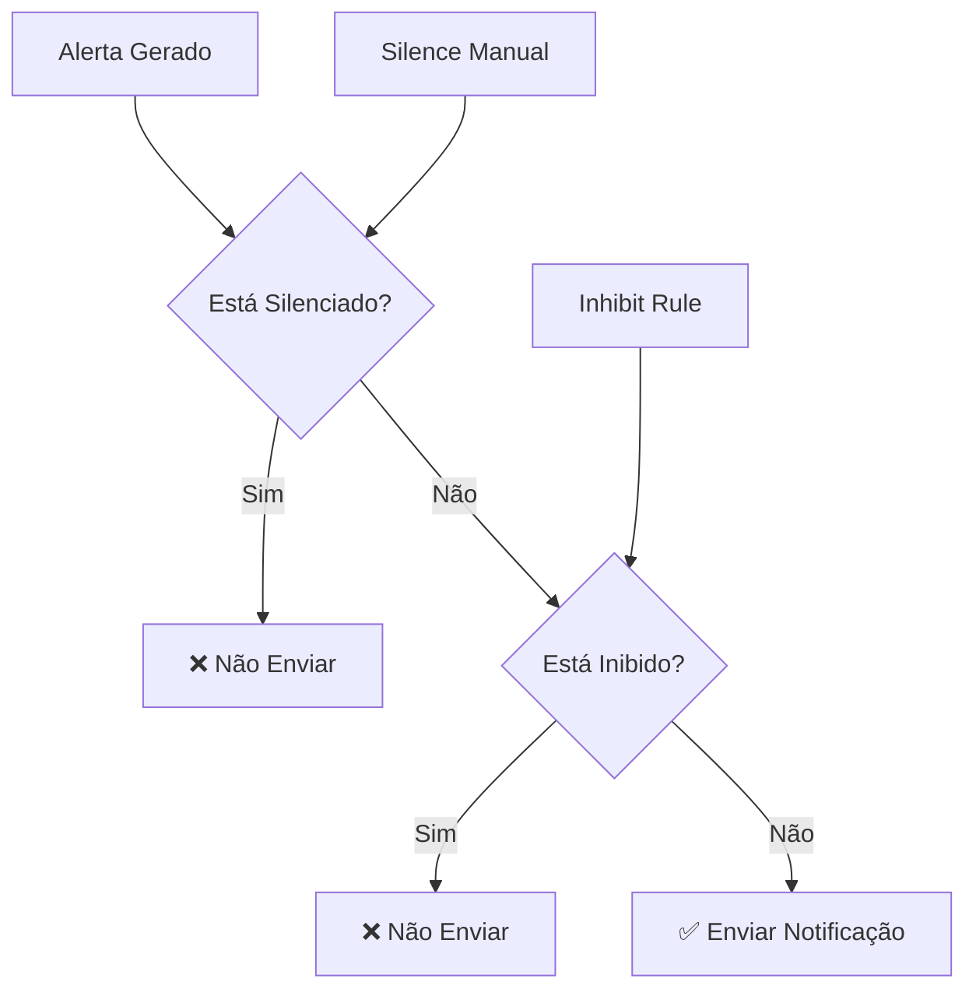

# 🔇 ALERTMANAGER - SILENCIAMENTO E INIBIÇÃO

> **Módulo 6:** Controlando quando NÃO enviar alertas

---

## 📋 CONTEÚDO DESTE MÓDULO

1. [Conceitos Fundamentais](#1-conceitos-fundamentais)
2. [Silenciamento (Silences)](#2-silenciamento-silences)
3. [Inibição (Inhibit Rules)](#3-inibição-inhibit-rules)
4. [Interface Web](#4-interface-web)
5. [Linha de Comando (amtool)](#5-linha-de-comando-amtool)
6. [Casos Práticos](#6-casos-práticos)
7. [Automação](#7-automação)
8. [Boas Práticas](#8-boas-práticas)

---

## 1. CONCEITOS FUNDAMENTAIS

### 🤫 Silenciamento vs Inibição

> **Analogia:** Imagine um sistema de alarme de uma casa:
> - **Silenciamento** é como desligar o alarme temporariamente quando você sabe que vai fazer barulho (reforma)
> - **Inibição** é como o alarme não tocar para "porta aberta" quando já está tocando para "invasão detectada"



### 🎯 Diferenças Principais

| Aspecto | Silenciamento | Inibição |
|---------|---------------|----------|
| **Controle** | Manual (usuário) | Automático (regra) |
| **Duração** | Tempo definido | Enquanto condição existir |
| **Escopo** | Alertas específicos | Relacionamento entre alertas |
| **Uso** | Manutenção, testes | Evitar spam, hierarquia |
| **Configuração** | Interface/API | Arquivo de configuração |

### 🔄 Fluxo de Processamento

```
1. 📨 Alerta chega no Alertmanager
2. 🔍 Verifica se há silence ativo
3. 🚫 Se silenciado → Para aqui
4. 🔍 Verifica regras de inibição
5. 🚫 Se inibido → Para aqui
6. 🛤️ Processa roteamento normal
7. 📤 Envia notificação
```

---

## 2. SILENCIAMENTO (SILENCES)

### 🤫 O que é Silenciamento?

Silenciamento é uma forma **manual** e **temporária** de suprimir alertas específicos.

### 🎯 Casos de Uso Comuns

- 🔧 **Manutenção programada**
- 🧪 **Testes de sistema**
- 🚀 **Deploy de aplicações**
- 🔄 **Reinicializações planejadas**
- 📊 **Investigação de problemas**

### 🕐 Anatomia de um Silence

```yaml
# Estrutura de um silence
silence:
  id: "abc123-def456-ghi789"          # ID único
  matchers:                           # Quais alertas silenciar
    - name: "alertname"
      value: "HighCPU"
      isRegex: false
    - name: "instance"
      value: "web-.*"
      isRegex: true
  startsAt: "2024-01-15T10:00:00Z"    # Início
  endsAt: "2024-01-15T12:00:00Z"      # Fim
  createdBy: "admin@empresa.com"      # Quem criou
  comment: "Manutenção do servidor web" # Motivo
  status:
    state: "active"                   # active, pending, expired
```

### 🌐 Criando Silences via Interface Web

1. **Acessar Alertmanager:** `http://localhost:9093`
2. **Ir para "Silences"**
3. **Clicar "New Silence"**
4. **Preencher formulário:**
   - **Matchers:** Labels que identificam os alertas
   - **Duration:** Duração do silenciamento
   - **Creator:** Seu email
   - **Comment:** Motivo do silenciamento

### 📝 Matchers (Seletores)

```yaml
# Exemplos de matchers

# ========================================
# 🎯 MATCH EXATO
# ========================================
matchers:
  - name: "alertname"
    value: "HighCPU"
    isRegex: false

# ========================================
# 🔍 MATCH COM REGEX
# ========================================
matchers:
  - name: "instance"
    value: "web-[0-9]+\.prod\.com"
    isRegex: true

# ========================================
# 🤝 MÚLTIPLOS MATCHERS (AND)
# ========================================
matchers:
  - name: "alertname"
    value: "HighCPU"
    isRegex: false
  - name: "severity"
    value: "warning"
    isRegex: false
  - name: "team"
    value: "web"
    isRegex: false

# ========================================
# 🌐 SILENCIAR TUDO DE UM AMBIENTE
# ========================================
matchers:
  - name: "environment"
    value: "staging"
    isRegex: false

# ========================================
# 🔧 SILENCIAR POR SERVIÇO
# ========================================
matchers:
  - name: "service"
    value: "(web|api|frontend)"
    isRegex: true
```

### ⏰ Durações Comuns

```bash
# Durações típicas
15m     # Reinicialização rápida
1h      # Manutenção pequena
2h      # Deploy complexo
4h      # Manutenção média
8h      # Manutenção longa
24h     # Manutenção de fim de semana
1w      # Projeto longo
```

---

## 3. INIBIÇÃO (INHIBIT RULES)

### 🚫 O que é Inibição?

Inibição é uma forma **automática** de suprimir alertas baseada na presença de outros alertas.

### 🎯 Casos de Uso

- 🏢 **Datacenter down** → Não alertar sobre servidores individuais
- 🌐 **Rede down** → Não alertar sobre aplicações
- 💾 **Database down** → Não alertar sobre aplicações que dependem dele
- 🔥 **Alerta crítico** → Não alertar sobre warnings relacionados

### 🏗️ Estrutura das Regras

```yaml
inhibit_rules:
  - source_match:           # Alerta que CAUSA a inibição
      alertname: 'DatacenterDown'
    target_match:           # Alerta que SERÁ inibido
      alertname: 'InstanceDown'
    equal: ['datacenter']   # Labels que devem ser iguais
```

### 🌐 Exemplo: Datacenter Down

```yaml
inhibit_rules:
  # ========================================
  # 🏢 DATACENTER DOWN → Inibe instâncias
  # ========================================
  - source_match:
      alertname: 'DatacenterDown'
      severity: 'critical'
    target_match:
      alertname: 'InstanceDown'
    equal: ['datacenter', 'region']
    
    # Se DatacenterDown está ativo para datacenter=dc1, region=us-east
    # Então InstanceDown será inibido para o mesmo datacenter e região
```

### 🌐 Exemplo: Rede Down

```yaml
inhibit_rules:
  # ========================================
  # 🌐 REDE DOWN → Inibe aplicações
  # ========================================
  - source_match:
      alertname: 'NetworkDown'
    target_match_re:
      alertname: '^(HighLatency|ConnectionFailed|APIDown)$'
    equal: ['datacenter']
  
  # ========================================
  # 🌐 SWITCH DOWN → Inibe servidores
  # ========================================
  - source_match:
      alertname: 'SwitchDown'
    target_match:
      alertname: 'InstanceDown'
    equal: ['switch_id', 'rack']
```

### 💾 Exemplo: Database Down

```yaml
inhibit_rules:
  # ========================================
  # 💾 DATABASE DOWN → Inibe aplicações
  # ========================================
  - source_match:
      alertname: 'DatabaseDown'
      service: 'mysql'
    target_match_re:
      alertname: '^(APIDown|WebDown|ConnectionPoolExhausted)$'
    equal: ['environment', 'cluster']
  
  # ========================================
  # 💾 MASTER DOWN → Inibe slave alerts
  # ========================================
  - source_match:
      alertname: 'MySQLMasterDown'
    target_match:
      alertname: 'MySQLReplicationLag'
    equal: ['cluster']
```

### 🔥 Exemplo: Severidade

```yaml
inhibit_rules:
  # ========================================
  # 🔴 CRÍTICO → Inibe warnings do mesmo serviço
  # ========================================
  - source_match:
      severity: 'critical'
    target_match:
      severity: 'warning'
    equal: ['service', 'instance']
  
  # ========================================
  # 🔴 CRÍTICO → Inibe info do mesmo alerta
  # ========================================
  - source_match:
      severity: 'critical'
    target_match:
      severity: 'info'
    equal: ['alertname', 'instance']
```

### 🎯 Regras Complexas

```yaml
inhibit_rules:
  # ========================================
  # 🏗️ MANUTENÇÃO → Inibe tudo relacionado
  # ========================================
  - source_match:
      alertname: 'MaintenanceMode'
    target_match_re:
      alertname: '^(?!MaintenanceMode).*$'  # Tudo exceto MaintenanceMode
    equal: ['instance']
  
  # ========================================
  # ☸️ KUBERNETES NODE DOWN → Inibe pods
  # ========================================
  - source_match:
      alertname: 'KubernetesNodeDown'
    target_match_re:
      alertname: '^(KubePod|KubeContainer).*'
    equal: ['node']
  
  # ========================================
  # 🐳 DOCKER DAEMON DOWN → Inibe containers
  # ========================================
  - source_match:
      alertname: 'DockerDaemonDown'
    target_match_re:
      alertname: '^(ContainerDown|ContainerHighCPU|ContainerHighMemory)$'
    equal: ['instance']
  
  # ========================================
  # 🔧 LOAD BALANCER DOWN → Inibe backend alerts
  # ========================================
  - source_match:
      alertname: 'LoadBalancerDown'
    target_match_re:
      alertname: '^(BackendDown|HighResponseTime)$'
    equal: ['lb_pool']
```

---

## 4. INTERFACE WEB

### 🌐 Navegando na Interface

#### 📊 Dashboard Principal
- **URL:** `http://localhost:9093`
- **Seções:**
  - 🚨 **Alerts** - Alertas ativos
  - 🤫 **Silences** - Silenciamentos ativos
  - 📊 **Status** - Status do sistema

#### 🤫 Gerenciando Silences

```
1. 🌐 Acessar http://localhost:9093/#/silences
2. 📝 Clicar "New Silence"
3. ⚙️ Configurar matchers:
   - Name: alertname
   - Value: HighCPU
   - Regex: false
4. ⏰ Definir duração: 2h
5. 👤 Preencher creator: admin@empresa.com
6. 💬 Adicionar comment: "Investigando problema de CPU"
7. ✅ Clicar "Create"
```

#### 🔍 Visualizando Silences Ativos

```
Interface mostra:
- 🆔 ID do silence
- 🎯 Matchers configurados
- ⏰ Tempo restante
- 👤 Quem criou
- 💬 Comentário
- 🔧 Ações (Edit, Expire)
```

#### ✏️ Editando Silences

```
1. 🔍 Encontrar silence na lista
2. ✏️ Clicar "Edit"
3. 🔧 Modificar:
   - Estender duração
   - Adicionar matchers
   - Atualizar comentário
4. ✅ Salvar alterações
```

#### ❌ Expirando Silences

```
1. 🔍 Encontrar silence na lista
2. ❌ Clicar "Expire"
3. ✅ Confirmar ação
4. 🔔 Alertas voltam a ser enviados imediatamente
```

---

## 5. LINHA DE COMANDO (AMTOOL)

### 🛠️ Instalação do amtool

```bash
# Download direto
wget https://github.com/prometheus/alertmanager/releases/download/v0.25.0/alertmanager-0.25.0.linux-amd64.tar.gz
tar xvf alertmanager-0.25.0.linux-amd64.tar.gz
sudo cp alertmanager-0.25.0.linux-amd64/amtool /usr/local/bin/

# Via Docker
docker run --rm prom/alertmanager:v0.25.0 amtool --help

# Alias para facilitar
alias amtool='docker run --rm --network observability-stack-docker_default prom/alertmanager:v0.25.0 amtool --alertmanager.url=http://alertmanager:9093'
```

### 🤫 Comandos de Silence

#### 📝 Criar Silence

```bash
# Silence básico
amtool silence add \
  alertname="HighCPU" \
  instance="web-01.prod.com" \
  --duration="2h" \
  --comment="Investigando problema de CPU" \
  --author="admin@empresa.com"

# Silence com regex
amtool silence add \
  alertname="HighCPU" \
  instance~="web-.*\.prod\.com" \
  --duration="4h" \
  --comment="Manutenção dos servidores web"

# Silence por severidade
amtool silence add \
  severity="warning" \
  team="database" \
  --duration="1h" \
  --comment="Deploy do banco de dados"

# Silence de ambiente inteiro
amtool silence add \
  environment="staging" \
  --duration="24h" \
  --comment="Ambiente de staging em manutenção"
```

#### 📋 Listar Silences

```bash
# Listar todos os silences
amtool silence query

# Listar silences ativos
amtool silence query --active

# Listar silences expirados
amtool silence query --expired

# Buscar por matcher
amtool silence query alertname="HighCPU"

# Buscar por autor
amtool silence query --author="admin@empresa.com"

# Output detalhado
amtool silence query --output=extended
```

#### ❌ Expirar Silence

```bash
# Expirar por ID
amtool silence expire abc123-def456-ghi789

# Expirar múltiplos
amtool silence expire abc123 def456 ghi789

# Expirar por matcher
amtool silence query alertname="HighCPU" | \
  grep "ID:" | \
  awk '{print $2}' | \
  xargs amtool silence expire
```

### 🚨 Comandos de Alert

#### 📋 Listar Alertas

```bash
# Todos os alertas
amtool alert query

# Alertas ativos
amtool alert query --active

# Alertas silenciados
amtool alert query --silenced

# Alertas inibidos
amtool alert query --inhibited

# Buscar por label
amtool alert query alertname="HighCPU"

# Buscar por severidade
amtool alert query severity="critical"
```

#### 🧪 Criar Alerta de Teste

```bash
# Alerta simples
amtool alert add \
  alertname="TestAlert" \
  severity="warning" \
  instance="test-server" \
  summary="Teste de alerta"

# Alerta com múltiplos labels
amtool alert add \
  alertname="TestCritical" \
  severity="critical" \
  service="database" \
  team="dba" \
  environment="production" \
  summary="Teste crítico" \
  description="Este é um alerta de teste crítico"
```

### 🔧 Configuração do amtool

```yaml
# ~/.config/amtool/config.yml
alertmanager.url: "http://localhost:9093"
author: "admin@empresa.com"
comment_required: true
output: "extended"

# Ou via variáveis de ambiente
export ALERTMANAGER_URL="http://localhost:9093"
export AMTOOL_AUTHOR="admin@empresa.com"
```

---

## 6. CASOS PRÁTICOS

### 🔧 Caso 1: Manutenção Programada

```bash
# Cenário: Manutenção do cluster web das 02:00 às 06:00

# 1. Criar silence antes da manutenção
amtool silence add \
  service="web" \
  environment="production" \
  --duration="4h" \
  --comment="Manutenção programada - Atualização do kernel" \
  --author="ops@empresa.com"

# 2. Verificar se silence está ativo
amtool silence query service="web"

# 3. Após manutenção, expirar silence se necessário
amtool silence query service="web" | grep "ID:" | awk '{print $2}' | xargs amtool silence expire
```

### 🚀 Caso 2: Deploy de Aplicação

```bash
# Cenário: Deploy da API que pode causar alertas temporários

# 1. Silence durante deploy (30 minutos)
amtool silence add \
  alertname~="(APIDown|HighLatency|HighErrorRate)" \
  service="api" \
  environment="production" \
  --duration="30m" \
  --comment="Deploy v2.1.0 - Possível instabilidade temporária" \
  --author="dev@empresa.com"

# 2. Monitorar alertas durante deploy
watch -n 30 'amtool alert query service="api" --active'

# 3. Se deploy falhar, expirar silence imediatamente
amtool silence query service="api" | grep "ID:" | awk '{print $2}' | xargs amtool silence expire
```

### 🧪 Caso 3: Investigação de Problema

```bash
# Cenário: CPU alta em servidor específico, investigando causa

# 1. Silence temporário para evitar spam
amtool silence add \
  alertname="HighCPU" \
  instance="web-03.prod.com" \
  --duration="2h" \
  --comment="Investigando causa da CPU alta - Ticket #12345" \
  --author="sre@empresa.com"

# 2. Estender se necessário
SILENCE_ID=$(amtool silence query instance="web-03.prod.com" | grep "ID:" | awk '{print $2}')
amtool silence update $SILENCE_ID --duration="4h" --comment="Investigação estendida - aguardando especialista"

# 3. Resolver e expirar
amtool silence expire $SILENCE_ID
```

### 🏢 Caso 4: Problema de Infraestrutura

```yaml
# Cenário: Switch de rede com problema, afetando múltiplos servidores

# inhibit_rules no alertmanager.yml
inhibit_rules:
  - source_match:
      alertname: 'NetworkSwitchDown'
    target_match_re:
      alertname: '^(InstanceDown|HighLatency|ConnectionFailed)$'
    equal: ['rack', 'switch_id']

# Quando NetworkSwitchDown disparar, automaticamente inibe:
# - InstanceDown dos servidores no mesmo rack
# - HighLatency das aplicações no mesmo switch
# - ConnectionFailed dos serviços afetados
```

### ☸️ Caso 5: Kubernetes Node Down

```yaml
# inhibit_rules para Kubernetes
inhibit_rules:
  # Node down inibe pods do mesmo node
  - source_match:
      alertname: 'KubernetesNodeNotReady'
    target_match_re:
      alertname: '^(KubePod|KubeContainer).*'
    equal: ['node']
  
  # Cluster down inibe tudo do cluster
  - source_match:
      alertname: 'KubernetesClusterDown'
    target_match_re:
      alertname: '^Kube.*'
    equal: ['cluster']
  
  # Namespace em manutenção
  - source_match:
      alertname: 'KubernetesNamespaceMaintenance'
    target_match_re:
      alertname: '^Kube.*'
    equal: ['namespace']
```

---

## 7. AUTOMAÇÃO

### 🤖 Scripts de Automação

#### 🔧 Script de Manutenção

```bash
#!/bin/bash
# maintenance.sh - Automatizar silences para manutenção

SERVICE="$1"
DURATION="$2"
COMMENT="$3"
AUTHOR="ops@empresa.com"

if [ -z "$SERVICE" ] || [ -z "$DURATION" ] || [ -z "$COMMENT" ]; then
    echo "Uso: $0 <service> <duration> <comment>"
    echo "Exemplo: $0 web 2h 'Atualização do kernel'"
    exit 1
fi

echo "🔧 Criando silence para manutenção..."
SILENCE_ID=$(amtool silence add \
    service="$SERVICE" \
    environment="production" \
    --duration="$DURATION" \
    --comment="MANUTENÇÃO: $COMMENT" \
    --author="$AUTHOR" | \
    grep "ID:" | awk '{print $2}')

echo "✅ Silence criado: $SILENCE_ID"
echo "📋 Para expirar: amtool silence expire $SILENCE_ID"

# Salvar ID para referência
echo "$SILENCE_ID" > "/tmp/maintenance_silence_${SERVICE}.id"

# Agendar expiração automática (opcional)
# echo "amtool silence expire $SILENCE_ID" | at now + $DURATION
```

#### 🚀 Script de Deploy

```bash
#!/bin/bash
# deploy.sh - Silence durante deploy

APP="$1"
VERSION="$2"
DURATION="${3:-30m}"  # Default 30 minutos

echo "🚀 Iniciando deploy $APP v$VERSION"

# Criar silence
SILENCE_ID=$(amtool silence add \
    service="$APP" \
    alertname~="(APIDown|HighLatency|HighErrorRate|DeploymentFailed)" \
    --duration="$DURATION" \
    --comment="Deploy $APP v$VERSION" \
    --author="deploy-bot@empresa.com" | \
    grep "ID:" | awk '{print $2}')

echo "🤫 Silence ativo: $SILENCE_ID"

# Executar deploy
echo "📦 Executando deploy..."
./deploy_script.sh "$APP" "$VERSION"
DEPLOY_STATUS=$?

# Verificar resultado
if [ $DEPLOY_STATUS -eq 0 ]; then
    echo "✅ Deploy bem-sucedido"
    echo "⏰ Aguardando estabilização..."
    sleep 300  # 5 minutos
    
    # Verificar se há alertas ativos
    ACTIVE_ALERTS=$(amtool alert query service="$APP" --active | wc -l)
    if [ $ACTIVE_ALERTS -eq 0 ]; then
        echo "🔔 Expirando silence - sistema estável"
        amtool silence expire "$SILENCE_ID"
    else
        echo "⚠️ Alertas ainda ativos, mantendo silence"
    fi
else
    echo "❌ Deploy falhou, expirando silence"
    amtool silence expire "$SILENCE_ID"
fi
```

### 🔄 Integração com CI/CD

#### 🐙 GitHub Actions

```yaml
# .github/workflows/deploy.yml
name: Deploy with Alertmanager Silence

on:
  push:
    branches: [main]

jobs:
  deploy:
    runs-on: ubuntu-latest
    steps:
      - uses: actions/checkout@v3
      
      - name: Create Alertmanager Silence
        id: silence
        run: |
          SILENCE_ID=$(curl -X POST http://alertmanager:9093/api/v2/silences \
            -H 'Content-Type: application/json' \
            -d '{
              "matchers": [
                {"name": "service", "value": "${{ github.event.repository.name }}", "isRegex": false}
              ],
              "startsAt": "'$(date -u +%Y-%m-%dT%H:%M:%SZ)'",
              "endsAt": "'$(date -u -d '+30 minutes' +%Y-%m-%dT%H:%M:%SZ)'",
              "createdBy": "github-actions@empresa.com",
              "comment": "Deploy ${{ github.sha }}"
            }' | jq -r '.silenceID')
          echo "silence_id=$SILENCE_ID" >> $GITHUB_OUTPUT
      
      - name: Deploy Application
        run: |
          # Seu script de deploy aqui
          ./deploy.sh
      
      - name: Expire Silence on Success
        if: success()
        run: |
          curl -X DELETE http://alertmanager:9093/api/v2/silence/${{ steps.silence.outputs.silence_id }}
      
      - name: Expire Silence on Failure
        if: failure()
        run: |
          curl -X DELETE http://alertmanager:9093/api/v2/silence/${{ steps.silence.outputs.silence_id }}
```

#### 🦊 GitLab CI

```yaml
# .gitlab-ci.yml
stages:
  - silence
  - deploy
  - cleanup

variables:
  ALERTMANAGER_URL: "http://alertmanager:9093"
  SERVICE_NAME: "$CI_PROJECT_NAME"

create_silence:
  stage: silence
  script:
    - |
      SILENCE_ID=$(curl -X POST $ALERTMANAGER_URL/api/v2/silences \
        -H 'Content-Type: application/json' \
        -d '{
          "matchers": [
            {"name": "service", "value": "'$SERVICE_NAME'", "isRegex": false}
          ],
          "startsAt": "'$(date -u +%Y-%m-%dT%H:%M:%SZ)'",
          "endsAt": "'$(date -u -d '+45 minutes' +%Y-%m-%dT%H:%M:%SZ)'",
          "createdBy": "gitlab-ci@empresa.com",
          "comment": "Deploy pipeline $CI_PIPELINE_ID"
        }' | jq -r '.silenceID')
      echo "SILENCE_ID=$SILENCE_ID" > silence.env
  artifacts:
    reports:
      dotenv: silence.env

deploy:
  stage: deploy
  script:
    - echo "Deploying with silence $SILENCE_ID"
    - ./deploy.sh

cleanup_silence:
  stage: cleanup
  script:
    - curl -X DELETE $ALERTMANAGER_URL/api/v2/silence/$SILENCE_ID
  when: always
```

### 📊 Monitoramento de Silences

```bash
#!/bin/bash
# monitor_silences.sh - Monitorar silences ativos

echo "📊 RELATÓRIO DE SILENCES"
echo "========================"
echo

# Silences ativos
ACTIVE_COUNT=$(amtool silence query --active | grep -c "ID:")
echo "🤫 Silences ativos: $ACTIVE_COUNT"

if [ $ACTIVE_COUNT -gt 0 ]; then
    echo
    echo "📋 DETALHES DOS SILENCES ATIVOS:"
    amtool silence query --active --output=extended
fi

# Silences expirando em 1 hora
EXPIRING_SOON=$(amtool silence query --active | \
    awk '/Ends At:/ {print $3" "$4}' | \
    while read end_time; do
        end_epoch=$(date -d "$end_time" +%s)
        now_epoch=$(date +%s)
        diff=$((end_epoch - now_epoch))
        if [ $diff -lt 3600 ]; then  # 1 hora = 3600 segundos
            echo "$end_time"
        fi
    done | wc -l)

if [ $EXPIRING_SOON -gt 0 ]; then
    echo
    echo "⏰ ATENÇÃO: $EXPIRING_SOON silence(s) expirando em menos de 1 hora"
fi

# Alertas silenciados
SILENCED_ALERTS=$(amtool alert query --silenced | grep -c "Labels:")
echo
echo "🔇 Alertas atualmente silenciados: $SILENCED_ALERTS"
```

---

## 8. BOAS PRÁTICAS

### ✅ Boas Práticas para Silences

#### 📝 Documentação
```bash
# ✅ BOM - Comentário descritivo
amtool silence add \
  service="web" \
  --duration="2h" \
  --comment="Manutenção programada - Atualização kernel - Ticket #12345 - Contato: ops@empresa.com" \
  --author="admin@empresa.com"

# ❌ RUIM - Comentário vago
amtool silence add \
  service="web" \
  --duration="2h" \
  --comment="manutenção" \
  --author="admin"
```

#### ⏰ Duração Apropriada
```bash
# ✅ BOM - Duração específica e justificada
--duration="30m"  # Deploy típico
--duration="2h"   # Manutenção pequena
--duration="4h"   # Manutenção grande

# ❌ RUIM - Duração excessiva
--duration="24h"  # Muito tempo para investigação
--duration="1w"   # Nunca use durações tão longas
```

#### 🎯 Matchers Precisos
```bash
# ✅ BOM - Específico
amtool silence add \
  alertname="HighCPU" \
  instance="web-01.prod.com" \
  service="web"

# ❌ RUIM - Muito amplo
amtool silence add \
  environment="production"  # Silencia TUDO em produção!
```

### ✅ Boas Práticas para Inhibit Rules

#### 🎯 Hierarquia Clara
```yaml
# ✅ BOM - Hierarquia lógica
inhibit_rules:
  # Datacenter > Rack > Servidor
  - source_match:
      alertname: 'DatacenterDown'
    target_match:
      alertname: 'RackDown'
    equal: ['datacenter']
  
  - source_match:
      alertname: 'RackDown'
    target_match:
      alertname: 'ServerDown'
    equal: ['rack']
```

#### 🔄 Evitar Loops
```yaml
# ❌ RUIM - Pode criar loop
inhibit_rules:
  - source_match:
      alertname: 'AlertA'
    target_match:
      alertname: 'AlertB'
  - source_match:
      alertname: 'AlertB'
    target_match:
      alertname: 'AlertA'  # Loop!
```

#### 📊 Labels Consistentes
```yaml
# ✅ BOM - Labels padronizados
inhibit_rules:
  - source_match:
      alertname: 'DatabaseDown'
    target_match_re:
      alertname: '^App.*Down$'
    equal: ['environment', 'cluster', 'datacenter']  # Labels consistentes
```

### 🔍 Monitoramento e Auditoria

#### 📊 Métricas Importantes
```promql
# Número de silences ativos
alertmanager_silences{state="active"}

# Alertas silenciados
alertmanager_alerts{state="suppressed"}

# Alertas inibidos
alertmanager_alerts{state="inhibited"}

# Duração média dos silences
avg(alertmanager_silence_duration_seconds)
```

#### 📋 Relatórios Regulares
```bash
#!/bin/bash
# weekly_silence_report.sh

echo "📊 RELATÓRIO SEMANAL DE SILENCES"
echo "Período: $(date -d '7 days ago' +%Y-%m-%d) a $(date +%Y-%m-%d)"
echo

# Silences criados na semana
echo "📝 Silences criados: "
amtool silence query --output=json | \
  jq -r '.[] | select(.createdAt > "'$(date -d '7 days ago' -u +%Y-%m-%dT%H:%M:%SZ)'") | "\(.createdBy): \(.comment)"'

# Top usuários
echo
echo "👥 Top criadores de silence:"
amtool silence query --output=json | \
  jq -r '.[] | .createdBy' | \
  sort | uniq -c | sort -nr | head -5

# Duração média
echo
echo "⏰ Duração média dos silences: "
amtool silence query --output=json | \
  jq -r '.[] | (.endsAt | fromdateiso8601) - (.startsAt | fromdateiso8601)' | \
  awk '{sum+=$1; count++} END {print sum/count/3600 " horas"}'
```

### 🚨 Alertas sobre Silences

```yaml
# prometheus rules para monitorar silences
groups:
  - name: silence-monitoring
    rules:
      # Muitos silences ativos
      - alert: TooManySilences
        expr: alertmanager_silences{state="active"} > 10
        for: 5m
        labels:
          severity: warning
        annotations:
          summary: "Muitos silences ativos"
          description: "{{ $value }} silences ativos no Alertmanager"
      
      # Silence muito longo
      - alert: LongRunningSilence
        expr: |
          (alertmanager_silence_end_time_seconds - alertmanager_silence_start_time_seconds) > 86400
        labels:
          severity: warning
        annotations:
          summary: "Silence com duração muito longa"
          description: "Silence {{ $labels.silence_id }} tem duração > 24h"
      
      # Muitos alertas silenciados
      - alert: TooManyAlertsSilenced
        expr: alertmanager_alerts{state="suppressed"} > 50
        for: 10m
        labels:
          severity: warning
        annotations:
          summary: "Muitos alertas silenciados"
          description: "{{ $value }} alertas estão silenciados"
```

---

## 🎯 RESUMO DO MÓDULO

### ✅ O que você aprendeu:

1. **Conceitos fundamentais** - Diferença entre silenciamento e inibição
2. **Silenciamento** - Controle manual e temporário de alertas
3. **Inibição** - Supressão automática baseada em regras
4. **Interface web** - Gerenciamento visual de silences
5. **amtool** - Linha de comando para automação
6. **Casos práticos** - Manutenção, deploy, investigação
7. **Automação** - Scripts e integração CI/CD
8. **Boas práticas** - Como usar efetivamente

### 🔧 Principais conceitos:
- **Silences** - Supressão manual e temporária
- **Inhibit Rules** - Supressão automática por hierarquia
- **Matchers** - Seletores para identificar alertas
- **Duração** - Tempo de vida dos silences

### 🚀 Próximos Passos

Agora que você domina silenciamento e inibição, vamos aprender sobre **templates avançados**:

**Próximo módulo:** [07-templates.md](07-templates.md) - Templates e personalização

---

## 🔗 Links Relacionados

- **[Anterior: Receivers](05-receivers.md)**
- **[Próximo: Templates](07-templates.md)**
- **[Voltar ao Índice](README.md)**