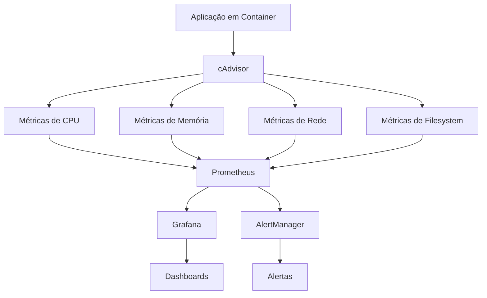
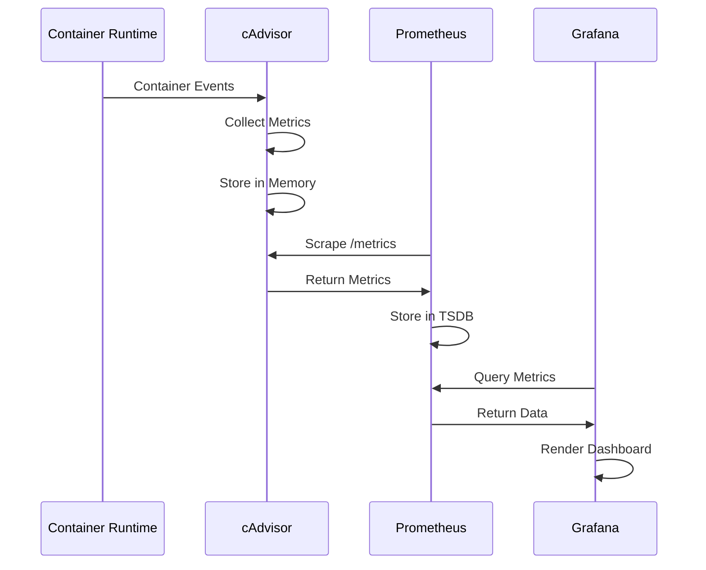

# Módulo 01: Introdução ao cAdvisor

> **Container Advisor (cAdvisor)** - Ferramenta essencial para monitoramento de containers em tempo real

## 📋 Objetivos do Módulo

Ao final deste módulo, você será capaz de:
- ✅ Compreender os conceitos fundamentais do cAdvisor
- ✅ Entender a arquitetura e componentes principais
- ✅ Identificar casos de uso e benefícios
- ✅ Comparar cAdvisor com outras ferramentas de monitoramento
- ✅ Planejar a implementação em diferentes cenários

## 🎯 O que é o cAdvisor?

**Container Advisor (cAdvisor)** é uma ferramenta open-source desenvolvida pelo Google que fornece aos usuários de containers informações sobre o uso de recursos e características de performance dos containers em execução.

### Características Principais

- **🔍 Monitoramento em Tempo Real:** Coleta métricas de CPU, memória, rede e filesystem
- **🌐 Interface Web Nativa:** Dashboard integrado para visualização imediata
- **📊 Integração com Prometheus:** Endpoint `/metrics` para coleta externa
- **🐳 Suporte Multi-Container:** Monitora todos os containers do host
- **📈 Histórico de Métricas:** Armazena dados históricos por período limitado
- **🔧 Zero Configuração:** Funciona out-of-the-box sem configuração complexa

### Por que usar cAdvisor?



## 🏗️ Arquitetura do cAdvisor

### Componentes Principais

#### 1. **Container Manager**
```go
// Exemplo conceitual da estrutura
type ContainerManager struct {
    containers map[string]*ContainerInfo
    driver     ContainerDriver
    collector  MetricsCollector
}
```

**Responsabilidades:**
- Descoberta automática de containers
- Gerenciamento do ciclo de vida dos containers monitorados
- Interface com diferentes runtimes (Docker, containerd, CRI-O)

#### 2. **Metrics Collector**
```yaml
# Tipos de métricas coletadas
metrics_types:
  cpu:
    - usage_total
    - usage_per_cpu
    - throttled_time
  memory:
    - usage
    - working_set
    - cache
    - rss
  network:
    - rx_bytes
    - tx_bytes
    - rx_packets
    - tx_packets
  filesystem:
    - usage
    - limit
    - available
```

#### 3. **Storage Backend**
```yaml
# Configuração de armazenamento
storage:
  driver: "memory"  # Padrão: armazenamento em memória
  duration: "2m"    # Retenção de dados
  frequency: "1s"   # Frequência de coleta
```

#### 4. **Web Interface**
- **Dashboard HTML:** Interface visual para navegação
- **REST API:** Endpoints para consulta programática
- **Metrics Endpoint:** Formato Prometheus para integração

### Fluxo de Funcionamento



## 📊 Tipos de Métricas

### 1. **CPU Metrics**

```promql
# Exemplos de métricas de CPU
container_cpu_usage_seconds_total{name="my-app"}
container_cpu_system_seconds_total{name="my-app"}
container_cpu_user_seconds_total{name="my-app"}

# Cálculo de CPU percentage
rate(container_cpu_usage_seconds_total{name="my-app"}[5m]) * 100
```

**Métricas Disponíveis:**
- `container_cpu_usage_seconds_total` - Uso total de CPU
- `container_cpu_user_seconds_total` - Tempo em user space
- `container_cpu_system_seconds_total` - Tempo em kernel space
- `container_cpu_throttled_seconds_total` - Tempo throttled

### 2. **Memory Metrics**

```promql
# Exemplos de métricas de memória
container_memory_usage_bytes{name="my-app"}
container_memory_working_set_bytes{name="my-app"}
container_memory_cache{name="my-app"}

# Cálculo de memory percentage
(container_memory_usage_bytes{name="my-app"} / container_spec_memory_limit_bytes{name="my-app"}) * 100
```

**Métricas Disponíveis:**
- `container_memory_usage_bytes` - Uso total de memória
- `container_memory_working_set_bytes` - Working set (memória ativa)
- `container_memory_rss` - Resident Set Size
- `container_memory_cache` - Cache de filesystem

### 3. **Network Metrics**

```promql
# Exemplos de métricas de rede
container_network_receive_bytes_total{name="my-app"}
container_network_transmit_bytes_total{name="my-app"}

# Cálculo de network throughput
rate(container_network_receive_bytes_total{name="my-app"}[5m])
rate(container_network_transmit_bytes_total{name="my-app"}[5m])
```

### 4. **Filesystem Metrics**

```promql
# Exemplos de métricas de filesystem
container_fs_usage_bytes{name="my-app"}
container_fs_limit_bytes{name="my-app"}

# Cálculo de disk usage percentage
(container_fs_usage_bytes{name="my-app"} / container_fs_limit_bytes{name="my-app"}) * 100
```

## 🔄 Comparação com Outras Ferramentas

### cAdvisor vs Docker Stats

| Aspecto | cAdvisor | Docker Stats |
|---------|----------|-------------|
| **Interface** | Web UI + API | CLI apenas |
| **Histórico** | 2 minutos | Tempo real apenas |
| **Integração** | Prometheus nativo | Requer parsing |
| **Overhead** | Baixo | Muito baixo |
| **Funcionalidades** | Completas | Básicas |

### cAdvisor vs Prometheus Node Exporter

| Aspecto | cAdvisor | Node Exporter |
|---------|----------|---------------|
| **Foco** | Containers | Sistema/Host |
| **Granularidade** | Por container | Por sistema |
| **Descoberta** | Automática | Manual/Service Discovery |
| **Métricas** | Container-specific | System-wide |
| **Complementaridade** | ✅ Usados juntos | ✅ Usados juntos |

### cAdvisor vs Kubernetes Metrics Server

| Aspecto | cAdvisor | Metrics Server |
|---------|----------|----------------|
| **Propósito** | Monitoramento detalhado | HPA/VPA apenas |
| **Retenção** | 2 minutos | Sem retenção |
| **API** | REST + Prometheus | Kubernetes API |
| **Overhead** | Médio | Baixo |
| **Uso** | Observabilidade | Autoscaling |

## 🎯 Casos de Uso

### 1. **Desenvolvimento Local**

```bash
# Cenário: Desenvolvedor analisando performance
docker run -d --name my-app nginx
docker run \
  --volume=/:/rootfs:ro \
  --volume=/var/run:/var/run:ro \
  --volume=/sys:/sys:ro \
  --volume=/var/lib/docker/:/var/lib/docker:ro \
  --publish=8080:8080 \
  --detach=true \
  --name=cadvisor \
  gcr.io/cadvisor/cadvisor:latest

# Acessar: http://localhost:8080
```

**Benefícios:**
- Identificação de vazamentos de memória
- Análise de padrões de CPU
- Otimização de recursos
- Debug de performance

### 2. **Ambiente de Produção**

```yaml
# docker-compose.yml para produção
version: '3.8'
services:
  cadvisor:
    image: gcr.io/cadvisor/cadvisor:latest
    container_name: cadvisor
    restart: unless-stopped
    ports:
      - "8080:8080"
    volumes:
      - /:/rootfs:ro
      - /var/run:/var/run:ro
      - /sys:/sys:ro
      - /var/lib/docker/:/var/lib/docker:ro
      - /dev/disk/:/dev/disk:ro
    privileged: true
    devices:
      - /dev/kmsg
    labels:
      - "prometheus.io/scrape=true"
      - "prometheus.io/port=8080"
      - "prometheus.io/path=/metrics"
```

**Benefícios:**
- Monitoramento contínuo
- Alertas proativos
- Capacity planning
- Troubleshooting rápido

### 3. **Kubernetes Cluster**

```yaml
# cadvisor-daemonset.yaml
apiVersion: apps/v1
kind: DaemonSet
metadata:
  name: cadvisor
  namespace: monitoring
spec:
  selector:
    matchLabels:
      name: cadvisor
  template:
    metadata:
      labels:
        name: cadvisor
    spec:
      hostNetwork: true
      hostPID: true
      containers:
      - name: cadvisor
        image: gcr.io/cadvisor/cadvisor:latest
        ports:
        - containerPort: 8080
          protocol: TCP
        volumeMounts:
        - name: rootfs
          mountPath: /rootfs
          readOnly: true
        - name: var-run
          mountPath: /var/run
          readOnly: true
        - name: sys
          mountPath: /sys
          readOnly: true
        - name: docker
          mountPath: /var/lib/docker
          readOnly: true
        - name: disk
          mountPath: /dev/disk
          readOnly: true
      volumes:
      - name: rootfs
        hostPath:
          path: /
      - name: var-run
        hostPath:
          path: /var/run
      - name: sys
        hostPath:
          path: /sys
      - name: docker
        hostPath:
          path: /var/lib/docker
      - name: disk
        hostPath:
          path: /dev/disk
```

**Benefícios:**
- Visibilidade de todo o cluster
- Métricas por namespace/pod
- Integração com HPA
- Observabilidade completa

## 🔧 Configurações Avançadas

### Parâmetros de Inicialização

```bash
# Exemplo com configurações customizadas
docker run \
  --volume=/:/rootfs:ro \
  --volume=/var/run:/var/run:ro \
  --volume=/sys:/sys:ro \
  --volume=/var/lib/docker/:/var/lib/docker:ro \
  --publish=8080:8080 \
  --detach=true \
  --name=cadvisor \
  gcr.io/cadvisor/cadvisor:latest \
  --housekeeping_interval=30s \
  --max_housekeeping_interval=35s \
  --event_storage_event_limit=default=0 \
  --event_storage_age_limit=default=0 \
  --disable_metrics=disk,network \
  --docker_only=true
```

**Parâmetros Importantes:**
- `--housekeeping_interval`: Frequência de coleta (padrão: 1s)
- `--max_housekeeping_interval`: Intervalo máximo (padrão: 60s)
- `--disable_metrics`: Desabilitar métricas específicas
- `--docker_only`: Monitorar apenas containers Docker
- `--store_container_labels`: Incluir labels nos dados

### Otimização de Performance

```yaml
# Configuração otimizada para produção
services:
  cadvisor:
    image: gcr.io/cadvisor/cadvisor:latest
    command:
      - '/usr/bin/cadvisor'
      - '--housekeeping_interval=30s'
      - '--max_housekeeping_interval=35s'
      - '--event_storage_event_limit=default=0'
      - '--event_storage_age_limit=default=0'
      - '--disable_metrics=percpu,sched,tcp,udp'
      - '--docker_only=true'
    resources:
      limits:
        memory: 200Mi
        cpu: 200m
      requests:
        memory: 100Mi
        cpu: 100m
```

## 📈 Métricas de Sistema

### Machine Metrics

```promql
# Métricas do host/máquina
machine_cpu_cores                    # Número de CPUs
machine_memory_bytes                 # Memória total
machine_cpu_frequency_khz           # Frequência da CPU
machine_load1                       # Load average 1min
machine_load5                       # Load average 5min
machine_load15                      # Load average 15min
```

### Container Spec Metrics

```promql
# Especificações dos containers
container_spec_cpu_quota            # CPU quota
container_spec_cpu_period           # CPU period
container_spec_memory_limit_bytes   # Limite de memória
container_spec_memory_swap_limit_bytes # Limite de swap
```

## 🚀 Exercício Prático

### Objetivo
Implementar cAdvisor em ambiente local e explorar as métricas básicas.

### Passos

1. **Deploy do cAdvisor:**
```bash
# Executar cAdvisor
docker run \
  --volume=/:/rootfs:ro \
  --volume=/var/run:/var/run:ro \
  --volume=/sys:/sys:ro \
  --volume=/var/lib/docker/:/var/lib/docker:ro \
  --volume=/dev/disk/:/dev/disk:ro \
  --publish=8080:8080 \
  --detach=true \
  --name=cadvisor \
  --privileged \
  --device=/dev/kmsg \
  gcr.io/cadvisor/cadvisor:latest
```

2. **Criar containers de teste:**
```bash
# Container com carga de CPU
docker run -d --name cpu-stress --cpus="0.5" progrium/stress --cpu 1

# Container com carga de memória
docker run -d --name memory-stress --memory="100m" progrium/stress --vm 1 --vm-bytes 50M

# Container web simples
docker run -d --name web-server -p 80:80 nginx
```

3. **Explorar a interface:**
- Acesse http://localhost:8080
- Navegue pelos containers
- Analise as métricas de CPU, memória e rede
- Observe os gráficos históricos

4. **Testar API REST:**
```bash
# Listar containers
curl http://localhost:8080/api/v1.3/containers/

# Métricas específicas de um container
curl http://localhost:8080/api/v1.3/containers/docker/cpu-stress

# Endpoint Prometheus
curl http://localhost:8080/metrics
```

5. **Análise de métricas:**
```bash
# Filtrar métricas específicas
curl -s http://localhost:8080/metrics | grep container_cpu_usage_seconds_total
curl -s http://localhost:8080/metrics | grep container_memory_usage_bytes
```

### Validação
- [ ] cAdvisor está executando e acessível
- [ ] Interface web mostra containers ativos
- [ ] Métricas estão sendo coletadas
- [ ] API REST responde corretamente
- [ ] Endpoint /metrics retorna dados Prometheus

## 📚 Resumo do Módulo

### Conceitos Aprendidos
- ✅ **Fundamentos:** O que é cAdvisor e seus benefícios
- ✅ **Arquitetura:** Componentes e fluxo de funcionamento
- ✅ **Métricas:** Tipos disponíveis e como interpretá-las
- ✅ **Comparações:** Diferenças com outras ferramentas
- ✅ **Casos de Uso:** Cenários de aplicação prática

### Próximos Passos
- **[Módulo 02: Configuração e Deploy](02-configuracao-deploy.md)** - Instalação e configuração avançada
- **[Módulo 03: Métricas e Coleta](03-metricas-coleta.md)** - Aprofundamento em métricas
- **[Módulo 04: Integração com Prometheus](04-integracao-prometheus.md)** - Integração completa

---

## Navegação

- [🏠 Página Principal](README.md)
- [➡️ Próximo: Configuração e Deploy](02-configuracao-deploy.md)

---

**Parabéns!** 🎉 Você completou a introdução ao cAdvisor. Agora você tem uma base sólida para avançar para configurações mais complexas e integrações avançadas.