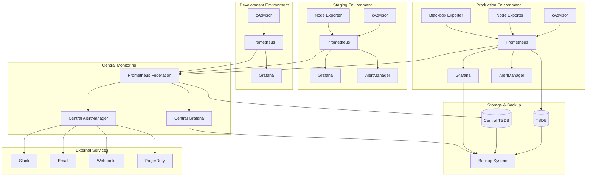

# Módulo 06: Projeto Final - Monitoramento Completo de Containers

> **Projeto integrado completo** - Stack de monitoramento de containers com cAdvisor, Prometheus, Grafana e automação avançada

## 📋 Objetivos do Projeto

Ao final deste projeto, você terá implementado:
- ✅ **Infraestrutura completa** de monitoramento de containers
- ✅ **Sistema de alertas inteligente** com múltiplos canais
- ✅ **Dashboards hierárquicos** para diferentes níveis de usuário
- ✅ **Automação completa** de deploy e manutenção
- ✅ **Backup e disaster recovery** automatizados
- ✅ **Monitoramento multi-ambiente** (dev, staging, prod)

## 🏗️ Arquitetura do Projeto



## 🚀 Implementação Completa

### Estrutura do Projeto

```bash
#!/bin/bash
# setup-container-monitoring-project.sh - Setup completo do projeto

set -e

# Configurações globais
PROJECT_NAME="container-monitoring-stack"
PROJECT_DIR="./$PROJECT_NAME"
ENVIRONMENTS=("development" "staging" "production")
DOMAIN="monitoring.local"
BACKUP_RETENTION_DAYS=30

# Cores para output
GREEN='\033[0;32m'
YELLOW='\033[1;33m'
BLUE='\033[0;34m'
RED='\033[0;31m'
NC='\033[0m'

log_info() {
    echo -e "${GREEN}[INFO]${NC} $1"
}

log_section() {
    echo -e "\n${BLUE}=== $1 ===${NC}"
}

log_warn() {
    echo -e "${YELLOW}[WARN]${NC} $1"
}

log_error() {
    echo -e "${RED}[ERROR]${NC} $1"
}

# Criar estrutura de diretórios
setup_project_structure() {
    log_section "Setting up project structure"
    
    # Estrutura principal
    mkdir -p $PROJECT_DIR/{environments/{development,staging,production},shared/{configs,dashboards,alerts,scripts},docs,backups,ssl}
    
    # Estrutura por ambiente
    for env in "${ENVIRONMENTS[@]}"; do
        mkdir -p $PROJECT_DIR/environments/$env/{prometheus,grafana/{provisioning/{datasources,dashboards,notifiers},dashboards},alertmanager,cadvisor,node-exporter,blackbox-exporter}
    done
    
    # Estrutura central
    mkdir -p $PROJECT_DIR/central/{prometheus,grafana/{provisioning/{datasources,dashboards},dashboards},alertmanager}
    
    # Scripts e utilitários
    mkdir -p $PROJECT_DIR/scripts/{deploy,backup,monitoring,maintenance}
    
    log_info "Project structure created: $PROJECT_DIR"
}

# Configurações compartilhadas
create_shared_configs() {
    log_section "Creating shared configurations"
    
    # Configuração base do cAdvisor
    cat > $PROJECT_DIR/shared/configs/cadvisor-base.yml << 'EOF'
# Configuração base do cAdvisor
version: '3.8'

services:
  cadvisor:
    image: gcr.io/cadvisor/cadvisor:v0.47.0
    container_name: cadvisor-${ENVIRONMENT}
    restart: unless-stopped
    ports:
      - "${CADVISOR_PORT}:8080"
    volumes:
      - /:/rootfs:ro
      - /var/run:/var/run:ro
      - /sys:/sys:ro
      - /var/lib/docker/:/var/lib/docker:ro
      - /dev/disk/:/dev/disk:ro
    privileged: true
    devices:
      - /dev/kmsg
    command:
      - '--housekeeping_interval=${HOUSEKEEPING_INTERVAL}'
      - '--max_housekeeping_interval=${MAX_HOUSEKEEPING_INTERVAL}'
      - '--disable_metrics=${DISABLED_METRICS}'
      - '--event_storage_event_limit=default=0'
      - '--event_storage_age_limit=default=0'
      - '--docker_only=true'
      - '--store_container_labels=${STORE_LABELS}'
      - '--whitelisted_container_labels=${WHITELISTED_LABELS}'
      - '--logtostderr=true'
      - '--v=${LOG_LEVEL}'
    labels:
      - "prometheus.scrape=true"
      - "prometheus.port=8080"
      - "prometheus.path=/metrics"
      - "environment=${ENVIRONMENT}"
    networks:
      - monitoring
    deploy:
      resources:
        limits:
          cpus: '${CPU_LIMIT}'
          memory: ${MEMORY_LIMIT}
        reservations:
          cpus: '${CPU_RESERVATION}'
          memory: ${MEMORY_RESERVATION}
    healthcheck:
      test: ["CMD", "wget", "--quiet", "--tries=1", "--spider", "http://localhost:8080/healthz"]
      interval: 30s
      timeout: 10s
      retries: 3
      start_period: 40s
EOF

    # Configuração base do Prometheus
    cat > $PROJECT_DIR/shared/configs/prometheus-base.yml << 'EOF'
# Configuração base do Prometheus
global:
  scrape_interval: 15s
  evaluation_interval: 15s
  external_labels:
    environment: '${ENVIRONMENT}'
    cluster: '${CLUSTER_NAME}'
    region: '${REGION}'

rule_files:
  - "rules/*.yml"

alerting:
  alertmanagers:
    - static_configs:
        - targets:
          - alertmanager:9093
      path_prefix: /
      scheme: http

scrape_configs:
  # cAdvisor - Container metrics
  - job_name: 'cadvisor'
    static_configs:
      - targets: ['cadvisor:8080']
    scrape_interval: 30s
    scrape_timeout: 10s
    metrics_path: '/metrics'
    relabel_configs:
      - source_labels: [__address__]
        target_label: __param_target
      - source_labels: [__param_target]
        target_label: instance
      - target_label: __address__
        replacement: cadvisor:8080
    metric_relabel_configs:
      # Drop unnecessary metrics
      - source_labels: [__name__]
        regex: 'container_tasks_state|container_memory_failures_total|container_spec_.*'
        action: drop
      # Add environment label
      - target_label: environment
        replacement: '${ENVIRONMENT}'
      # Normalize container labels
      - source_labels: [container_label_com_docker_compose_service]
        target_label: service_name
      - source_labels: [container_label_com_docker_compose_project]
        target_label: project_name

  # Node Exporter - Host metrics
  - job_name: 'node-exporter'
    static_configs:
      - targets: ['node-exporter:9100']
    scrape_interval: 30s
    metric_relabel_configs:
      - target_label: environment
        replacement: '${ENVIRONMENT}'

  # Blackbox Exporter - Endpoint monitoring
  - job_name: 'blackbox'
    metrics_path: /probe
    params:
      module: [http_2xx]
    static_configs:
      - targets:
        - http://cadvisor:8080/healthz
        - http://prometheus:9090/-/healthy
        - http://grafana:3000/api/health
    relabel_configs:
      - source_labels: [__address__]
        target_label: __param_target
      - source_labels: [__param_target]
        target_label: instance
      - target_label: __address__
        replacement: blackbox-exporter:9115
      - target_label: environment
        replacement: '${ENVIRONMENT}'

  # Prometheus self-monitoring
  - job_name: 'prometheus'
    static_configs:
      - targets: ['localhost:9090']
    metric_relabel_configs:
      - target_label: environment
        replacement: '${ENVIRONMENT}'
EOF

    log_info "Shared configurations created"
}

# Criar configurações por ambiente
create_environment_configs() {
    log_section "Creating environment-specific configurations"
    
    # Development
    create_env_config "development" "8080" "30s" "60s" "tcp,udp" "true" "prometheus.scrape,service.name,service.version" "2" "1.0" "512M" "0.1" "128M" "dev-cluster" "us-east-1"
    
    # Staging
    create_env_config "staging" "8081" "60s" "120s" "percpu,sched,tcp,udp,disk" "false" "prometheus.scrape,service.name" "1" "0.5" "256M" "0.1" "128M" "staging-cluster" "us-east-1"
    
    # Production
    create_env_config "production" "8082" "120s" "300s" "percpu,sched,tcp,udp,disk,diskIO,accelerator,hugetlb,memory_numa,cpuset,advtcp,cpu_topology,resctrl" "false" "prometheus.scrape" "0" "0.3" "128M" "0.1" "64M" "prod-cluster" "us-east-1"
}

create_env_config() {
    local env=$1
    local port=$2
    local housekeeping=$3
    local max_housekeeping=$4
    local disabled_metrics=$5
    local store_labels=$6
    local whitelisted_labels=$7
    local log_level=$8
    local cpu_limit=$9
    local memory_limit=${10}
    local cpu_reservation=${11}
    local memory_reservation=${12}
    local cluster_name=${13}
    local region=${14}
    
    log_info "Creating configuration for environment: $env"
    
    # Variáveis de ambiente
    cat > $PROJECT_DIR/environments/$env/.env << EOF
# Environment: $env
ENVIRONMENT=$env
CADVISOR_PORT=$port
HOUSEKEEPING_INTERVAL=$housekeeping
MAX_HOUSEKEEPING_INTERVAL=$max_housekeeping
DISABLED_METRICS=$disabled_metrics
STORE_LABELS=$store_labels
WHITELISTED_LABELS=$whitelisted_labels
LOG_LEVEL=$log_level
CPU_LIMIT=$cpu_limit
MEMORY_LIMIT=$memory_limit
CPU_RESERVATION=$cpu_reservation
MEMORY_RESERVATION=$memory_reservation
CLUSTER_NAME=$cluster_name
REGION=$region

# Prometheus
PROMETHEUS_PORT=$((9090 + $(echo $env | wc -c)))
PROMETHEUS_RETENTION=15d
PROMETHEUS_STORAGE_SIZE=10GB

# Grafana
GRAFANA_PORT=$((3000 + $(echo $env | wc -c)))
GRAFANA_ADMIN_PASSWORD=admin123$env

# AlertManager
ALERTMANAGER_PORT=$((9093 + $(echo $env | wc -c)))

# Node Exporter
NODE_EXPORTER_PORT=$((9100 + $(echo $env | wc -c)))

# Blackbox Exporter
BLACKBOX_EXPORTER_PORT=$((9115 + $(echo $env | wc -c)))
EOF

    # Docker Compose para o ambiente
    cat > $PROJECT_DIR/environments/$env/docker-compose.yml << 'EOF'
version: '3.8'

networks:
  monitoring:
    driver: bridge
    name: monitoring-${ENVIRONMENT}

volumes:
  prometheus_data:
    name: prometheus_data_${ENVIRONMENT}
  grafana_data:
    name: grafana_data_${ENVIRONMENT}
  alertmanager_data:
    name: alertmanager_data_${ENVIRONMENT}

services:
  # cAdvisor - Container monitoring
  cadvisor:
    image: gcr.io/cadvisor/cadvisor:v0.47.0
    container_name: cadvisor-${ENVIRONMENT}
    restart: unless-stopped
    ports:
      - "${CADVISOR_PORT}:8080"
    volumes:
      - /:/rootfs:ro
      - /var/run:/var/run:ro
      - /sys:/sys:ro
      - /var/lib/docker/:/var/lib/docker:ro
      - /dev/disk/:/dev/disk:ro
    privileged: true
    devices:
      - /dev/kmsg
    command:
      - '--housekeeping_interval=${HOUSEKEEPING_INTERVAL}'
      - '--max_housekeeping_interval=${MAX_HOUSEKEEPING_INTERVAL}'
      - '--disable_metrics=${DISABLED_METRICS}'
      - '--event_storage_event_limit=default=0'
      - '--event_storage_age_limit=default=0'
      - '--docker_only=true'
      - '--store_container_labels=${STORE_LABELS}'
      - '--whitelisted_container_labels=${WHITELISTED_LABELS}'
      - '--logtostderr=true'
      - '--v=${LOG_LEVEL}'
    labels:
      - "prometheus.scrape=true"
      - "prometheus.port=8080"
      - "environment=${ENVIRONMENT}"
    networks:
      - monitoring
    deploy:
      resources:
        limits:
          cpus: '${CPU_LIMIT}'
          memory: ${MEMORY_LIMIT}
        reservations:
          cpus: '${CPU_RESERVATION}'
          memory: ${MEMORY_RESERVATION}
    healthcheck:
      test: ["CMD", "wget", "--quiet", "--tries=1", "--spider", "http://localhost:8080/healthz"]
      interval: 30s
      timeout: 10s
      retries: 3
      start_period: 40s

  # Node Exporter - Host metrics
  node-exporter:
    image: prom/node-exporter:latest
    container_name: node-exporter-${ENVIRONMENT}
    restart: unless-stopped
    ports:
      - "${NODE_EXPORTER_PORT}:9100"
    volumes:
      - /proc:/host/proc:ro
      - /sys:/host/sys:ro
      - /:/rootfs:ro
    command:
      - '--path.procfs=/host/proc'
      - '--path.rootfs=/rootfs'
      - '--path.sysfs=/host/sys'
      - '--collector.filesystem.mount-points-exclude=^/(sys|proc|dev|host|etc)($$|/)'
      - '--collector.systemd'
      - '--collector.processes'
    labels:
      - "prometheus.scrape=true"
      - "prometheus.port=9100"
      - "environment=${ENVIRONMENT}"
    networks:
      - monitoring

  # Blackbox Exporter - Endpoint monitoring
  blackbox-exporter:
    image: prom/blackbox-exporter:latest
    container_name: blackbox-exporter-${ENVIRONMENT}
    restart: unless-stopped
    ports:
      - "${BLACKBOX_EXPORTER_PORT}:9115"
    volumes:
      - ./blackbox-exporter/blackbox.yml:/etc/blackbox_exporter/config.yml:ro
    labels:
      - "prometheus.scrape=true"
      - "prometheus.port=9115"
      - "environment=${ENVIRONMENT}"
    networks:
      - monitoring

  # Prometheus - Metrics collection and storage
  prometheus:
    image: prom/prometheus:latest
    container_name: prometheus-${ENVIRONMENT}
    restart: unless-stopped
    ports:
      - "${PROMETHEUS_PORT}:9090"
    volumes:
      - ./prometheus:/etc/prometheus
      - prometheus_data:/prometheus
    command:
      - '--config.file=/etc/prometheus/prometheus.yml'
      - '--storage.tsdb.path=/prometheus'
      - '--web.console.libraries=/etc/prometheus/console_libraries'
      - '--web.console.templates=/etc/prometheus/consoles'
      - '--storage.tsdb.retention.time=${PROMETHEUS_RETENTION}'
      - '--storage.tsdb.retention.size=${PROMETHEUS_STORAGE_SIZE}'
      - '--web.enable-lifecycle'
      - '--web.enable-admin-api'
      - '--web.external-url=http://${DOMAIN}:${PROMETHEUS_PORT}'
    depends_on:
      - cadvisor
      - node-exporter
      - blackbox-exporter
    labels:
      - "prometheus.scrape=true"
      - "prometheus.port=9090"
      - "environment=${ENVIRONMENT}"
    networks:
      - monitoring

  # AlertManager - Alert management
  alertmanager:
    image: prom/alertmanager:latest
    container_name: alertmanager-${ENVIRONMENT}
    restart: unless-stopped
    ports:
      - "${ALERTMANAGER_PORT}:9093"
    volumes:
      - ./alertmanager:/etc/alertmanager
      - alertmanager_data:/alertmanager
    command:
      - '--config.file=/etc/alertmanager/alertmanager.yml'
      - '--storage.path=/alertmanager'
      - '--web.external-url=http://${DOMAIN}:${ALERTMANAGER_PORT}'
      - '--cluster.listen-address=0.0.0.0:9094'
    labels:
      - "environment=${ENVIRONMENT}"
    networks:
      - monitoring

  # Grafana - Visualization and dashboards
  grafana:
    image: grafana/grafana:latest
    container_name: grafana-${ENVIRONMENT}
    restart: unless-stopped
    ports:
      - "${GRAFANA_PORT}:3000"
    volumes:
      - grafana_data:/var/lib/grafana
      - ./grafana/provisioning:/etc/grafana/provisioning
      - ./grafana/dashboards:/var/lib/grafana/dashboards
      - ../../shared/dashboards:/var/lib/grafana/shared-dashboards:ro
    environment:
      - GF_SECURITY_ADMIN_PASSWORD=${GRAFANA_ADMIN_PASSWORD}
      - GF_USERS_ALLOW_SIGN_UP=false
      - GF_SERVER_ROOT_URL=http://${DOMAIN}:${GRAFANA_PORT}
      - GF_INSTALL_PLUGINS=grafana-piechart-panel,grafana-worldmap-panel,grafana-clock-panel,grafana-simple-json-datasource
      - GF_FEATURE_TOGGLES_ENABLE=ngalert
      - GF_UNIFIED_ALERTING_ENABLED=true
      - GF_ALERTING_ENABLED=false
    depends_on:
      - prometheus
    labels:
      - "environment=${ENVIRONMENT}"
    networks:
      - monitoring
EOF
}

# Criar regras de alerta
create_alert_rules() {
    log_section "Creating alert rules"
    
    # Regras de alerta para containers
    cat > $PROJECT_DIR/shared/alerts/container-alerts.yml << 'EOF'
groups:
- name: container.rules
  rules:
  # Container Down
  - alert: ContainerDown
    expr: up{job="cadvisor"} == 0
    for: 1m
    labels:
      severity: critical
      component: monitoring
      team: infrastructure
    annotations:
      summary: "cAdvisor is down on {{ $labels.instance }}"
      description: |
        cAdvisor has been down for more than 1 minute.
        
        Environment: {{ $labels.environment }}
        Instance: {{ $labels.instance }}
        
        Immediate actions required:
        1. Check cAdvisor container status
        2. Verify Docker daemon is running
        3. Check system resources
      runbook_url: "https://runbooks.example.com/cadvisor-down"

  # High CPU Usage
  - alert: ContainerHighCpuUsage
    expr: |
      (
        rate(container_cpu_usage_seconds_total{name!="",name!~".*POD.*"}[5m]) * 100
      ) > 80
    for: 5m
    labels:
      severity: warning
      component: container
      team: application
    annotations:
      summary: "High CPU usage in container {{ $labels.name }}"
      description: |
        Container {{ $labels.name }} has been using {{ $value | humanizePercentage }} CPU for more than 5 minutes.
        
        Environment: {{ $labels.environment }}
        Container: {{ $labels.name }}
        Image: {{ $labels.image }}
        Current usage: {{ $value | humanizePercentage }}
        
        Investigation steps:
        1. Check application logs
        2. Review recent deployments
        3. Consider scaling or optimization
      dashboard_url: "http://grafana:3000/d/container-overview"

  # High Memory Usage
  - alert: ContainerHighMemoryUsage
    expr: |
      (
        container_memory_working_set_bytes{name!="",name!~".*POD.*"} / 
        container_spec_memory_limit_bytes{name!="",name!~".*POD.*"} * 100
      ) > 85
    for: 3m
    labels:
      severity: warning
      component: container
      team: application
    annotations:
      summary: "High memory usage in container {{ $labels.name }}"
      description: |
        Container {{ $labels.name }} is using {{ $value | humanizePercentage }} of its memory limit.
        
        Environment: {{ $labels.environment }}
        Container: {{ $labels.name }}
        Current usage: {{ $value | humanizePercentage }}
        Memory limit: {{ query "container_spec_memory_limit_bytes{name='" }}{{ $labels.name }}{{ "'}" | first | value | humanizeBytes }}
        
        Actions:
        1. Check for memory leaks
        2. Review memory allocation
        3. Consider increasing limits

  # Container Near Memory Limit
  - alert: ContainerNearMemoryLimit
    expr: |
      (
        container_memory_working_set_bytes{name!="",name!~".*POD.*"} / 
        container_spec_memory_limit_bytes{name!="",name!~".*POD.*"} * 100
      ) > 95
    for: 1m
    labels:
      severity: critical
      component: container
      team: application
    annotations:
      summary: "Container {{ $labels.name }} near memory limit"
      description: |
        Container {{ $labels.name }} is using {{ $value | humanizePercentage }} of its memory limit and may be killed soon.
        
        Environment: {{ $labels.environment }}
        Container: {{ $labels.name }}
        Current usage: {{ $value | humanizePercentage }}
        
        URGENT: Immediate action required to prevent OOM kill

  # Container Restarting
  - alert: ContainerRestarting
    expr: |
      rate(container_start_time_seconds{name!="",name!~".*POD.*"}[15m]) * 60 * 15 > 5
    for: 5m
    labels:
      severity: warning
      component: container
      team: application
    annotations:
      summary: "Container {{ $labels.name }} restarting frequently"
      description: |
        Container {{ $labels.name }} has restarted {{ $value | humanize }} times in the last 15 minutes.
        
        Environment: {{ $labels.environment }}
        Container: {{ $labels.name }}
        Image: {{ $labels.image }}
        
        Investigation needed:
        1. Check container logs
        2. Review health checks
        3. Verify resource limits

  # CPU Throttling
  - alert: ContainerCpuThrottling
    expr: |
      (
        rate(container_cpu_cfs_throttled_seconds_total{name!="",name!~".*POD.*"}[5m]) /
        rate(container_cpu_cfs_periods_total{name!="",name!~".*POD.*"}[5m]) * 100
      ) > 50
    for: 5m
    labels:
      severity: warning
      component: container
      team: application
    annotations:
      summary: "Container {{ $labels.name }} experiencing CPU throttling"
      description: |
        Container {{ $labels.name }} is being CPU throttled {{ $value | humanizePercentage }} of the time.
        
        Environment: {{ $labels.environment }}
        Container: {{ $labels.name }}
        Throttling rate: {{ $value | humanizePercentage }}
        
        Consider:
        1. Increasing CPU limits
        2. Optimizing application performance
        3. Reviewing resource allocation

  # High Network Usage
  - alert: ContainerHighNetworkUsage
    expr: |
      (
        rate(container_network_transmit_bytes_total{name!="",name!~".*POD.*"}[5m]) +
        rate(container_network_receive_bytes_total{name!="",name!~".*POD.*"}[5m])
      ) > 100 * 1024 * 1024  # 100 MB/s
    for: 5m
    labels:
      severity: info
      component: container
      team: application
    annotations:
      summary: "High network usage in container {{ $labels.name }}"
      description: |
        Container {{ $labels.name }} is using {{ $value | humanizeBytes }}/s of network bandwidth.
        
        Environment: {{ $labels.environment }}
        Container: {{ $labels.name }}
        Network usage: {{ $value | humanizeBytes }}/s
        
        Monitor for:
        1. Unusual traffic patterns
        2. Potential DDoS or abuse
        3. Application behavior changes

  # Filesystem Usage
  - alert: ContainerFilesystemNearFull
    expr: |
      (
        container_fs_usage_bytes{name!="",name!~".*POD.*"} / 
        container_fs_limit_bytes{name!="",name!~".*POD.*"} * 100
      ) > 85
    for: 5m
    labels:
      severity: warning
      component: container
      team: application
    annotations:
      summary: "Container {{ $labels.name }} filesystem usage high"
      description: |
        Container {{ $labels.name }} filesystem on {{ $labels.device }} is {{ $value | humanizePercentage }} full.
        
        Environment: {{ $labels.environment }}
        Container: {{ $labels.name }}
        Device: {{ $labels.device }}
        Usage: {{ $value | humanizePercentage }}
        
        Actions:
        1. Clean up temporary files
        2. Review log rotation
        3. Consider increasing storage
EOF

    # Regras de alerta para sistema
    cat > $PROJECT_DIR/shared/alerts/system-alerts.yml << 'EOF'
groups:
- name: system.rules
  rules:
  # Node Down
  - alert: NodeDown
    expr: up{job="node-exporter"} == 0
    for: 1m
    labels:
      severity: critical
      component: infrastructure
      team: infrastructure
    annotations:
      summary: "Node Exporter is down on {{ $labels.instance }}"
      description: |
        Node Exporter has been down for more than 1 minute.
        
        Environment: {{ $labels.environment }}
        Instance: {{ $labels.instance }}
        
        System may be unreachable or Node Exporter service is down.

  # High CPU Usage
  - alert: HostHighCpuUsage
    expr: |
      (
        100 - (avg by (instance, environment) (irate(node_cpu_seconds_total{mode="idle"}[5m])) * 100)
      ) > 80
    for: 5m
    labels:
      severity: warning
      component: infrastructure
      team: infrastructure
    annotations:
      summary: "High CPU usage on {{ $labels.instance }}"
      description: |
        Host {{ $labels.instance }} has been using {{ $value | humanizePercentage }} CPU for more than 5 minutes.
        
        Environment: {{ $labels.environment }}
        Current usage: {{ $value | humanizePercentage }}

  # High Memory Usage
  - alert: HostHighMemoryUsage
    expr: |
      (
        (node_memory_MemTotal_bytes - node_memory_MemAvailable_bytes) / 
        node_memory_MemTotal_bytes * 100
      ) > 85
    for: 5m
    labels:
      severity: warning
      component: infrastructure
      team: infrastructure
    annotations:
      summary: "High memory usage on {{ $labels.instance }}"
      description: |
        Host {{ $labels.instance }} memory usage is {{ $value | humanizePercentage }}.
        
        Environment: {{ $labels.environment }}
        Current usage: {{ $value | humanizePercentage }}

  # High Disk Usage
  - alert: HostHighDiskUsage
    expr: |
      (
        (node_filesystem_size_bytes{fstype!="tmpfs"} - node_filesystem_avail_bytes{fstype!="tmpfs"}) / 
        node_filesystem_size_bytes{fstype!="tmpfs"} * 100
      ) > 85
    for: 5m
    labels:
      severity: warning
      component: infrastructure
      team: infrastructure
    annotations:
      summary: "High disk usage on {{ $labels.instance }}"
      description: |
        Disk usage on {{ $labels.instance }}:{{ $labels.mountpoint }} is {{ $value | humanizePercentage }}.
        
        Environment: {{ $labels.environment }}
        Mountpoint: {{ $labels.mountpoint }}
        Usage: {{ $value | humanizePercentage }}

  # High Load Average
  - alert: HostHighLoadAverage
    expr: |
      node_load15 / count by (instance, environment) (node_cpu_seconds_total{mode="idle"}) > 1.5
    for: 5m
    labels:
      severity: warning
      component: infrastructure
      team: infrastructure
    annotations:
      summary: "High load average on {{ $labels.instance }}"
      description: |
        Host {{ $labels.instance }} load average is {{ $value | humanize }}.
        
        Environment: {{ $labels.environment }}
        Load average (15m): {{ $value | humanize }}
        CPU cores: {{ query "count by (instance) (node_cpu_seconds_total{mode='idle', instance='" }}{{ $labels.instance }}{{ "'})" | first | value }}
EOF

    # Regras de alerta para aplicações
    cat > $PROJECT_DIR/shared/alerts/application-alerts.yml << 'EOF'
groups:
- name: application.rules
  rules:
  # Service Down
  - alert: ServiceDown
    expr: up{job="blackbox"} == 0
    for: 1m
    labels:
      severity: critical
      component: application
      team: application
    annotations:
      summary: "Service {{ $labels.instance }} is down"
      description: |
        Service {{ $labels.instance }} has been down for more than 1 minute.
        
        Environment: {{ $labels.environment }}
        Target: {{ $labels.instance }}
        
        Service is not responding to health checks.

  # High Response Time
  - alert: ServiceHighResponseTime
    expr: |
      probe_duration_seconds{job="blackbox"} > 5
    for: 3m
    labels:
      severity: warning
      component: application
      team: application
    annotations:
      summary: "High response time for {{ $labels.instance }}"
      description: |
        Service {{ $labels.instance }} response time is {{ $value | humanizeDuration }}.
        
        Environment: {{ $labels.environment }}
        Target: {{ $labels.instance }}
        Response time: {{ $value | humanizeDuration }}

  # SSL Certificate Expiring
  - alert: SSLCertificateExpiring
    expr: |
      (probe_ssl_earliest_cert_expiry - time()) / 86400 < 30
    for: 1h
    labels:
      severity: warning
      component: security
      team: infrastructure
    annotations:
      summary: "SSL certificate expiring soon for {{ $labels.instance }}"
      description: |
        SSL certificate for {{ $labels.instance }} expires in {{ $value | humanize }} days.
        
        Environment: {{ $labels.environment }}
        Target: {{ $labels.instance }}
        Days until expiry: {{ $value | humanize }}
        
        Action required: Renew SSL certificate
EOF

    log_info "Alert rules created"
}

# Criar dashboards
create_dashboards() {
    log_section "Creating Grafana dashboards"
    
    # Dashboard overview de containers
    cat > $PROJECT_DIR/shared/dashboards/container-overview.json << 'EOF'
{
  "dashboard": {
    "id": null,
    "title": "Container Overview",
    "tags": ["cadvisor", "containers", "overview"],
    "timezone": "browser",
    "templating": {
      "list": [
        {
          "name": "environment",
          "type": "query",
          "query": "label_values(environment)",
          "refresh": 1,
          "includeAll": true,
          "multi": true
        },
        {
          "name": "container",
          "type": "query",
          "query": "label_values(container_last_seen{environment=~\"$environment\", name!=\"\"}, name)",
          "refresh": 1,
          "includeAll": true,
          "multi": true
        }
      ]
    },
    "panels": [
      {
        "id": 1,
        "title": "Running Containers",
        "type": "stat",
        "targets": [
          {
            "expr": "count(container_last_seen{environment=~\"$environment\", name!=\"\", name=~\"$container\"})",
            "legendFormat": "Total Containers"
          }
        ],
        "fieldConfig": {
          "defaults": {
            "color": {"mode": "palette-classic"},
            "thresholds": {
              "steps": [
                {"color": "green", "value": null},
                {"color": "yellow", "value": 50},
                {"color": "red", "value": 100}
              ]
            }
          }
        },
        "gridPos": {"h": 4, "w": 6, "x": 0, "y": 0}
      },
      {
        "id": 2,
        "title": "Total CPU Usage",
        "type": "stat",
        "targets": [
          {
            "expr": "sum(rate(container_cpu_usage_seconds_total{environment=~\"$environment\", name!=\"\", name=~\"$container\"}[5m])) * 100",
            "legendFormat": "CPU %"
          }
        ],
        "fieldConfig": {
          "defaults": {
            "unit": "percent",
            "thresholds": {
              "steps": [
                {"color": "green", "value": null},
                {"color": "yellow", "value": 70},
                {"color": "red", "value": 90}
              ]
            }
          }
        },
        "gridPos": {"h": 4, "w": 6, "x": 6, "y": 0}
      },
      {
        "id": 3,
        "title": "Total Memory Usage",
        "type": "stat",
        "targets": [
          {
            "expr": "sum(container_memory_working_set_bytes{environment=~\"$environment\", name!=\"\", name=~\"$container\"})",
            "legendFormat": "Memory"
          }
        ],
        "fieldConfig": {
          "defaults": {
            "unit": "bytes",
            "thresholds": {
              "steps": [
                {"color": "green", "value": null},
                {"color": "yellow", "value": 1073741824},
                {"color": "red", "value": 2147483648}
              ]
            }
          }
        },
        "gridPos": {"h": 4, "w": 6, "x": 12, "y": 0}
      },
      {
        "id": 4,
        "title": "Network I/O",
        "type": "stat",
        "targets": [
          {
            "expr": "sum(rate(container_network_receive_bytes_total{environment=~\"$environment\", name!=\"\", name=~\"$container\"}[5m])) + sum(rate(container_network_transmit_bytes_total{environment=~\"$environment\", name!=\"\", name=~\"$container\"}[5m]))",
            "legendFormat": "Network"
          }
        ],
        "fieldConfig": {
          "defaults": {
            "unit": "Bps",
            "thresholds": {
              "steps": [
                {"color": "green", "value": null},
                {"color": "yellow", "value": 10485760},
                {"color": "red", "value": 104857600}
              ]
            }
          }
        },
        "gridPos": {"h": 4, "w": 6, "x": 18, "y": 0}
      },
      {
        "id": 5,
        "title": "CPU Usage by Container",
        "type": "timeseries",
        "targets": [
          {
            "expr": "rate(container_cpu_usage_seconds_total{environment=~\"$environment\", name!=\"\", name=~\"$container\"}[5m]) * 100",
            "legendFormat": "{{name}}"
          }
        ],
        "fieldConfig": {
          "defaults": {
            "unit": "percent"
          }
        },
        "gridPos": {"h": 8, "w": 12, "x": 0, "y": 4}
      },
      {
        "id": 6,
        "title": "Memory Usage by Container",
        "type": "timeseries",
        "targets": [
          {
            "expr": "container_memory_working_set_bytes{environment=~\"$environment\", name!=\"\", name=~\"$container\"}",
            "legendFormat": "{{name}}"
          }
        ],
        "fieldConfig": {
          "defaults": {
            "unit": "bytes"
          }
        },
        "gridPos": {"h": 8, "w": 12, "x": 12, "y": 4}
      },
      {
        "id": 7,
        "title": "Network I/O by Container",
        "type": "timeseries",
        "targets": [
          {
            "expr": "rate(container_network_receive_bytes_total{environment=~\"$environment\", name!=\"\", name=~\"$container\"}[5m])",
            "legendFormat": "{{name}} - RX"
          },
          {
            "expr": "rate(container_network_transmit_bytes_total{environment=~\"$environment\", name!=\"\", name=~\"$container\"}[5m])",
            "legendFormat": "{{name}} - TX"
          }
        ],
        "fieldConfig": {
          "defaults": {
            "unit": "Bps"
          }
        },
        "gridPos": {"h": 8, "w": 24, "x": 0, "y": 12}
      },
      {
        "id": 8,
        "title": "Filesystem Usage by Container",
        "type": "bargauge",
        "targets": [
          {
            "expr": "(container_fs_usage_bytes{environment=~\"$environment\", name!=\"\", name=~\"$container\"} / container_fs_limit_bytes{environment=~\"$environment\", name!=\"\", name=~\"$container\"}) * 100",
            "legendFormat": "{{name}} - {{device}}"
          }
        ],
        "fieldConfig": {
          "defaults": {
            "unit": "percent",
            "max": 100,
            "thresholds": {
              "steps": [
                {"color": "green", "value": null},
                {"color": "yellow", "value": 70},
                {"color": "red", "value": 85}
              ]
            }
          }
        },
        "gridPos": {"h": 8, "w": 24, "x": 0, "y": 20}
      }
    ],
    "time": {
      "from": "now-1h",
      "to": "now"
    },
    "refresh": "30s"
  }
}
EOF

    log_info "Dashboards created"
}

# Criar scripts de automação
create_automation_scripts() {
    log_section "Creating automation scripts"
    
    # Script de deploy
    cat > $PROJECT_DIR/scripts/deploy/deploy-environment.sh << 'EOF'
#!/bin/bash
# deploy-environment.sh - Deploy específico por ambiente

set -e

ENVIRONMENT=${1:-development}
ACTION=${2:-up}

if [[ ! " development staging production " =~ " $ENVIRONMENT " ]]; then
    echo "❌ Invalid environment: $ENVIRONMENT"
    echo "Valid environments: development, staging, production"
    exit 1
fi

ENV_DIR="./environments/$ENVIRONMENT"

if [ ! -d "$ENV_DIR" ]; then
    echo "❌ Environment directory not found: $ENV_DIR"
    exit 1
fi

echo "🚀 Deploying $ENVIRONMENT environment..."

cd "$ENV_DIR"

# Carregar variáveis de ambiente
if [ -f ".env" ]; then
    export $(cat .env | grep -v '^#' | xargs)
fi

# Substituir variáveis nos arquivos de configuração
envsubst < ../../shared/configs/prometheus-base.yml > prometheus/prometheus.yml

case $ACTION in
    "up")
        echo "📦 Starting services..."
        docker-compose up -d
        
        echo "⏳ Waiting for services to be ready..."
        sleep 30
        
        # Verificar saúde dos serviços
        echo "🏥 Checking service health..."
        services=("cadvisor:$CADVISOR_PORT" "prometheus:$PROMETHEUS_PORT" "grafana:$GRAFANA_PORT")
        
        for service in "${services[@]}"; do
            name=$(echo $service | cut -d: -f1)
            port=$(echo $service | cut -d: -f2)
            
            if curl -s -f "http://localhost:$port" > /dev/null; then
                echo "✅ $name is healthy"
            else
                echo "❌ $name is not responding"
            fi
        done
        
        echo
        echo "📊 Access URLs for $ENVIRONMENT:"
        echo "   cAdvisor:     http://localhost:$CADVISOR_PORT"
        echo "   Prometheus:   http://localhost:$PROMETHEUS_PORT"
        echo "   Grafana:      http://localhost:$GRAFANA_PORT (admin/$GRAFANA_ADMIN_PASSWORD)"
        echo "   AlertManager: http://localhost:$ALERTMANAGER_PORT"
        ;;
    "down")
        echo "🛑 Stopping services..."
        docker-compose down
        ;;
    "restart")
        echo "🔄 Restarting services..."
        docker-compose restart
        ;;
    "logs")
        echo "📋 Showing logs..."
        docker-compose logs -f
        ;;
    *)
        echo "❌ Invalid action: $ACTION"
        echo "Valid actions: up, down, restart, logs"
        exit 1
        ;;
esac
EOF

    # Script de backup
    cat > $PROJECT_DIR/scripts/backup/backup-all.sh << 'EOF'
#!/bin/bash
# backup-all.sh - Backup completo de todos os ambientes

set -e

BACKUP_DIR="./backups/$(date +%Y%m%d-%H%M%S)"
RETENTION_DAYS=30

echo "💾 Starting complete backup..."
echo "📁 Backup directory: $BACKUP_DIR"

mkdir -p "$BACKUP_DIR"

# Backup de cada ambiente
for env in development staging production; do
    if [ -d "./environments/$env" ]; then
        echo "📦 Backing up $env environment..."
        
        env_backup_dir="$BACKUP_DIR/$env"
        mkdir -p "$env_backup_dir"
        
        # Backup de volumes Docker
        echo "💾 Backing up Docker volumes for $env..."
        
        # Prometheus data
        if docker volume ls | grep -q "prometheus_data_$env"; then
            docker run --rm -v "prometheus_data_$env:/data" -v "$(pwd)/$env_backup_dir:/backup" alpine tar czf "/backup/prometheus-data.tar.gz" -C /data .
        fi
        
        # Grafana data
        if docker volume ls | grep -q "grafana_data_$env"; then
            docker run --rm -v "grafana_data_$env:/data" -v "$(pwd)/$env_backup_dir:/backup" alpine tar czf "/backup/grafana-data.tar.gz" -C /data .
        fi
        
        # AlertManager data
        if docker volume ls | grep -q "alertmanager_data_$env"; then
            docker run --rm -v "alertmanager_data_$env:/data" -v "$(pwd)/$env_backup_dir:/backup" alpine tar czf "/backup/alertmanager-data.tar.gz" -C /data .
        fi
        
        # Backup de configurações
        echo "⚙️ Backing up configurations for $env..."
        cp -r "./environments/$env" "$env_backup_dir/config"
        
        echo "✅ $env backup completed"
    fi
done

# Backup de configurações compartilhadas
echo "📦 Backing up shared configurations..."
cp -r "./shared" "$BACKUP_DIR/shared"

# Backup de scripts
echo "📦 Backing up scripts..."
cp -r "./scripts" "$BACKUP_DIR/scripts"

# Criar arquivo de metadados
cat > "$BACKUP_DIR/metadata.json" << EOF
{
  "backup_date": "$(date -Iseconds)",
  "backup_type": "full",
  "environments": ["development", "staging", "production"],
  "components": ["prometheus", "grafana", "alertmanager", "configurations", "scripts"],
  "retention_days": $RETENTION_DAYS
}
EOF

# Comprimir backup completo
echo "🗜️ Compressing backup..."
tar czf "$BACKUP_DIR.tar.gz" -C "./backups" "$(basename $BACKUP_DIR)"
rm -rf "$BACKUP_DIR"

echo "✅ Backup completed: $BACKUP_DIR.tar.gz"

# Limpeza de backups antigos
echo "🧹 Cleaning up old backups..."
find ./backups -name "*.tar.gz" -mtime +$RETENTION_DAYS -delete

echo "📊 Backup summary:"
echo "   Backup file: $BACKUP_DIR.tar.gz"
echo "   Size: $(du -h $BACKUP_DIR.tar.gz | cut -f1)"
echo "   Retention: $RETENTION_DAYS days"
EOF

    # Script de monitoramento
    cat > $PROJECT_DIR/scripts/monitoring/health-check.sh << 'EOF'
#!/bin/bash
# health-check.sh - Verificação de saúde de todos os ambientes

set -e

ENVIRONMENTS=("development" "staging" "production")
REPORT_FILE="./health-report-$(date +%Y%m%d-%H%M%S).json"

echo "🏥 Starting health check for all environments..."

# Inicializar relatório JSON
echo '{"timestamp": "'$(date -Iseconds)'", "environments": {' > "$REPORT_FILE"

first_env=true
for env in "${ENVIRONMENTS[@]}"; do
    if [ "$first_env" = false ]; then
        echo ',' >> "$REPORT_FILE"
    fi
    first_env=false
    
    echo "🔍 Checking $env environment..."
    
    # Carregar variáveis do ambiente
    if [ -f "./environments/$env/.env" ]; then
        export $(cat "./environments/$env/.env" | grep -v '^#' | xargs)
    fi
    
    echo "\"$env\": {" >> "$REPORT_FILE"
    
    # Verificar serviços
    services=(
        "cadvisor:$CADVISOR_PORT:/healthz"
        "prometheus:$PROMETHEUS_PORT:/-/healthy"
        "grafana:$GRAFANA_PORT:/api/health"
        "alertmanager:$ALERTMANAGER_PORT:/-/healthy"
    )
    
    echo '"services": {' >> "$REPORT_FILE"
    
    first_service=true
    for service in "${services[@]}"; do
        if [ "$first_service" = false ]; then
            echo ',' >> "$REPORT_FILE"
        fi
        first_service=false
        
        IFS=':' read -r name port path <<< "$service"
        
        echo -n "  Checking $name..."
        
        if curl -s -f "http://localhost:$port$path" > /dev/null 2>&1; then
            status="healthy"
            echo " ✅"
        else
            status="unhealthy"
            echo " ❌"
        fi
        
        # Obter tempo de resposta
        response_time=$(curl -o /dev/null -s -w "%{time_total}" "http://localhost:$port$path" 2>/dev/null || echo "0")
        
        echo "\"$name\": {\"status\": \"$status\", \"response_time\": $response_time}" >> "$REPORT_FILE"
    done
    
    echo '}' >> "$REPORT_FILE"
    echo '}' >> "$REPORT_FILE"
done

echo '}' >> "$REPORT_FILE"
echo '}' >> "$REPORT_FILE"

echo "📊 Health check completed"
echo "📝 Report saved to: $REPORT_FILE"

# Mostrar resumo
echo
echo "📋 Health Summary:"
healthy_services=$(grep -o '"status": "healthy"' "$REPORT_FILE" | wc -l)
total_services=$(grep -o '"status":' "$REPORT_FILE" | wc -l)
echo "   Healthy services: $healthy_services/$total_services"

if [ "$healthy_services" -eq "$total_services" ]; then
    echo "✅ All services are healthy!"
    exit 0
else
    echo "⚠️ Some services are unhealthy"
    exit 1
fi
EOF

    # Tornar scripts executáveis
    chmod +x $PROJECT_DIR/scripts/deploy/deploy-environment.sh
    chmod +x $PROJECT_DIR/scripts/backup/backup-all.sh
    chmod +x $PROJECT_DIR/scripts/monitoring/health-check.sh
    
    log_info "Automation scripts created"
}

# Criar documentação
create_documentation() {
    log_section "Creating project documentation"
    
    cat > $PROJECT_DIR/README.md << 'EOF'
# Container Monitoring Stack

> Complete container monitoring solution with cAdvisor, Prometheus, Grafana, and AlertManager

## 🏗️ Architecture

This project provides a complete container monitoring stack with:

- **cAdvisor**: Container metrics collection
- **Prometheus**: Metrics storage and querying
- **Grafana**: Visualization and dashboards
- **AlertManager**: Alert management and notifications
- **Node Exporter**: Host metrics
- **Blackbox Exporter**: Endpoint monitoring

## 🚀 Quick Start

### Deploy Development Environment

```bash
# Deploy development stack
./scripts/deploy/deploy-environment.sh development up

# Access services
# - cAdvisor: http://localhost:8080
# - Prometheus: http://localhost:9091
# - Grafana: http://localhost:3001 (admin/admin123development)
```

### Deploy All Environments

```bash
# Deploy all environments
for env in development staging production; do
    ./scripts/deploy/deploy-environment.sh $env up
done
```

## 📊 Monitoring

### Health Check

```bash
# Check health of all environments
./scripts/monitoring/health-check.sh
```

### Backup

```bash
# Create complete backup
./scripts/backup/backup-all.sh
```

## 🔧 Configuration

### Environment Variables

Each environment has its own `.env` file in `environments/{env}/.env`:

- **Development**: Full metrics, verbose logging
- **Staging**: Balanced configuration
- **Production**: Optimized for performance

### Customization

1. **Alerts**: Modify files in `shared/alerts/`
2. **Dashboards**: Update files in `shared/dashboards/`
3. **Configurations**: Edit files in `shared/configs/`

## 📈 Dashboards

- **Container Overview**: Complete container metrics
- **System Overview**: Host and infrastructure metrics
- **Application Overview**: Service health and performance

## 🚨 Alerting

### Alert Rules

- **Container Alerts**: CPU, memory, restarts, throttling
- **System Alerts**: Host resources, disk usage, load
- **Application Alerts**: Service health, response time, SSL certificates

### Notification Channels

- **Slack**: Real-time team notifications
- **Email**: Detailed alert information
- **PagerDuty**: Critical incident management
- **Webhooks**: Custom integrations

## 🔒 Security

### Best Practices

- **Network Isolation**: Separate monitoring network
- **Access Control**: Role-based permissions
- **SSL/TLS**: Encrypted communications
- **Secrets Management**: Secure credential storage

## 📚 Usage Examples

### Deploy Development Environment

```bash
# Setup project
./setup-container-monitoring-project.sh

# Deploy development
./scripts/deploy/deploy-environment.sh development up

# Check health
./scripts/monitoring/health-check.sh
```

### Monitor Production Workload

```bash
# Deploy production with optimized settings
./scripts/deploy/deploy-environment.sh production up

# Create backup before changes
./scripts/backup/backup-all.sh

# Monitor critical services
watch -n 30 './scripts/monitoring/health-check.sh'
```

## 🎯 Exercício Prático

### Objetivo
Implementar um stack completo de monitoramento de containers com múltiplos ambientes, automação e alertas.

### Passos do Exercício

#### 1. Setup do Projeto

```bash
# Executar o script de setup
bash setup-container-monitoring-project.sh

# Verificar estrutura criada
ls -la container-monitoring-stack/
```

#### 2. Deploy dos Ambientes

```bash
cd container-monitoring-stack

# Deploy development
./scripts/deploy/deploy-environment.sh development up

# Deploy staging
./scripts/deploy/deploy-environment.sh staging up

# Deploy production
./scripts/deploy/deploy-environment.sh production up
```

#### 3. Verificação dos Serviços

```bash
# Health check completo
./scripts/monitoring/health-check.sh

# Verificar logs se necessário
./scripts/deploy/deploy-environment.sh development logs
```

#### 4. Teste de Carga

```bash
# Criar containers de teste para gerar métricas
docker run -d --name test-app-1 --label prometheus.scrape=true nginx:alpine
docker run -d --name test-app-2 --label service.name=web-server redis:alpine
docker run -d --name test-app-3 --label service.version=v1.0 busybox:latest sleep 3600

# Gerar carga de CPU
docker run -d --name cpu-stress --cpus="0.5" progrium/stress --cpu 2 --timeout 300s

# Gerar carga de memória
docker run -d --name memory-stress --memory="256m" progrium/stress --vm 1 --vm-bytes 200M --timeout 300s
```

#### 5. Monitoramento e Análise

```bash
# Acessar interfaces web
echo "Development Environment:"
echo "  cAdvisor: http://localhost:8080"
echo "  Prometheus: http://localhost:9091"
echo "  Grafana: http://localhost:3001"

echo "Staging Environment:"
echo "  cAdvisor: http://localhost:8081"
echo "  Prometheus: http://localhost:9092"
echo "  Grafana: http://localhost:3002"

echo "Production Environment:"
echo "  cAdvisor: http://localhost:8082"
echo "  Prometheus: http://localhost:9093"
echo "  Grafana: http://localhost:3003"
```

#### 6. Teste de Alertas

```bash
# Simular alta utilização de CPU
docker run -d --name alert-test-cpu progrium/stress --cpu 4 --timeout 600s

# Simular alta utilização de memória
docker run -d --name alert-test-memory --memory="100m" progrium/stress --vm 1 --vm-bytes 95M --timeout 600s

# Verificar alertas no AlertManager
curl -s http://localhost:9094/api/v1/alerts | jq '.data[] | {alertname: .labels.alertname, status: .status.state}'
```

#### 7. Backup e Recuperação

```bash
# Criar backup completo
./scripts/backup/backup-all.sh

# Listar backups
ls -la backups/

# Simular recuperação (parar serviços)
./scripts/deploy/deploy-environment.sh development down

# Restaurar (reiniciar serviços)
./scripts/deploy/deploy-environment.sh development up
```

#### 8. Limpeza

```bash
# Remover containers de teste
docker rm -f test-app-1 test-app-2 test-app-3 cpu-stress memory-stress alert-test-cpu alert-test-memory

# Parar todos os ambientes
for env in development staging production; do
    ./scripts/deploy/deploy-environment.sh $env down
done
```

### Validação do Exercício

✅ **Critérios de Sucesso:**

1. **Infraestrutura**: Todos os 3 ambientes funcionando
2. **Métricas**: cAdvisor coletando métricas de containers
3. **Armazenamento**: Prometheus armazenando dados
4. **Visualização**: Dashboards Grafana funcionais
5. **Alertas**: AlertManager processando alertas
6. **Automação**: Scripts de deploy e backup funcionando
7. **Monitoramento**: Health checks passando
8. **Documentação**: Logs e relatórios gerados

## 📝 Resumo do Módulo

### Conceitos Aprendidos

✅ **Arquitetura Completa**
- Stack de monitoramento multi-ambiente
- Integração entre cAdvisor, Prometheus, Grafana e AlertManager
- Automação de deploy e manutenção

✅ **Configuração Avançada**
- Configurações específicas por ambiente
- Otimização de performance para produção
- Segurança e isolamento de rede

✅ **Alertas Inteligentes**
- Regras de alerta hierárquicas
- Múltiplos canais de notificação
- Escalação automática de incidentes

✅ **Operações**
- Backup e recuperação automatizados
- Health checks proativos
- Manutenção preventiva

✅ **Dashboards Profissionais**
- Visualizações para diferentes audiências
- Métricas de negócio e técnicas
- Análise de tendências e capacidade

### Próximos Passos

🎯 **Expansões Recomendadas:**

1. **Kubernetes**: Adaptar para ambientes Kubernetes
2. **Service Mesh**: Integrar com Istio/Linkerd
3. **Logs**: Adicionar ELK/EFK stack
4. **Traces**: Implementar Jaeger/Zipkin
5. **Chaos Engineering**: Testes de resiliência
6. **GitOps**: Automação com ArgoCD/Flux

### Recursos Adicionais

📚 **Documentação:**
- [cAdvisor GitHub](https://github.com/google/cadvisor)
- [Prometheus Documentation](https://prometheus.io/docs/)
- [Grafana Documentation](https://grafana.com/docs/)
- [AlertManager Guide](https://prometheus.io/docs/alerting/latest/alertmanager/)

🛠️ **Ferramentas:**
- [Prometheus Operator](https://github.com/prometheus-operator/prometheus-operator)
- [Grafana Operator](https://github.com/grafana-operator/grafana-operator)
- [Thanos](https://thanos.io/) - Long-term storage
- [VictoriaMetrics](https://victoriametrics.com/) - Alternative TSDB

---

## 🧭 Navegação

⬅️ **[Módulo Anterior: 05 - Troubleshooting e Performance](05-troubleshooting-performance.md)**

🏠 **[Voltar ao README Principal](README.md)**

➡️ **Próximo: Documentação Node Exporter**

---

> 🎉 **Parabéns!** Você completou o curso completo de cAdvisor e implementou um sistema de monitoramento de containers de nível profissional. Continue explorando as tecnologias de observabilidade para se tornar um especialista em monitoramento de infraestrutura!