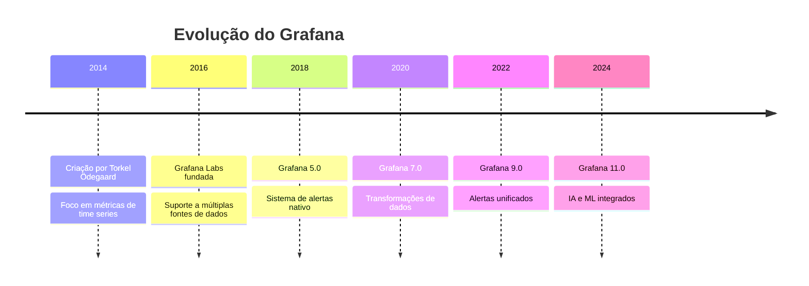
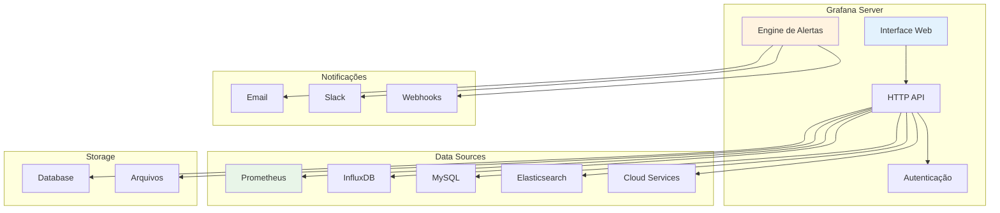
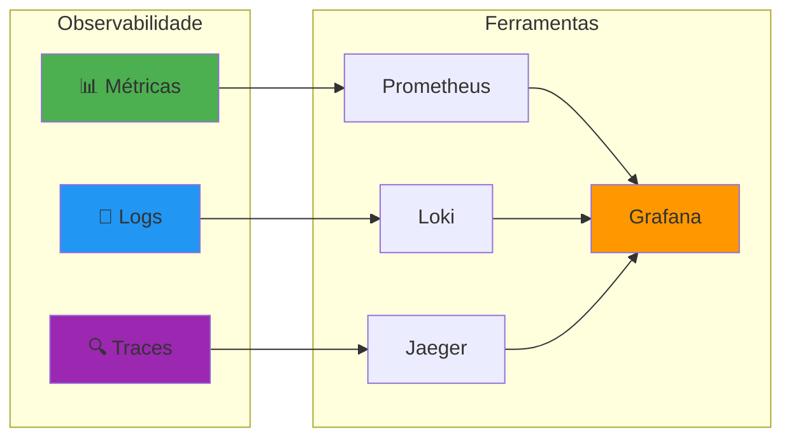

# Módulo 01 - Introdução ao Grafana

## 📊 Objetivos do Módulo

Ao final deste módulo, você será capaz de:

- ✅ Compreender o que é o Grafana e sua importância
- ✅ Conhecer a arquitetura e componentes principais
- ✅ Identificar diferentes tipos de visualizações
- ✅ Entender o ecossistema de observabilidade
- ✅ Reconhecer casos de uso práticos

## 🎯 O que é o Grafana?

### Definição

**Grafana** é uma plataforma de análise e visualização de código aberto que permite consultar, visualizar, alertar e compreender suas métricas, independentemente de onde estejam armazenadas.

### Características Principais

- 📊 **Visualização Rica**: Gráficos, tabelas, mapas e painéis interativos
- 🔌 **Multi-Data Source**: Suporte a 60+ fontes de dados
- 🔔 **Alertas Inteligentes**: Sistema de alertas unificado
- 👥 **Colaboração**: Compartilhamento e trabalho em equipe
- 🎨 **Personalização**: Temas, plugins e customizações
- 🚀 **Performance**: Otimizado para grandes volumes de dados

### História e Evolução



## 🏗️ Arquitetura do Grafana

### Componentes Principais



### Fluxo de Dados

1. **Coleta**: Data sources fornecem métricas
2. **Consulta**: Grafana executa queries
3. **Processamento**: Transformações e cálculos
4. **Visualização**: Renderização em painéis
5. **Alertas**: Avaliação de condições
6. **Notificação**: Envio de alertas

## 📊 Tipos de Visualizações

### Gráficos de Time Series

#### Line Chart (Gráfico de Linha)
```json
{
  "type": "timeseries",
  "options": {
    "legend": {
      "displayMode": "table",
      "placement": "bottom"
    },
    "tooltip": {
      "mode": "multi"
    }
  }
}
```

**Casos de Uso:**
- Métricas de CPU ao longo do tempo
- Latência de aplicações
- Throughput de rede

#### Bar Chart (Gráfico de Barras)
```json
{
  "type": "barchart",
  "options": {
    "orientation": "horizontal",
    "barWidth": 0.8
  }
}
```

**Casos de Uso:**
- Comparação de recursos por servidor
- Top N aplicações por uso
- Distribuição de erros por tipo

### Visualizações de Estado

#### Stat Panel (Painel de Estatística)
```json
{
  "type": "stat",
  "options": {
    "reduceOptions": {
      "values": false,
      "calcs": ["lastNotNull"]
    },
    "colorMode": "background",
    "graphMode": "area"
  }
}
```

#### Gauge (Medidor)
```json
{
  "type": "gauge",
  "options": {
    "min": 0,
    "max": 100,
    "thresholds": {
      "steps": [
        {"color": "green", "value": 0},
        {"color": "yellow", "value": 70},
        {"color": "red", "value": 90}
      ]
    }
  }
}
```

### Visualizações Tabulares

#### Table (Tabela)
```json
{
  "type": "table",
  "options": {
    "showHeader": true,
    "sortBy": [
      {
        "displayName": "Value",
        "desc": true
      }
    ]
  }
}
```

#### Logs Panel
```json
{
  "type": "logs",
  "options": {
    "showTime": true,
    "showLabels": true,
    "sortOrder": "Descending"
  }
}
```

### Visualizações Especializadas

#### Heatmap (Mapa de Calor)
```json
{
  "type": "heatmap",
  "options": {
    "calculate": true,
    "yAxis": {
      "unit": "ms"
    },
    "color": {
      "scheme": "Spectral"
    }
  }
}
```

#### Node Graph (Grafo de Nós)
```json
{
  "type": "nodeGraph",
  "options": {
    "nodes": {
      "mainStatUnit": "percent"
    },
    "edges": {
      "mainStatUnit": "reqps"
    }
  }
}
```

## 🌐 Ecossistema de Observabilidade

### Os Três Pilares



### Integração com Grafana

#### Métricas (Prometheus)
```yaml
# prometheus.yml
global:
  scrape_interval: 15s

scrape_configs:
  - job_name: 'node-exporter'
    static_configs:
      - targets: ['localhost:9100']
```

#### Logs (Loki)
```yaml
# promtail.yml
server:
  http_listen_port: 9080

positions:
  filename: /tmp/positions.yaml

clients:
  - url: http://loki:3100/loki/api/v1/push

scrape_configs:
  - job_name: system
    static_configs:
      - targets:
          - localhost
        labels:
          job: varlogs
          __path__: /var/log/*log
```

#### Traces (Jaeger)
```yaml
# jaeger.yml
reporter:
  type: jaeger
  jaeger:
    endpoint: http://jaeger:14268/api/traces

sampler:
  type: const
  param: 1
```

## 🎯 Casos de Uso Práticos

### 1. Monitoramento de Infraestrutura

**Objetivo**: Monitorar servidores, containers e rede

**Métricas Principais**:
- CPU, Memória, Disco
- Latência de rede
- Status de serviços
- Logs de sistema

**Dashboard Exemplo**:
```json
{
  "dashboard": {
    "title": "Infrastructure Overview",
    "panels": [
      {
        "title": "CPU Usage",
        "type": "timeseries",
        "targets": [
          {
            "expr": "100 - (avg(irate(node_cpu_seconds_total{mode=\"idle\"}[5m])) * 100)"
          }
        ]
      }
    ]
  }
}
```

### 2. Monitoramento de Aplicações

**Objetivo**: Acompanhar performance e erros de aplicações

**Métricas Principais**:
- Request rate (RPS)
- Response time
- Error rate
- Throughput

**Query Exemplo**:
```promql
# Taxa de erro por serviço
sum(rate(http_requests_total{status=~"5.."}[5m])) by (service) /
sum(rate(http_requests_total[5m])) by (service) * 100
```

### 3. Monitoramento de Negócio

**Objetivo**: Acompanhar KPIs e métricas de negócio

**Métricas Principais**:
- Vendas por período
- Usuários ativos
- Conversões
- Revenue

**Dashboard Business**:
```json
{
  "dashboard": {
    "title": "Business Metrics",
    "panels": [
      {
        "title": "Daily Revenue",
        "type": "stat",
        "targets": [
          {
            "expr": "sum(increase(sales_total[1d]))"
          }
        ]
      }
    ]
  }
}
```

## 🔧 Conceitos Fundamentais

### Data Sources (Fontes de Dados)

**Definição**: Sistemas que fornecem dados para o Grafana

**Tipos Principais**:
- **Time Series**: Prometheus, InfluxDB, Graphite
- **Logs**: Loki, Elasticsearch, CloudWatch
- **Traces**: Jaeger, Zipkin, Tempo
- **SQL**: MySQL, PostgreSQL, MSSQL
- **NoSQL**: MongoDB, Cassandra
- **Cloud**: AWS, GCP, Azure

### Dashboards

**Definição**: Coleção de painéis organizados em uma interface

**Componentes**:
- **Panels**: Visualizações individuais
- **Rows**: Agrupamento de painéis
- **Variables**: Parâmetros dinâmicos
- **Annotations**: Marcações temporais

### Queries

**Definição**: Comandos para buscar dados das fontes

**Exemplos por Data Source**:

```promql
# Prometheus (PromQL)
rate(http_requests_total[5m])

# InfluxDB (Flux)
from(bucket: "metrics")
  |> range(start: -1h)
  |> filter(fn: (r) => r._measurement == "cpu")

# SQL
SELECT time, value 
FROM metrics 
WHERE time > NOW() - INTERVAL 1 HOUR
```

### Alertas

**Definição**: Sistema de notificações baseado em condições

**Componentes**:
- **Alert Rules**: Condições de disparo
- **Contact Points**: Destinos de notificação
- **Notification Policies**: Roteamento de alertas
- **Silences**: Supressão temporária

## 📈 Vantagens do Grafana

### Para Desenvolvedores
- 🔧 **API Completa**: Automação e integração
- 🎨 **Customização**: Plugins e temas
- 📊 **Múltiplas Fontes**: Dados unificados
- 🚀 **Performance**: Otimizado para escala

### Para Operações
- 👀 **Visibilidade**: Dashboards centralizados
- 🔔 **Alertas**: Notificações inteligentes
- 📱 **Mobile**: Acesso em qualquer lugar
- 👥 **Colaboração**: Compartilhamento fácil

### Para Negócio
- 💰 **ROI**: Redução de downtime
- 📊 **Insights**: Dados para decisões
- 🎯 **KPIs**: Acompanhamento de metas
- 📈 **Crescimento**: Escalabilidade

## 🌟 Comparação com Outras Ferramentas

| Característica | Grafana | Kibana | Tableau | Power BI |
|----------------|---------|--------|---------|----------|
| **Código Aberto** | ✅ | ✅ | ❌ | ❌ |
| **Time Series** | ✅ | ⚠️ | ⚠️ | ⚠️ |
| **Alertas** | ✅ | ✅ | ❌ | ⚠️ |
| **Multi-Source** | ✅ | ❌ | ✅ | ✅ |
| **Real-time** | ✅ | ✅ | ⚠️ | ⚠️ |
| **Custo** | Gratuito | Gratuito | Alto | Médio |
| **Curva Aprendizado** | Média | Média | Alta | Baixa |

## 🎯 Exercícios Práticos

### Exercício 1: Exploração da Interface

**Objetivo**: Familiarizar-se com a interface do Grafana

**Passos**:
1. Acesse o Grafana demo: https://play.grafana.org/
2. Explore os dashboards existentes
3. Identifique diferentes tipos de visualizações
4. Analise as queries utilizadas

**Questões**:
1. Quantos tipos de painéis diferentes você encontrou?
2. Quais data sources estão configurados?
3. Como são organizados os dashboards?

### Exercício 2: Análise de Casos de Uso

**Objetivo**: Identificar aplicações práticas do Grafana

**Cenários**:
1. **E-commerce**: Monitorar vendas, usuários, performance
2. **DevOps**: Acompanhar deployments, erros, infraestrutura
3. **IoT**: Visualizar sensores, dispositivos, alertas

**Tarefa**: Para cada cenário, liste:
- 5 métricas importantes
- 3 tipos de visualização adequados
- 2 alertas críticos

### Exercício 3: Planejamento de Dashboard

**Objetivo**: Projetar um dashboard para monitoramento web

**Requisitos**:
- Monitorar aplicação web
- Incluir métricas de infraestrutura
- Alertas para problemas críticos

**Entregáveis**:
1. Esboço do layout
2. Lista de métricas
3. Definição de alertas
4. Justificativa das escolhas

## 📚 Resumo do Módulo

### Conceitos Aprendidos

✅ **Grafana Fundamentals**
- Definição e propósito
- Arquitetura e componentes
- Ecossistema de observabilidade

✅ **Tipos de Visualização**
- Time series (linha, barra)
- Estado (stat, gauge)
- Tabular (table, logs)
- Especializada (heatmap, graph)

✅ **Casos de Uso**
- Monitoramento de infraestrutura
- Observabilidade de aplicações
- Métricas de negócio

✅ **Conceitos Técnicos**
- Data sources
- Dashboards e painéis
- Queries e alertas

### Próximos Passos

No próximo módulo, você aprenderá:
- Instalação e configuração do Grafana
- Configuração com Docker
- Primeiros passos práticos
- Integração com Prometheus

## 🔗 Recursos Adicionais

### Documentação Oficial
- [Grafana Documentation](https://grafana.com/docs/)
- [Getting Started Guide](https://grafana.com/docs/grafana/latest/getting-started/)
- [Panel Types](https://grafana.com/docs/grafana/latest/panels/)

### Tutoriais e Cursos
- [Grafana Fundamentals](https://grafana.com/tutorials/grafana-fundamentals/)
- [Grafana University](https://university.grafana.com/)
- [Community Tutorials](https://grafana.com/tutorials/)

### Comunidade
- [Grafana Community Forum](https://community.grafana.com/)
- [GitHub Repository](https://github.com/grafana/grafana)
- [Slack Channel](https://grafana.slack.com/)

---

## 🚀 Navegação

**Anterior:** [📚 Índice Principal](README.md)  
**Próximo:** [⚙️ Módulo 02 - Configuração Inicial](02-configuracao.md)

---

*Este módulo faz parte da documentação educacional completa do Grafana. Continue sua jornada de aprendizado com os próximos módulos!*