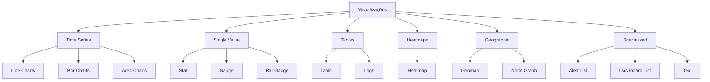

# Módulo 05: Visualizações

## Objetivos do Módulo

Ao final deste módulo, você será capaz de:
- Dominar todos os tipos de visualização do Grafana
- Configurar gráficos avançados com múltiplas séries
- Criar tabelas dinâmicas e interativas
- Implementar mapas e visualizações geográficas
- Configurar alertas visuais e thresholds
- Customizar cores, estilos e formatação
- Otimizar visualizações para performance

## 1. Fundamentos das Visualizações

### 1.1 Tipos de Visualização

O Grafana oferece diversos tipos de painéis para diferentes necessidades:



### 1.2 Configuração Base

**Estrutura Comum de Painel:**
```json
{
  "id": 1,
  "title": "Panel Title",
  "type": "timeseries",
  "targets": [
    {
      "expr": "prometheus_query",
      "legendFormat": "Legend Template",
      "refId": "A"
    }
  ],
  "fieldConfig": {
    "defaults": {
      "unit": "bytes",
      "min": 0,
      "max": 100,
      "thresholds": {
        "mode": "absolute",
        "steps": [
          {"color": "green", "value": null},
          {"color": "yellow", "value": 70},
          {"color": "red", "value": 90}
        ]
      }
    },
    "overrides": []
  },
  "options": {},
  "gridPos": {"h": 8, "w": 12, "x": 0, "y": 0}
}
```

## 2. Time Series (Gráficos Temporais)

### 2.1 Line Charts

**Configuração Básica:**
```json
{
  "type": "timeseries",
  "title": "CPU Usage Over Time",
  "targets": [
    {
      "expr": "100 - (avg(rate(node_cpu_seconds_total{mode=\"idle\"}[5m])) * 100)",
      "legendFormat": "CPU Usage %",
      "refId": "A"
    }
  ],
  "fieldConfig": {
    "defaults": {
      "custom": {
        "drawStyle": "line",
        "lineInterpolation": "linear",
        "lineWidth": 2,
        "fillOpacity": 10,
        "gradientMode": "none",
        "spanNulls": false,
        "insertNulls": false,
        "showPoints": "auto",
        "pointSize": 5,
        "stacking": {
          "mode": "none",
          "group": "A"
        },
        "axisPlacement": "auto",
        "axisLabel": "",
        "axisColorMode": "text",
        "scaleDistribution": {
          "type": "linear"
        },
        "hideFrom": {
          "legend": false,
          "tooltip": false,
          "vis": false
        },
        "thresholdsStyle": {
          "mode": "off"
        }
      },
      "color": {
        "mode": "palette-classic"
      },
      "unit": "percent",
      "min": 0,
      "max": 100
    }
  },
  "options": {
    "tooltip": {
      "mode": "single",
      "sort": "none"
    },
    "legend": {
      "displayMode": "visible",
      "placement": "bottom",
      "calcs": ["last", "max", "mean"]
    }
  }
}
```

**Múltiplas Séries:**
```json
{
  "targets": [
    {
      "expr": "rate(node_cpu_seconds_total{mode=\"user\"}[5m]) * 100",
      "legendFormat": "User CPU - {{instance}}",
      "refId": "A"
    },
    {
      "expr": "rate(node_cpu_seconds_total{mode=\"system\"}[5m]) * 100",
      "legendFormat": "System CPU - {{instance}}",
      "refId": "B"
    },
    {
      "expr": "rate(node_cpu_seconds_total{mode=\"iowait\"}[5m]) * 100",
      "legendFormat": "IO Wait - {{instance}}",
      "refId": "C"
    }
  ],
  "fieldConfig": {
    "overrides": [
      {
        "matcher": {"id": "byRegexp", "options": "/User CPU/"},
        "properties": [
          {"id": "color", "value": {"mode": "fixed", "fixedColor": "blue"}}
        ]
      },
      {
        "matcher": {"id": "byRegexp", "options": "/System CPU/"},
        "properties": [
          {"id": "color", "value": {"mode": "fixed", "fixedColor": "red"}}
        ]
      }
    ]
  }
}
```

### 2.2 Area Charts e Stacking

**Gráfico de Área Empilhada:**
```json
{
  "type": "timeseries",
  "title": "Memory Usage Breakdown",
  "targets": [
    {
      "expr": "node_memory_MemTotal_bytes - node_memory_MemFree_bytes - node_memory_Buffers_bytes - node_memory_Cached_bytes",
      "legendFormat": "Used Memory",
      "refId": "A"
    },
    {
      "expr": "node_memory_Buffers_bytes",
      "legendFormat": "Buffers",
      "refId": "B"
    },
    {
      "expr": "node_memory_Cached_bytes",
      "legendFormat": "Cached",
      "refId": "C"
    },
    {
      "expr": "node_memory_MemFree_bytes",
      "legendFormat": "Free",
      "refId": "D"
    }
  ],
  "fieldConfig": {
    "defaults": {
      "custom": {
        "drawStyle": "line",
        "fillOpacity": 80,
        "stacking": {
          "mode": "normal",
          "group": "A"
        }
      },
      "unit": "bytes"
    }
  }
}
```

### 2.3 Bar Charts

**Gráfico de Barras Horizontal:**
```json
{
  "type": "barchart",
  "title": "Top 10 Processes by CPU",
  "targets": [
    {
      "expr": "topk(10, rate(process_cpu_seconds_total[5m]))",
      "legendFormat": "{{job}} - {{instance}}",
      "refId": "A"
    }
  ],
  "fieldConfig": {
    "defaults": {
      "unit": "percentunit",
      "custom": {
        "orientation": "horizontal",
        "barWidth": 0.6,
        "groupWidth": 0.7
      }
    }
  },
  "options": {
    "orientation": "horizontal",
    "barWidth": 0.6,
    "groupWidth": 0.7,
    "showValue": "auto",
    "stacking": "none",
    "tooltip": {
      "mode": "single"
    },
    "text": {
      "valueSize": 12
    }
  }
}
```

## 3. Single Value Visualizations

### 3.1 Stat Panel

**Configuração Avançada:**
```json
{
  "type": "stat",
  "title": "Current System Load",
  "targets": [
    {
      "expr": "node_load1",
      "legendFormat": "1m Load",
      "refId": "A"
    }
  ],
  "fieldConfig": {
    "defaults": {
      "mappings": [
        {
          "options": {
            "from": null,
            "result": {
              "text": "Low"
            },
            "to": 1
          },
          "type": "range"
        },
        {
          "options": {
            "from": 1,
            "result": {
              "text": "Normal"
            },
            "to": 2
          },
          "type": "range"
        },
        {
          "options": {
            "from": 2,
            "result": {
              "text": "High"
            },
            "to": null
          },
          "type": "range"
        }
      ],
      "thresholds": {
        "mode": "absolute",
        "steps": [
          {"color": "green", "value": null},
          {"color": "yellow", "value": 1},
          {"color": "red", "value": 2}
        ]
      },
      "unit": "short",
      "decimals": 2
    }
  },
  "options": {
    "reduceOptions": {
      "values": false,
      "calcs": ["lastNotNull"],
      "fields": ""
    },
    "orientation": "auto",
    "textMode": "value_and_name",
    "colorMode": "background",
    "graphMode": "area",
    "justifyMode": "center"
  }
}
```

### 3.2 Gauge Panel

**Gauge Circular:**
```json
{
  "type": "gauge",
  "title": "Disk Usage",
  "targets": [
    {
      "expr": "100 - ((node_filesystem_avail_bytes{mountpoint=\"/\"} * 100) / node_filesystem_size_bytes{mountpoint=\"/\"})",
      "legendFormat": "Root Disk %",
      "refId": "A"
    }
  ],
  "fieldConfig": {
    "defaults": {
      "unit": "percent",
      "min": 0,
      "max": 100,
      "thresholds": {
        "mode": "absolute",
        "steps": [
          {"color": "green", "value": null},
          {"color": "yellow", "value": 70},
          {"color": "red", "value": 85}
        ]
      }
    }
  },
  "options": {
    "reduceOptions": {
      "values": false,
      "calcs": ["lastNotNull"],
      "fields": ""
    },
    "orientation": "auto",
    "showThresholdLabels": false,
    "showThresholdMarkers": true
  }
}
```

### 3.3 Bar Gauge

**Múltiplos Valores:**
```json
{
  "type": "bargauge",
  "title": "Service Status",
  "targets": [
    {
      "expr": "up{job=\"node-exporter\"}",
      "legendFormat": "{{instance}}",
      "refId": "A"
    }
  ],
  "fieldConfig": {
    "defaults": {
      "unit": "short",
      "min": 0,
      "max": 1,
      "thresholds": {
        "mode": "absolute",
        "steps": [
          {"color": "red", "value": null},
          {"color": "green", "value": 1}
        ]
      },
      "mappings": [
        {
          "options": {
            "0": {
              "text": "DOWN"
            },
            "1": {
              "text": "UP"
            }
          },
          "type": "value"
        }
      ]
    }
  },
  "options": {
    "reduceOptions": {
      "values": false,
      "calcs": ["lastNotNull"],
      "fields": ""
    },
    "orientation": "horizontal",
    "displayMode": "gradient",
    "showUnfilled": true
  }
}
```

## 4. Tables e Logs

### 4.1 Table Panel Avançada

**Tabela com Formatação Condicional:**
```json
{
  "type": "table",
  "title": "System Resources Overview",
  "targets": [
    {
      "expr": "100 - (avg by (instance) (rate(node_cpu_seconds_total{mode=\"idle\"}[5m])) * 100)",
      "format": "table",
      "instant": true,
      "refId": "A"
    },
    {
      "expr": "(1 - (node_memory_MemAvailable_bytes / node_memory_MemTotal_bytes)) * 100",
      "format": "table",
      "instant": true,
      "refId": "B"
    },
    {
      "expr": "100 - ((node_filesystem_avail_bytes{mountpoint=\"/\"} * 100) / node_filesystem_size_bytes{mountpoint=\"/\"})",
      "format": "table",
      "instant": true,
      "refId": "C"
    }
  ],
  "fieldConfig": {
    "defaults": {
      "custom": {
        "align": "auto",
        "displayMode": "auto",
        "inspect": false
      },
      "mappings": [],
      "thresholds": {
        "mode": "absolute",
        "steps": [
          {"color": "green", "value": null},
          {"color": "yellow", "value": 70},
          {"color": "red", "value": 90}
        ]
      },
      "unit": "percent"
    },
    "overrides": [
      {
        "matcher": {"id": "byName", "options": "instance"},
        "properties": [
          {"id": "custom.width", "value": 200},
          {"id": "custom.displayMode", "value": "color-text"}
        ]
      },
      {
        "matcher": {"id": "byRegexp", "options": "/CPU|Memory|Disk/"},
        "properties": [
          {"id": "custom.displayMode", "value": "gradient-gauge"},
          {"id": "custom.width", "value": 150}
        ]
      }
    ]
  },
  "options": {
    "showHeader": true,
    "cellHeight": "sm",
    "footer": {
      "show": false,
      "reducer": ["sum"],
      "countRows": false
    }
  }
}
```

### 4.2 Logs Panel

**Visualização de Logs:**
```json
{
  "type": "logs",
  "title": "Application Logs",
  "targets": [
    {
      "expr": "{job=\"app\"} |= \"error\" | json",
      "refId": "A"
    }
  ],
  "options": {
    "showTime": true,
    "showLabels": false,
    "showCommonLabels": false,
    "wrapLogMessage": false,
    "prettifyLogMessage": false,
    "enableLogDetails": true,
    "dedupStrategy": "none",
    "sortOrder": "Descending"
  },
  "fieldConfig": {
    "defaults": {
      "custom": {
        "hideFrom": {
          "legend": false,
          "tooltip": false,
          "vis": false
        }
      }
    }
  }
}
```

## 5. Heatmaps

### 5.1 Heatmap Básico

**Latência de Requisições:**
```json
{
  "type": "heatmap",
  "title": "Request Latency Distribution",
  "targets": [
    {
      "expr": "rate(http_request_duration_seconds_bucket[5m])",
      "format": "heatmap",
      "legendFormat": "{{le}}",
      "refId": "A"
    }
  ],
  "fieldConfig": {
    "defaults": {
      "custom": {
        "hideFrom": {
          "legend": false,
          "tooltip": false,
          "vis": false
        },
        "scaleDistribution": {
          "type": "linear"
        }
      }
    }
  },
  "options": {
    "calculate": false,
    "cellGap": 2,
    "cellValues": {
      "unit": "reqps"
    },
    "color": {
      "exponent": 0.5,
      "fill": "dark-orange",
      "mode": "spectrum",
      "reverse": false,
      "scale": "exponential",
      "scheme": "Spectral",
      "steps": 64
    },
    "exemplars": {
      "color": "rgba(255,0,255,0.7)"
    },
    "filterValues": {
      "le": 1e-9
    },
    "legend": {
      "show": false
    },
    "rowsFrame": {
      "layout": "auto"
    },
    "tooltip": {
      "show": true,
      "yHistogram": false
    },
    "yAxis": {
      "axisPlacement": "left",
      "reverse": false,
      "unit": "s"
    }
  }
}
```

## 6. Visualizações Geográficas

### 6.1 Geomap

**Mapa de Servidores por Localização:**
```json
{
  "type": "geomap",
  "title": "Server Locations",
  "targets": [
    {
      "expr": "up{job=\"node-exporter\"}",
      "legendFormat": "{{instance}}",
      "refId": "A"
    }
  ],
  "fieldConfig": {
    "defaults": {
      "mappings": [
        {
          "options": {
            "0": {
              "text": "DOWN"
            },
            "1": {
              "text": "UP"
            }
          },
          "type": "value"
        }
      ],
      "thresholds": {
        "mode": "absolute",
        "steps": [
          {"color": "red", "value": null},
          {"color": "green", "value": 1}
        ]
      },
      "unit": "short"
    }
  },
  "options": {
    "view": {
      "id": "coords",
      "lat": 0,
      "lon": 0,
      "zoom": 1
    },
    "controls": {
      "mouseWheelZoom": true,
      "showAttribution": true,
      "showDebug": false,
      "showMeasure": false,
      "showScale": false,
      "showZoom": true
    },
    "basemap": {
      "config": {},
      "name": "Layer 0",
      "type": "osm-standard"
    },
    "layers": [
      {
        "config": {
          "showLegend": true,
          "style": {
            "color": {
              "field": "Value",
              "fixed": "dark-green"
            },
            "opacity": 0.4,
            "rotation": {
              "fixed": 0,
              "max": 360,
              "min": -360,
              "mode": "mod"
            },
            "size": {
              "fixed": 5,
              "max": 15,
              "min": 2
            },
            "symbol": {
              "fixed": "img/icons/marker/circle.svg",
              "mode": "fixed"
            },
            "textConfig": {
              "fontSize": 12,
              "offsetX": 0,
              "offsetY": 0,
              "textAlign": "center",
              "textBaseline": "middle"
            }
          }
        },
        "location": {
          "mode": "coords",
          "coords": {
            "lat": "latitude",
            "lon": "longitude"
          }
        },
        "name": "Layer 1",
        "tooltip": true,
        "type": "markers"
      }
    ]
  }
}
```

### 6.2 Node Graph

**Grafo de Dependências:**
```json
{
  "type": "nodeGraph",
  "title": "Service Dependencies",
  "targets": [
    {
      "expr": "sum(rate(http_requests_total[5m])) by (source_service, target_service)",
      "refId": "A"
    }
  ],
  "fieldConfig": {
    "defaults": {
      "custom": {
        "hideFrom": {
          "legend": false,
          "tooltip": false,
          "vis": false
        }
      },
      "unit": "reqps"
    }
  },
  "options": {
    "nodes": {
      "mainStatUnit": "reqps",
      "secondaryStatUnit": "percent",
      "arcs": [
        {
          "field": "Value",
          "color": "green"
        }
      ]
    },
    "edges": {
      "mainStatUnit": "reqps",
      "secondaryStatUnit": "ms"
    }
  }
}
```

## 7. Alertas Visuais e Thresholds

### 7.1 Configuração de Thresholds

**Thresholds Avançados:**
```json
{
  "fieldConfig": {
    "defaults": {
      "thresholds": {
        "mode": "absolute",
        "steps": [
          {
            "color": "green",
            "value": null
          },
          {
            "color": "yellow",
            "value": 70
          },
          {
            "color": "orange",
            "value": 85
          },
          {
            "color": "red",
            "value": 95
          }
        ]
      }
    },
    "overrides": [
      {
        "matcher": {
          "id": "byName",
          "options": "Critical Service"
        },
        "properties": [
          {
            "id": "thresholds",
            "value": {
              "mode": "absolute",
              "steps": [
                {"color": "green", "value": null},
                {"color": "red", "value": 50}
              ]
            }
          }
        ]
      }
    ]
  }
}
```

### 7.2 Alert List Panel

**Lista de Alertas Ativos:**
```json
{
  "type": "alertlist",
  "title": "Active Alerts",
  "options": {
    "showOptions": "current",
    "maxItems": 20,
    "sortOrder": 1,
    "dashboardAlerts": false,
    "alertName": "",
    "dashboardTitle": "",
    "folderId": null,
    "tags": ["production"],
    "stateFilter": {
      "ok": false,
      "paused": false,
      "no_data": false,
      "execution_error": false,
      "alerting": true,
      "pending": true
    },
    "folder": ""
  },
  "fieldConfig": {
    "defaults": {
      "custom": {
        "hideFrom": {
          "legend": false,
          "tooltip": false,
          "vis": false
        }
      }
    }
  }
}
```

## 8. Customização Avançada

### 8.1 Cores e Estilos

**Paleta de Cores Customizada:**
```json
{
  "fieldConfig": {
    "defaults": {
      "color": {
        "mode": "palette-classic",
        "palette": [
          "#1f77b4",
          "#ff7f0e",
          "#2ca02c",
          "#d62728",
          "#9467bd",
          "#8c564b",
          "#e377c2",
          "#7f7f7f",
          "#bcbd22",
          "#17becf"
        ]
      }
    },
    "overrides": [
      {
        "matcher": {"id": "byRegexp", "options": "/error|fail/i"},
        "properties": [
          {"id": "color", "value": {"mode": "fixed", "fixedColor": "red"}}
        ]
      },
      {
        "matcher": {"id": "byRegexp", "options": "/success|ok/i"},
        "properties": [
          {"id": "color", "value": {"mode": "fixed", "fixedColor": "green"}}
        ]
      }
    ]
  }
}
```

### 8.2 Formatação de Unidades

**Unidades Customizadas:**
```json
{
  "fieldConfig": {
    "defaults": {
      "unit": "bytes",
      "decimals": 2,
      "displayName": "Memory Usage"
    },
    "overrides": [
      {
        "matcher": {"id": "byName", "options": "network_rx"},
        "properties": [
          {"id": "unit", "value": "binBps"},
          {"id": "displayName", "value": "Network RX"}
        ]
      },
      {
        "matcher": {"id": "byName", "options": "network_tx"},
        "properties": [
          {"id": "unit", "value": "binBps"},
          {"id": "displayName", "value": "Network TX"}
        ]
      }
    ]
  }
}
```

### 8.3 Transformações de Dados

**Transformações Comuns:**
```json
{
  "transformations": [
    {
      "id": "reduce",
      "options": {
        "reducers": ["lastNotNull"],
        "fields": "/^Value/"
      }
    },
    {
      "id": "organize",
      "options": {
        "excludeByName": {
          "Time": true,
          "__name__": true
        },
        "indexByName": {
          "instance": 0,
          "Value": 1
        },
        "renameByName": {
          "instance": "Server",
          "Value": "CPU Usage %"
        }
      }
    },
    {
      "id": "sortBy",
      "options": {
        "fields": {},
        "sort": [
          {
            "field": "CPU Usage %",
            "desc": true
          }
        ]
      }
    }
  ]
}
```

## 9. Performance e Otimização

### 9.1 Otimização de Queries

**Boas Práticas:**
```promql
# ❌ Evitar - Query muito ampla
rate(http_requests_total[5m])

# ✅ Melhor - Query específica
rate(http_requests_total{job="api", status=~"2.."}[5m])

# ❌ Evitar - Agregação desnecessária
sum(rate(cpu_usage[5m])) by (instance, job, mode)

# ✅ Melhor - Agregação otimizada
sum(rate(cpu_usage[5m])) by (instance)

# ✅ Usar recording rules para queries complexas
instance:cpu_usage:rate5m
```

### 9.2 Configuração de Cache

**Cache de Queries:**
```json
{
  "targets": [
    {
      "expr": "up",
      "interval": "30s",
      "maxDataPoints": 300,
      "refId": "A"
    }
  ]
}
```

## 10. Exercícios Práticos

### Exercício 1: Dashboard de Monitoramento Completo

**Objetivo:** Criar dashboard com diferentes tipos de visualização

**Componentes:**
1. Time series para CPU e memória
2. Gauge para uso de disco
3. Tabela com status de serviços
4. Heatmap de latência
5. Alert list

**Template Base:**
```json
{
  "dashboard": {
    "title": "Complete Monitoring Dashboard",
    "panels": [
      {
        "title": "CPU Usage",
        "type": "timeseries",
        "gridPos": {"h": 8, "w": 12, "x": 0, "y": 0}
      },
      {
        "title": "Memory Usage",
        "type": "timeseries",
        "gridPos": {"h": 8, "w": 12, "x": 12, "y": 0}
      },
      {
        "title": "Disk Usage",
        "type": "gauge",
        "gridPos": {"h": 8, "w": 8, "x": 0, "y": 8}
      },
      {
        "title": "Service Status",
        "type": "table",
        "gridPos": {"h": 8, "w": 16, "x": 8, "y": 8}
      }
    ]
  }
}
```

### Exercício 2: Visualização Geográfica

**Objetivo:** Criar mapa de servidores com status

**Dados Necessários:**
```json
{
  "servers": [
    {"name": "server-us", "lat": 40.7128, "lon": -74.0060, "status": 1},
    {"name": "server-eu", "lat": 52.5200, "lon": 13.4050, "status": 1},
    {"name": "server-asia", "lat": 35.6762, "lon": 139.6503, "status": 0}
  ]
}
```

### Exercício 3: Heatmap de Performance

**Objetivo:** Visualizar distribuição de latência

**Query Prometheus:**
```promql
# Histogram buckets para heatmap
rate(http_request_duration_seconds_bucket[5m])
```

## 11. Resumo do Módulo

### Conceitos Aprendidos

- ✅ **Time Series**: Line, area, bar charts com múltiplas séries
- ✅ **Single Values**: Stat, gauge, bar gauge com thresholds
- ✅ **Tables**: Formatação condicional e transformações
- ✅ **Heatmaps**: Distribuições e análise de performance
- ✅ **Geographic**: Mapas e visualizações espaciais
- ✅ **Customização**: Cores, estilos, formatação
- ✅ **Performance**: Otimização de queries e cache

### Próximos Passos

- **Módulo 06**: Sistema de alertas e notificações
- **Módulo 07**: Provisioning e automação
- **Módulo 08**: Troubleshooting e diagnóstico

### Recursos Adicionais

- [Panel Types Documentation](https://grafana.com/docs/grafana/latest/panels/)
- [Visualization Examples](https://grafana.com/docs/grafana/latest/panels/visualizations/)
- [Field Options Reference](https://grafana.com/docs/grafana/latest/panels/field-options/)

---

**Navegação:**
- [← Módulo 04: Dashboards](04-dashboards.md)
- [→ Módulo 06: Alertas](06-alertas.md)
- [🏠 Início](../README.md)