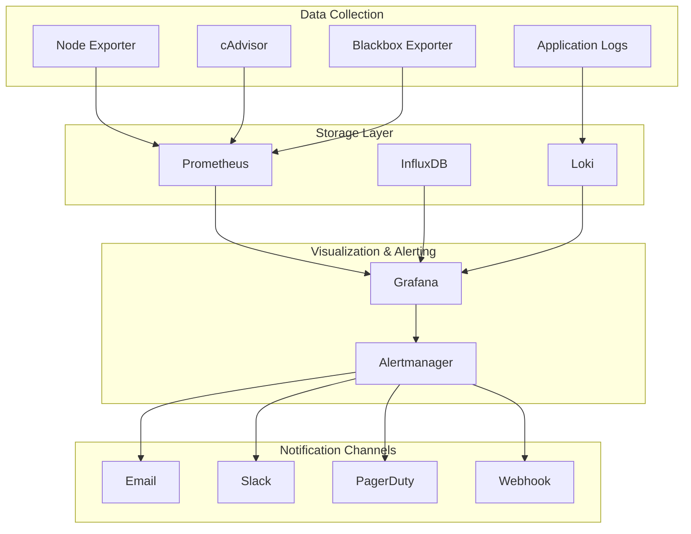

# Módulo 09: Projeto Final

## Objetivos do Projeto

Neste projeto final, você irá:
- Implementar um sistema completo de monitoramento de infraestrutura
- Integrar múltiplas fontes de dados (Prometheus, InfluxDB, Loki)
- Criar dashboards hierárquicos e interativos
- Configurar alertas inteligentes e escalonamento
- Implementar provisioning automatizado
- Aplicar boas práticas de performance e troubleshooting

## 1. Arquitetura do Projeto

### 1.1 Visão Geral



### 1.2 Componentes do Sistema

**Coleta de Dados:**
- **Node Exporter**: Métricas do sistema operacional
- **cAdvisor**: Métricas de containers Docker
- **Blackbox Exporter**: Monitoramento de endpoints HTTP/HTTPS
- **Application Logs**: Logs estruturados das aplicações

**Armazenamento:**
- **Prometheus**: Métricas de infraestrutura e aplicações
- **InfluxDB**: Dados de séries temporais customizados
- **Loki**: Agregação e indexação de logs

**Visualização:**
- **Grafana**: Dashboards interativos e alertas
- **Alertmanager**: Gerenciamento de alertas e notificações

## 2. Setup do Ambiente

### 2.1 Docker Compose Completo

**docker-compose.yml:**
```yaml
version: '3.8'

services:
  # === Monitoring Stack ===
  prometheus:
    image: prom/prometheus:latest
    container_name: prometheus
    ports:
      - "9090:9090"
    volumes:
      - ./prometheus:/etc/prometheus:ro
      - prometheus-data:/prometheus
    command:
      - '--config.file=/etc/prometheus/prometheus.yml'
      - '--storage.tsdb.path=/prometheus'
      - '--web.console.libraries=/etc/prometheus/console_libraries'
      - '--web.console.templates=/etc/prometheus/consoles'
      - '--storage.tsdb.retention.time=30d'
      - '--web.enable-lifecycle'
      - '--web.enable-admin-api'
    networks:
      - monitoring
    restart: unless-stopped

  grafana:
    image: grafana/grafana:latest
    container_name: grafana
    ports:
      - "3000:3000"
    environment:
      - GF_SECURITY_ADMIN_PASSWORD=admin123
      - GF_USERS_ALLOW_SIGN_UP=false
      - GF_INSTALL_PLUGINS=grafana-clock-panel,grafana-worldmap-panel,grafana-piechart-panel
      - GF_PATHS_PROVISIONING=/etc/grafana/provisioning
    volumes:
      - grafana-data:/var/lib/grafana
      - ./grafana/provisioning:/etc/grafana/provisioning:ro
      - ./grafana/dashboards:/var/lib/grafana/dashboards:ro
    networks:
      - monitoring
    restart: unless-stopped
    depends_on:
      - prometheus
      - influxdb
      - loki

  influxdb:
    image: influxdb:2.7
    container_name: influxdb
    ports:
      - "8086:8086"
    environment:
      - DOCKER_INFLUXDB_INIT_MODE=setup
      - DOCKER_INFLUXDB_INIT_USERNAME=admin
      - DOCKER_INFLUXDB_INIT_PASSWORD=admin123
      - DOCKER_INFLUXDB_INIT_ORG=monitoring
      - DOCKER_INFLUXDB_INIT_BUCKET=metrics
      - DOCKER_INFLUXDB_INIT_ADMIN_TOKEN=my-super-secret-auth-token
    volumes:
      - influxdb-data:/var/lib/influxdb2
      - ./influxdb/config:/etc/influxdb2:ro
    networks:
      - monitoring
    restart: unless-stopped

  loki:
    image: grafana/loki:latest
    container_name: loki
    ports:
      - "3100:3100"
    volumes:
      - ./loki:/etc/loki:ro
      - loki-data:/loki
    command: -config.file=/etc/loki/loki.yml
    networks:
      - monitoring
    restart: unless-stopped

  promtail:
    image: grafana/promtail:latest
    container_name: promtail
    volumes:
      - ./promtail:/etc/promtail:ro
      - /var/log:/var/log:ro
      - /var/lib/docker/containers:/var/lib/docker/containers:ro
    command: -config.file=/etc/promtail/promtail.yml
    networks:
      - monitoring
    restart: unless-stopped
    depends_on:
      - loki

  # === Exporters ===
  node-exporter:
    image: prom/node-exporter:latest
    container_name: node-exporter
    ports:
      - "9100:9100"
    volumes:
      - /proc:/host/proc:ro
      - /sys:/host/sys:ro
      - /:/rootfs:ro
    command:
      - '--path.procfs=/host/proc'
      - '--path.rootfs=/rootfs'
      - '--path.sysfs=/host/sys'
      - '--collector.filesystem.mount-points-exclude=^/(sys|proc|dev|host|etc)($$|/)'
    networks:
      - monitoring
    restart: unless-stopped

  cadvisor:
    image: gcr.io/cadvisor/cadvisor:latest
    container_name: cadvisor
    ports:
      - "8080:8080"
    volumes:
      - /:/rootfs:ro
      - /var/run:/var/run:ro
      - /sys:/sys:ro
      - /var/lib/docker/:/var/lib/docker:ro
      - /dev/disk/:/dev/disk:ro
    privileged: true
    devices:
      - /dev/kmsg
    networks:
      - monitoring
    restart: unless-stopped

  blackbox-exporter:
    image: prom/blackbox-exporter:latest
    container_name: blackbox-exporter
    ports:
      - "9115:9115"
    volumes:
      - ./blackbox:/etc/blackbox_exporter:ro
    networks:
      - monitoring
    restart: unless-stopped

  # === Sample Applications ===
  nginx:
    image: nginx:alpine
    container_name: sample-nginx
    ports:
      - "8081:80"
    volumes:
      - ./nginx/nginx.conf:/etc/nginx/nginx.conf:ro
      - ./nginx/html:/usr/share/nginx/html:ro
    networks:
      - monitoring
    restart: unless-stopped

  redis:
    image: redis:alpine
    container_name: sample-redis
    ports:
      - "6379:6379"
    networks:
      - monitoring
    restart: unless-stopped

  mysql:
    image: mysql:8.0
    container_name: sample-mysql
    ports:
      - "3306:3306"
    environment:
      - MYSQL_ROOT_PASSWORD=rootpass
      - MYSQL_DATABASE=testdb
      - MYSQL_USER=grafana
      - MYSQL_PASSWORD=grafana123
    volumes:
      - mysql-data:/var/lib/mysql
    networks:
      - monitoring
    restart: unless-stopped

volumes:
  prometheus-data:
  grafana-data:
  influxdb-data:
  loki-data:
  mysql-data:

networks:
  monitoring:
    driver: bridge
```

### 2.2 Configurações dos Componentes

**prometheus/prometheus.yml:**
```yaml
global:
  scrape_interval: 15s
  evaluation_interval: 15s
  external_labels:
    cluster: 'monitoring-lab'
    environment: 'production'

rule_files:
  - "rules/*.yml"

alerting:
  alertmanagers:
    - static_configs:
        - targets:
          - alertmanager:9093

scrape_configs:
  # Prometheus itself
  - job_name: 'prometheus'
    static_configs:
      - targets: ['localhost:9090']
    scrape_interval: 5s

  # Grafana
  - job_name: 'grafana'
    static_configs:
      - targets: ['grafana:3000']
    metrics_path: '/metrics'
    scrape_interval: 15s

  # Node Exporter
  - job_name: 'node-exporter'
    static_configs:
      - targets: ['node-exporter:9100']
    scrape_interval: 15s

  # cAdvisor
  - job_name: 'cadvisor'
    static_configs:
      - targets: ['cadvisor:8080']
    scrape_interval: 15s

  # Blackbox Exporter - HTTP checks
  - job_name: 'blackbox-http'
    metrics_path: /probe
    params:
      module: [http_2xx]
    static_configs:
      - targets:
        - http://nginx:80
        - http://grafana:3000
        - http://prometheus:9090
    relabel_configs:
      - source_labels: [__address__]
        target_label: __param_target
      - source_labels: [__param_target]
        target_label: instance
      - target_label: __address__
        replacement: blackbox-exporter:9115

  # Blackbox Exporter - TCP checks
  - job_name: 'blackbox-tcp'
    metrics_path: /probe
    params:
      module: [tcp_connect]
    static_configs:
      - targets:
        - redis:6379
        - mysql:3306
    relabel_configs:
      - source_labels: [__address__]
        target_label: __param_target
      - source_labels: [__param_target]
        target_label: instance
      - target_label: __address__
        replacement: blackbox-exporter:9115

  # InfluxDB
  - job_name: 'influxdb'
    static_configs:
      - targets: ['influxdb:8086']
    metrics_path: '/metrics'
    scrape_interval: 30s

  # Custom application metrics (example)
  - job_name: 'custom-app'
    static_configs:
      - targets: ['app:8000']
    metrics_path: '/metrics'
    scrape_interval: 30s
```

**loki/loki.yml:**
```yaml
auth_enabled: false

server:
  http_listen_port: 3100
  grpc_listen_port: 9096

common:
  path_prefix: /loki
  storage:
    filesystem:
      chunks_directory: /loki/chunks
      rules_directory: /loki/rules
  replication_factor: 1
  ring:
    instance_addr: 127.0.0.1
    kvstore:
      store: inmemory

query_range:
  results_cache:
    cache:
      embedded_cache:
        enabled: true
        max_size_mb: 100

schema_config:
  configs:
    - from: 2020-10-24
      store: boltdb-shipper
      object_store: filesystem
      schema: v11
      index:
        prefix: index_
        period: 24h

ruler:
  alertmanager_url: http://localhost:9093

limits_config:
  enforce_metric_name: false
  reject_old_samples: true
  reject_old_samples_max_age: 168h
  max_cache_freshness_per_query: 10m
  split_queries_by_interval: 15m

chunk_store_config:
  max_look_back_period: 0s

table_manager:
  retention_deletes_enabled: false
  retention_period: 0s

compactor:
  working_directory: /loki/boltdb-shipper-compactor
  shared_store: filesystem
  compaction_interval: 10m
  retention_enabled: true
  retention_delete_delay: 2h
  retention_delete_worker_count: 150
```

**promtail/promtail.yml:**
```yaml
server:
  http_listen_port: 9080
  grpc_listen_port: 0

positions:
  filename: /tmp/positions.yaml

clients:
  - url: http://loki:3100/loki/api/v1/push

scrape_configs:
  # System logs
  - job_name: system
    static_configs:
      - targets:
          - localhost
        labels:
          job: varlogs
          __path__: /var/log/*log

  # Docker container logs
  - job_name: containers
    static_configs:
      - targets:
          - localhost
        labels:
          job: containerlogs
          __path__: /var/lib/docker/containers/*/*log
    
    # Parse JSON logs
    pipeline_stages:
      - json:
          expressions:
            output: log
            stream: stream
            attrs:
      - json:
          expressions:
            tag:
          source: attrs
      - regex:
          expression: (?P<container_name>(?:[^|]*))
          source: tag
      - timestamp:
          format: RFC3339Nano
          source: time
      - labels:
          stream:
          container_name:
      - output:
          source: output

  # Nginx access logs
  - job_name: nginx
    static_configs:
      - targets:
          - localhost
        labels:
          job: nginx
          __path__: /var/log/nginx/*log
    
    pipeline_stages:
      - regex:
          expression: '^(?P<remote_addr>[\w\.]+) - (?P<remote_user>\S+) \[(?P<time_local>[\w:/]+\s[+\-]\d{4})\] "(?P<method>\S+) (?P<request>\S+) (?P<protocol>\S+)" (?P<status>\d{3}) (?P<body_bytes_sent>\d+) "(?P<http_referer>[^"]*)" "(?P<http_user_agent>[^"]*)"'
      - labels:
          method:
          status:
      - timestamp:
          format: 02/Jan/2006:15:04:05 -0700
          source: time_local
```

## 3. Dashboards Hierárquicos

### 3.1 Dashboard Principal - Overview

**dashboards/00-infrastructure-overview.json:**
```json
{
  "dashboard": {
    "id": null,
    "uid": "infrastructure-overview",
    "title": "Infrastructure Overview",
    "description": "High-level view of infrastructure health and performance",
    "tags": ["infrastructure", "overview", "monitoring"],
    "timezone": "browser",
    "editable": true,
    "graphTooltip": 1,
    "time": {
      "from": "now-1h",
      "to": "now"
    },
    "timepicker": {
      "refresh_intervals": ["5s", "10s", "30s", "1m", "5m", "15m", "30m", "1h"],
      "time_options": ["5m", "15m", "1h", "6h", "12h", "24h", "2d", "7d", "30d"]
    },
    "templating": {
      "list": [
        {
          "name": "datasource",
          "type": "datasource",
          "query": "prometheus",
          "current": {
            "value": "${DS_PROMETHEUS}",
            "text": "Prometheus"
          },
          "hide": 0,
          "includeAll": false,
          "multi": false,
          "options": [],
          "refresh": 1,
          "regex": "",
          "skipUrlSync": false
        },
        {
          "name": "cluster",
          "type": "query",
          "datasource": "${datasource}",
          "query": "label_values(up, cluster)",
          "current": {},
          "hide": 0,
          "includeAll": true,
          "multi": true,
          "options": [],
          "refresh": 1,
          "regex": "",
          "skipUrlSync": false,
          "sort": 1
        }
      ]
    },
    "panels": [
      {
        "id": 1,
        "title": "System Health Overview",
        "type": "row",
        "collapsed": false,
        "gridPos": {"h": 1, "w": 24, "x": 0, "y": 0},
        "panels": []
      },
      {
        "id": 2,
        "title": "Services Status",
        "type": "stat",
        "gridPos": {"h": 8, "w": 6, "x": 0, "y": 1},
        "targets": [
          {
            "expr": "count(up{cluster=~\"$cluster\"} == 1)",
            "legendFormat": "Services Up",
            "refId": "A"
          },
          {
            "expr": "count(up{cluster=~\"$cluster\"} == 0)",
            "legendFormat": "Services Down",
            "refId": "B"
          }
        ],
        "fieldConfig": {
          "defaults": {
            "unit": "short",
            "mappings": [],
            "thresholds": {
              "steps": [
                {"color": "red", "value": null},
                {"color": "green", "value": 1}
              ]
            }
          },
          "overrides": [
            {
              "matcher": {"id": "byName", "options": "Services Down"},
              "properties": [
                {
                  "id": "thresholds",
                  "value": {
                    "steps": [
                      {"color": "green", "value": null},
                      {"color": "red", "value": 1}
                    ]
                  }
                }
              ]
            }
          ]
        },
        "options": {
          "reduceOptions": {
            "values": false,
            "calcs": ["lastNotNull"],
            "fields": ""
          },
          "orientation": "auto",
          "textMode": "auto",
          "colorMode": "background",
          "graphMode": "area",
          "justifyMode": "auto"
        }
      },
      {
        "id": 3,
        "title": "CPU Usage",
        "type": "gauge",
        "gridPos": {"h": 8, "w": 6, "x": 6, "y": 1},
        "targets": [
          {
            "expr": "avg(100 - (avg by (instance) (rate(node_cpu_seconds_total{cluster=~\"$cluster\", mode=\"idle\"}[5m])) * 100))",
            "legendFormat": "CPU Usage %",
            "refId": "A"
          }
        ],
        "fieldConfig": {
          "defaults": {
            "unit": "percent",
            "min": 0,
            "max": 100,
            "thresholds": {
              "steps": [
                {"color": "green", "value": null},
                {"color": "yellow", "value": 70},
                {"color": "red", "value": 90}
              ]
            }
          }
        },
        "options": {
          "reduceOptions": {
            "values": false,
            "calcs": ["lastNotNull"],
            "fields": ""
          },
          "orientation": "auto",
          "textMode": "auto",
          "colorMode": "value",
          "graphMode": "area",
          "justifyMode": "auto"
        }
      },
      {
        "id": 4,
        "title": "Memory Usage",
        "type": "gauge",
        "gridPos": {"h": 8, "w": 6, "x": 12, "y": 1},
        "targets": [
          {
            "expr": "avg((1 - (node_memory_MemAvailable_bytes{cluster=~\"$cluster\"} / node_memory_MemTotal_bytes{cluster=~\"$cluster\"})) * 100)",
            "legendFormat": "Memory Usage %",
            "refId": "A"
          }
        ],
        "fieldConfig": {
          "defaults": {
            "unit": "percent",
            "min": 0,
            "max": 100,
            "thresholds": {
              "steps": [
                {"color": "green", "value": null},
                {"color": "yellow", "value": 80},
                {"color": "red", "value": 95}
              ]
            }
          }
        }
      },
      {
        "id": 5,
        "title": "Disk Usage",
        "type": "gauge",
        "gridPos": {"h": 8, "w": 6, "x": 18, "y": 1},
        "targets": [
          {
            "expr": "avg((1 - (node_filesystem_avail_bytes{cluster=~\"$cluster\", fstype!=\"tmpfs\"} / node_filesystem_size_bytes{cluster=~\"$cluster\", fstype!=\"tmpfs\"})) * 100)",
            "legendFormat": "Disk Usage %",
            "refId": "A"
          }
        ],
        "fieldConfig": {
          "defaults": {
            "unit": "percent",
            "min": 0,
            "max": 100,
            "thresholds": {
              "steps": [
                {"color": "green", "value": null},
                {"color": "yellow", "value": 80},
                {"color": "red", "value": 90}
              ]
            }
          }
        }
      },
      {
        "id": 6,
        "title": "Network Traffic",
        "type": "timeseries",
        "gridPos": {"h": 8, "w": 12, "x": 0, "y": 9},
        "targets": [
          {
            "expr": "sum(rate(node_network_receive_bytes_total{cluster=~\"$cluster\"}[5m])) * 8",
            "legendFormat": "Inbound",
            "refId": "A"
          },
          {
            "expr": "sum(rate(node_network_transmit_bytes_total{cluster=~\"$cluster\"}[5m])) * 8",
            "legendFormat": "Outbound",
            "refId": "B"
          }
        ],
        "fieldConfig": {
          "defaults": {
            "unit": "bps",
            "custom": {
              "drawStyle": "line",
              "lineInterpolation": "linear",
              "barAlignment": 0,
              "lineWidth": 1,
              "fillOpacity": 10,
              "gradientMode": "none",
              "spanNulls": false,
              "insertNulls": false,
              "showPoints": "never",
              "pointSize": 5,
              "stacking": {
                "mode": "none",
                "group": "A"
              },
              "axisPlacement": "auto",
              "axisLabel": "",
              "scaleDistribution": {
                "type": "linear"
              },
              "hideFrom": {
                "legend": false,
                "tooltip": false,
                "vis": false
              },
              "thresholdsStyle": {
                "mode": "off"
              }
            }
          }
        }
      },
      {
        "id": 7,
        "title": "Active Alerts",
        "type": "table",
        "gridPos": {"h": 8, "w": 12, "x": 12, "y": 9},
        "targets": [
          {
            "expr": "ALERTS{cluster=~\"$cluster\", alertstate=\"firing\"}",
            "format": "table",
            "instant": true,
            "refId": "A"
          }
        ],
        "fieldConfig": {
          "defaults": {
            "custom": {
              "align": "auto",
              "displayMode": "auto",
              "inspect": false
            },
            "mappings": [],
            "thresholds": {
              "mode": "absolute",
              "steps": [
                {"color": "green", "value": null},
                {"color": "red", "value": 80}
              ]
            }
          },
          "overrides": [
            {
              "matcher": {"id": "byName", "options": "alertname"},
              "properties": [
                {"id": "displayName", "value": "Alert Name"},
                {"id": "custom.width", "value": 200}
              ]
            },
            {
              "matcher": {"id": "byName", "options": "severity"},
              "properties": [
                {"id": "displayName", "value": "Severity"},
                {"id": "custom.width", "value": 100}
              ]
            },
            {
              "matcher": {"id": "byName", "options": "instance"},
              "properties": [
                {"id": "displayName", "value": "Instance"},
                {"id": "custom.width", "value": 150}
              ]
            }
          ]
        },
        "options": {
          "showHeader": true,
          "sortBy": [
            {
              "desc": true,
              "displayName": "Severity"
            }
          ]
        },
        "transformations": [
          {
            "id": "organize",
            "options": {
              "excludeByName": {
                "Time": true,
                "__name__": true,
                "alertstate": true,
                "job": true
              },
              "indexByName": {},
              "renameByName": {}
            }
          }
        ]
      }
    ],
    "refresh": "30s",
    "schemaVersion": 36,
    "version": 1,
    "links": [
      {
        "asDropdown": false,
        "icon": "external link",
        "includeVars": true,
        "keepTime": true,
        "tags": ["infrastructure"],
        "targetBlank": false,
        "title": "Infrastructure Dashboards",
        "tooltip": "",
        "type": "dashboards",
        "url": ""
      }
    ]
  },
  "overwrite": true
}
```

### 3.2 Dashboard de Containers

**dashboards/01-containers-monitoring.json:**
```json
{
  "dashboard": {
    "uid": "containers-monitoring",
    "title": "Containers Monitoring",
    "description": "Docker containers performance and resource usage",
    "tags": ["docker", "containers", "infrastructure"],
    "templating": {
      "list": [
        {
          "name": "container",
          "type": "query",
          "datasource": "${DS_PROMETHEUS}",
          "query": "label_values(container_last_seen, name)",
          "current": {},
          "hide": 0,
          "includeAll": true,
          "multi": true,
          "refresh": 1,
          "regex": "/^(?!.*POD).*$/",
          "sort": 1
        }
      ]
    },
    "panels": [
      {
        "id": 1,
        "title": "Container CPU Usage",
        "type": "timeseries",
        "targets": [
          {
            "expr": "rate(container_cpu_usage_seconds_total{name=~\"$container\"}[5m]) * 100",
            "legendFormat": "{{ name }}",
            "refId": "A"
          }
        ],
        "fieldConfig": {
          "defaults": {
            "unit": "percent",
            "thresholds": {
              "steps": [
                {"color": "green", "value": null},
                {"color": "yellow", "value": 70},
                {"color": "red", "value": 90}
              ]
            }
          }
        }
      },
      {
        "id": 2,
        "title": "Container Memory Usage",
        "type": "timeseries",
        "targets": [
          {
            "expr": "container_memory_usage_bytes{name=~\"$container\"} / 1024 / 1024",
            "legendFormat": "{{ name }}",
            "refId": "A"
          }
        ],
        "fieldConfig": {
          "defaults": {
            "unit": "decbytes"
          }
        }
      },
      {
        "id": 3,
        "title": "Container Network I/O",
        "type": "timeseries",
        "targets": [
          {
            "expr": "rate(container_network_receive_bytes_total{name=~\"$container\"}[5m])",
            "legendFormat": "{{ name }} - RX",
            "refId": "A"
          },
          {
            "expr": "rate(container_network_transmit_bytes_total{name=~\"$container\"}[5m])",
            "legendFormat": "{{ name }} - TX",
            "refId": "B"
          }
        ],
        "fieldConfig": {
          "defaults": {
            "unit": "Bps"
          }
        }
      }
    ]
  }
}
```

### 3.3 Dashboard de Logs

**dashboards/02-logs-analysis.json:**
```json
{
  "dashboard": {
    "uid": "logs-analysis",
    "title": "Logs Analysis",
    "description": "Centralized log analysis and monitoring",
    "tags": ["logs", "loki", "monitoring"],
    "templating": {
      "list": [
        {
          "name": "job",
          "type": "query",
          "datasource": "${DS_LOKI}",
          "query": "label_values(job)",
          "current": {},
          "hide": 0,
          "includeAll": true,
          "multi": true,
          "refresh": 1
        },
        {
          "name": "level",
          "type": "custom",
          "options": [
            {"text": "All", "value": ".*", "selected": true},
            {"text": "Error", "value": "error"},
            {"text": "Warning", "value": "warn"},
            {"text": "Info", "value": "info"},
            {"text": "Debug", "value": "debug"}
          ],
          "current": {"text": "All", "value": ".*"}
        }
      ]
    },
    "panels": [
      {
        "id": 1,
        "title": "Log Volume",
        "type": "timeseries",
        "targets": [
          {
            "expr": "sum(rate({job=~\"$job\"} |~ \"(?i)$level\" [5m])) by (job)",
            "legendFormat": "{{ job }}",
            "refId": "A"
          }
        ],
        "fieldConfig": {
          "defaults": {
            "unit": "logs/sec"
          }
        }
      },
      {
        "id": 2,
        "title": "Error Rate",
        "type": "stat",
        "targets": [
          {
            "expr": "sum(rate({job=~\"$job\"} |~ \"(?i)error\" [5m]))",
            "legendFormat": "Errors/sec",
            "refId": "A"
          }
        ],
        "fieldConfig": {
          "defaults": {
            "unit": "logs/sec",
            "thresholds": {
              "steps": [
                {"color": "green", "value": null},
                {"color": "yellow", "value": 0.1},
                {"color": "red", "value": 1}
              ]
            }
          }
        }
      },
      {
        "id": 3,
        "title": "Recent Logs",
        "type": "logs",
        "targets": [
          {
            "expr": "{job=~\"$job\"} |~ \"(?i)$level\"",
            "refId": "A"
          }
        ],
        "options": {
          "showTime": true,
          "showLabels": true,
          "showCommonLabels": false,
          "wrapLogMessage": true,
          "prettifyLogMessage": false,
          "enableLogDetails": true,
          "dedupStrategy": "none",
          "sortOrder": "Descending"
        }
      }
    ]
  }
}
```

## 4. Sistema de Alertas Inteligente

### 4.1 Regras de Alerta Hierárquicas

**prometheus/rules/infrastructure.yml:**
```yaml
groups:
  - name: infrastructure.critical
    interval: 30s
    rules:
      # Node down
      - alert: NodeDown
        expr: up{job="node-exporter"} == 0
        for: 1m
        labels:
          severity: critical
          team: infrastructure
          category: availability
        annotations:
          summary: "Node {{ $labels.instance }} is down"
          description: "Node {{ $labels.instance }} has been down for more than 1 minute"
          runbook_url: "https://wiki.company.com/runbooks/node-down"
          dashboard_url: "https://grafana.company.com/d/infrastructure-overview"

      # High CPU usage
      - alert: HighCPUUsage
        expr: 100 - (avg by (instance) (rate(node_cpu_seconds_total{mode="idle"}[5m])) * 100) > 90
        for: 5m
        labels:
          severity: critical
          team: infrastructure
          category: performance
        annotations:
          summary: "High CPU usage on {{ $labels.instance }}"
          description: "CPU usage is {{ $value }}% on {{ $labels.instance }}"
          runbook_url: "https://wiki.company.com/runbooks/high-cpu"

      # High memory usage
      - alert: HighMemoryUsage
        expr: (1 - (node_memory_MemAvailable_bytes / node_memory_MemTotal_bytes)) * 100 > 95
        for: 5m
        labels:
          severity: critical
          team: infrastructure
          category: performance
        annotations:
          summary: "High memory usage on {{ $labels.instance }}"
          description: "Memory usage is {{ $value }}% on {{ $labels.instance }}"

      # Disk space critical
      - alert: DiskSpaceCritical
        expr: (1 - (node_filesystem_avail_bytes{fstype!="tmpfs"} / node_filesystem_size_bytes{fstype!="tmpfs"})) * 100 > 90
        for: 2m
        labels:
          severity: critical
          team: infrastructure
          category: storage
        annotations:
          summary: "Disk space critical on {{ $labels.instance }}"
          description: "Disk usage is {{ $value }}% on {{ $labels.instance }} ({{ $labels.mountpoint }})"

  - name: infrastructure.warning
    interval: 1m
    rules:
      # CPU usage warning
      - alert: HighCPUUsageWarning
        expr: 100 - (avg by (instance) (rate(node_cpu_seconds_total{mode="idle"}[5m])) * 100) > 80
        for: 10m
        labels:
          severity: warning
          team: infrastructure
          category: performance
        annotations:
          summary: "Elevated CPU usage on {{ $labels.instance }}"
          description: "CPU usage is {{ $value }}% on {{ $labels.instance }}"

      # Memory usage warning
      - alert: HighMemoryUsageWarning
        expr: (1 - (node_memory_MemAvailable_bytes / node_memory_MemTotal_bytes)) * 100 > 85
        for: 10m
        labels:
          severity: warning
          team: infrastructure
          category: performance
        annotations:
          summary: "Elevated memory usage on {{ $labels.instance }}"
          description: "Memory usage is {{ $value }}% on {{ $labels.instance }}"

      # Disk space warning
      - alert: DiskSpaceWarning
        expr: (1 - (node_filesystem_avail_bytes{fstype!="tmpfs"} / node_filesystem_size_bytes{fstype!="tmpfs"})) * 100 > 80
        for: 5m
        labels:
          severity: warning
          team: infrastructure
          category: storage
        annotations:
          summary: "Disk space low on {{ $labels.instance }}"
          description: "Disk usage is {{ $value }}% on {{ $labels.instance }} ({{ $labels.mountpoint }})"

  - name: applications.rules
    interval: 30s
    rules:
      # Service down
      - alert: ServiceDown
        expr: up{job!="node-exporter"} == 0
        for: 1m
        labels:
          severity: critical
          team: applications
          category: availability
        annotations:
          summary: "Service {{ $labels.job }} is down"
          description: "Service {{ $labels.job }} on {{ $labels.instance }} has been down for more than 1 minute"

      # High error rate
      - alert: HighErrorRate
        expr: rate(prometheus_http_requests_total{code=~"5.."}[5m]) > 0.1
        for: 2m
        labels:
          severity: warning
          team: applications
          category: errors
        annotations:
          summary: "High error rate detected"
          description: "Error rate is {{ $value }} errors/sec for {{ $labels.job }}"

  - name: containers.rules
    interval: 30s
    rules:
      # Container high CPU
      - alert: ContainerHighCPU
        expr: rate(container_cpu_usage_seconds_total{name!=""}[5m]) * 100 > 80
        for: 5m
        labels:
          severity: warning
          team: infrastructure
          category: containers
        annotations:
          summary: "Container {{ $labels.name }} high CPU usage"
          description: "Container {{ $labels.name }} CPU usage is {{ $value }}%"

      # Container high memory
      - alert: ContainerHighMemory
        expr: container_memory_usage_bytes{name!=""} / container_spec_memory_limit_bytes{name!=""} * 100 > 90
        for: 5m
        labels:
          severity: warning
          team: infrastructure
          category: containers
        annotations:
          summary: "Container {{ $labels.name }} high memory usage"
          description: "Container {{ $labels.name }} memory usage is {{ $value }}%"

      # Container restart
      - alert: ContainerRestarted
        expr: increase(container_start_time_seconds{name!=""}[5m]) > 0
        for: 0s
        labels:
          severity: info
          team: infrastructure
          category: containers
        annotations:
          summary: "Container {{ $labels.name }} restarted"
          description: "Container {{ $labels.name }} has been restarted"
```

### 4.2 Configuração Avançada de Notificações

**grafana/provisioning/alerting/contact-points.yml:**
```yaml
apiVersion: 1

contactPoints:
  # Email para equipe de infraestrutura
  - orgId: 1
    name: infrastructure-email
    receivers:
      - uid: infra-email
        type: email
        settings:
          addresses: 'infra-team@company.com'
          subject: '[{{ .Status | toUpper }}] {{ .GroupLabels.alertname }} - {{ .GroupLabels.category }}'
          message: |
            **Alert Details:**
            {{ range .Alerts }}
            - **Alert:** {{ .Annotations.summary }}
            - **Description:** {{ .Annotations.description }}
            - **Severity:** {{ .Labels.severity }}
            - **Team:** {{ .Labels.team }}
            - **Category:** {{ .Labels.category }}
            - **Instance:** {{ .Labels.instance }}
            - **Started:** {{ .StartsAt.Format "2006-01-02 15:04:05" }}
            {{ if .Annotations.runbook_url }}- **Runbook:** {{ .Annotations.runbook_url }}{{ end }}
            {{ if .Annotations.dashboard_url }}- **Dashboard:** {{ .Annotations.dashboard_url }}{{ end }}
            {{ end }}

  # Slack para alertas críticos
  - orgId: 1
    name: critical-slack
    receivers:
      - uid: critical-slack
        type: slack
        settings:
          url: 'https://hooks.slack.com/services/YOUR/SLACK/WEBHOOK'
          channel: '#alerts-critical'
          username: 'Grafana Alert'
          title: '🚨 {{ .Status | toUpper }}: {{ .GroupLabels.alertname }}'
          text: |
            {{ range .Alerts }}
            *{{ .Annotations.summary }}*
            {{ .Annotations.description }}
            
            *Details:*
            • Severity: `{{ .Labels.severity }}`
            • Team: `{{ .Labels.team }}`
            • Category: `{{ .Labels.category }}`
            • Instance: `{{ .Labels.instance }}`
            {{ if .Annotations.runbook_url }}• <{{ .Annotations.runbook_url }}|Runbook>{{ end }}
            {{ if .Annotations.dashboard_url }}• <{{ .Annotations.dashboard_url }}|Dashboard>{{ end }}
            {{ end }}
          color: '{{ if eq .Status "firing" }}danger{{ else }}good{{ end }}'

  # PagerDuty para alertas críticos
  - orgId: 1
    name: pagerduty-critical
    receivers:
      - uid: pagerduty-critical
        type: pagerduty
        settings:
          integrationKey: 'your-pagerduty-integration-key'
          severity: '{{ .CommonLabels.severity }}'
          class: '{{ .CommonLabels.category }}'
          component: '{{ .CommonLabels.job }}'
          group: '{{ .CommonLabels.team }}'
          summary: '{{ range .Alerts }}{{ .Annotations.summary }}{{ end }}'
          source: 'Grafana Monitoring'

  # Webhook para integração customizada
  - orgId: 1
    name: webhook-integration
    receivers:
      - uid: webhook-integration
        type: webhook
        settings:
          url: 'https://api.company.com/alerts/webhook'
          httpMethod: 'POST'
          username: 'grafana'
          password: 'webhook-secret'
          title: 'Grafana Alert'
          message: |
            {
              "status": "{{ .Status }}",
              "alerts": [
                {{ range $index, $alert := .Alerts }}
                {{ if $index }},{{ end }}
                {
                  "alertname": "{{ $alert.Labels.alertname }}",
                  "severity": "{{ $alert.Labels.severity }}",
                  "team": "{{ $alert.Labels.team }}",
                  "category": "{{ $alert.Labels.category }}",
                  "instance": "{{ $alert.Labels.instance }}",
                  "summary": "{{ $alert.Annotations.summary }}",
                  "description": "{{ $alert.Annotations.description }}",
                  "startsAt": "{{ $alert.StartsAt }}",
                  "endsAt": "{{ $alert.EndsAt }}"
                }
                {{ end }}
              ]
            }

  # Teams para colaboração
  - orgId: 1
    name: teams-notifications
    receivers:
      - uid: teams-notifications
        type: teams
        settings:
          url: 'https://outlook.office.com/webhook/YOUR/TEAMS/WEBHOOK'
          title: '{{ .Status | toUpper }}: {{ .GroupLabels.alertname }}'
          message: |
            {{ range .Alerts }}
            **{{ .Annotations.summary }}**
            
            {{ .Annotations.description }}
            
            **Details:**
            - Severity: {{ .Labels.severity }}
            - Team: {{ .Labels.team }}
            - Instance: {{ .Labels.instance }}
            - Started: {{ .StartsAt.Format "2006-01-02 15:04:05" }}
            {{ end }}
```

### 4.3 Políticas de Notificação Inteligentes

**grafana/provisioning/alerting/policies.yml:**
```yaml
apiVersion: 1

policies:
  - orgId: 1
    receiver: default-contact-point
    group_by: ['alertname', 'cluster', 'team']
    group_wait: 10s
    group_interval: 5m
    repeat_interval: 4h
    routes:
      # Alertas críticos - notificação imediata
      - receiver: critical-slack
        matchers:
          - name: severity
            value: critical
            isRegex: false
        group_wait: 0s
        group_interval: 1m
        repeat_interval: 30m
        routes:
          # Infraestrutura crítica -> PagerDuty + Email
          - receiver: pagerduty-critical
            matchers:
              - name: team
                value: infrastructure
                isRegex: false
              - name: category
                value: availability
                isRegex: false
            continue: true
          
          # Email para equipe de infraestrutura
          - receiver: infrastructure-email
            matchers:
              - name: team
                value: infrastructure
                isRegex: false
            continue: true
          
          # Webhook para todos os críticos
          - receiver: webhook-integration
            continue: true
      
      # Alertas de warning - horário comercial
      - receiver: teams-notifications
        matchers:
          - name: severity
            value: warning
            isRegex: false
        active_time_intervals:
          - business-hours
        group_wait: 2m
        group_interval: 10m
        repeat_interval: 12h
        routes:
          # Email para warnings de infraestrutura
          - receiver: infrastructure-email
            matchers:
              - name: team
                value: infrastructure
                isRegex: false
            continue: true
      
      # Alertas informativos - apenas webhook
      - receiver: webhook-integration
        matchers:
          - name: severity
            value: info
            isRegex: false
        group_wait: 5m
        group_interval: 30m
        repeat_interval: 24h
      
      # Roteamento por equipe
      - receiver: infrastructure-email
        matchers:
          - name: team
            value: infrastructure
            isRegex: false
        routes:
          # Containers -> Slack específico
          - receiver: critical-slack
            matchers:
              - name: category
                value: containers
                isRegex: false
            continue: true
      
      # Aplicações -> equipe de desenvolvimento
      - receiver: teams-notifications
        matchers:
          - name: team
            value: applications
            isRegex: false
        active_time_intervals:
          - business-hours-extended

mute_time_intervals:
  # Horário comercial padrão
  - name: business-hours
    time_intervals:
      - times:
          - start_time: '09:00'
            end_time: '18:00'
        weekdays: ['monday:friday']
        months: ['1:12']
        days_of_month: ['1:31']
  
  # Horário comercial estendido
  - name: business-hours-extended
    time_intervals:
      - times:
          - start_time: '08:00'
            end_time: '20:00'
        weekdays: ['monday:friday']
        months: ['1:12']
        days_of_month: ['1:31']
      - times:
          - start_time: '10:00'
            end_time: '16:00'
        weekdays: ['saturday']
        months: ['1:12']
        days_of_month: ['1:31']
  
  # Janela de manutenção
  - name: maintenance-window
    time_intervals:
      - times:
          - start_time: '02:00'
            end_time: '04:00'
        weekdays: ['sunday']
        months: ['1:12']
        days_of_month: ['1:31']
```

## 5. Scripts de Automação

### 5.1 Deploy Automatizado

**deploy.sh:**
```bash
#!/bin/bash
# deploy.sh - Script de deploy completo do projeto

set -e

# Configurações
PROJECT_DIR="$(cd "$(dirname "${BASH_SOURCE[0]}")" && pwd)"
ENV=${1:-"development"}
VERSION=${2:-"latest"}

echo "=== Deploying Grafana Monitoring Stack ==="
echo "Environment: $ENV"
echo "Version: $VERSION"
echo "Project Directory: $PROJECT_DIR"
echo

# Função para verificar dependências
check_dependencies() {
    echo "Checking dependencies..."
    
    # Docker
    if ! command -v docker &> /dev/null; then
        echo "❌ Docker not found"
        exit 1
    fi
    echo "✅ Docker: $(docker --version)"
    
    # Docker Compose
    if ! command -v docker-compose &> /dev/null; then
        echo "❌ Docker Compose not found"
        exit 1
    fi
    echo "✅ Docker Compose: $(docker-compose --version)"
    
    # jq
    if ! command -v jq &> /dev/null; then
        echo "❌ jq not found"
        exit 1
    fi
    echo "✅ jq: $(jq --version)"
    
    echo
}

# Função para validar configurações
validate_configs() {
    echo "Validating configurations..."
    
    # Validar YAML files
    find "$PROJECT_DIR" -name "*.yml" -o -name "*.yaml" | while read file; do
        echo "  Validating $file"
        if ! python3 -c "import yaml; yaml.safe_load(open('$file'))" 2>/dev/null; then
            echo "❌ Invalid YAML: $file"
            exit 1
        fi
    done
    
    # Validar JSON files
    find "$PROJECT_DIR" -name "*.json" | while read file; do
        echo "  Validating $file"
        if ! jq empty "$file" 2>/dev/null; then
            echo "❌ Invalid JSON: $file"
            exit 1
        fi
    done
    
    echo "✅ All configurations are valid"
    echo
}

# Função para criar diretórios necessários
setup_directories() {
    echo "Setting up directories..."
    
    DIRS=(
        "$PROJECT_DIR/data/prometheus"
        "$PROJECT_DIR/data/grafana"
        "$PROJECT_DIR/data/influxdb"
        "$PROJECT_DIR/data/loki"
        "$PROJECT_DIR/logs"
    )
    
    for dir in "${DIRS[@]}"; do
        if [ ! -d "$dir" ]; then
            mkdir -p "$dir"
            echo "  Created: $dir"
        fi
    done
    
    # Ajustar permissões
    chmod 777 "$PROJECT_DIR/data/grafana"
    
    echo "✅ Directories ready"
    echo
}

# Função para fazer backup
backup_existing() {
    echo "Creating backup..."
    
    BACKUP_DIR="$PROJECT_DIR/backups/$(date +%Y%m%d-%H%M%S)"
    mkdir -p "$BACKUP_DIR"
    
    # Backup de dados existentes
    if [ -d "$PROJECT_DIR/data" ]; then
        cp -r "$PROJECT_DIR/data" "$BACKUP_DIR/"
        echo "  Data backed up to: $BACKUP_DIR"
    fi
    
    # Backup via API (se Grafana estiver rodando)
    if curl -s http://localhost:3000/api/health > /dev/null 2>&1; then
        echo "  Backing up Grafana via API..."
        ./scripts/backup-grafana.sh "$BACKUP_DIR/grafana-api"
    fi
    
    echo "✅ Backup completed: $BACKUP_DIR"
    echo
}

# Função para deploy
deploy_stack() {
    echo "Deploying monitoring stack..."
    
    cd "$PROJECT_DIR"
    
    # Parar serviços existentes
    echo "  Stopping existing services..."
    docker-compose down --remove-orphans
    
    # Limpar volumes órfãos
    docker volume prune -f
    
    # Pull das imagens
    echo "  Pulling latest images..."
    docker-compose pull
    
    # Iniciar serviços
    echo "  Starting services..."
    docker-compose up -d
    
    # Aguardar serviços ficarem prontos
    echo "  Waiting for services to be ready..."
    wait_for_services
    
    echo "✅ Stack deployed successfully"
    echo
}

# Função para aguardar serviços
wait_for_services() {
    local services=("prometheus:9090" "grafana:3000" "influxdb:8086" "loki:3100")
    local max_attempts=30
    local attempt=1
    
    for service in "${services[@]}"; do
        echo "  Waiting for $service..."
        
        while [ $attempt -le $max_attempts ]; do
            if curl -s "http://localhost:${service#*:}/api/health" > /dev/null 2>&1 || \
               curl -s "http://localhost:${service#*:}" > /dev/null 2>&1; then
                echo "    ✅ $service is ready"
                break
            fi
            
            if [ $attempt -eq $max_attempts ]; then
                echo "    ❌ $service failed to start"
                exit 1
            fi
            
            sleep 5
            ((attempt++))
        done
        
        attempt=1
    done
}

# Função para configurar Grafana
setup_grafana() {
    echo "Setting up Grafana..."
    
    # Aguardar Grafana estar pronto
    sleep 10
    
    # Configurar data sources via API
    echo "  Configuring data sources..."
    ./scripts/setup-datasources.sh
    
    # Importar dashboards
    echo "  Importing dashboards..."
    ./scripts/import-dashboards.sh
    
    # Configurar alertas
    echo "  Setting up alerts..."
    ./scripts/setup-alerts.sh
    
    echo "✅ Grafana configured"
    echo
}

# Função para executar testes
run_tests() {
    echo "Running tests..."
    
    # Teste de conectividade
    echo "  Testing connectivity..."
    ./scripts/test-connectivity.sh
    
    # Teste de métricas
    echo "  Testing metrics collection..."
    ./scripts/test-metrics.sh
    
    # Teste de alertas
    echo "  Testing alerts..."
    ./scripts/test-alerts.sh
    
    echo "✅ All tests passed"
    echo
}

# Função principal
main() {
    check_dependencies
    validate_configs
    setup_directories
    
    if [ "$ENV" != "development" ]; then
        backup_existing
    fi
    
    deploy_stack
    setup_grafana
    run_tests
    
    echo "🎉 Deployment completed successfully!"
    echo
    echo "Access URLs:"
    echo "  Grafana: http://localhost:3000 (admin/admin123)"
    echo "  Prometheus: http://localhost:9090"
    echo "  InfluxDB: http://localhost:8086"
    echo "  Loki: http://localhost:3100"
    echo
    echo "Next steps:"
    echo "  1. Change default passwords"
    echo "  2. Configure SSL certificates"
    echo "  3. Set up monitoring for production"
    echo "  4. Review and customize dashboards"
}

# Executar se chamado diretamente
if [[ "${BASH_SOURCE[0]}" == "${0}" ]]; then
    main "$@"
fi
```

### 5.2 Script de Configuração de Data Sources

**scripts/setup-datasources.sh:**
```bash
#!/bin/bash
# setup-datasources.sh - Configurar data sources via API

set -e

GRAFANA_URL="http://localhost:3000"
GRAFANA_USER="admin"
GRAFANA_PASS="admin123"

echo "Setting up Grafana data sources..."

# Função para fazer requisições à API
api_request() {
    local method=$1
    local endpoint=$2
    local data=$3
    
    curl -s -X "$method" \
        -H "Content-Type: application/json" \
        -u "$GRAFANA_USER:$GRAFANA_PASS" \
        "$GRAFANA_URL/api/$endpoint" \
        ${data:+-d "$data"}
}

# Aguardar Grafana estar pronto
echo "Waiting for Grafana..."
while ! api_request GET "health" > /dev/null 2>&1; do
    sleep 2
done
echo "✅ Grafana is ready"

# Configurar Prometheus
echo "Configuring Prometheus data source..."
api_request POST "datasources" '{
    "name": "Prometheus",
    "type": "prometheus",
    "url": "http://prometheus:9090",
    "access": "proxy",
    "isDefault": true,
    "jsonData": {
        "timeInterval": "15s",
        "queryTimeout": "60s",
        "httpMethod": "POST"
    }
}' > /dev/null

# Configurar InfluxDB
echo "Configuring InfluxDB data source..."
api_request POST "datasources" '{
    "name": "InfluxDB",
    "type": "influxdb",
    "url": "http://influxdb:8086",
    "access": "proxy",
    "database": "metrics",
    "user": "admin",
    "secureJsonData": {
        "password": "admin123"
    },
    "jsonData": {
        "version": "Flux",
        "organization": "monitoring",
        "defaultBucket": "metrics",
        "timeInterval": "15s"
    },
    "secureJsonData": {
        "token": "my-super-secret-auth-token"
    }
}' > /dev/null

# Configurar Loki
echo "Configuring Loki data source..."
api_request POST "datasources" '{
    "name": "Loki",
    "type": "loki",
    "url": "http://loki:3100",
    "access": "proxy",
    "jsonData": {
        "maxLines": 1000,
        "timeout": "60s"
    }
}' > /dev/null

echo "✅ Data sources configured successfully"
```

### 5.3 Script de Importação de Dashboards

**scripts/import-dashboards.sh:**
```bash
#!/bin/bash
# import-dashboards.sh - Importar dashboards

set -e

GRAFANA_URL="http://localhost:3000"
GRAFANA_USER="admin"
GRAFANA_PASS="admin123"
DASHBOARDS_DIR="./grafana/dashboards"

echo "Importing Grafana dashboards..."

# Função para fazer requisições à API
api_request() {
    local method=$1
    local endpoint=$2
    local data=$3
    
    curl -s -X "$method" \
        -H "Content-Type: application/json" \
        -u "$GRAFANA_USER:$GRAFANA_PASS" \
        "$GRAFANA_URL/api/$endpoint" \
        ${data:+-d "$data"}
}

# Importar dashboards locais
if [ -d "$DASHBOARDS_DIR" ]; then
    for dashboard_file in "$DASHBOARDS_DIR"/*.json; do
        if [ -f "$dashboard_file" ]; then
            echo "  Importing $(basename "$dashboard_file")..."
            
            # Ler e processar dashboard
            dashboard_json=$(cat "$dashboard_file")
            
            # Importar via API
            api_request POST "dashboards/db" "{
                \"dashboard\": $dashboard_json,
                \"overwrite\": true,
                \"inputs\": [
                    {
                        \"name\": \"DS_PROMETHEUS\",
                        \"type\": \"datasource\",
                        \"pluginId\": \"prometheus\",
                        \"value\": \"Prometheus\"
                    },
                    {
                        \"name\": \"DS_LOKI\",
                        \"type\": \"datasource\",
                        \"pluginId\": \"loki\",
                        \"value\": \"Loki\"
                    }
                ]
            }" > /dev/null
        fi
    done
fi

# Importar dashboards da comunidade
echo "  Importing community dashboards..."

# Node Exporter Full
api_request POST "dashboards/import" '{
    "dashboard": {
        "id": 1860
    },
    "overwrite": true,
    "inputs": [
        {
            "name": "DS_PROMETHEUS",
            "type": "datasource",
            "pluginId": "prometheus",
            "value": "Prometheus"
        }
    ]
}' > /dev/null

# Docker Container & Host Metrics
api_request POST "dashboards/import" '{
    "dashboard": {
        "id": 10619
    },
    "overwrite": true,
    "inputs": [
        {
            "name": "DS_PROMETHEUS",
            "type": "datasource",
            "pluginId": "prometheus",
            "value": "Prometheus"
        }
    ]
}' > /dev/null

echo "✅ Dashboards imported successfully"
```

### 5.4 Scripts de Teste

**scripts/test-connectivity.sh:**
```bash
#!/bin/bash
# test-connectivity.sh - Testar conectividade dos serviços

set -e

echo "Testing service connectivity..."

# Definir serviços para teste
SERVICES=(
    "prometheus:9090:/api/v1/status/config"
    "grafana:3000:/api/health"
    "influxdb:8086:/health"
    "loki:3100:/ready"
    "node-exporter:9100:/metrics"
    "cadvisor:8080:/metrics"
    "blackbox-exporter:9115:/metrics"
)

# Função para testar conectividade
test_service() {
    local service_info=$1
    local service_name=$(echo $service_info | cut -d':' -f1)
    local port=$(echo $service_info | cut -d':' -f2)
    local endpoint=$(echo $service_info | cut -d':' -f3)
    
    echo "  Testing $service_name..."
    
    if curl -s -f "http://localhost:$port$endpoint" > /dev/null; then
        echo "    ✅ $service_name is responding"
        return 0
    else
        echo "    ❌ $service_name is not responding"
        return 1
    fi
}

# Executar testes
failed_tests=0
for service in "${SERVICES[@]}"; do
    if ! test_service "$service"; then
        ((failed_tests++))
    fi
done

# Testar conectividade entre serviços
echo "  Testing inter-service connectivity..."

# Prometheus -> Targets
if curl -s "http://localhost:9090/api/v1/targets" | jq -r '.data.activeTargets[].health' | grep -q "up"; then
    echo "    ✅ Prometheus is scraping targets"
else
    echo "    ❌ Prometheus has no active targets"
    ((failed_tests++))
fi

# Grafana -> Data Sources
if curl -s -u "admin:admin123" "http://localhost:3000/api/datasources" | jq -r '.[].name' | grep -q "Prometheus"; then
    echo "    ✅ Grafana has configured data sources"
else
    echo "    ❌ Grafana has no data sources"
    ((failed_tests++))
fi

# Resultado final
if [ $failed_tests -eq 0 ]; then
    echo "✅ All connectivity tests passed"
    exit 0
else
    echo "❌ $failed_tests connectivity tests failed"
    exit 1
fi
```

**scripts/test-metrics.sh:**
```bash
#!/bin/bash
# test-metrics.sh - Testar coleta de métricas

set -e

echo "Testing metrics collection..."

# Função para testar query Prometheus
test_prometheus_query() {
    local query=$1
    local description=$2
    
    echo "  Testing: $description"
    
    local result=$(curl -s "http://localhost:9090/api/v1/query?query=$query" | jq -r '.data.result | length')
    
    if [ "$result" -gt 0 ]; then
        echo "    ✅ Query returned $result results"
        return 0
    else
        echo "    ❌ Query returned no results"
        return 1
    fi
}

# Testes de métricas básicas
failed_tests=0

# Node Exporter metrics
if ! test_prometheus_query "up{job='node-exporter'}" "Node Exporter availability"; then
    ((failed_tests++))
fi

if ! test_prometheus_query "node_cpu_seconds_total" "CPU metrics"; then
    ((failed_tests++))
fi

if ! test_prometheus_query "node_memory_MemTotal_bytes" "Memory metrics"; then
    ((failed_tests++))
fi

if ! test_prometheus_query "node_filesystem_size_bytes" "Filesystem metrics"; then
    ((failed_tests++))
fi

# cAdvisor metrics
if ! test_prometheus_query "container_cpu_usage_seconds_total" "Container CPU metrics"; then
    ((failed_tests++))
fi

if ! test_prometheus_query "container_memory_usage_bytes" "Container memory metrics"; then
    ((failed_tests++))
fi

# Blackbox Exporter metrics
if ! test_prometheus_query "probe_success" "Blackbox probe metrics"; then
    ((failed_tests++))
fi

# Prometheus internal metrics
if ! test_prometheus_query "prometheus_tsdb_head_samples_appended_total" "Prometheus internal metrics"; then
    ((failed_tests++))
fi

# Testar Loki logs
echo "  Testing Loki log ingestion..."
if curl -s "http://localhost:3100/loki/api/v1/query?query={job=~'.+'}&limit=1" | jq -r '.data.result | length' | grep -q "[1-9]"; then
    echo "    ✅ Loki is receiving logs"
else
    echo "    ❌ Loki has no logs"
    ((failed_tests++))
fi

# Resultado final
if [ $failed_tests -eq 0 ]; then
    echo "✅ All metrics tests passed"
    exit 0
else
    echo "❌ $failed_tests metrics tests failed"
    exit 1
fi
```

**scripts/test-alerts.sh:**
```bash
#!/bin/bash
# test-alerts.sh - Testar sistema de alertas

set -e

echo "Testing alert system..."

# Função para testar regras de alerta
test_alert_rules() {
    echo "  Testing alert rules..."
    
    local rules=$(curl -s "http://localhost:9090/api/v1/rules" | jq -r '.data.groups[].rules[] | select(.type=="alerting") | .name' | wc -l)
    
    if [ "$rules" -gt 0 ]; then
        echo "    ✅ Found $rules alert rules"
    else
        echo "    ❌ No alert rules found"
        return 1
    fi
}

# Função para testar alertas ativos
test_active_alerts() {
    echo "  Testing active alerts..."
    
    local alerts=$(curl -s "http://localhost:9090/api/v1/alerts" | jq -r '.data.alerts | length')
    
    echo "    ℹ️  Found $alerts active alerts"
    
    # Listar alertas ativos
    if [ "$alerts" -gt 0 ]; then
        echo "    Active alerts:"
        curl -s "http://localhost:9090/api/v1/alerts" | jq -r '.data.alerts[] | "      - " + .labels.alertname + " (" + .state + ")"'
    fi
}

# Função para testar Grafana alerting
test_grafana_alerting() {
    echo "  Testing Grafana alerting..."
    
    # Verificar se alerting está habilitado
    if curl -s -u "admin:admin123" "http://localhost:3000/api/alertmanager/grafana/api/v1/status" | jq -r '.data.configYAML' | grep -q "route:"; then
        echo "    ✅ Grafana alerting is configured"
    else
        echo "    ❌ Grafana alerting not configured"
        return 1
    fi
}

# Executar testes
failed_tests=0

if ! test_alert_rules; then
    ((failed_tests++))
fi

test_active_alerts

if ! test_grafana_alerting; then
    ((failed_tests++))
fi

# Resultado final
if [ $failed_tests -eq 0 ]; then
    echo "✅ All alert tests passed"
    exit 0
else
    echo "❌ $failed_tests alert tests failed"
    exit 1
fi
```

## 6. Exercícios Práticos

### 6.1 Exercício 1: Deploy Completo

**Objetivo:** Implementar o sistema completo de monitoramento

**Passos:**
1. Clone o repositório do projeto
2. Execute o script de deploy
3. Verifique todos os serviços
4. Acesse os dashboards
5. Configure alertas personalizados

**Comandos:**
```bash
# 1. Preparar ambiente
git clone <repository-url>
cd observability-stack-docker

# 2. Executar deploy
chmod +x deploy.sh
./deploy.sh production

# 3. Verificar serviços
docker-compose ps
./scripts/test-connectivity.sh
./scripts/test-metrics.sh

# 4. Acessar interfaces
echo "Grafana: http://localhost:3000"
echo "Prometheus: http://localhost:9090"
echo "InfluxDB: http://localhost:8086"
```

**Validação:**
- [ ] Todos os serviços estão rodando
- [ ] Métricas estão sendo coletadas
- [ ] Dashboards estão funcionais
- [ ] Alertas estão configurados
- [ ] Logs estão sendo agregados

### 6.2 Exercício 2: Dashboard Personalizado

**Objetivo:** Criar um dashboard customizado para sua aplicação

**Requisitos:**
1. Painel de status geral da aplicação
2. Métricas de performance (CPU, Memory, Network)
3. Logs de erro em tempo real
4. Alertas para condições críticas
5. Variáveis para filtrar por ambiente/instância

**Template Base:**
```json
{
  "dashboard": {
    "title": "My Application Dashboard",
    "tags": ["application", "custom"],
    "templating": {
      "list": [
        {
          "name": "environment",
          "type": "custom",
          "options": [
            {"text": "Production", "value": "prod"},
            {"text": "Staging", "value": "staging"},
            {"text": "Development", "value": "dev"}
          ]
        },
        {
          "name": "instance",
          "type": "query",
          "datasource": "Prometheus",
          "query": "label_values(up{env=\"$environment\"}, instance)"
        }
      ]
    },
    "panels": [
      {
        "title": "Application Status",
        "type": "stat",
        "targets": [
          {
            "expr": "up{env=\"$environment\", instance=~\"$instance\"}",
            "legendFormat": "{{instance}}"
          }
        ]
      },
      {
        "title": "Response Time",
        "type": "timeseries",
        "targets": [
          {
            "expr": "histogram_quantile(0.95, rate(http_request_duration_seconds_bucket{env=\"$environment\", instance=~\"$instance\"}[5m]))",
            "legendFormat": "95th percentile"
          }
        ]
      },
      {
        "title": "Error Logs",
        "type": "logs",
        "targets": [
          {
            "expr": "{env=\"$environment\", instance=~\"$instance\"} |~ \"(?i)error\""
          }
        ]
      }
    ]
  }
}
```

### 6.3 Exercício 3: Alertas Avançados

**Objetivo:** Implementar sistema de alertas com escalonamento

**Cenários:**
1. **Alerta Crítico:** Serviço indisponível
   - Notificação imediata via PagerDuty
   - Backup via Slack e email
   - Escalonamento após 15 minutos

2. **Alerta Warning:** Alta latência
   - Notificação via Slack durante horário comercial
   - Email para equipe técnica
   - Supressão durante manutenção

3. **Alerta Info:** Deploy realizado
   - Notificação via webhook
   - Log para auditoria

**Configuração de Exemplo:**
```yaml
# Alert Rule
- alert: ServiceCritical
  expr: up{job="my-service"} == 0
  for: 1m
  labels:
    severity: critical
    team: backend
    escalation: "true"
  annotations:
    summary: "Service {{ $labels.job }} is down"
    description: "Service has been down for more than 1 minute"
    runbook_url: "https://wiki.company.com/runbooks/service-down"

# Notification Policy
routes:
  - receiver: pagerduty-critical
    matchers:
      - name: severity
        value: critical
    group_wait: 0s
    repeat_interval: 15m
    routes:
      - receiver: escalation-manager
        matchers:
          - name: escalation
            value: "true"
        group_wait: 15m
```

## 7. Boas Práticas e Otimização

### 7.1 Performance

**Prometheus:**
- Configure retenção adequada (30-90 dias)
- Use recording rules para queries complexas
- Implemente sharding para grandes volumes
- Configure compactação automática

**Grafana:**
- Use cache de queries
- Limite o número de séries por painel
- Configure timeout adequado
- Use variáveis para reduzir cardinalidade

**InfluxDB:**
- Configure retention policies
- Use continuous queries para agregações
- Otimize schema de dados
- Configure compressão

### 7.2 Segurança

**Autenticação:**
- Configure LDAP/OAuth
- Use certificados SSL/TLS
- Implemente rotação de senhas
- Configure 2FA quando possível

**Autorização:**
- Defina roles e permissões
- Use organizações para isolamento
- Configure data source permissions
- Implemente audit logging

**Rede:**
- Use reverse proxy (Nginx/Traefik)
- Configure firewall rules
- Implemente rate limiting
- Use VPN para acesso externo

### 7.3 Backup e Disaster Recovery

**Estratégia de Backup:**
```bash
#!/bin/bash
# backup-complete.sh - Backup completo do sistema

BACKUP_DIR="/backups/$(date +%Y%m%d-%H%M%S)"
mkdir -p "$BACKUP_DIR"

# Backup Grafana
docker exec grafana grafana-cli admin export-dashboard > "$BACKUP_DIR/grafana-dashboards.json"
cp -r ./grafana/provisioning "$BACKUP_DIR/grafana-provisioning"

# Backup Prometheus
docker exec prometheus promtool tsdb create-blocks-from-rules \
    --start=$(date -d '30 days ago' +%s) \
    --end=$(date +%s) \
    --output-dir="$BACKUP_DIR/prometheus"

# Backup InfluxDB
docker exec influxdb influx backup "$BACKUP_DIR/influxdb"

# Backup configurações
cp -r ./prometheus "$BACKUP_DIR/"
cp -r ./loki "$BACKUP_DIR/"
cp docker-compose.yml "$BACKUP_DIR/"

echo "Backup completed: $BACKUP_DIR"
```

## 8. Conclusão

### 8.1 Resumo do Projeto

Neste projeto final, você implementou:

✅ **Infraestrutura Completa:**
- Stack de monitoramento com Prometheus, Grafana, InfluxDB e Loki
- Coleta automatizada de métricas e logs
- Dashboards hierárquicos e interativos

✅ **Sistema de Alertas:**
- Regras de alerta inteligentes
- Múltiplos canais de notificação
- Políticas de escalonamento

✅ **Automação:**
- Provisioning como código
- Scripts de deploy e teste
- CI/CD integration

✅ **Boas Práticas:**
- Segurança e autenticação
- Performance e otimização
- Backup e disaster recovery

### 8.2 Próximos Passos

**Expansão do Sistema:**
1. **Distributed Tracing:** Integrar Jaeger/Zipkin
2. **APM:** Adicionar New Relic/Datadog
3. **Synthetic Monitoring:** Implementar testes sintéticos
4. **Machine Learning:** Alertas baseados em anomalias

**Melhorias Operacionais:**
1. **High Availability:** Cluster Prometheus/Grafana
2. **Scaling:** Implementar Thanos/Cortex
3. **Multi-tenancy:** Isolamento por equipes
4. **Cost Optimization:** Monitoramento de custos

**Integração Avançada:**
1. **Service Mesh:** Istio/Linkerd monitoring
2. **Kubernetes:** Operator patterns
3. **Cloud Native:** Prometheus Operator
4. **GitOps:** ArgoCD/Flux integration

### 8.3 Recursos Adicionais

**Documentação:**
- [Prometheus Documentation](https://prometheus.io/docs/)
- [Grafana Documentation](https://grafana.com/docs/)
- [InfluxDB Documentation](https://docs.influxdata.com/)
- [Loki Documentation](https://grafana.com/docs/loki/)

**Comunidade:**
- [Prometheus Community](https://prometheus.io/community/)
- [Grafana Community](https://community.grafana.com/)
- [CNCF Slack](https://slack.cncf.io/)

**Certificações:**
- Prometheus Certified Associate (PCA)
- Grafana Certified Associate (GCA)
- Certified Kubernetes Administrator (CKA)

---

## Navegação

- [← Módulo 08: Troubleshooting](08-troubleshooting.md)
- [🏠 Página Principal](../README.md)

---

**Parabéns!** 🎉 Você completou o curso completo de Grafana e implementou um sistema de monitoramento de classe empresarial. Continue praticando e explorando as possibilidades infinitas do mundo da observabilidade!