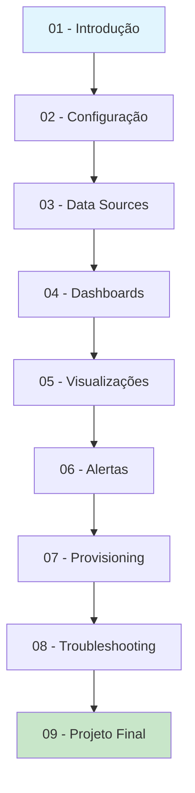

# Documentação Grafana - Guia Educacional Completo

## 📊 Sobre Esta Documentação

Esta é uma documentação educacional completa e modular sobre **Grafana**, a plataforma líder em visualização e observabilidade. Desenvolvida para complementar o stack de observabilidade com Prometheus e Alertmanager, esta documentação oferece uma abordagem prática e progressiva para dominar o Grafana.

## 🎯 Objetivos de Aprendizagem

Ao completar esta documentação, você será capaz de:

- ✅ Compreender os conceitos fundamentais do Grafana
- ✅ Configurar e gerenciar data sources diversos
- ✅ Criar dashboards profissionais e interativos
- ✅ Implementar visualizações avançadas e personalizadas
- ✅ Configurar alertas inteligentes e notificações
- ✅ Automatizar configurações com provisioning
- ✅ Diagnosticar e resolver problemas comuns
- ✅ Implementar um projeto completo de monitoramento

## 📚 Estrutura Modular

### 🚀 Módulos Fundamentais

| Módulo | Título | Descrição | Duração |
|--------|--------|-----------|----------|
| **[01](01-introducao.md)** | **Introdução ao Grafana** | Conceitos, arquitetura e tipos de visualização | 45 min |
| **[02](02-configuracao.md)** | **Configuração Inicial** | Instalação, Docker e primeiros passos | 60 min |
| **[03](03-data-sources.md)** | **Data Sources** | Prometheus, InfluxDB, MySQL e configurações | 75 min |

### 📊 Módulos de Visualização

| Módulo | Título | Descrição | Duração |
|--------|--------|-----------|----------|
| **[04](04-dashboards.md)** | **Dashboards** | Criação, painéis, variáveis e templates | 90 min |
| **[05](05-visualizacoes.md)** | **Visualizações** | Gráficos, tabelas, mapas e alertas visuais | 75 min |

### 🔔 Módulos Avançados

| Módulo | Título | Descrição | Duração |
|--------|--------|-----------|----------|
| **[06](06-alertas.md)** | **Alertas** | Configuração, notificações e políticas | 60 min |
| **[07](07-provisioning.md)** | **Provisioning** | Automação e configuração como código | 45 min |
| **[08](08-troubleshooting.md)** | **Troubleshooting** | Diagnóstico, performance e problemas | 60 min |

### 🎯 Projeto Final

| Módulo | Título | Descrição | Duração |
|--------|--------|-----------|----------|
| **[09](09-projeto-final.md)** | **Projeto Final** | Dashboard completo de infraestrutura | 120 min |

## 🛠️ Pré-requisitos

### Conhecimentos Necessários
- Conceitos básicos de monitoramento
- Familiaridade com Docker e Docker Compose
- Conhecimento básico de Prometheus (recomendado)
- Noções de redes e infraestrutura

### Ferramentas Necessárias
- Docker e Docker Compose
- Editor de texto (VS Code recomendado)
- Navegador web moderno
- Terminal/PowerShell

## 🚀 Como Usar Esta Documentação

### 📖 Abordagem Sequencial (Recomendada)
1. **Siga a ordem dos módulos** - Cada módulo constrói sobre o anterior
2. **Complete os exercícios práticos** - Hands-on é essencial
3. **Teste os exemplos** - Execute todos os códigos fornecidos
4. **Faça o projeto final** - Consolide todo o aprendizado

### 🎯 Abordagem por Tópicos
- **Iniciante**: Módulos 01-03
- **Intermediário**: Módulos 04-06
- **Avançado**: Módulos 07-09
- **Troubleshooting**: Módulo 08 (consulta)

## 🌟 Características Especiais

### 📋 Exercícios Práticos
Cada módulo inclui:
- **Exercícios guiados** com soluções
- **Desafios práticos** para fixação
- **Projetos mini** para aplicação

### 🔧 Exemplos Reais
- Configurações de produção
- Dashboards de diferentes domínios
- Casos de uso empresariais
- Boas práticas da indústria

### 📊 Recursos Visuais
- Screenshots passo a passo
- Diagramas de arquitetura
- Fluxogramas de processo
- Exemplos de dashboards

## 🔗 Integração com o Stack

Esta documentação integra-se perfeitamente com:

- **[Prometheus](../prometheus/README.md)** - Coleta de métricas
- **[Alertmanager](../alertmanager/README.md)** - Gerenciamento de alertas
- **[SNMP Exporter](../snmp-exporter/README.md)** - Monitoramento de rede

## 📈 Progressão de Aprendizagem

## 🎯 Resultados Esperados

Ao final desta jornada, você terá:

### 📊 Conhecimento Técnico
- Domínio completo do Grafana
- Capacidade de criar dashboards profissionais
- Habilidades de troubleshooting avançado
- Conhecimento de automação e provisioning

### 🛠️ Projeto Prático
- Dashboard completo de infraestrutura
- Alertas configurados e funcionais
- Ambiente automatizado com Docker
- Documentação técnica completa

### 🚀 Competências Profissionais
- Implementação de soluções de observabilidade
- Otimização de performance de dashboards
- Configuração de alertas inteligentes
- Automação de configurações

## 📞 Suporte e Recursos

### 📚 Documentação Oficial
- [Grafana Documentation](https://grafana.com/docs/)
- [Grafana Tutorials](https://grafana.com/tutorials/)
- [Grafana Community](https://community.grafana.com/)

### 🛠️ Ferramentas Úteis
- [Grafana Playground](https://play.grafana.org/)
- [Dashboard Library](https://grafana.com/grafana/dashboards/)
- [Plugin Catalog](https://grafana.com/grafana/plugins/)

### 🎯 Próximos Passos
Após completar esta documentação:
1. Explore plugins avançados
2. Implemente em ambiente de produção
3. Contribua com a comunidade
4. Mantenha-se atualizado com novas versões

---

## 🚀 Começar Agora

**Pronto para começar sua jornada com Grafana?**

👉 **[Iniciar com Módulo 01 - Introdução ao Grafana](01-introducao.md)**

---

*Esta documentação é parte do projeto **Observability Stack Docker** - uma solução completa para monitoramento e observabilidade.*

**Navegação:**
- 🏠 [Início](../../README.md)
- 📊 [Prometheus](../prometheus/README.md)
- 🔔 [Alertmanager](../alertmanager/README.md)
- 🌐 [SNMP Exporter](../snmp-exporter/README.md)
- ⚡ **Grafana** (você está aqui)

**Última atualização:** Janeiro 2025