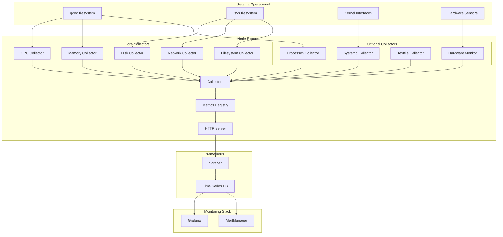

# Módulo 01: Introdução ao Node Exporter

> **Fundamentos essenciais** - Compreenda a arquitetura, funcionamento e casos de uso do Node Exporter

## 📋 Objetivos do Módulo

Ao final deste módulo, você será capaz de:
- ✅ **Compreender** o que é o Node Exporter e sua função no ecossistema Prometheus
- ✅ **Identificar** os tipos de métricas coletadas pelo Node Exporter
- ✅ **Analisar** a arquitetura e componentes internos
- ✅ **Comparar** com outras ferramentas de monitoramento de sistema
- ✅ **Implementar** um deploy básico e explorar métricas

## 🎯 O que é o Node Exporter?

O **Node Exporter** é um exportador oficial do Prometheus que coleta métricas de hardware e sistema operacional de máquinas Unix/Linux. Ele expõe uma ampla variedade de métricas relacionadas ao kernel e hardware através de um endpoint HTTP que pode ser consumido pelo Prometheus.

### Características Principais

🔍 **Coleta Abrangente**
- Métricas de CPU, memória, disco, rede
- Estatísticas do kernel e sistema operacional
- Informações de hardware e sensores
- Métricas de processos e serviços

⚡ **Performance Otimizada**
- Baixo overhead de CPU e memória
- Coleta eficiente através de /proc e /sys
- Collectors modulares e configuráveis
- Caching inteligente de métricas

🔧 **Flexibilidade**
- Collectors habilitáveis/desabilitáveis
- Configuração via flags de linha de comando
- Suporte a textfile collector para métricas customizadas
- Integração nativa com Prometheus

🛡️ **Confiabilidade**
- Desenvolvido e mantido pela equipe Prometheus
- Amplamente testado em produção
- Suporte ativo da comunidade
- Documentação completa e atualizada

## 🏗️ Arquitetura do Node Exporter



### Componentes Principais

#### 1. **Collectors (Coletores)**
Módulos responsáveis por coletar métricas específicas:

```go
// Exemplo conceitual de um collector
type CPUCollector struct {
    cpuStats *prometheus.Desc
}

func (c *CPUCollector) Collect(ch chan<- prometheus.Metric) {
    // Lê dados de /proc/stat
    stats := readCPUStats("/proc/stat")
    
    // Converte para métricas Prometheus
    for cpu, values := range stats {
        ch <- prometheus.MustNewConstMetric(
            c.cpuStats,
            prometheus.CounterValue,
            values.user,
            cpu, "user",
        )
    }
}
```

#### 2. **Metrics Registry**
Central de registro e gerenciamento de métricas:

- **Registro**: Collectors registram suas métricas
- **Coleta**: Coordena a coleta de todos os collectors
- **Formatação**: Converte métricas para formato Prometheus
- **Cache**: Otimiza coletas repetidas

#### 3. **HTTP Server**
Servidor web que expõe as métricas:

```bash
# Endpoint principal de métricas
GET /metrics

# Endpoint de health check
GET /

# Informações sobre collectors
GET /debug/collectors
```

## 📊 Tipos de Métricas Coletadas

### 🖥️ CPU (Central Processing Unit)

```promql
# Tempo de CPU por modo
node_cpu_seconds_total{cpu="0", mode="user"}
node_cpu_seconds_total{cpu="0", mode="system"}
node_cpu_seconds_total{cpu="0", mode="idle"}
node_cpu_seconds_total{cpu="0", mode="iowait"}

# Utilização de CPU (calculada)
rate(node_cpu_seconds_total{mode!="idle"}[5m])

# Load average
node_load1
node_load5
node_load15
```

**Exemplo de Query PromQL:**
```promql
# CPU Usage por core
100 - (avg by (instance, cpu) (irate(node_cpu_seconds_total{mode="idle"}[5m])) * 100)

# CPU Usage total do sistema
100 - (avg by (instance) (irate(node_cpu_seconds_total{mode="idle"}[5m])) * 100)
```

### 💾 Memória (Memory)

```promql
# Memória total e disponível
node_memory_MemTotal_bytes
node_memory_MemAvailable_bytes
node_memory_MemFree_bytes

# Buffers e cache
node_memory_Buffers_bytes
node_memory_Cached_bytes

# Swap
node_memory_SwapTotal_bytes
node_memory_SwapFree_bytes
```

**Exemplo de Query PromQL:**
```promql
# Memory Usage percentage
(1 - (node_memory_MemAvailable_bytes / node_memory_MemTotal_bytes)) * 100

# Swap Usage percentage
(1 - (node_memory_SwapFree_bytes / node_memory_SwapTotal_bytes)) * 100
```

### 💽 Disco (Disk)

```promql
# I/O de disco
node_disk_reads_completed_total
node_disk_writes_completed_total
node_disk_read_bytes_total
node_disk_written_bytes_total

# Tempo de I/O
node_disk_read_time_seconds_total
node_disk_write_time_seconds_total
node_disk_io_time_seconds_total
```

**Exemplo de Query PromQL:**
```promql
# Disk IOPS
rate(node_disk_reads_completed_total[5m]) + rate(node_disk_writes_completed_total[5m])

# Disk Throughput
rate(node_disk_read_bytes_total[5m]) + rate(node_disk_written_bytes_total[5m])

# Disk Utilization
rate(node_disk_io_time_seconds_total[5m]) * 100
```

### 🌐 Rede (Network)

```promql
# Tráfego de rede
node_network_receive_bytes_total
node_network_transmit_bytes_total
node_network_receive_packets_total
node_network_transmit_packets_total

# Erros de rede
node_network_receive_errs_total
node_network_transmit_errs_total
node_network_receive_drop_total
node_network_transmit_drop_total
```

**Exemplo de Query PromQL:**
```promql
# Network Traffic (bytes/sec)
rate(node_network_receive_bytes_total{device!="lo"}[5m])
rate(node_network_transmit_bytes_total{device!="lo"}[5m])

# Network Error Rate
rate(node_network_receive_errs_total[5m]) / rate(node_network_receive_packets_total[5m])
```

### 📁 Sistema de Arquivos (Filesystem)

```promql
# Espaço em disco
node_filesystem_size_bytes
node_filesystem_free_bytes
node_filesystem_avail_bytes

# Inodes
node_filesystem_files
node_filesystem_files_free
```

**Exemplo de Query PromQL:**
```promql
# Filesystem Usage percentage
100 - ((node_filesystem_avail_bytes * 100) / node_filesystem_size_bytes)

# Inode Usage percentage
100 - ((node_filesystem_files_free * 100) / node_filesystem_files)
```

## 🔄 Fluxo de Operação

### 1. **Inicialização**
```bash
# Node Exporter inicia
./node_exporter --web.listen-address=":9100"

# Registra collectors habilitados
# Inicia servidor HTTP
# Aguarda requisições
```

### 2. **Coleta de Métricas**
```bash
# Prometheus faz scrape
curl http://localhost:9100/metrics

# Node Exporter:
# 1. Executa todos os collectors
# 2. Lê dados de /proc, /sys, etc.
# 3. Converte para formato Prometheus
# 4. Retorna métricas formatadas
```

### 3. **Processamento**
```promql
# Prometheus armazena métricas
# Aplica regras de recording/alerting
# Disponibiliza para queries

# Exemplo de query
rate(node_cpu_seconds_total[5m])
```

## 🆚 Comparação com Outras Ferramentas

### Node Exporter vs. Collectd

| Aspecto | Node Exporter | Collectd |
|---------|---------------|----------|
| **Arquitetura** | Pull-based (HTTP) | Push-based (plugins) |
| **Configuração** | Flags simples | Arquivo complexo |
| **Extensibilidade** | Textfile collector | Plugins C/Python |
| **Overhead** | Muito baixo | Baixo a médio |
| **Integração Prometheus** | Nativa | Requer plugin |
| **Comunidade** | Prometheus ecosystem | Independente |

### Node Exporter vs. Telegraf

| Aspecto | Node Exporter | Telegraf |
|---------|---------------|----------|
| **Foco** | Métricas de sistema | Multi-purpose |
| **Outputs** | Prometheus apenas | Múltiplos backends |
| **Configuração** | Minimal | TOML extenso |
| **Plugins** | Collectors internos | Ecosystem amplo |
| **Performance** | Otimizado | Configurável |
| **Deployment** | Binário único | Binário + config |

### Node Exporter vs. SNMP Exporter

| Aspecto | Node Exporter | SNMP Exporter |
|---------|---------------|---------------|
| **Protocolo** | Acesso local | SNMP remoto |
| **Escopo** | Sistema local | Dispositivos rede |
| **Configuração** | Auto-discovery | MIBs manuais |
| **Latência** | Muito baixa | Dependente rede |
| **Segurança** | Local access | SNMP community |
| **Métricas** | Sistema completo | Específicas SNMP |

## 🎯 Casos de Uso Práticos

### 🖥️ Monitoramento de Servidores

**Cenário:** Monitoramento de frota de servidores Linux

```yaml
# docker-compose.yml para servidor
version: '3.8'
services:
  node-exporter:
    image: prom/node-exporter:latest
    container_name: node-exporter
    restart: unless-stopped
    ports:
      - "9100:9100"
    volumes:
      - /proc:/host/proc:ro
      - /sys:/host/sys:ro
      - /:/rootfs:ro
    command:
      - '--path.procfs=/host/proc'
      - '--path.sysfs=/host/sys'
      - '--collector.filesystem.mount-points-exclude=^/(sys|proc|dev|host|etc)($$|/)'
      - '--collector.systemd'
      - '--collector.processes'
    network_mode: host
    pid: host
```

**Métricas Chave:**
- CPU utilization e load average
- Memory usage e swap
- Disk I/O e filesystem usage
- Network traffic e errors
- System uptime e boot time

### ☁️ Infraestrutura Cloud

**Cenário:** Auto-scaling baseado em métricas

```yaml
# Kubernetes DaemonSet
apiVersion: apps/v1
kind: DaemonSet
metadata:
  name: node-exporter
  namespace: monitoring
spec:
  selector:
    matchLabels:
      app: node-exporter
  template:
    metadata:
      labels:
        app: node-exporter
    spec:
      hostNetwork: true
      hostPID: true
      containers:
      - name: node-exporter
        image: prom/node-exporter:latest
        args:
          - '--path.procfs=/host/proc'
          - '--path.sysfs=/host/sys'
          - '--collector.filesystem.mount-points-exclude=^/(dev|proc|sys|var/lib/docker/.+)($$|/)'
        ports:
        - containerPort: 9100
        volumeMounts:
        - name: proc
          mountPath: /host/proc
          readOnly: true
        - name: sys
          mountPath: /host/sys
          readOnly: true
        - name: root
          mountPath: /rootfs
          readOnly: true
      volumes:
      - name: proc
        hostPath:
          path: /proc
      - name: sys
        hostPath:
          path: /sys
      - name: root
        hostPath:
          path: /
```

**Integração HPA:**
```yaml
apiVersion: autoscaling/v2
kind: HorizontalPodAutoscaler
metadata:
  name: app-hpa
spec:
  scaleTargetRef:
    apiVersion: apps/v1
    kind: Deployment
    name: my-app
  minReplicas: 2
  maxReplicas: 10
  metrics:
  - type: External
    external:
      metric:
        name: node_cpu_usage
      target:
        type: AverageValue
        averageValue: "70"
```

### 🏢 Ambiente Corporativo

**Cenário:** Compliance e SLA monitoring

```bash
#!/bin/bash
# deploy-node-exporter-enterprise.sh

# Configuração para ambiente corporativo
./node_exporter \
  --web.listen-address="0.0.0.0:9100" \
  --web.telemetry-path="/metrics" \
  --log.level="info" \
  --log.format="json" \
  --collector.systemd \
  --collector.systemd.unit-whitelist="(sshd|nginx|mysql|postgresql)\.service" \
  --collector.processes \
  --collector.textfile.directory="/var/lib/node_exporter/textfile_collector" \
  --collector.filesystem.mount-points-exclude="^/(dev|proc|sys|var/lib/docker/.+)($$|/)" \
  --collector.netdev.device-exclude="^(veth.*|docker.*|br-.*)\$" \
  --web.config.file="/etc/node_exporter/web-config.yml"
```

**Configuração de Segurança:**
```yaml
# /etc/node_exporter/web-config.yml
tls_server_config:
  cert_file: /etc/ssl/certs/node_exporter.crt
  key_file: /etc/ssl/private/node_exporter.key
  client_auth_type: RequireAndVerifyClientCert
  client_ca_file: /etc/ssl/certs/ca.crt

basic_auth_users:
  prometheus: $2b$12$hNf2lSsxfm0.i4a.1kVpSOVyBCfIB51VRjgBUyv6kdnyTlgWj81Ay
```

## 🎯 Exercício Prático

### Objetivo
Implementar um deploy básico do Node Exporter e explorar as métricas coletadas.

### Pré-requisitos
- Docker instalado
- curl ou wget
- Navegador web

### Passos do Exercício

#### 1. Deploy Básico

```bash
# Executar Node Exporter
docker run -d \
  --name node-exporter \
  --restart unless-stopped \
  -p 9100:9100 \
  -v "/proc:/host/proc:ro" \
  -v "/sys:/host/sys:ro" \
  -v "/:/rootfs:ro" \
  --pid="host" \
  --net="host" \
  prom/node-exporter:latest \
  --path.procfs=/host/proc \
  --path.sysfs=/host/sys \
  --collector.filesystem.mount-points-exclude='^/(sys|proc|dev|host|etc)($$|/)'

# Verificar se está rodando
docker ps | grep node-exporter

# Testar endpoint
curl -s http://localhost:9100/ | head -5
```

#### 2. Exploração de Métricas

```bash
# Obter todas as métricas
curl -s http://localhost:9100/metrics > node_metrics.txt

# Contar total de métricas
grep -c '^node_' node_metrics.txt

# Métricas de CPU
curl -s http://localhost:9100/metrics | grep '^node_cpu_seconds_total' | head -5

# Métricas de memória
curl -s http://localhost:9100/metrics | grep '^node_memory_' | head -10

# Métricas de disco
curl -s http://localhost:9100/metrics | grep '^node_disk_' | head -10

# Métricas de rede
curl -s http://localhost:9100/metrics | grep '^node_network_' | head -10
```

#### 3. Análise de Métricas Específicas

```bash
# CPU cores disponíveis
curl -s http://localhost:9100/metrics | grep 'node_cpu_seconds_total' | grep 'mode="idle"' | wc -l

# Memória total (em bytes)
curl -s http://localhost:9100/metrics | grep '^node_memory_MemTotal_bytes'

# Uptime do sistema
curl -s http://localhost:9100/metrics | grep '^node_boot_time_seconds'

# Load average
curl -s http://localhost:9100/metrics | grep '^node_load'

# Interfaces de rede
curl -s http://localhost:9100/metrics | grep 'node_network_receive_bytes_total' | cut -d'{' -f2 | cut -d'=' -f2 | cut -d'"' -f2 | sort -u
```

#### 4. Monitoramento em Tempo Real

```bash
# Script para monitoramento contínuo
cat > monitor_node.sh << 'EOF'
#!/bin/bash

while true; do
    echo "=== $(date) ==="
    
    # CPU Usage (aproximado)
    echo "CPU Cores: $(curl -s http://localhost:9100/metrics | grep 'node_cpu_seconds_total' | grep 'mode="idle"' | wc -l)"
    
    # Memory
    MEM_TOTAL=$(curl -s http://localhost:9100/metrics | grep '^node_memory_MemTotal_bytes' | awk '{print $2}')
    MEM_AVAIL=$(curl -s http://localhost:9100/metrics | grep '^node_memory_MemAvailable_bytes' | awk '{print $2}')
    MEM_USED_PCT=$(echo "scale=2; (1 - $MEM_AVAIL / $MEM_TOTAL) * 100" | bc -l)
    echo "Memory Usage: ${MEM_USED_PCT}%"
    
    # Load Average
    LOAD1=$(curl -s http://localhost:9100/metrics | grep '^node_load1' | awk '{print $2}')
    echo "Load Average (1m): $LOAD1"
    
    # Uptime
    BOOT_TIME=$(curl -s http://localhost:9100/metrics | grep '^node_boot_time_seconds' | awk '{print $2}')
    CURRENT_TIME=$(date +%s)
    UPTIME_SECONDS=$((CURRENT_TIME - ${BOOT_TIME%.*}))
    UPTIME_DAYS=$((UPTIME_SECONDS / 86400))
    echo "Uptime: $UPTIME_DAYS days"
    
    echo
    sleep 10
done
EOF

chmod +x monitor_node.sh
./monitor_node.sh
```

#### 5. Teste de Carga

```bash
# Gerar carga de CPU para ver mudanças nas métricas
docker run --rm -d --name cpu-stress progrium/stress --cpu 2 --timeout 60s

# Monitorar mudanças nas métricas de CPU
watch -n 2 'curl -s http://localhost:9100/metrics | grep "node_load"'

# Gerar carga de I/O
docker run --rm -d --name io-stress -v /tmp:/tmp progrium/stress --io 2 --timeout 60s

# Limpar containers de teste
docker rm -f cpu-stress io-stress 2>/dev/null || true
```

#### 6. Limpeza

```bash
# Parar e remover Node Exporter
docker stop node-exporter
docker rm node-exporter

# Limpar arquivos temporários
rm -f node_metrics.txt monitor_node.sh
```

### Validação do Exercício

✅ **Critérios de Sucesso:**

1. **Deploy**: Node Exporter rodando na porta 9100
2. **Métricas**: Endpoint /metrics retornando dados
3. **Exploração**: Identificação de métricas principais
4. **Análise**: Compreensão dos tipos de dados coletados
5. **Monitoramento**: Script de monitoramento funcionando
6. **Teste**: Observação de mudanças durante carga

## 📝 Resumo do Módulo

### Conceitos Aprendidos

✅ **Fundamentos**
- Node Exporter como coletor de métricas de sistema
- Arquitetura baseada em collectors modulares
- Integração nativa com Prometheus

✅ **Métricas Principais**
- CPU: utilização, load average, contexto
- Memória: total, disponível, buffers, swap
- Disco: I/O, throughput, utilização
- Rede: tráfego, erros, drops
- Filesystem: espaço, inodes

✅ **Arquitetura**
- Collectors especializados por tipo de métrica
- Registry central para gerenciamento
- HTTP server para exposição
- Integração com /proc e /sys

✅ **Comparações**
- Vantagens sobre Collectd e Telegraf
- Foco específico em métricas de sistema
- Otimização para ecossistema Prometheus

### Próximos Passos

🎯 **No próximo módulo** você aprenderá:
- Instalação em diferentes ambientes
- Configuração avançada de collectors
- Setup como serviço systemd
- Deployment em Kubernetes
- Configurações de segurança

---

## 🧭 Navegação

⬅️ **[Voltar ao README Principal](README.md)**

➡️ **[Próximo: 02 - Instalação e Configuração](02-instalacao-configuracao.md)**

---

> 💡 **Dica:** Pratique os comandos e queries apresentados neste módulo. A familiaridade com as métricas básicas é fundamental para os módulos avançados!