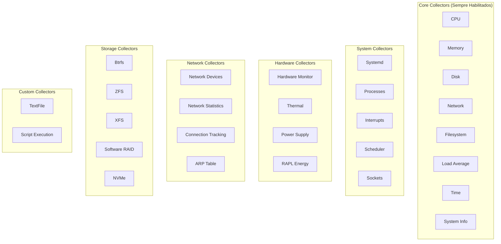

# Módulo 03: Collectors e Métricas

> **Domínio completo** - Explore todos os collectors disponíveis e suas métricas específicas

## 📋 Objetivos do Módulo

Ao final deste módulo, você será capaz de:
- ✅ **Compreender** todos os collectors disponíveis no Node Exporter
- ✅ **Configurar** collectors específicos para diferentes cenários
- ✅ **Filtrar** métricas usando exclusões e inclusões
- ✅ **Customizar** coleta de métricas via TextFile Collector
- ✅ **Otimizar** performance através de seleção de collectors

## 🔍 Visão Geral dos Collectors

O Node Exporter possui mais de 30 collectors diferentes, cada um especializado em coletar métricas específicas do sistema. Eles são divididos em categorias:

### 📊 Collectors por Categoria



## 🖥️ Core Collectors (Habilitados por Padrão)

### 1. CPU Collector

**Métricas Principais:**
```promql
# Tempo de CPU por modo e core
node_cpu_seconds_total{cpu="0", mode="user"}
node_cpu_seconds_total{cpu="0", mode="system"}
node_cpu_seconds_total{cpu="0", mode="idle"}
node_cpu_seconds_total{cpu="0", mode="iowait"}
node_cpu_seconds_total{cpu="0", mode="irq"}
node_cpu_seconds_total{cpu="0", mode="softirq"}
node_cpu_seconds_total{cpu="0", mode="steal"}
node_cpu_seconds_total{cpu="0", mode="nice"}

# Informações de CPU
node_cpu_info{cpu="0", core="0", package="0"}
```

**Configuração:**
```bash
# Habilitar coleta de informações detalhadas de CPU
node_exporter --collector.cpu.info

# Desabilitar se necessário (não recomendado)
node_exporter --no-collector.cpu
```

**Queries Úteis:**
```promql
# CPU Usage por core
100 - (avg by (instance, cpu) (irate(node_cpu_seconds_total{mode="idle"}[5m])) * 100)

# CPU Usage total
100 - (avg by (instance) (irate(node_cpu_seconds_total{mode="idle"}[5m])) * 100)

# CPU I/O Wait
avg by (instance) (irate(node_cpu_seconds_total{mode="iowait"}[5m])) * 100

# CPU Steal (importante em VMs)
avg by (instance) (irate(node_cpu_seconds_total{mode="steal"}[5m])) * 100
```

### 2. Memory Collector

**Métricas Principais:**
```promql
# Memória básica
node_memory_MemTotal_bytes
node_memory_MemFree_bytes
node_memory_MemAvailable_bytes
node_memory_Buffers_bytes
node_memory_Cached_bytes

# Swap
node_memory_SwapTotal_bytes
node_memory_SwapFree_bytes
node_memory_SwapCached_bytes

# Memória detalhada
node_memory_Active_bytes
node_memory_Inactive_bytes
node_memory_Dirty_bytes
node_memory_Writeback_bytes
node_memory_Slab_bytes
node_memory_PageTables_bytes
node_memory_VmallocUsed_bytes
```

**Queries Úteis:**
```promql
# Memory Usage percentage
(1 - (node_memory_MemAvailable_bytes / node_memory_MemTotal_bytes)) * 100

# Swap Usage percentage
(1 - (node_memory_SwapFree_bytes / node_memory_SwapTotal_bytes)) * 100

# Buffer/Cache Usage
(node_memory_Buffers_bytes + node_memory_Cached_bytes) / node_memory_MemTotal_bytes * 100

# Memory pressure (dirty pages)
node_memory_Dirty_bytes / node_memory_MemTotal_bytes * 100
```

### 3. Disk Collector

**Métricas Principais:**
```promql
# I/O Operations
node_disk_reads_completed_total{device="sda"}
node_disk_writes_completed_total{device="sda"}
node_disk_read_bytes_total{device="sda"}
node_disk_written_bytes_total{device="sda"}

# I/O Timing
node_disk_read_time_seconds_total{device="sda"}
node_disk_write_time_seconds_total{device="sda"}
node_disk_io_time_seconds_total{device="sda"}
node_disk_io_time_weighted_seconds_total{device="sda"}

# Queue depth
node_disk_reads_merged_total{device="sda"}
node_disk_writes_merged_total{device="sda"}
```

**Configuração:**
```bash
# Excluir dispositivos específicos
node_exporter --collector.diskstats.ignored-devices="^(ram|loop|fd|(h|s|v|xv)d[a-z]|nvme\\d+n\\d+p)\\d+$"

# Incluir apenas dispositivos específicos
node_exporter --collector.diskstats.device-include="^(sda|sdb|nvme0n1)$"
```

**Queries Úteis:**
```promql
# Disk IOPS
rate(node_disk_reads_completed_total[5m]) + rate(node_disk_writes_completed_total[5m])

# Disk Throughput (MB/s)
(rate(node_disk_read_bytes_total[5m]) + rate(node_disk_written_bytes_total[5m])) / 1024 / 1024

# Disk Utilization %
rate(node_disk_io_time_seconds_total[5m]) * 100

# Average I/O time
rate(node_disk_io_time_weighted_seconds_total[5m]) / rate(node_disk_reads_completed_total[5m] + node_disk_writes_completed_total[5m])
```

### 4. Network Collector

**Métricas Principais:**
```promql
# Tráfego de rede
node_network_receive_bytes_total{device="eth0"}
node_network_transmit_bytes_total{device="eth0"}
node_network_receive_packets_total{device="eth0"}
node_network_transmit_packets_total{device="eth0"}

# Erros e drops
node_network_receive_errs_total{device="eth0"}
node_network_transmit_errs_total{device="eth0"}
node_network_receive_drop_total{device="eth0"}
node_network_transmit_drop_total{device="eth0"}

# Estado da interface
node_network_up{device="eth0"}
node_network_carrier{device="eth0"}
node_network_mtu_bytes{device="eth0"}
node_network_speed_bytes{device="eth0"}
```

**Configuração:**
```bash
# Excluir interfaces virtuais
node_exporter --collector.netdev.device-exclude="^(veth.*|docker.*|br-.*|lo)$"

# Incluir apenas interfaces físicas
node_exporter --collector.netdev.device-include="^(eth|ens|enp).*$"
```

### 5. Filesystem Collector

**Métricas Principais:**
```promql
# Espaço em disco
node_filesystem_size_bytes{mountpoint="/"}
node_filesystem_free_bytes{mountpoint="/"}
node_filesystem_avail_bytes{mountpoint="/"}

# Inodes
node_filesystem_files{mountpoint="/"}
node_filesystem_files_free{mountpoint="/"}

# Estado do filesystem
node_filesystem_readonly{mountpoint="/"}
node_filesystem_device_error{mountpoint="/"}
```

**Configuração:**
```bash
# Excluir filesystems temporários
node_exporter --collector.filesystem.mount-points-exclude="^/(dev|proc|sys|var/lib/docker/.+)($|/)"

# Excluir tipos de filesystem
node_exporter --collector.filesystem.fs-types-exclude="^(autofs|binfmt_misc|bpf|cgroup2?|configfs|debugfs|devpts|devtmpfs|fusectl|hugetlbfs|iso9660|mqueue|nsfs|overlay|proc|procfs|pstore|rpc_pipefs|securityfs|selinuxfs|squashfs|sysfs|tracefs)$"
```

## ⚙️ System Collectors

### 1. Systemd Collector

**Habilitação:**
```bash
node_exporter --collector.systemd
```

**Métricas:**
```promql
# Estado dos serviços
node_systemd_unit_state{name="nginx.service", state="active"}
node_systemd_unit_state{name="nginx.service", state="inactive"}
node_systemd_unit_state{name="nginx.service", state="failed"}

# Tempo de inicialização
node_systemd_service_restart_total{name="nginx.service"}
node_systemd_socket_accepted_connections_total{name="docker.socket"}

# Informações do sistema
node_systemd_system_running
node_systemd_version
```

**Configuração Avançada:**
```bash
# Filtrar apenas serviços específicos
node_exporter --collector.systemd --collector.systemd.unit-whitelist="(sshd|nginx|mysql|postgresql)\.service"

# Incluir sockets e timers
node_exporter --collector.systemd --collector.systemd.enable-task-metrics --collector.systemd.enable-restarts-metrics --collector.systemd.enable-start-time-metrics
```

**Script de Configuração:**
```bash
#!/bin/bash
# configure-systemd-collector.sh

# Criar lista de serviços críticos para monitorar
CRITICAL_SERVICES=(
    "sshd.service"
    "nginx.service"
    "apache2.service"
    "mysql.service"
    "postgresql.service"
    "redis.service"
    "docker.service"
    "kubelet.service"
)

# Gerar whitelist
WHITELIST=$(IFS='|'; echo "(${CRITICAL_SERVICES[*]})\.service")

echo "Configuração do Systemd Collector:"
echo "--collector.systemd"
echo "--collector.systemd.unit-whitelist=\"$WHITELIST\""
echo "--collector.systemd.enable-task-metrics"
echo "--collector.systemd.enable-restarts-metrics"
echo "--collector.systemd.enable-start-time-metrics"

# Testar se serviços existem
echo "\nServiços encontrados no sistema:"
for service in "${CRITICAL_SERVICES[@]}"; do
    if systemctl list-unit-files | grep -q "^$service"; then
        STATUS=$(systemctl is-active "$service" 2>/dev/null || echo "not-found")
        echo "✅ $service: $STATUS"
    else
        echo "❌ $service: não encontrado"
    fi
done
```

### 2. Processes Collector

**Habilitação:**
```bash
node_exporter --collector.processes
```

**Métricas:**
```promql
# Contadores de processos
node_procs_running
node_procs_blocked

# Estados de processos
node_processes_pids
node_processes_threads
node_processes_threads_limit
node_processes_max_processes

# Forks
node_forks_total
```

**Queries Úteis:**
```promql
# Processos em execução
node_procs_running

# Processos bloqueados (I/O wait)
node_procs_blocked

# Taxa de fork
rate(node_forks_total[5m])

# Utilização de PIDs
node_processes_pids / node_processes_max_processes * 100
```

### 3. Interrupts Collector

**Habilitação:**
```bash
node_exporter --collector.interrupts
```

**Métricas:**
```promql
# Interrupções por CPU e tipo
node_intr_total{cpu="0", type="0"}
node_intr_total{cpu="0", type="timer"}
node_intr_total{cpu="0", type="net_tx"}
node_intr_total{cpu="0", type="net_rx"}
```

## 🔧 Hardware Collectors

### 1. Hardware Monitor (hwmon)

**Habilitação:**
```bash
node_exporter --collector.hwmon
```

**Métricas:**
```promql
# Temperaturas
node_hwmon_temp_celsius{chip="coretemp-isa-0000", sensor="temp1"}
node_hwmon_temp_max_celsius{chip="coretemp-isa-0000", sensor="temp1"}
node_hwmon_temp_crit_celsius{chip="coretemp-isa-0000", sensor="temp1"}

# Voltagens
node_hwmon_in_volts{chip="acpi-0", sensor="in0"}

# Velocidade de ventiladores
node_hwmon_fan_rpm{chip="nct6775-isa-0290", sensor="fan1"}
```

**Script de Configuração:**
```bash
#!/bin/bash
# setup-hwmon-collector.sh

echo "Verificando sensores de hardware disponíveis..."

# Verificar se lm-sensors está instalado
if ! command -v sensors &> /dev/null; then
    echo "Instalando lm-sensors..."
    sudo apt-get update && sudo apt-get install -y lm-sensors
fi

# Detectar sensores
echo "Detectando sensores..."
sudo sensors-detect --auto

# Listar sensores disponíveis
echo "Sensores disponíveis:"
sensors

# Verificar arquivos hwmon
echo "\nArquivos hwmon disponíveis:"
find /sys/class/hwmon -name "temp*_input" -o -name "fan*_input" -o -name "in*_input" | head -10

# Testar coleta
echo "\nTestando coleta hwmon..."
node_exporter --collector.hwmon --web.listen-address=":9101" &
NE_PID=$!
sleep 3

if curl -s http://localhost:9101/metrics | grep -q "node_hwmon"; then
    echo "✅ Hardware monitoring funcionando"
    curl -s http://localhost:9101/metrics | grep "node_hwmon" | head -5
else
    echo "❌ Nenhuma métrica hwmon encontrada"
fi

kill $NE_PID 2>/dev/null
```

### 2. Thermal Collector

**Habilitação:**
```bash
node_exporter --collector.thermal_zone
```

**Métricas:**
```promql
# Temperaturas por zona térmica
node_thermal_zone_temp{type="x86_pkg_temp", zone="0"}
node_thermal_zone_temp{type="acpitz", zone="0"}
```

### 3. Power Supply Collector

**Habilitação:**
```bash
node_exporter --collector.powersupplyclass
```

**Métricas:**
```promql
# Estado da bateria
node_power_supply_online{power_supply="ADP1"}
node_power_supply_present{power_supply="BAT0"}

# Informações da bateria
node_power_supply_capacity{power_supply="BAT0"}
node_power_supply_charge_full{power_supply="BAT0"}
node_power_supply_charge_now{power_supply="BAT0"}
node_power_supply_voltage_now{power_supply="BAT0"}
```

## 🌐 Network Collectors Avançados

### 1. Network Statistics (netstat)

**Habilitação:**
```bash
node_exporter --collector.netstat
```

**Métricas:**
```promql
# Estatísticas TCP
node_netstat_Tcp_ActiveOpens
node_netstat_Tcp_PassiveOpens
node_netstat_Tcp_AttemptFails
node_netstat_Tcp_EstabResets
node_netstat_Tcp_CurrEstab
node_netstat_Tcp_InSegs
node_netstat_Tcp_OutSegs
node_netstat_Tcp_RetransSegs

# Estatísticas UDP
node_netstat_Udp_InDatagrams
node_netstat_Udp_OutDatagrams
node_netstat_Udp_InErrors
node_netstat_Udp_NoPorts
```

### 2. Socket Statistics (sockstat)

**Habilitação:**
```bash
node_exporter --collector.sockstat
```

**Métricas:**
```promql
# Sockets em uso
node_sockstat_sockets_used
node_sockstat_TCP_inuse
node_sockstat_TCP_orphan
node_sockstat_TCP_tw
node_sockstat_TCP_alloc
node_sockstat_TCP_mem
node_sockstat_UDP_inuse
node_sockstat_UDP_mem
```

### 3. Connection Tracking (conntrack)

**Habilitação:**
```bash
node_exporter --collector.conntrack
```

**Métricas:**
```promql
# Conexões rastreadas
node_nf_conntrack_entries
node_nf_conntrack_entries_limit
```

## 💾 Storage Collectors Especializados

### 1. Btrfs Collector

**Habilitação:**
```bash
node_exporter --collector.btrfs
```

**Métricas:**
```promql
# Informações do filesystem Btrfs
node_btrfs_info{label="", uuid="..."}
node_btrfs_allocation_ratio
node_btrfs_global_rsv_size_bytes
node_btrfs_device_size_bytes
```

### 2. ZFS Collector

**Habilitação:**
```bash
node_exporter --collector.zfs
```

**Métricas:**
```promql
# Estatísticas ZFS
node_zfs_arc_hits_total
node_zfs_arc_misses_total
node_zfs_arc_size_bytes
node_zfs_arc_max_bytes
```

### 3. Software RAID (mdadm)

**Habilitação:**
```bash
node_exporter --collector.mdadm
```

**Métricas:**
```promql
# Estado do RAID
node_md_state{device="md0", state="active"}
node_md_disks{device="md0", state="active"}
node_md_disks_required{device="md0"}
```

## 📝 TextFile Collector (Métricas Customizadas)

### Configuração Básica

```bash
# Habilitar TextFile Collector
node_exporter --collector.textfile.directory=/var/lib/node_exporter/textfile_collector
```

### Script Avançado de Métricas Customizadas

```bash
#!/bin/bash
# advanced-custom-metrics.sh

TEXTFILE_DIR="/var/lib/node_exporter/textfile_collector"
METRICS_FILE="$TEXTFILE_DIR/advanced_metrics.prom"
TEMP_FILE="$TEXTFILE_DIR/advanced_metrics.prom.$$"

# Função para adicionar métrica com labels
add_metric_with_labels() {
    local name="$1"
    local value="$2"
    local labels="$3"
    local help="$4"
    local type="$5"
    
    echo "# HELP $name $help" >> "$TEMP_FILE"
    echo "# TYPE $name $type" >> "$TEMP_FILE"
    echo "${name}{${labels}} $value" >> "$TEMP_FILE"
}

# Limpar arquivo temporário
> "$TEMP_FILE"

# 1. Métricas de aplicação
echo "# Coletando métricas de aplicação..."

# Verificar se Nginx está rodando e coletar estatísticas
if systemctl is-active --quiet nginx; then
    # Conexões ativas do Nginx (requer stub_status)
    if curl -s http://localhost/nginx_status > /dev/null 2>&1; then
        NGINX_ACTIVE=$(curl -s http://localhost/nginx_status | grep 'Active connections' | awk '{print $3}')
        add_metric_with_labels "custom_nginx_connections_active" "$NGINX_ACTIVE" 'service="nginx"' "Active Nginx connections" "gauge"
        
        NGINX_REQUESTS=$(curl -s http://localhost/nginx_status | awk '/^[[:space:]]*[0-9]+[[:space:]]+[0-9]+[[:space:]]+[0-9]+/ {print $3}')
        add_metric_with_labels "custom_nginx_requests_total" "$NGINX_REQUESTS" 'service="nginx"' "Total Nginx requests" "counter"
    fi
fi

# 2. Métricas de banco de dados
echo "# Coletando métricas de banco de dados..."

# MySQL/MariaDB
if systemctl is-active --quiet mysql || systemctl is-active --quiet mariadb; then
    # Conexões MySQL (requer usuário com privilégios)
    MYSQL_CONNECTIONS=$(mysql -e "SHOW STATUS LIKE 'Threads_connected';" 2>/dev/null | awk 'NR==2 {print $2}' || echo "0")
    add_metric_with_labels "custom_mysql_connections" "$MYSQL_CONNECTIONS" 'service="mysql"' "MySQL active connections" "gauge"
    
    MYSQL_QUERIES=$(mysql -e "SHOW STATUS LIKE 'Queries';" 2>/dev/null | awk 'NR==2 {print $2}' || echo "0")
    add_metric_with_labels "custom_mysql_queries_total" "$MYSQL_QUERIES" 'service="mysql"' "MySQL total queries" "counter"
fi

# PostgreSQL
if systemctl is-active --quiet postgresql; then
    PG_CONNECTIONS=$(sudo -u postgres psql -t -c "SELECT count(*) FROM pg_stat_activity;" 2>/dev/null | tr -d ' ' || echo "0")
    add_metric_with_labels "custom_postgresql_connections" "$PG_CONNECTIONS" 'service="postgresql"' "PostgreSQL active connections" "gauge"
fi

# 3. Métricas de sistema customizadas
echo "# Coletando métricas de sistema customizadas..."

# Usuários logados por tipo
SSH_USERS=$(who | grep -c 'pts/')
add_metric_with_labels "custom_users_logged_in" "$SSH_USERS" 'type="ssh"' "Users logged in via SSH" "gauge"

CONSOLE_USERS=$(who | grep -c 'tty')
add_metric_with_labels "custom_users_logged_in" "$CONSOLE_USERS" 'type="console"' "Users logged in via console" "gauge"

# Processos por usuário
for user in $(ps -eo user --no-headers | sort | uniq); do
    PROC_COUNT=$(ps -u "$user" --no-headers | wc -l)
    add_metric_with_labels "custom_processes_by_user" "$PROC_COUNT" "user=\"$user\"" "Number of processes by user" "gauge"
done

# 4. Métricas de segurança
echo "# Coletando métricas de segurança..."

# Tentativas de login falhadas (últimas 24h)
FAILED_LOGINS=$(journalctl --since "24 hours ago" | grep -c "Failed password" || echo "0")
add_metric_with_labels "custom_security_failed_logins_24h" "$FAILED_LOGINS" 'type="ssh"' "Failed login attempts in last 24h" "gauge"

# Processos suspeitos
SUSPICIOUS_PROCS=$(ps aux | grep -E '(nc|netcat|ncat|socat|telnet)' | grep -v grep | wc -l)
add_metric_with_labels "custom_security_suspicious_processes" "$SUSPICIOUS_PROCS" 'type="network_tools"' "Suspicious network processes" "gauge"

# 5. Métricas de performance customizadas
echo "# Coletando métricas de performance..."

# Context switches por segundo (média dos últimos 5 minutos)
CTXT_SWITCHES=$(awk '/^ctxt/ {print $2}' /proc/stat)
add_metric_with_labels "custom_context_switches_total" "$CTXT_SWITCHES" '' "Total context switches" "counter"

# Page faults
PAGE_FAULTS_MAJOR=$(awk '/^pgmajfault/ {print $2}' /proc/vmstat 2>/dev/null || echo "0")
PAGE_FAULTS_MINOR=$(awk '/^pgfault/ {print $2}' /proc/vmstat 2>/dev/null || echo "0")
add_metric_with_labels "custom_page_faults_total" "$PAGE_FAULTS_MAJOR" 'type="major"' "Major page faults" "counter"
add_metric_with_labels "custom_page_faults_total" "$PAGE_FAULTS_MINOR" 'type="minor"' "Minor page faults" "counter"

# 6. Métricas de rede customizadas
echo "# Coletando métricas de rede customizadas..."

# Conexões por estado
for state in ESTABLISHED SYN_SENT SYN_RECV FIN_WAIT1 FIN_WAIT2 TIME_WAIT CLOSE CLOSE_WAIT LAST_ACK LISTEN CLOSING; do
    COUNT=$(ss -ant | grep -c "$state" || echo "0")
    add_metric_with_labels "custom_tcp_connections_by_state" "$COUNT" "state=\"$state\"" "TCP connections by state" "gauge"
done

# Conexões por porta (top 10)
ss -tlnp | awk 'NR>1 {split($4,a,":"); port=a[length(a)]; count[port]++} END {for(p in count) print p, count[p]}' | sort -k2 -nr | head -10 | while read port count; do
    add_metric_with_labels "custom_listening_ports" "$count" "port=\"$port\"" "Services listening on ports" "gauge"
done

# 7. Métricas de armazenamento customizadas
echo "# Coletando métricas de armazenamento..."

# I/O por processo (top 5)
if command -v iotop &> /dev/null; then
    iotop -b -n 1 -a -o | head -10 | tail -5 | while read line; do
        PID=$(echo "$line" | awk '{print $1}')
        READ_RATE=$(echo "$line" | awk '{print $4}' | sed 's/[^0-9.]//g')
        WRITE_RATE=$(echo "$line" | awk '{print $6}' | sed 's/[^0-9.]//g')
        COMMAND=$(echo "$line" | awk '{print $12}')
        
        if [[ "$READ_RATE" =~ ^[0-9.]+$ ]] && [[ "$WRITE_RATE" =~ ^[0-9.]+$ ]]; then
            add_metric_with_labels "custom_process_io_read_rate" "$READ_RATE" "pid=\"$PID\",command=\"$COMMAND\"" "Process I/O read rate" "gauge"
            add_metric_with_labels "custom_process_io_write_rate" "$WRITE_RATE" "pid=\"$PID\",command=\"$COMMAND\"" "Process I/O write rate" "gauge"
        fi
    done
fi

# 8. Métricas de containers (se Docker estiver presente)
if command -v docker &> /dev/null && systemctl is-active --quiet docker; then
    echo "# Coletando métricas de containers..."
    
    # Containers por estado
    for state in running paused restarting exited dead created; do
        COUNT=$(docker ps -a --filter "status=$state" --format "table {{.Names}}" | tail -n +2 | wc -l)
        add_metric_with_labels "custom_docker_containers_by_state" "$COUNT" "state=\"$state\"" "Docker containers by state" "gauge"
    done
    
    # Uso de espaço do Docker
    DOCKER_SIZE=$(docker system df --format "table {{.Size}}" | tail -n +2 | head -1 | sed 's/[^0-9.]//g' || echo "0")
    add_metric_with_labels "custom_docker_space_usage_gb" "$DOCKER_SIZE" '' "Docker space usage in GB" "gauge"
fi

# 9. Métricas de certificados SSL
echo "# Coletando métricas de certificados SSL..."

# Verificar certificados em /etc/ssl/certs/
find /etc/ssl/certs/ -name "*.crt" -o -name "*.pem" | while read cert_file; do
    if openssl x509 -in "$cert_file" -noout -dates &>/dev/null; then
        EXPIRY_DATE=$(openssl x509 -in "$cert_file" -noout -enddate | cut -d= -f2)
        EXPIRY_EPOCH=$(date -d "$EXPIRY_DATE" +%s 2>/dev/null || echo "0")
        CURRENT_EPOCH=$(date +%s)
        DAYS_TO_EXPIRY=$(( (EXPIRY_EPOCH - CURRENT_EPOCH) / 86400 ))
        
        CERT_NAME=$(basename "$cert_file")
        add_metric_with_labels "custom_ssl_certificate_expiry_days" "$DAYS_TO_EXPIRY" "certificate=\"$CERT_NAME\"" "Days until SSL certificate expiry" "gauge"
    fi
done

# 10. Timestamp da coleta
CURRENT_TIMESTAMP=$(date +%s)
add_metric_with_labels "custom_metrics_collection_timestamp" "$CURRENT_TIMESTAMP" '' "Timestamp of custom metrics collection" "gauge"

# Mover arquivo temporário para final
mv "$TEMP_FILE" "$METRICS_FILE"

echo "Métricas customizadas coletadas com sucesso!"
echo "Arquivo: $METRICS_FILE"
echo "Total de métricas: $(grep -c '^custom_' "$METRICS_FILE")"
```

### Cron Job para Métricas Customizadas

```bash
#!/bin/bash
# setup-custom-metrics-cron.sh

SCRIPT_PATH="/usr/local/bin/advanced-custom-metrics.sh"
CRON_USER="node_exporter"

# Copiar script para local apropriado
sudo cp advanced-custom-metrics.sh "$SCRIPT_PATH"
sudo chmod +x "$SCRIPT_PATH"
sudo chown node_exporter:node_exporter "$SCRIPT_PATH"

# Configurar cron job
echo "Configurando cron job para métricas customizadas..."

# Executar a cada 2 minutos
echo "*/2 * * * * $SCRIPT_PATH" | sudo crontab -u "$CRON_USER" -

# Verificar cron job
echo "Cron job configurado:"
sudo crontab -u "$CRON_USER" -l

# Executar uma vez para testar
echo "Executando teste inicial..."
sudo -u "$CRON_USER" "$SCRIPT_PATH"

echo "Configuração concluída!"
echo "Métricas customizadas serão coletadas a cada 2 minutos"
echo "Arquivo de métricas: /var/lib/node_exporter/textfile_collector/advanced_metrics.prom"
```

## 🎛️ Configurações de Performance

### Configuração por Ambiente

```bash
#!/bin/bash
# performance-configs.sh

# Configuração para desenvolvimento (máximo de métricas)
DEV_CONFIG="
--collector.systemd \
--collector.processes \
--collector.interrupts \
--collector.tcpstat \
--collector.meminfo_numa \
--collector.hwmon \
--collector.thermal_zone \
--collector.powersupplyclass \
--collector.pressure \
--collector.schedstat \
--collector.sockstat \
--collector.softnet \
--collector.textfile.directory=/var/lib/node_exporter/textfile_collector"

# Configuração para produção (balanceada)
PROD_CONFIG="
--collector.systemd \
--collector.systemd.unit-whitelist='(sshd|nginx|mysql|postgresql|redis|docker)\.service' \
--collector.processes \
--collector.hwmon \
--collector.pressure \
--collector.sockstat \
--collector.textfile.directory=/var/lib/node_exporter/textfile_collector \
--no-collector.arp \
--no-collector.bcache \
--no-collector.bonding \
--no-collector.btrfs \
--no-collector.conntrack \
--no-collector.cpufreq \
--no-collector.edac \
--no-collector.entropy \
--no-collector.fibrechannel \
--no-collector.infiniband \
--no-collector.interrupts \
--no-collector.ipvs \
--no-collector.mdadm \
--no-collector.nfs \
--no-collector.nfsd \
--no-collector.nvme \
--no-collector.rapl \
--no-collector.schedstat \
--no-collector.selinux \
--no-collector.softnet \
--no-collector.tcpstat \
--no-collector.thermal_zone \
--no-collector.timex \
--no-collector.udp_queues \
--no-collector.xfs \
--no-collector.zfs"

# Configuração mínima (baixo overhead)
MINIMAL_CONFIG="
--no-collector.arp \
--no-collector.bcache \
--no-collector.bonding \
--no-collector.btrfs \
--no-collector.conntrack \
--no-collector.cpufreq \
--no-collector.edac \
--no-collector.entropy \
--no-collector.fibrechannel \
--no-collector.hwmon \
--no-collector.infiniband \
--no-collector.interrupts \
--no-collector.ipvs \
--no-collector.mdadm \
--no-collector.meminfo_numa \
--no-collector.nfs \
--no-collector.nfsd \
--no-collector.nvme \
--no-collector.powersupplyclass \
--no-collector.pressure \
--no-collector.processes \
--no-collector.rapl \
--no-collector.schedstat \
--no-collector.selinux \
--no-collector.sockstat \
--no-collector.softnet \
--no-collector.systemd \
--no-collector.tcpstat \
--no-collector.thermal_zone \
--no-collector.timex \
--no-collector.udp_queues \
--no-collector.xfs \
--no-collector.zfs"

echo "=== Configurações de Performance ==="
echo
echo "1. Desenvolvimento (máximo de métricas):"
echo "node_exporter $DEV_CONFIG"
echo
echo "2. Produção (balanceada):"
echo "node_exporter $PROD_CONFIG"
echo
echo "3. Mínima (baixo overhead):"
echo "node_exporter $MINIMAL_CONFIG"
```

## 🎯 Exercício Prático

### Objetivo
Configurar diferentes collectors e criar métricas customizadas.

### Cenários do Exercício

#### Cenário 1: Configuração de Collectors por Ambiente

```bash
#!/bin/bash
# exercicio-collectors.sh

echo "=== Exercício: Configuração de Collectors ==="

# Função para testar configuração
test_config() {
    local config_name="$1"
    local config_args="$2"
    local port="$3"
    
    echo "Testando configuração: $config_name"
    echo "Porta: $port"
    
    # Iniciar Node Exporter com configuração específica
    node_exporter --web.listen-address=":$port" $config_args &
    local pid=$!
    
    # Aguardar inicialização
    sleep 3
    
    # Testar endpoint
    if curl -s "http://localhost:$port/metrics" > /dev/null; then
        echo "✅ Configuração $config_name funcionando"
        
        # Contar métricas
        local metric_count=$(curl -s "http://localhost:$port/metrics" | grep -c '^node_')
        echo "📊 Total de métricas: $metric_count"
        
        # Listar collectors ativos
        echo "🔧 Collectors ativos:"
        curl -s "http://localhost:$port/metrics" | grep '^node_' | cut -d'_' -f2 | sort | uniq -c | sort -nr | head -10
    else
        echo "❌ Erro na configuração $config_name"
    fi
    
    # Parar Node Exporter
    kill $pid 2>/dev/null
    wait $pid 2>/dev/null
    echo
}

# Teste 1: Configuração mínima
test_config "Mínima" "--no-collector.systemd --no-collector.processes --no-collector.interrupts" "9101"

# Teste 2: Configuração padrão
test_config "Padrão" "" "9102"

# Teste 3: Configuração completa
test_config "Completa" "--collector.systemd --collector.processes --collector.interrupts --collector.tcpstat" "9103"

echo "Exercício de collectors concluído!"
```

#### Cenário 2: Métricas Customizadas

```bash
#!/bin/bash
# exercicio-custom-metrics.sh

echo "=== Exercício: Métricas Customizadas ==="

# Criar diretório para TextFile Collector
TEXTFILE_DIR="./textfile_collector"
mkdir -p "$TEXTFILE_DIR"

# Script para gerar métricas de exemplo
cat > generate_custom_metrics.sh << 'EOF'
#!/bin/bash
TEXTFILE_DIR="./textfile_collector"
METRICS_FILE="$TEXTFILE_DIR/example_metrics.prom"

# Limpar arquivo
> "$METRICS_FILE"

# Métrica 1: Número de arquivos no diretório atual
FILE_COUNT=$(ls -1 | wc -l)
echo "# HELP example_files_in_directory Number of files in current directory" >> "$METRICS_FILE"
echo "# TYPE example_files_in_directory gauge" >> "$METRICS_FILE"
echo "example_files_in_directory $FILE_COUNT" >> "$METRICS_FILE"

# Métrica 2: Uso de CPU (simulado)
CPU_USAGE=$(( RANDOM % 100 ))
echo "# HELP example_cpu_usage_percent Simulated CPU usage percentage" >> "$METRICS_FILE"
echo "# TYPE example_cpu_usage_percent gauge" >> "$METRICS_FILE"
echo "example_cpu_usage_percent $CPU_USAGE" >> "$METRICS_FILE"

# Métrica 3: Contador de execuções
COUNTER_FILE="./execution_counter"
if [ -f "$COUNTER_FILE" ]; then
    COUNTER=$(cat "$COUNTER_FILE")
else
    COUNTER=0
fi
COUNTER=$((COUNTER + 1))
echo $COUNTER > "$COUNTER_FILE"

echo "# HELP example_script_executions_total Total script executions" >> "$METRICS_FILE"
echo "# TYPE example_script_executions_total counter" >> "$METRICS_FILE"
echo "example_script_executions_total $COUNTER" >> "$METRICS_FILE"

# Métrica 4: Timestamp da última execução
TIMESTAMP=$(date +%s)
echo "# HELP example_last_execution_timestamp Timestamp of last execution" >> "$METRICS_FILE"
echo "# TYPE example_last_execution_timestamp gauge" >> "$METRICS_FILE"
echo "example_last_execution_timestamp $TIMESTAMP" >> "$METRICS_FILE"

echo "Métricas customizadas geradas: $METRICS_FILE"
EOF

chmod +x generate_custom_metrics.sh

# Gerar métricas iniciais
./generate_custom_metrics.sh

# Mostrar conteúdo das métricas
echo "Conteúdo das métricas customizadas:"
cat "$TEXTFILE_DIR/example_metrics.prom"
echo

# Iniciar Node Exporter com TextFile Collector
echo "Iniciando Node Exporter com TextFile Collector..."
node_exporter --collector.textfile.directory="$TEXTFILE_DIR" --web.listen-address=":9104" &
NE_PID=$!

# Aguardar inicialização
sleep 3

# Verificar se métricas customizadas estão sendo coletadas
echo "Verificando métricas customizadas:"
if curl -s http://localhost:9104/metrics | grep -q "example_"; then
    echo "✅ Métricas customizadas encontradas:"
    curl -s http://localhost:9104/metrics | grep "example_"
else
    echo "❌ Métricas customizadas não encontradas"
fi

echo
echo "Gerando novas métricas..."
./generate_custom_metrics.sh

echo "Aguardando próxima coleta..."
sleep 5

echo "Verificando métricas atualizadas:"
curl -s http://localhost:9104/metrics | grep "example_script_executions_total"

# Limpeza
kill $NE_PID 2>/dev/null
rm -rf "$TEXTFILE_DIR" generate_custom_metrics.sh execution_counter

echo "Exercício de métricas customizadas concluído!"
```

#### Cenário 3: Análise de Performance

```bash
#!/bin/bash
# exercicio-performance.sh

echo "=== Exercício: Análise de Performance ==="

# Função para medir performance
measure_performance() {
    local config_name="$1"
    local config_args="$2"
    local port="$3"
    
    echo "Medindo performance: $config_name"
    
    # Iniciar Node Exporter
    node_exporter --web.listen-address=":$port" $config_args &
    local pid=$!
    
    # Aguardar inicialização
    sleep 3
    
    # Medir tempo de resposta
    local start_time=$(date +%s%N)
    curl -s "http://localhost:$port/metrics" > /dev/null
    local end_time=$(date +%s%N)
    local response_time=$(( (end_time - start_time) / 1000000 ))
    
    # Contar métricas
    local metric_count=$(curl -s "http://localhost:$port/metrics" | grep -c '^node_')
    
    # Medir uso de CPU do processo
    local cpu_usage=$(ps -p $pid -o %cpu --no-headers | tr -d ' ')
    
    # Medir uso de memória
    local mem_usage=$(ps -p $pid -o rss --no-headers | tr -d ' ')
    
    echo "📊 Resultados para $config_name:"
    echo "   Tempo de resposta: ${response_time}ms"
    echo "   Número de métricas: $metric_count"
    echo "   CPU usage: ${cpu_usage}%"
    echo "   Memory usage: ${mem_usage}KB"
    
    # Parar Node Exporter
    kill $pid 2>/dev/null
    wait $pid 2>/dev/null
    echo
}

# Teste diferentes configurações
measure_performance "Mínima" "--no-collector.systemd --no-collector.processes" "9105"
measure_performance "Padrão" "" "9106"
measure_performance "Máxima" "--collector.systemd --collector.processes --collector.interrupts --collector.tcpstat --collector.hwmon" "9107"

echo "Análise de performance concluída!"
```

### Script Principal do Exercício

```bash
#!/bin/bash
# exercicio-completo-collectors.sh

echo "🎯 Exercício Completo: Collectors e Métricas"
echo "==========================================="

PS3="Escolha um exercício: "
options=("Configuração de Collectors" "Métricas Customizadas" "Análise de Performance" "Todos" "Sair")

select opt in "${options[@]}"; do
    case $opt in
        "Configuração de Collectors")
            source exercicio-collectors.sh
            ;;
        "Métricas Customizadas")
            source exercicio-custom-metrics.sh
            ;;
        "Análise de Performance")
            source exercicio-performance.sh
            ;;
        "Todos")
            source exercicio-collectors.sh
            echo
            source exercicio-custom-metrics.sh
            echo
            source exercicio-performance.sh
            ;;
        "Sair")
            break
            ;;
        *) echo "Opção inválida $REPLY";;
    esac
done

echo "Exercícios concluídos! 🎉"
```

### Validação do Exercício

✅ **Critérios de Sucesso:**

1. **Collectors**: Diferentes configurações funcionando
2. **Métricas**: Contagem correta por configuração
3. **Customização**: TextFile Collector operacional
4. **Performance**: Medições de tempo e recursos
5. **Filtros**: Exclusões e inclusões aplicadas
6. **Análise**: Comparação entre configurações

## 📝 Resumo do Módulo

### Conceitos Aprendidos

✅ **Collectors Principais**
- Core collectors (CPU, Memory, Disk, Network, Filesystem)
- System collectors (Systemd, Processes, Interrupts)
- Hardware collectors (hwmon, thermal, power)
- Network collectors (netstat, sockstat, conntrack)
- Storage collectors (btrfs, zfs, mdadm)

✅ **Configuração Avançada**
- Habilitação/desabilitação seletiva
- Filtros e exclusões por regex
- Configurações por ambiente
- Otimização de performance

✅ **Métricas Customizadas**
- TextFile Collector
- Scripts de coleta automatizada
- Métricas de aplicação
- Integração com cron

✅ **Performance e Otimização**
- Seleção de collectors por cenário
- Medição de overhead
- Configurações balanceadas
- Troubleshooting de performance

### Próximos Passos

🎯 **No próximo módulo** você aprenderá:
- Integração completa com Prometheus
- Service discovery automático
- Configuração de scraping
- Queries PromQL avançadas
- Alertas baseados em métricas

---

## 🧭 Navegação

⬅️ **[Anterior: 02 - Instalação e Configuração](02-instalacao-configuracao.md)**

➡️ **[Próximo: 04 - Integração com Prometheus](04-integracao-prometheus.md)**

⬆️ **[Voltar ao README Principal](README.md)**

---

> 💡 **Dica:** Experimente diferentes combinações de collectors para encontrar o equilíbrio ideal entre informação e performance para seu ambiente específico!