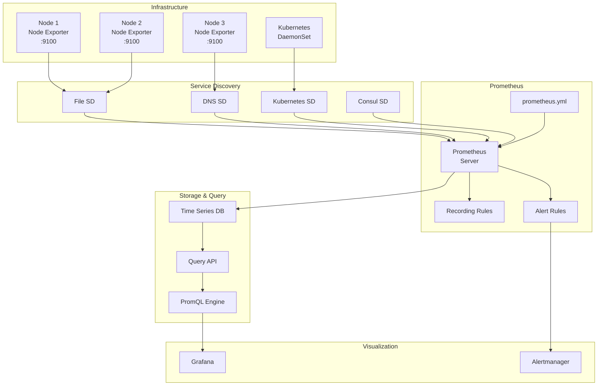

# Módulo 04: Integração com Prometheus

> **Integração completa** - Configure scraping, service discovery e queries avançadas

## 📋 Objetivos do Módulo

Ao final deste módulo, você será capaz de:
- ✅ **Configurar** scraping do Node Exporter no Prometheus
- ✅ **Implementar** service discovery automático
- ✅ **Criar** queries PromQL avançadas para métricas de sistema
- ✅ **Otimizar** configurações de coleta e retenção
- ✅ **Monitorar** múltiplos nodes de forma eficiente
- ✅ **Implementar** relabeling e filtering avançados

## 🔄 Arquitetura de Integração



## ⚙️ Configuração Básica do Prometheus

### 1. Configuração Simples

```yaml
# prometheus-basic.yml
global:
  scrape_interval: 15s
  evaluation_interval: 15s
  external_labels:
    cluster: 'production'
    region: 'us-east-1'

rule_files:
  - "node_exporter_rules.yml"
  - "node_exporter_alerts.yml"

scrape_configs:
  # Job básico para Node Exporter
  - job_name: 'node-exporter'
    static_configs:
      - targets:
        - 'localhost:9100'
        - '192.168.1.10:9100'
        - '192.168.1.11:9100'
    scrape_interval: 30s
    scrape_timeout: 10s
    metrics_path: /metrics
    
    # Labels adicionais
    static_configs:
      - targets: ['localhost:9100']
        labels:
          env: 'production'
          datacenter: 'dc1'
          team: 'infrastructure'
      - targets: ['192.168.1.10:9100']
        labels:
          env: 'staging'
          datacenter: 'dc1'
          team: 'development'
```

### 2. Configuração com Relabeling

```yaml
# prometheus-relabeling.yml
scrape_configs:
  - job_name: 'node-exporter-advanced'
    static_configs:
      - targets:
        - 'web01.example.com:9100'
        - 'web02.example.com:9100'
        - 'db01.example.com:9100'
        - 'db02.example.com:9100'
    
    # Configurações de scraping
    scrape_interval: 30s
    scrape_timeout: 10s
    honor_labels: false
    honor_timestamps: true
    
    # Relabeling rules
    relabel_configs:
      # Extrair hostname do target
      - source_labels: [__address__]
        regex: '([^:]+):\\d+'
        target_label: hostname
        replacement: '${1}'
      
      # Definir role baseado no hostname
      - source_labels: [hostname]
        regex: 'web.*'
        target_label: role
        replacement: 'webserver'
      
      - source_labels: [hostname]
        regex: 'db.*'
        target_label: role
        replacement: 'database'
      
      # Definir environment baseado no hostname
      - source_labels: [hostname]
        regex: '.*prod.*'
        target_label: environment
        replacement: 'production'
      
      - source_labels: [hostname]
        regex: '.*stage.*'
        target_label: environment
        replacement: 'staging'
      
      # Adicionar datacenter baseado na subnet
      - source_labels: [__address__]
        regex: '192\\.168\\.1\\..*'
        target_label: datacenter
        replacement: 'dc1'
      
      - source_labels: [__address__]
        regex: '192\\.168\\.2\\..*'
        target_label: datacenter
        replacement: 'dc2'
    
    # Metric relabeling (após scraping)
    metric_relabel_configs:
      # Remover métricas desnecessárias
      - source_labels: [__name__]
        regex: 'node_arp_entries|node_netstat_Icmp.*'
        action: drop
      
      # Renomear labels
      - source_labels: [device]
        regex: 'eth0'
        target_label: interface
        replacement: 'primary'
      
      # Filtrar apenas interfaces de rede importantes
      - source_labels: [__name__, device]
        regex: 'node_network_.*; (eth.*|ens.*|enp.*)'
        action: keep
```

## 🔍 Service Discovery

### 1. File-based Service Discovery

**Configuração do Prometheus:**
```yaml
# prometheus-file-sd.yml
scrape_configs:
  - job_name: 'node-exporter-file-sd'
    file_sd_configs:
      - files:
        - '/etc/prometheus/targets/node_exporter_*.yml'
        - '/etc/prometheus/targets/node_exporter_*.json'
        refresh_interval: 30s
    
    relabel_configs:
      # Usar labels do service discovery
      - source_labels: [__meta_filepath]
        regex: '.*/node_exporter_(.+)\\.yml'
        target_label: environment
        replacement: '${1}'
```

**Arquivo de targets:**
```yaml
# /etc/prometheus/targets/node_exporter_production.yml
- targets:
  - 'prod-web01:9100'
  - 'prod-web02:9100'
  - 'prod-db01:9100'
  labels:
    environment: 'production'
    datacenter: 'dc1'
    team: 'platform'

- targets:
  - 'prod-cache01:9100'
  - 'prod-cache02:9100'
  labels:
    environment: 'production'
    datacenter: 'dc1'
    team: 'platform'
    role: 'cache'
```

**Script de gerenciamento de targets:**
```bash
#!/bin/bash
# manage-node-targets.sh

TARGETS_DIR="/etc/prometheus/targets"
BACKUP_DIR="/etc/prometheus/targets/backup"

# Função para adicionar target
add_target() {
    local hostname="$1"
    local environment="$2"
    local datacenter="$3"
    local role="$4"
    local team="$5"
    
    local file="$TARGETS_DIR/node_exporter_${environment}.yml"
    
    # Backup do arquivo existente
    if [ -f "$file" ]; then
        cp "$file" "$BACKUP_DIR/node_exporter_${environment}_$(date +%Y%m%d_%H%M%S).yml"
    fi
    
    # Verificar se target já existe
    if grep -q "$hostname:9100" "$file" 2>/dev/null; then
        echo "Target $hostname já existe em $environment"
        return 1
    fi
    
    # Adicionar novo target
    cat >> "$file" << EOF
- targets:
  - '${hostname}:9100'
  labels:
    environment: '${environment}'
    datacenter: '${datacenter}'
    team: '${team}'
    role: '${role}'
EOF
    
    echo "Target $hostname adicionado ao ambiente $environment"
    
    # Validar arquivo YAML
    if ! python3 -c "import yaml; yaml.safe_load(open('$file'))" 2>/dev/null; then
        echo "Erro: Arquivo YAML inválido. Restaurando backup..."
        if [ -f "$BACKUP_DIR/node_exporter_${environment}_$(date +%Y%m%d)*.yml" ]; then
            cp "$BACKUP_DIR/node_exporter_${environment}_"*.yml "$file"
        fi
        return 1
    fi
    
    # Recarregar configuração do Prometheus
    reload_prometheus
}

# Função para remover target
remove_target() {
    local hostname="$1"
    local environment="$2"
    
    local file="$TARGETS_DIR/node_exporter_${environment}.yml"
    
    if [ ! -f "$file" ]; then
        echo "Arquivo $file não encontrado"
        return 1
    fi
    
    # Backup
    cp "$file" "$BACKUP_DIR/node_exporter_${environment}_$(date +%Y%m%d_%H%M%S).yml"
    
    # Remover target (remove o bloco completo)
    python3 << EOF
import yaml

with open('$file', 'r') as f:
    data = yaml.safe_load(f) or []

# Filtrar targets
filtered_data = []
for item in data:
    if isinstance(item, dict) and 'targets' in item:
        # Filtrar targets que não contêm o hostname
        filtered_targets = [t for t in item['targets'] if '$hostname:9100' not in t]
        if filtered_targets:
            item['targets'] = filtered_targets
            filtered_data.append(item)

with open('$file', 'w') as f:
    yaml.dump(filtered_data, f, default_flow_style=False)
EOF
    
    echo "Target $hostname removido do ambiente $environment"
    reload_prometheus
}

# Função para listar targets
list_targets() {
    local environment="$1"
    
    if [ -n "$environment" ]; then
        local file="$TARGETS_DIR/node_exporter_${environment}.yml"
        if [ -f "$file" ]; then
            echo "Targets para $environment:"
            grep -E '^  - ' "$file" | sed 's/^  - /  /'
        else
            echo "Nenhum target encontrado para $environment"
        fi
    else
        echo "Todos os targets:"
        for file in "$TARGETS_DIR"/node_exporter_*.yml; do
            if [ -f "$file" ]; then
                env=$(basename "$file" .yml | sed 's/node_exporter_//')
                echo "\n=== $env ==="
                grep -E '^  - ' "$file" | sed 's/^  - /  /'
            fi
        done
    fi
}

# Função para recarregar Prometheus
reload_prometheus() {
    echo "Recarregando configuração do Prometheus..."
    if curl -X POST http://localhost:9090/-/reload 2>/dev/null; then
        echo "✅ Prometheus recarregado com sucesso"
    else
        echo "❌ Erro ao recarregar Prometheus"
    fi
}

# Função para validar conectividade
validate_target() {
    local hostname="$1"
    local port="${2:-9100}"
    
    echo "Validando conectividade com $hostname:$port..."
    
    if timeout 5 bash -c "</dev/tcp/$hostname/$port"; then
        echo "✅ Conectividade OK"
        
        # Testar endpoint de métricas
        if curl -s --max-time 5 "http://$hostname:$port/metrics" | head -1 | grep -q "#"; then
            echo "✅ Endpoint de métricas OK"
            
            # Contar métricas disponíveis
            local metric_count=$(curl -s --max-time 5 "http://$hostname:$port/metrics" | grep -c '^node_')
            echo "📊 Métricas disponíveis: $metric_count"
        else
            echo "❌ Endpoint de métricas não responde"
        fi
    else
        echo "❌ Não foi possível conectar"
    fi
}

# Menu principal
case "$1" in
    add)
        if [ $# -ne 6 ]; then
            echo "Uso: $0 add <hostname> <environment> <datacenter> <role> <team>"
            exit 1
        fi
        add_target "$2" "$3" "$4" "$5" "$6"
        ;;
    remove)
        if [ $# -ne 3 ]; then
            echo "Uso: $0 remove <hostname> <environment>"
            exit 1
        fi
        remove_target "$2" "$3"
        ;;
    list)
        list_targets "$2"
        ;;
    validate)
        if [ $# -lt 2 ]; then
            echo "Uso: $0 validate <hostname> [port]"
            exit 1
        fi
        validate_target "$2" "$3"
        ;;
    reload)
        reload_prometheus
        ;;
    *)
        echo "Uso: $0 {add|remove|list|validate|reload}"
        echo "Exemplos:"
        echo "  $0 add web01.prod.com production dc1 webserver platform"
        echo "  $0 remove web01.prod.com production"
        echo "  $0 list production"
        echo "  $0 validate web01.prod.com"
        echo "  $0 reload"
        exit 1
        ;;
esac
```

### 2. DNS Service Discovery

```yaml
# prometheus-dns-sd.yml
scrape_configs:
  - job_name: 'node-exporter-dns-sd'
    dns_sd_configs:
      - names:
        - '_node-exporter._tcp.production.internal'
        - '_node-exporter._tcp.staging.internal'
        type: 'SRV'
        port: 9100
        refresh_interval: 30s
    
    relabel_configs:
      # Extrair environment do DNS name
      - source_labels: [__meta_dns_name]
        regex: '_node-exporter\\._tcp\\.(.+)\\.internal'
        target_label: environment
        replacement: '${1}'
      
      # Usar hostname do SRV record
      - source_labels: [__meta_dns_srv_record_target]
        target_label: hostname
        replacement: '${1}'
```

### 3. Kubernetes Service Discovery

```yaml
# prometheus-k8s-sd.yml
scrape_configs:
  - job_name: 'kubernetes-node-exporter'
    kubernetes_sd_configs:
      - role: endpoints
        namespaces:
          names:
          - monitoring
          - kube-system
    
    relabel_configs:
      # Manter apenas endpoints do node-exporter
      - source_labels: [__meta_kubernetes_service_name]
        action: keep
        regex: node-exporter
      
      # Usar node name como instance
      - source_labels: [__meta_kubernetes_endpoint_node_name]
        target_label: instance
      
      # Adicionar labels do node
      - source_labels: [__meta_kubernetes_node_label_kubernetes_io_hostname]
        target_label: hostname
      
      - source_labels: [__meta_kubernetes_node_label_node_kubernetes_io_instance_type]
        target_label: instance_type
      
      - source_labels: [__meta_kubernetes_node_label_topology_kubernetes_io_zone]
        target_label: availability_zone
      
      # Adicionar informações do cluster
      - target_label: cluster
        replacement: 'production-k8s'
```

**DaemonSet para Kubernetes:**
```yaml
# node-exporter-daemonset-advanced.yaml
apiVersion: apps/v1
kind: DaemonSet
metadata:
  name: node-exporter
  namespace: monitoring
  labels:
    app: node-exporter
spec:
  selector:
    matchLabels:
      app: node-exporter
  template:
    metadata:
      labels:
        app: node-exporter
      annotations:
        prometheus.io/scrape: "true"
        prometheus.io/port: "9100"
        prometheus.io/path: "/metrics"
    spec:
      hostNetwork: true
      hostPID: true
      tolerations:
      - key: node-role.kubernetes.io/master
        effect: NoSchedule
      - key: node-role.kubernetes.io/control-plane
        effect: NoSchedule
      containers:
      - name: node-exporter
        image: prom/node-exporter:v1.6.1
        args:
        - '--path.procfs=/host/proc'
        - '--path.sysfs=/host/sys'
        - '--path.rootfs=/host/root'
        - '--collector.filesystem.mount-points-exclude=^/(dev|proc|sys|var/lib/docker/.+)($|/)'
        - '--collector.filesystem.fs-types-exclude=^(autofs|binfmt_misc|bpf|cgroup2?|configfs|debugfs|devpts|devtmpfs|fusectl|hugetlbfs|iso9660|mqueue|nsfs|overlay|proc|procfs|pstore|rpc_pipefs|securityfs|selinuxfs|squashfs|sysfs|tracefs)$'
        - '--collector.systemd'
        - '--collector.processes'
        - '--web.listen-address=0.0.0.0:9100'
        ports:
        - containerPort: 9100
          name: metrics
          protocol: TCP
        resources:
          limits:
            cpu: 200m
            memory: 200Mi
          requests:
            cpu: 100m
            memory: 100Mi
        volumeMounts:
        - name: proc
          mountPath: /host/proc
          readOnly: true
        - name: sys
          mountPath: /host/sys
          readOnly: true
        - name: root
          mountPath: /host/root
          readOnly: true
        securityContext:
          runAsNonRoot: true
          runAsUser: 65534
      volumes:
      - name: proc
        hostPath:
          path: /proc
      - name: sys
        hostPath:
          path: /sys
      - name: root
        hostPath:
          path: /
---
apiVersion: v1
kind: Service
metadata:
  name: node-exporter
  namespace: monitoring
  labels:
    app: node-exporter
  annotations:
    prometheus.io/scrape: "true"
    prometheus.io/port: "9100"
spec:
  type: ClusterIP
  clusterIP: None
  ports:
  - name: metrics
    port: 9100
    targetPort: 9100
    protocol: TCP
  selector:
    app: node-exporter
```

## 📊 Queries PromQL Avançadas

### 1. CPU Metrics

```promql
# CPU Usage por core
100 - (avg by (instance, cpu) (irate(node_cpu_seconds_total{mode="idle"}[5m])) * 100)

# CPU Usage total por instância
100 - (avg by (instance) (irate(node_cpu_seconds_total{mode="idle"}[5m])) * 100)

# Top 10 instâncias com maior CPU usage
topk(10, 100 - (avg by (instance) (irate(node_cpu_seconds_total{mode="idle"}[5m])) * 100))

# CPU Usage por modo (user, system, iowait, etc.)
sum by (instance, mode) (irate(node_cpu_seconds_total[5m])) * 100

# CPU Steal (importante para VMs)
avg by (instance) (irate(node_cpu_seconds_total{mode="steal"}[5m])) * 100

# CPU I/O Wait percentage
avg by (instance) (irate(node_cpu_seconds_total{mode="iowait"}[5m])) * 100

# CPU Load Average vs CPU cores
node_load1 / on(instance) count by (instance) (node_cpu_seconds_total{mode="idle"})

# Predição de CPU usage (próximas 4 horas)
predict_linear(node_cpu_seconds_total{mode="idle"}[1h], 4*3600)
```

### 2. Memory Metrics

```promql
# Memory Usage percentage
(1 - (node_memory_MemAvailable_bytes / node_memory_MemTotal_bytes)) * 100

# Memory Usage em GB
(node_memory_MemTotal_bytes - node_memory_MemAvailable_bytes) / 1024 / 1024 / 1024

# Swap Usage percentage
(1 - (node_memory_SwapFree_bytes / node_memory_SwapTotal_bytes)) * 100

# Buffer/Cache Usage
(node_memory_Buffers_bytes + node_memory_Cached_bytes) / node_memory_MemTotal_bytes * 100

# Memory pressure (dirty pages)
node_memory_Dirty_bytes / node_memory_MemTotal_bytes * 100

# Top 10 instâncias com maior uso de memória
topk(10, (1 - (node_memory_MemAvailable_bytes / node_memory_MemTotal_bytes)) * 100)

# Instâncias com pouca memória disponível (< 10%)
(node_memory_MemAvailable_bytes / node_memory_MemTotal_bytes) * 100 < 10

# Taxa de page faults
rate(node_vmstat_pgfault[5m])

# Major page faults (indicam I/O)
rate(node_vmstat_pgmajfault[5m])
```

### 3. Disk Metrics

```promql
# Disk Usage percentage por filesystem
(1 - (node_filesystem_avail_bytes / node_filesystem_size_bytes)) * 100

# Filesystems com pouco espaço (< 10%)
(node_filesystem_avail_bytes / node_filesystem_size_bytes) * 100 < 10

# Disk I/O Operations per second
sum by (instance, device) (rate(node_disk_reads_completed_total[5m]) + rate(node_disk_writes_completed_total[5m]))

# Disk Throughput (MB/s)
sum by (instance, device) (
  rate(node_disk_read_bytes_total[5m]) + rate(node_disk_written_bytes_total[5m])
) / 1024 / 1024

# Disk Utilization percentage
rate(node_disk_io_time_seconds_total[5m]) * 100

# Average I/O wait time
rate(node_disk_io_time_weighted_seconds_total[5m]) / 
rate(node_disk_reads_completed_total[5m] + node_disk_writes_completed_total[5m])

# Top 10 devices com maior I/O
topk(10, sum by (instance, device) (rate(node_disk_reads_completed_total[5m]) + rate(node_disk_writes_completed_total[5m])))

# Inodes Usage percentage
(1 - (node_filesystem_files_free / node_filesystem_files)) * 100

# Predição de espaço em disco (próximas 24 horas)
predict_linear(node_filesystem_avail_bytes[6h], 24*3600)
```

### 4. Network Metrics

```promql
# Network Traffic (bytes/sec)
sum by (instance, device) (
  rate(node_network_receive_bytes_total[5m]) + rate(node_network_transmit_bytes_total[5m])
)

# Network Traffic (Mbps)
sum by (instance, device) (
  rate(node_network_receive_bytes_total[5m]) + rate(node_network_transmit_bytes_total[5m])
) * 8 / 1024 / 1024

# Network Errors rate
sum by (instance, device) (
  rate(node_network_receive_errs_total[5m]) + rate(node_network_transmit_errs_total[5m])
)

# Network Drops rate
sum by (instance, device) (
  rate(node_network_receive_drop_total[5m]) + rate(node_network_transmit_drop_total[5m])
)

# Network utilization (% of interface speed)
(
  sum by (instance, device) (
    rate(node_network_receive_bytes_total[5m]) + rate(node_network_transmit_bytes_total[5m])
  ) * 8
) / on(instance, device) node_network_speed_bytes * 100

# Top interfaces por tráfego
topk(10, sum by (instance, device) (
  rate(node_network_receive_bytes_total[5m]) + rate(node_network_transmit_bytes_total[5m])
))

# Interfaces com alta taxa de erro (> 1%)
(
  sum by (instance, device) (
    rate(node_network_receive_errs_total[5m]) + rate(node_network_transmit_errs_total[5m])
  ) / 
  sum by (instance, device) (
    rate(node_network_receive_packets_total[5m]) + rate(node_network_transmit_packets_total[5m])
  )
) * 100 > 1
```

### 5. System Metrics

```promql
# System Load Average
node_load1
node_load5
node_load15

# Load Average normalizado por CPU cores
node_load1 / on(instance) count by (instance) (node_cpu_seconds_total{mode="idle"})

# Uptime em dias
node_time_seconds - node_boot_time_seconds
(node_time_seconds - node_boot_time_seconds) / 86400

# Número de processos
node_procs_running
node_procs_blocked

# Context switches por segundo
rate(node_context_switches_total[5m])

# Interrupts por segundo
rate(node_intr_total[5m])

# Fork rate
rate(node_forks_total[5m])

# Entropy disponível
node_entropy_available_bits

# Time drift (se NTP estiver configurado)
abs(node_timex_offset_seconds) > 0.1
```

### 6. Queries Agregadas e Comparativas

```promql
# CPU usage médio por datacenter
avg by (datacenter) (
  100 - (avg by (instance) (irate(node_cpu_seconds_total{mode="idle"}[5m])) * 100)
)

# Memory usage por environment
avg by (environment) (
  (1 - (node_memory_MemAvailable_bytes / node_memory_MemTotal_bytes)) * 100
)

# Comparação de performance entre environments
(
  avg by (environment) (
    100 - (avg by (instance) (irate(node_cpu_seconds_total{mode="idle"}[5m])) * 100)
  )
) / on() (
  avg (
    100 - (avg by (instance) (irate(node_cpu_seconds_total{mode="idle"}[5m])) * 100)
  )
) * 100

# Nodes com problemas (múltiplas condições)
(
  (100 - (avg by (instance) (irate(node_cpu_seconds_total{mode="idle"}[5m])) * 100)) > 80
  or
  ((1 - (node_memory_MemAvailable_bytes / node_memory_MemTotal_bytes)) * 100) > 90
  or
  (rate(node_disk_io_time_seconds_total[5m]) * 100) > 80
  or
  (node_load5 / on(instance) count by (instance) (node_cpu_seconds_total{mode="idle"})) > 2
)

# Ranking de nodes por resource usage
topk(20, 
  (
    (100 - (avg by (instance) (irate(node_cpu_seconds_total{mode="idle"}[5m])) * 100)) * 0.4 +
    ((1 - (node_memory_MemAvailable_bytes / node_memory_MemTotal_bytes)) * 100) * 0.4 +
    (rate(node_disk_io_time_seconds_total[5m]) * 100) * 0.2
  )
)
```

## 📏 Recording Rules

### Arquivo de Recording Rules

```yaml
# node_exporter_rules.yml
groups:
  - name: node_exporter_aggregation
    interval: 30s
    rules:
      # CPU Rules
      - record: instance:node_cpu_utilization:rate5m
        expr: |
          100 - (
            avg by (instance) (
              irate(node_cpu_seconds_total{mode="idle"}[5m])
            ) * 100
          )
      
      - record: instance:node_cpu_utilization_by_mode:rate5m
        expr: |
          sum by (instance, mode) (
            irate(node_cpu_seconds_total[5m])
          ) * 100
      
      - record: instance:node_load_per_cpu:ratio
        expr: |
          node_load1 / on(instance) count by (instance) (
            node_cpu_seconds_total{mode="idle"}
          )
      
      # Memory Rules
      - record: instance:node_memory_utilization:ratio
        expr: |
          1 - (
            node_memory_MemAvailable_bytes / node_memory_MemTotal_bytes
          )
      
      - record: instance:node_memory_utilization:percent
        expr: |
          instance:node_memory_utilization:ratio * 100
      
      - record: instance:node_swap_utilization:percent
        expr: |
          (
            1 - (node_memory_SwapFree_bytes / node_memory_SwapTotal_bytes)
          ) * 100
      
      # Disk Rules
      - record: instance:node_filesystem_utilization:percent
        expr: |
          (
            1 - (node_filesystem_avail_bytes / node_filesystem_size_bytes)
          ) * 100
      
      - record: instance:node_disk_io_utilization:rate5m
        expr: |
          rate(node_disk_io_time_seconds_total[5m]) * 100
      
      - record: instance:node_disk_iops:rate5m
        expr: |
          sum by (instance, device) (
            rate(node_disk_reads_completed_total[5m]) +
            rate(node_disk_writes_completed_total[5m])
          )
      
      - record: instance:node_disk_throughput_bytes:rate5m
        expr: |
          sum by (instance, device) (
            rate(node_disk_read_bytes_total[5m]) +
            rate(node_disk_written_bytes_total[5m])
          )
      
      # Network Rules
      - record: instance:node_network_traffic_bytes:rate5m
        expr: |
          sum by (instance, device) (
            rate(node_network_receive_bytes_total[5m]) +
            rate(node_network_transmit_bytes_total[5m])
          )
      
      - record: instance:node_network_errors:rate5m
        expr: |
          sum by (instance, device) (
            rate(node_network_receive_errs_total[5m]) +
            rate(node_network_transmit_errs_total[5m])
          )
      
      # System Rules
      - record: instance:node_uptime_days
        expr: |
          (node_time_seconds - node_boot_time_seconds) / 86400
      
      - record: instance:node_context_switches:rate5m
        expr: |
          rate(node_context_switches_total[5m])

  - name: node_exporter_datacenter_aggregation
    interval: 60s
    rules:
      # Agregações por datacenter
      - record: datacenter:node_cpu_utilization:avg
        expr: |
          avg by (datacenter) (
            instance:node_cpu_utilization:rate5m
          )
      
      - record: datacenter:node_memory_utilization:avg
        expr: |
          avg by (datacenter) (
            instance:node_memory_utilization:percent
          )
      
      - record: datacenter:node_count:total
        expr: |
          count by (datacenter) (
            up{job=~".*node.*"}
          )
      
      - record: datacenter:node_count:up
        expr: |
          count by (datacenter) (
            up{job=~".*node.*"} == 1
          )
      
      # Agregações por environment
      - record: environment:node_cpu_utilization:avg
        expr: |
          avg by (environment) (
            instance:node_cpu_utilization:rate5m
          )
      
      - record: environment:node_memory_utilization:avg
        expr: |
          avg by (environment) (
            instance:node_memory_utilization:percent
          )

  - name: node_exporter_sli_slo
    interval: 60s
    rules:
      # SLI: Availability
      - record: sli:node_availability:rate5m
        expr: |
          avg_over_time(up{job=~".*node.*"}[5m])
      
      # SLI: Performance (CPU < 80%)
      - record: sli:node_cpu_performance:rate5m
        expr: |
          avg_over_time(
            (instance:node_cpu_utilization:rate5m < 80)[5m:]
          )
      
      # SLI: Performance (Memory < 90%)
      - record: sli:node_memory_performance:rate5m
        expr: |
          avg_over_time(
            (instance:node_memory_utilization:percent < 90)[5m:]
          )
      
      # SLO: 99.9% availability
      - record: slo:node_availability:target
        expr: 0.999
      
      # SLO: 95% performance compliance
      - record: slo:node_performance:target
        expr: 0.95
```

## 🔧 Configuração de Retenção e Performance

### 1. Configuração de Storage

```yaml
# prometheus-storage.yml
global:
  scrape_interval: 15s
  evaluation_interval: 15s
  # Retenção externa (para long-term storage)
  external_labels:
    cluster: 'production'
    replica: 'prometheus-01'

# Configurações de storage
storage:
  tsdb:
    # Retenção local (15 dias)
    retention.time: 15d
    # Tamanho máximo do storage local (100GB)
    retention.size: 100GB
    # Compactação
    min-block-duration: 2h
    max-block-duration: 25h
    # WAL compression
    wal-compression: true

# Remote write para long-term storage
remote_write:
  - url: "https://prometheus-remote-storage.example.com/api/v1/write"
    queue_config:
      capacity: 10000
      max_shards: 200
      min_shards: 1
      max_samples_per_send: 5000
      batch_send_deadline: 5s
      min_backoff: 30ms
      max_backoff: 100ms
    write_relabel_configs:
      # Não enviar métricas de debug
      - source_labels: [__name__]
        regex: 'node_scrape_collector_.*'
        action: drop
      
      # Reduzir resolução para métricas antigas
      - source_labels: [__name__]
        regex: 'node_network_.*'
        target_label: __tmp_resolution
        replacement: '60s'

# Remote read para queries históricas
remote_read:
  - url: "https://prometheus-remote-storage.example.com/api/v1/read"
    read_recent: false
```

### 2. Otimização de Scraping

```yaml
# prometheus-optimized.yml
scrape_configs:
  - job_name: 'node-exporter-optimized'
    static_configs:
      - targets: ['node1:9100', 'node2:9100']
    
    # Configurações otimizadas
    scrape_interval: 30s
    scrape_timeout: 10s
    
    # Limitar métricas coletadas
    metric_relabel_configs:
      # Manter apenas métricas essenciais
      - source_labels: [__name__]
        regex: 'node_(cpu_seconds_total|memory_.*|filesystem_.*|disk_.*|network_.*|load.*|up)'
        action: keep
      
      # Remover métricas de debug
      - source_labels: [__name__]
        regex: 'node_scrape_collector_.*'
        action: drop
      
      # Remover métricas raramente usadas
      - source_labels: [__name__]
        regex: 'node_(arp_entries|netstat_.*|sockstat_.*|vmstat_.*|entropy_.*|timex_.*|nf_conntrack_.*)'
        action: drop
      
      # Filtrar apenas interfaces de rede importantes
      - source_labels: [__name__, device]
        regex: 'node_network_.*; (lo|docker.*|veth.*|br-.*)'
        action: drop
      
      # Filtrar apenas filesystems importantes
      - source_labels: [__name__, fstype]
        regex: 'node_filesystem_.*; (tmpfs|devtmpfs|overlay|squashfs)'
        action: drop
      
      # Filtrar mountpoints temporários
      - source_labels: [__name__, mountpoint]
        regex: 'node_filesystem_.*; /(dev|proc|sys|run|var/lib/docker/.*).*'
        action: drop
```

### 3. Configuração Multi-Prometheus

```yaml
# prometheus-federation.yml
# Prometheus Global (Federation)
global:
  scrape_interval: 60s
  evaluation_interval: 60s
  external_labels:
    cluster: 'global'
    region: 'multi'

scrape_configs:
  # Federation dos Prometheus regionais
  - job_name: 'prometheus-federation'
    scrape_interval: 30s
    honor_labels: true
    metrics_path: '/federate'
    params:
      'match[]':
        # Métricas agregadas
        - '{__name__=~"datacenter:.*"}'
        - '{__name__=~"environment:.*"}'
        - '{__name__=~"sli:.*"}'
        - '{__name__=~"slo:.*"}'
        # Métricas de alta prioridade
        - '{__name__=~"up"}'
        - '{__name__=~"instance:node_cpu_utilization:rate5m"}'
        - '{__name__=~"instance:node_memory_utilization:percent"}'
        - '{__name__=~"instance:node_filesystem_utilization:percent"}'
    static_configs:
      - targets:
        - 'prometheus-dc1:9090'
        - 'prometheus-dc2:9090'
        - 'prometheus-k8s:9090'
    relabel_configs:
      - source_labels: [__address__]
        regex: 'prometheus-(.+):9090'
        target_label: datacenter
        replacement: '${1}'
```

## 🎯 Exercício Prático

### Objetivo
Configurar integração completa entre Node Exporter e Prometheus com service discovery e queries avançadas.

### Cenário do Exercício

```bash
#!/bin/bash
# exercicio-integracao-prometheus.sh

echo "🎯 Exercício: Integração Node Exporter + Prometheus"
echo "================================================="

# Criar estrutura de diretórios
mkdir -p prometheus/{config,data,targets,rules}
mkdir -p node-exporter/{config,data}

# 1. Configurar múltiplos Node Exporters
echo "📊 Configurando Node Exporters..."

# Node Exporter 1 (simulando produção)
cat > node-exporter/docker-compose-node1.yml << 'EOF'
version: '3.8'
services:
  node-exporter-prod:
    image: prom/node-exporter:v1.6.1
    container_name: node-exporter-prod
    ports:
      - "9100:9100"
    command:
      - '--path.procfs=/host/proc'
      - '--path.sysfs=/host/sys'
      - '--path.rootfs=/host/root'
      - '--collector.filesystem.mount-points-exclude=^/(dev|proc|sys|var/lib/docker/.+)($|/)'
      - '--collector.systemd'
      - '--collector.processes'
      - '--web.listen-address=0.0.0.0:9100'
    volumes:
      - /proc:/host/proc:ro
      - /sys:/host/sys:ro
      - /:/host/root:ro
    labels:
      - "environment=production"
      - "datacenter=dc1"
      - "role=webserver"
EOF

# Node Exporter 2 (simulando staging)
cat > node-exporter/docker-compose-node2.yml << 'EOF'
version: '3.8'
services:
  node-exporter-staging:
    image: prom/node-exporter:v1.6.1
    container_name: node-exporter-staging
    ports:
      - "9101:9100"
    command:
      - '--path.procfs=/host/proc'
      - '--path.sysfs=/host/sys'
      - '--path.rootfs=/host/root'
      - '--collector.filesystem.mount-points-exclude=^/(dev|proc|sys|var/lib/docker/.+)($|/)'
      - '--no-collector.systemd'
      - '--no-collector.processes'
      - '--web.listen-address=0.0.0.0:9100'
    volumes:
      - /proc:/host/proc:ro
      - /sys:/host/sys:ro
      - /:/host/root:ro
    labels:
      - "environment=staging"
      - "datacenter=dc1"
      - "role=database"
EOF

# 2. Configurar targets para service discovery
echo "🔍 Configurando Service Discovery..."

cat > prometheus/targets/node_exporter_production.yml << 'EOF'
- targets:
  - 'localhost:9100'
  labels:
    environment: 'production'
    datacenter: 'dc1'
    team: 'platform'
    role: 'webserver'
    
- targets:
  - 'localhost:9101'
  labels:
    environment: 'staging'
    datacenter: 'dc1'
    team: 'development'
    role: 'database'
EOF

# 3. Configurar recording rules
echo "📏 Configurando Recording Rules..."

cat > prometheus/rules/node_exporter_rules.yml << 'EOF'
groups:
  - name: node_exporter_basic
    interval: 30s
    rules:
      - record: instance:node_cpu_utilization:rate5m
        expr: |
          100 - (
            avg by (instance) (
              irate(node_cpu_seconds_total{mode="idle"}[5m])
            ) * 100
          )
      
      - record: instance:node_memory_utilization:percent
        expr: |
          (
            1 - (node_memory_MemAvailable_bytes / node_memory_MemTotal_bytes)
          ) * 100
      
      - record: instance:node_filesystem_utilization:percent
        expr: |
          (
            1 - (node_filesystem_avail_bytes / node_filesystem_size_bytes)
          ) * 100
      
      - record: environment:node_cpu_utilization:avg
        expr: |
          avg by (environment) (
            instance:node_cpu_utilization:rate5m
          )
EOF

# 4. Configurar Prometheus
echo "⚙️ Configurando Prometheus..."

cat > prometheus/config/prometheus.yml << 'EOF'
global:
  scrape_interval: 15s
  evaluation_interval: 15s
  external_labels:
    cluster: 'exercise'
    region: 'local'

rule_files:
  - "/etc/prometheus/rules/*.yml"

scrape_configs:
  - job_name: 'prometheus'
    static_configs:
      - targets: ['localhost:9090']
  
  - job_name: 'node-exporter-file-sd'
    file_sd_configs:
      - files:
        - '/etc/prometheus/targets/*.yml'
        refresh_interval: 30s
    
    scrape_interval: 30s
    scrape_timeout: 10s
    
    relabel_configs:
      # Adicionar hostname baseado no target
      - source_labels: [__address__]
        regex: '([^:]+):\\d+'
        target_label: hostname
        replacement: '${1}'
      
      # Normalizar localhost
      - source_labels: [hostname]
        regex: 'localhost'
        target_label: hostname
        replacement: 'exercise-host'
    
    metric_relabel_configs:
      # Filtrar métricas desnecessárias
      - source_labels: [__name__]
        regex: 'node_(arp_entries|netstat_.*|sockstat_.*)'
        action: drop
EOF

# 5. Docker Compose para Prometheus
cat > prometheus/docker-compose.yml << 'EOF'
version: '3.8'
services:
  prometheus:
    image: prom/prometheus:v2.45.0
    container_name: prometheus-exercise
    ports:
      - "9090:9090"
    volumes:
      - ./config/prometheus.yml:/etc/prometheus/prometheus.yml
      - ./rules:/etc/prometheus/rules
      - ./targets:/etc/prometheus/targets
      - ./data:/prometheus
    command:
      - '--config.file=/etc/prometheus/prometheus.yml'
      - '--storage.tsdb.path=/prometheus'
      - '--web.console.libraries=/etc/prometheus/console_libraries'
      - '--web.console.templates=/etc/prometheus/consoles'
      - '--storage.tsdb.retention.time=15d'
      - '--web.enable-lifecycle'
      - '--web.enable-admin-api'
    networks:
      - monitoring

networks:
  monitoring:
    driver: bridge
EOF

# 6. Script de teste de queries
cat > test-queries.sh << 'EOF'
#!/bin/bash

PROMETHEUS_URL="http://localhost:9090"

echo "🔍 Testando Queries PromQL..."
echo "============================="

# Função para executar query
query_prometheus() {
    local query="$1"
    local description="$2"
    
    echo "\n📊 $description"
    echo "Query: $query"
    
    result=$(curl -s "$PROMETHEUS_URL/api/v1/query" \
        --data-urlencode "query=$query" | \
        jq -r '.data.result[] | "\(.metric.instance // .metric.job): \(.value[1])"' 2>/dev/null)
    
    if [ -n "$result" ]; then
        echo "Resultado:"
        echo "$result"
    else
        echo "❌ Nenhum resultado encontrado"
    fi
}

# Aguardar Prometheus estar pronto
echo "Aguardando Prometheus..."
while ! curl -s "$PROMETHEUS_URL/-/ready" > /dev/null; do
    sleep 2
done
echo "✅ Prometheus pronto!"

# Testar queries básicas
query_prometheus "up" "Status dos targets"
query_prometheus "instance:node_cpu_utilization:rate5m" "CPU Utilization (Recording Rule)"
query_prometheus "instance:node_memory_utilization:percent" "Memory Utilization (Recording Rule)"
query_prometheus "environment:node_cpu_utilization:avg" "CPU por Environment (Recording Rule)"

# Testar queries avançadas
query_prometheus "topk(5, instance:node_cpu_utilization:rate5m)" "Top 5 CPU Usage"
query_prometheus "count by (environment) (up{job=\"node-exporter-file-sd\"})" "Nodes por Environment"

echo "\n✅ Teste de queries concluído!"
EOF

chmod +x test-queries.sh

# 7. Script principal de execução
cat > run-exercise.sh << 'EOF'
#!/bin/bash

echo "🚀 Iniciando Exercício de Integração"
echo "===================================="

# Iniciar Node Exporters
echo "📊 Iniciando Node Exporters..."
cd node-exporter
docker-compose -f docker-compose-node1.yml up -d
docker-compose -f docker-compose-node2.yml up -d
cd ..

# Aguardar Node Exporters
echo "Aguardando Node Exporters..."
sleep 5

# Verificar Node Exporters
echo "Verificando Node Exporters:"
for port in 9100 9101; do
    if curl -s "http://localhost:$port/metrics" | head -1 | grep -q "#"; then
        echo "✅ Node Exporter na porta $port: OK"
    else
        echo "❌ Node Exporter na porta $port: ERRO"
    fi
done

# Iniciar Prometheus
echo "\n⚙️ Iniciando Prometheus..."
cd prometheus
docker-compose up -d
cd ..

# Aguardar Prometheus
echo "Aguardando Prometheus..."
sleep 10

# Verificar Prometheus
if curl -s "http://localhost:9090/-/ready" > /dev/null; then
    echo "✅ Prometheus: OK"
else
    echo "❌ Prometheus: ERRO"
    exit 1
fi

# Executar testes
echo "\n🔍 Executando testes..."
./test-queries.sh

# Mostrar URLs
echo "\n🌐 URLs disponíveis:"
echo "Prometheus: http://localhost:9090"
echo "Node Exporter (Prod): http://localhost:9100/metrics"
echo "Node Exporter (Staging): http://localhost:9101/metrics"

echo "\n📋 Próximos passos:"
echo "1. Acesse o Prometheus Web UI"
echo "2. Verifique os targets em Status > Targets"
echo "3. Teste as queries no Graph"
echo "4. Explore as recording rules em Status > Rules"

echo "\n🛑 Para parar o exercício, execute: ./cleanup-exercise.sh"
EOF

chmod +x run-exercise.sh

# 8. Script de limpeza
cat > cleanup-exercise.sh << 'EOF'
#!/bin/bash

echo "🧹 Limpando exercício..."

# Parar containers
cd prometheus && docker-compose down -v
cd ../node-exporter
docker-compose -f docker-compose-node1.yml down -v
docker-compose -f docker-compose-node2.yml down -v
cd ..

# Remover arquivos temporários
rm -rf prometheus node-exporter
rm -f test-queries.sh run-exercise.sh cleanup-exercise.sh

echo "✅ Limpeza concluída!"
EOF

chmod +x cleanup-exercise.sh

echo "\n🎯 Exercício configurado!"
echo "Execute: ./run-exercise.sh para iniciar"
```

### Validação do Exercício

✅ **Critérios de Sucesso:**

1. **Service Discovery**: Targets descobertos automaticamente
2. **Scraping**: Métricas coletadas de múltiplos nodes
3. **Recording Rules**: Regras funcionando e gerando métricas
4. **Queries**: PromQL queries retornando dados corretos
5. **Labels**: Relabeling aplicado corretamente
6. **Performance**: Configurações otimizadas aplicadas

## 📝 Resumo do Módulo

### Conceitos Aprendidos

✅ **Configuração de Scraping**
- Configuração básica e avançada
- Relabeling e metric relabeling
- Otimização de performance
- Configurações por ambiente

✅ **Service Discovery**
- File-based service discovery
- DNS service discovery
- Kubernetes service discovery
- Gerenciamento automático de targets

✅ **Queries PromQL**
- Queries básicas e avançadas
- Agregações e comparações
- Recording rules para performance
- SLI/SLO monitoring

✅ **Otimização e Scaling**
- Configuração de retenção
- Remote storage integration
- Federation para múltiplos Prometheus
- Filtering e sampling

### Próximos Passos

🎯 **No próximo módulo** você aprenderá:
- Criação de dashboards Grafana
- Configuração de alertas
- Visualizações avançadas
- Templates e variáveis
- Alerting rules e notifications

---

## 🧭 Navegação

⬅️ **[Anterior: 03 - Collectors e Métricas](03-collectors-metricas.md)**

➡️ **[Próximo: 05 - Dashboards e Alertas](05-dashboards-alertas.md)**

⬆️ **[Voltar ao README Principal](README.md)**

---

> 💡 **Dica:** A integração eficiente com Prometheus é fundamental para um monitoramento escalável. Sempre considere performance e retenção ao configurar scraping!