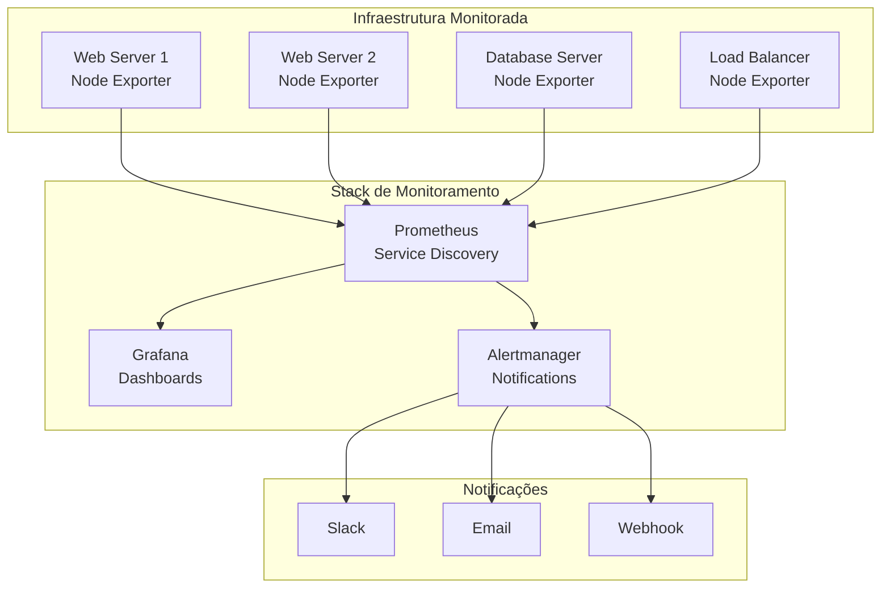

# Módulo 07: Projeto Final - Monitoramento Completo de Infraestrutura

Este módulo apresenta um projeto prático completo que integra todos os conceitos aprendidos nos módulos anteriores, implementando uma solução de monitoramento de infraestrutura robusta e escalável.

## 🎯 Objetivo do Projeto

Implementar uma solução completa de monitoramento de infraestrutura usando Node Exporter, incluindo:
- Monitoramento multi-servidor
- Dashboards personalizados
- Sistema de alertas avançado
- Automação e orquestração
- Documentação e procedimentos operacionais

## 🏗️ Arquitetura da Solução



## 📋 Estrutura do Projeto

### Organização de Arquivos

```bash
#!/bin/bash
# setup-project-structure.sh

PROJECT_ROOT="/opt/infrastructure-monitoring"

echo "🏗️ Criando estrutura do projeto..."

# Criar diretórios principais
mkdir -p "$PROJECT_ROOT"/{config,scripts,dashboards,alerts,docs,logs,backup}

# Subdiretórios de configuração
mkdir -p "$PROJECT_ROOT/config"/{prometheus,grafana,alertmanager,node-exporter}

# Subdiretórios de scripts
mkdir -p "$PROJECT_ROOT/scripts"/{deployment,monitoring,maintenance,backup}

# Subdiretórios de dashboards
mkdir -p "$PROJECT_ROOT/dashboards"/{infrastructure,applications,security,custom}

# Subdiretórios de alertas
mkdir -p "$PROJECT_ROOT/alerts"/{rules,templates,integrations}

# Subdiretórios de documentação
mkdir -p "$PROJECT_ROOT/docs"/{runbooks,procedures,architecture}

echo "✅ Estrutura do projeto criada em: $PROJECT_ROOT"

# Criar arquivo de inventário
cat > "$PROJECT_ROOT/config/inventory.yml" << 'EOF'
# Inventário de Servidores
servers:
  web_servers:
    - name: web-01
      ip: 192.168.1.10
      role: frontend
      environment: production
      node_exporter_port: 9100
    - name: web-02
      ip: 192.168.1.11
      role: frontend
      environment: production
      node_exporter_port: 9100
  
  database_servers:
    - name: db-01
      ip: 192.168.1.20
      role: database
      environment: production
      node_exporter_port: 9100
  
  load_balancers:
    - name: lb-01
      ip: 192.168.1.5
      role: loadbalancer
      environment: production
      node_exporter_port: 9100
  
  monitoring_servers:
    - name: monitor-01
      ip: 192.168.1.100
      role: monitoring
      environment: production
      services:
        - prometheus
        - grafana
        - alertmanager
EOF

echo "📋 Inventário de servidores criado"
```

## 🚀 Implementação Completa

### 1. Deploy Automatizado do Node Exporter

```bash
#!/bin/bash
# deploy-node-exporter-fleet.sh

PROJECT_ROOT="/opt/infrastructure-monitoring"
INVENTORY_FILE="$PROJECT_ROOT/config/inventory.yml"
SSH_KEY="~/.ssh/infrastructure_key"
SSH_USER="admin"

echo "🚀 Deploy Automatizado do Node Exporter"
echo "======================================"

# Função para extrair IPs do inventário
get_server_ips() {
    python3 << 'EOF'
import yaml
import sys

with open('/opt/infrastructure-monitoring/config/inventory.yml', 'r') as f:
    inventory = yaml.safe_load(f)

for category in inventory['servers']:
    for server in inventory['servers'][category]:
        print(f"{server['ip']} {server['name']} {server['role']}")
EOF
}

# Função para instalar Node Exporter em um servidor
install_node_exporter() {
    local server_ip=$1
    local server_name=$2
    local server_role=$3
    
    echo "📦 Instalando Node Exporter em $server_name ($server_ip)..."
    
    # Script de instalação remota
    ssh -i "$SSH_KEY" "$SSH_USER@$server_ip" << 'REMOTE_SCRIPT'
        # Baixar e instalar Node Exporter
        cd /tmp
        wget https://github.com/prometheus/node_exporter/releases/download/v1.6.1/node_exporter-1.6.1.linux-amd64.tar.gz
        tar xvfz node_exporter-1.6.1.linux-amd64.tar.gz
        
        # Criar usuário
        sudo useradd --no-create-home --shell /bin/false node_exporter
        
        # Instalar binário
        sudo cp node_exporter-1.6.1.linux-amd64/node_exporter /usr/local/bin/
        sudo chown node_exporter:node_exporter /usr/local/bin/node_exporter
        
        # Criar diretórios
        sudo mkdir -p /var/lib/node_exporter/textfile_collector
        sudo chown -R node_exporter:node_exporter /var/lib/node_exporter
        
        # Criar configuração systemd
        sudo tee /etc/systemd/system/node_exporter.service > /dev/null << 'EOF'
[Unit]
Description=Node Exporter
Wants=network-online.target
After=network-online.target

[Service]
User=node_exporter
Group=node_exporter
Type=simple
ExecStart=/usr/local/bin/node_exporter \
    --web.listen-address=:9100 \
    --web.telemetry-path=/metrics \
    --collector.textfile.directory=/var/lib/node_exporter/textfile_collector \
    --collector.filesystem.ignored-mount-points="^/(dev|proc|sys|var/lib/docker/.+)(\$|/)" \
    --collector.filesystem.ignored-fs-types="^(autofs|binfmt_misc|bpf|cgroup2?|configfs|debugfs|devpts|devtmpfs|fusectl|hugetlbfs|iso9660|mqueue|nsfs|overlay|proc|procfs|pstore|rpc_pipefs|securityfs|selinuxfs|squashfs|sysfs|tracefs)(\$|/)" \
    --collector.netdev.ignored-devices="^(veth.*|docker.*|br-.*)\$"

SyslogIdentifier=node_exporter
Restart=always
RestartSec=5

[Install]
WantedBy=multi-user.target
EOF
        
        # Habilitar e iniciar serviço
        sudo systemctl daemon-reload
        sudo systemctl enable node_exporter
        sudo systemctl start node_exporter
        
        # Verificar status
        sudo systemctl status node_exporter --no-pager
        
        # Cleanup
        rm -rf /tmp/node_exporter-*
REMOTE_SCRIPT
    
    if [ $? -eq 0 ]; then
        echo "✅ Node Exporter instalado com sucesso em $server_name"
    else
        echo "❌ Falha na instalação em $server_name"
    fi
}

# Função para configurar métricas customizadas por role
setup_custom_metrics() {
    local server_ip=$1
    local server_name=$2
    local server_role=$3
    
    echo "🔧 Configurando métricas customizadas para $server_name ($server_role)..."
    
    case $server_role in
        "frontend")
            # Métricas específicas para servidores web
            ssh -i "$SSH_KEY" "$SSH_USER@$server_ip" << 'WEB_METRICS'
                # Script para métricas de servidor web
                sudo tee /var/lib/node_exporter/textfile_collector/web_metrics.sh > /dev/null << 'EOF'
#!/bin/bash
# Métricas customizadas para servidor web

# Conexões HTTP
http_connections=$(netstat -an | grep :80 | grep ESTABLISHED | wc -l)
echo "web_http_connections $http_connections" > /var/lib/node_exporter/textfile_collector/web_metrics.prom.tmp

# Conexões HTTPS
https_connections=$(netstat -an | grep :443 | grep ESTABLISHED | wc -l)
echo "web_https_connections $https_connections" >> /var/lib/node_exporter/textfile_collector/web_metrics.prom.tmp

# Processos Apache/Nginx
web_processes=$(pgrep -c "apache2|nginx|httpd")
echo "web_processes_count $web_processes" >> /var/lib/node_exporter/textfile_collector/web_metrics.prom.tmp

# Mover arquivo temporário
mv /var/lib/node_exporter/textfile_collector/web_metrics.prom.tmp /var/lib/node_exporter/textfile_collector/web_metrics.prom
EOF
                
                sudo chmod +x /var/lib/node_exporter/textfile_collector/web_metrics.sh
                sudo chown node_exporter:node_exporter /var/lib/node_exporter/textfile_collector/web_metrics.sh
                
                # Adicionar ao cron
                echo "*/1 * * * * /var/lib/node_exporter/textfile_collector/web_metrics.sh" | sudo crontab -u node_exporter -
WEB_METRICS
            ;;
        "database")
            # Métricas específicas para servidores de banco
            ssh -i "$SSH_KEY" "$SSH_USER@$server_ip" << 'DB_METRICS'
                sudo tee /var/lib/node_exporter/textfile_collector/db_metrics.sh > /dev/null << 'EOF'
#!/bin/bash
# Métricas customizadas para servidor de banco

# Conexões MySQL/PostgreSQL
db_connections=$(netstat -an | grep :3306 | grep ESTABLISHED | wc -l)
echo "db_mysql_connections $db_connections" > /var/lib/node_exporter/textfile_collector/db_metrics.prom.tmp

pg_connections=$(netstat -an | grep :5432 | grep ESTABLISHED | wc -l)
echo "db_postgresql_connections $pg_connections" >> /var/lib/node_exporter/textfile_collector/db_metrics.prom.tmp

# Processos de banco
db_processes=$(pgrep -c "mysqld|postgres")
echo "db_processes_count $db_processes" >> /var/lib/node_exporter/textfile_collector/db_metrics.prom.tmp

# Tamanho dos logs
if [ -d "/var/log/mysql" ]; then
    mysql_log_size=$(du -sb /var/log/mysql 2>/dev/null | cut -f1 || echo 0)
    echo "db_mysql_log_size_bytes $mysql_log_size" >> /var/lib/node_exporter/textfile_collector/db_metrics.prom.tmp
fi

mv /var/lib/node_exporter/textfile_collector/db_metrics.prom.tmp /var/lib/node_exporter/textfile_collector/db_metrics.prom
EOF
                
                sudo chmod +x /var/lib/node_exporter/textfile_collector/db_metrics.sh
                sudo chown node_exporter:node_exporter /var/lib/node_exporter/textfile_collector/db_metrics.sh
                echo "*/2 * * * * /var/lib/node_exporter/textfile_collector/db_metrics.sh" | sudo crontab -u node_exporter -
DB_METRICS
            ;;
        "loadbalancer")
            # Métricas específicas para load balancers
            ssh -i "$SSH_KEY" "$SSH_USER@$server_ip" << 'LB_METRICS'
                sudo tee /var/lib/node_exporter/textfile_collector/lb_metrics.sh > /dev/null << 'EOF'
#!/bin/bash
# Métricas customizadas para load balancer

# Conexões totais
total_connections=$(netstat -an | grep ESTABLISHED | wc -l)
echo "lb_total_connections $total_connections" > /var/lib/node_exporter/textfile_collector/lb_metrics.prom.tmp

# Processos HAProxy/Nginx
lb_processes=$(pgrep -c "haproxy|nginx")
echo "lb_processes_count $lb_processes" >> /var/lib/node_exporter/textfile_collector/lb_metrics.prom.tmp

# Bandwidth (aproximado)
rx_bytes=$(cat /proc/net/dev | grep eth0 | awk '{print $2}')
tx_bytes=$(cat /proc/net/dev | grep eth0 | awk '{print $10}')
echo "lb_rx_bytes_total $rx_bytes" >> /var/lib/node_exporter/textfile_collector/lb_metrics.prom.tmp
echo "lb_tx_bytes_total $tx_bytes" >> /var/lib/node_exporter/textfile_collector/lb_metrics.prom.tmp

mv /var/lib/node_exporter/textfile_collector/lb_metrics.prom.tmp /var/lib/node_exporter/textfile_collector/lb_metrics.prom
EOF
                
                sudo chmod +x /var/lib/node_exporter/textfile_collector/lb_metrics.sh
                sudo chown node_exporter:node_exporter /var/lib/node_exporter/textfile_collector/lb_metrics.sh
                echo "*/1 * * * * /var/lib/node_exporter/textfile_collector/lb_metrics.sh" | sudo crontab -u node_exporter -
LB_METRICS
            ;;
    esac
    
    echo "✅ Métricas customizadas configuradas para $server_name"
}

# Executar deploy em todos os servidores
echo "📋 Lendo inventário de servidores..."

get_server_ips | while read ip name role; do
    echo "\n🎯 Processando servidor: $name ($ip) - Role: $role"
    
    # Testar conectividade
    if ssh -i "$SSH_KEY" -o ConnectTimeout=5 "$SSH_USER@$ip" "echo 'Conectado'" > /dev/null 2>&1; then
        echo "✅ Conectividade OK"
        
        # Instalar Node Exporter
        install_node_exporter "$ip" "$name" "$role"
        
        # Configurar métricas customizadas
        setup_custom_metrics "$ip" "$name" "$role"
        
        # Verificar se está funcionando
        if ssh -i "$SSH_KEY" "$SSH_USER@$ip" "curl -s http://localhost:9100/metrics | head -5" > /dev/null 2>&1; then
            echo "✅ Node Exporter funcionando em $name"
        else
            echo "❌ Node Exporter não está respondendo em $name"
        fi
    else
        echo "❌ Não foi possível conectar em $ip"
    fi
done

echo "\n🎉 Deploy do Node Exporter concluído!"
```

### 2. Configuração do Prometheus com Service Discovery

```yaml
# prometheus-infrastructure.yml
global:
  scrape_interval: 15s
  evaluation_interval: 15s
  external_labels:
    cluster: 'infrastructure-monitoring'
    environment: 'production'

rule_files:
  - "/etc/prometheus/rules/*.yml"

alerting:
  alertmanagers:
    - static_configs:
        - targets:
          - alertmanager:9093

scrape_configs:
  # Node Exporter - Web Servers
  - job_name: 'node-exporter-web'
    static_configs:
      - targets:
        - '192.168.1.10:9100'  # web-01
        - '192.168.1.11:9100'  # web-02
    relabel_configs:
      - source_labels: [__address__]
        regex: '192.168.1.10:9100'
        target_label: instance
        replacement: 'web-01'
      - source_labels: [__address__]
        regex: '192.168.1.11:9100'
        target_label: instance
        replacement: 'web-02'
      - target_label: role
        replacement: 'frontend'
      - target_label: environment
        replacement: 'production'
    metric_relabel_configs:
      - source_labels: [__name__]
        regex: 'node_network_.*'
        target_label: __tmp_network
        replacement: 'true'
      - source_labels: [device]
        regex: 'veth.*|docker.*|br-.*'
        action: drop

  # Node Exporter - Database Servers
  - job_name: 'node-exporter-database'
    static_configs:
      - targets:
        - '192.168.1.20:9100'  # db-01
    relabel_configs:
      - source_labels: [__address__]
        regex: '192.168.1.20:9100'
        target_label: instance
        replacement: 'db-01'
      - target_label: role
        replacement: 'database'
      - target_label: environment
        replacement: 'production'
    scrape_interval: 10s  # Mais frequente para DB

  # Node Exporter - Load Balancers
  - job_name: 'node-exporter-loadbalancer'
    static_configs:
      - targets:
        - '192.168.1.5:9100'   # lb-01
    relabel_configs:
      - source_labels: [__address__]
        regex: '192.168.1.5:9100'
        target_label: instance
        replacement: 'lb-01'
      - target_label: role
        replacement: 'loadbalancer'
      - target_label: environment
        replacement: 'production'
    scrape_interval: 5s   # Mais frequente para LB

  # File-based Service Discovery (para expansão futura)
  - job_name: 'node-exporter-dynamic'
    file_sd_configs:
      - files:
        - '/etc/prometheus/targets/*.json'
        refresh_interval: 30s
    relabel_configs:
      - source_labels: [__meta_filepath]
        target_label: __tmp_filepath
      - source_labels: [__tmp_filepath]
        regex: '.*/([^/]+)\.json'
        target_label: service_group
        replacement: '${1}'

  # Prometheus self-monitoring
  - job_name: 'prometheus'
    static_configs:
      - targets: ['localhost:9090']
    relabel_configs:
      - target_label: role
        replacement: 'monitoring'

# Recording rules para otimização
recording_rules:
  - name: infrastructure.rules
    rules:
      # CPU Usage por servidor
      - record: instance:node_cpu_utilization:rate5m
        expr: |
          100 - (
            avg by (instance, role) (
              irate(node_cpu_seconds_total{mode="idle"}[5m])
            ) * 100
          )
      
      # Memory Usage por servidor
      - record: instance:node_memory_utilization:ratio
        expr: |
          (
            node_memory_MemTotal_bytes - node_memory_MemAvailable_bytes
          ) / node_memory_MemTotal_bytes * 100
      
      # Disk Usage por servidor
      - record: instance:node_disk_utilization:ratio
        expr: |
          100 - (
            node_filesystem_avail_bytes{fstype!="tmpfs"} / 
            node_filesystem_size_bytes{fstype!="tmpfs"} * 100
          )
      
      # Network Traffic por servidor
      - record: instance:node_network_transmit_bytes:rate5m
        expr: |
          sum by (instance, role) (
            irate(node_network_transmit_bytes_total{device!~"veth.*|docker.*|br-.*"}[5m])
          )
      
      - record: instance:node_network_receive_bytes:rate5m
        expr: |
          sum by (instance, role) (
            irate(node_network_receive_bytes_total{device!~"veth.*|docker.*|br-.*"}[5m])
          )
```

### 3. Sistema de Alertas Avançado

```yaml
# infrastructure-alerts.yml
groups:
  - name: infrastructure.critical
    rules:
      # Servidor Down
      - alert: ServerDown
        expr: up{job=~"node-exporter-.*"} == 0
        for: 1m
        labels:
          severity: critical
          team: infrastructure
        annotations:
          summary: "Servidor {{ $labels.instance }} está down"
          description: |
            O servidor {{ $labels.instance }} ({{ $labels.role }}) não está respondendo há mais de 1 minuto.
            
            Detalhes:
            - Instance: {{ $labels.instance }}
            - Role: {{ $labels.role }}
            - Job: {{ $labels.job }}
            - Environment: {{ $labels.environment }}
          
          runbook_url: "https://wiki.company.com/runbooks/server-down"

      # CPU Crítico
      - alert: HighCPUUsage
        expr: instance:node_cpu_utilization:rate5m > 90
        for: 5m
        labels:
          severity: critical
          team: infrastructure
        annotations:
          summary: "Alto uso de CPU em {{ $labels.instance }}"
          description: |
            CPU usage está em {{ $value | humanizePercentage }} no servidor {{ $labels.instance }}.
            
            Threshold: 90%
            Duração: 5 minutos
            Role: {{ $labels.role }}
          
          runbook_url: "https://wiki.company.com/runbooks/high-cpu"

      # Memória Crítica
      - alert: HighMemoryUsage
        expr: instance:node_memory_utilization:ratio > 95
        for: 3m
        labels:
          severity: critical
          team: infrastructure
        annotations:
          summary: "Alto uso de memória em {{ $labels.instance }}"
          description: |
            Memory usage está em {{ $value | humanizePercentage }} no servidor {{ $labels.instance }}.
            
            Threshold: 95%
            Duração: 3 minutos
            Role: {{ $labels.role }}

      # Disco Crítico
      - alert: HighDiskUsage
        expr: instance:node_disk_utilization:ratio > 90
        for: 2m
        labels:
          severity: critical
          team: infrastructure
        annotations:
          summary: "Alto uso de disco em {{ $labels.instance }}"
          description: |
            Disk usage está em {{ $value | humanizePercentage }} no servidor {{ $labels.instance }}.
            
            Filesystem: {{ $labels.mountpoint }}
            Device: {{ $labels.device }}
            Threshold: 90%

  - name: infrastructure.warning
    rules:
      # Load Average Alto
      - alert: HighLoadAverage
        expr: node_load15 / on(instance) count by (instance)(node_cpu_seconds_total{mode="idle"}) > 0.8
        for: 10m
        labels:
          severity: warning
          team: infrastructure
        annotations:
          summary: "Load average alto em {{ $labels.instance }}"
          description: |
            Load average (15min) está em {{ $value }} no servidor {{ $labels.instance }}.
            
            Isso indica que o sistema pode estar sobrecarregado.
            Role: {{ $labels.role }}

      # Muitas conexões de rede
      - alert: HighNetworkConnections
        expr: node_netstat_Tcp_CurrEstab > 1000
        for: 5m
        labels:
          severity: warning
          team: infrastructure
        annotations:
          summary: "Muitas conexões TCP em {{ $labels.instance }}"
          description: |
            Número de conexões TCP estabelecidas: {{ $value }}
            
            Threshold: 1000 conexões
            Servidor: {{ $labels.instance }} ({{ $labels.role }})

  - name: infrastructure.application
    rules:
      # Métricas específicas por role
      - alert: WebServerConnectionsHigh
        expr: web_http_connections + web_https_connections > 500
        for: 5m
        labels:
          severity: warning
          team: frontend
        annotations:
          summary: "Muitas conexões HTTP/HTTPS em {{ $labels.instance }}"
          description: |
            Total de conexões web: {{ $value }}
            
            HTTP: {{ with query "web_http_connections{instance='" }}{{ . | first | value }}{{ end }}
            HTTPS: {{ with query "web_https_connections{instance='" }}{{ . | first | value }}{{ end }}

      - alert: DatabaseConnectionsHigh
        expr: db_mysql_connections + db_postgresql_connections > 100
        for: 3m
        labels:
          severity: warning
          team: database
        annotations:
          summary: "Muitas conexões de banco em {{ $labels.instance }}"
          description: |
            Total de conexões de banco: {{ $value }}
            
            MySQL: {{ with query "db_mysql_connections{instance='" }}{{ . | first | value }}{{ end }}
            PostgreSQL: {{ with query "db_postgresql_connections{instance='" }}{{ . | first | value }}{{ end }}

  - name: infrastructure.predictive
    rules:
      # Alertas preditivos
      - alert: DiskWillFillIn4Hours
        expr: |
          predict_linear(node_filesystem_avail_bytes{fstype!="tmpfs"}[1h], 4*3600) < 0
        for: 5m
        labels:
          severity: warning
          team: infrastructure
        annotations:
          summary: "Disco será preenchido em 4 horas em {{ $labels.instance }}"
          description: |
            Baseado na tendência atual, o disco {{ $labels.mountpoint }} 
            será preenchido completamente em aproximadamente 4 horas.
            
            Servidor: {{ $labels.instance }}
            Filesystem: {{ $labels.mountpoint }}
            Device: {{ $labels.device }}

      - alert: MemoryLeakDetected
        expr: |
          increase(node_memory_MemTotal_bytes - node_memory_MemAvailable_bytes[6h]) > 1073741824
        for: 10m
        labels:
          severity: warning
          team: infrastructure
        annotations:
          summary: "Possível vazamento de memória em {{ $labels.instance }}"
          description: |
            O uso de memória aumentou mais de 1GB nas últimas 6 horas.
            
            Isso pode indicar um vazamento de memória.
            Servidor: {{ $labels.instance }} ({{ $labels.role }})
```

### 4. Dashboards Personalizados

```bash
#!/bin/bash
# create-infrastructure-dashboards.sh

GRAFANA_URL="http://localhost:3000"
GRAFANA_USER="admin"
GRAFANA_PASS="admin"
DASHBOARD_DIR="/opt/infrastructure-monitoring/dashboards"

echo "📊 Criando Dashboards de Infraestrutura"
echo "======================================"

# Função para importar dashboard
import_dashboard() {
    local dashboard_file=$1
    local dashboard_name=$2
    
    echo "📈 Importando dashboard: $dashboard_name"
    
    curl -X POST \
        -H "Content-Type: application/json" \
        -u "$GRAFANA_USER:$GRAFANA_PASS" \
        -d @"$dashboard_file" \
        "$GRAFANA_URL/api/dashboards/db"
    
    if [ $? -eq 0 ]; then
        echo "✅ Dashboard '$dashboard_name' importado com sucesso"
    else
        echo "❌ Falha ao importar dashboard '$dashboard_name'"
    fi
}

# Dashboard 1: Infrastructure Overview
cat > "$DASHBOARD_DIR/infrastructure-overview.json" << 'EOF'
{
  "dashboard": {
    "id": null,
    "title": "Infrastructure Overview",
    "tags": ["infrastructure", "overview"],
    "timezone": "browser",
    "panels": [
      {
        "id": 1,
        "title": "Servers Status",
        "type": "stat",
        "targets": [
          {
            "expr": "count(up{job=~\"node-exporter-.*\"})",
            "legendFormat": "Total Servers"
          },
          {
            "expr": "count(up{job=~\"node-exporter-.*\"} == 1)",
            "legendFormat": "Online Servers"
          },
          {
            "expr": "count(up{job=~\"node-exporter-.*\"} == 0)",
            "legendFormat": "Offline Servers"
          }
        ],
        "gridPos": {"h": 8, "w": 12, "x": 0, "y": 0}
      },
      {
        "id": 2,
        "title": "CPU Usage by Server",
        "type": "timeseries",
        "targets": [
          {
            "expr": "instance:node_cpu_utilization:rate5m",
            "legendFormat": "{{instance}} ({{role}})"
          }
        ],
        "gridPos": {"h": 8, "w": 12, "x": 12, "y": 0}
      },
      {
        "id": 3,
        "title": "Memory Usage by Server",
        "type": "timeseries",
        "targets": [
          {
            "expr": "instance:node_memory_utilization:ratio",
            "legendFormat": "{{instance}} ({{role}})"
          }
        ],
        "gridPos": {"h": 8, "w": 12, "x": 0, "y": 8}
      },
      {
        "id": 4,
        "title": "Disk Usage by Server",
        "type": "timeseries",
        "targets": [
          {
            "expr": "instance:node_disk_utilization:ratio",
            "legendFormat": "{{instance}} {{mountpoint}}"
          }
        ],
        "gridPos": {"h": 8, "w": 12, "x": 12, "y": 8}
      },
      {
        "id": 5,
        "title": "Network Traffic",
        "type": "timeseries",
        "targets": [
          {
            "expr": "instance:node_network_transmit_bytes:rate5m * 8",
            "legendFormat": "{{instance}} TX"
          },
          {
            "expr": "instance:node_network_receive_bytes:rate5m * 8",
            "legendFormat": "{{instance}} RX"
          }
        ],
        "gridPos": {"h": 8, "w": 24, "x": 0, "y": 16}
      }
    ],
    "time": {
      "from": "now-1h",
      "to": "now"
    },
    "refresh": "30s"
  }
}
EOF

# Dashboard 2: Application Specific
cat > "$DASHBOARD_DIR/application-metrics.json" << 'EOF'
{
  "dashboard": {
    "id": null,
    "title": "Application Metrics",
    "tags": ["application", "custom"],
    "timezone": "browser",
    "panels": [
      {
        "id": 1,
        "title": "Web Server Connections",
        "type": "timeseries",
        "targets": [
          {
            "expr": "web_http_connections",
            "legendFormat": "{{instance}} HTTP"
          },
          {
            "expr": "web_https_connections",
            "legendFormat": "{{instance}} HTTPS"
          }
        ],
        "gridPos": {"h": 8, "w": 12, "x": 0, "y": 0}
      },
      {
        "id": 2,
        "title": "Database Connections",
        "type": "timeseries",
        "targets": [
          {
            "expr": "db_mysql_connections",
            "legendFormat": "{{instance}} MySQL"
          },
          {
            "expr": "db_postgresql_connections",
            "legendFormat": "{{instance}} PostgreSQL"
          }
        ],
        "gridPos": {"h": 8, "w": 12, "x": 12, "y": 0}
      },
      {
        "id": 3,
        "title": "Load Balancer Traffic",
        "type": "timeseries",
        "targets": [
          {
            "expr": "rate(lb_rx_bytes_total[5m]) * 8",
            "legendFormat": "{{instance}} RX"
          },
          {
            "expr": "rate(lb_tx_bytes_total[5m]) * 8",
            "legendFormat": "{{instance}} TX"
          }
        ],
        "gridPos": {"h": 8, "w": 24, "x": 0, "y": 8}
      }
    ],
    "time": {
      "from": "now-1h",
      "to": "now"
    },
    "refresh": "15s"
  }
}
EOF

# Dashboard 3: Security Monitoring
cat > "$DASHBOARD_DIR/security-monitoring.json" << 'EOF'
{
  "dashboard": {
    "id": null,
    "title": "Security Monitoring",
    "tags": ["security", "monitoring"],
    "timezone": "browser",
    "panels": [
      {
        "id": 1,
        "title": "Failed Login Attempts",
        "type": "timeseries",
        "targets": [
          {
            "expr": "increase(node_systemd_unit_state{name=\"ssh.service\", state=\"failed\"}[5m])",
            "legendFormat": "{{instance}} SSH Failures"
          }
        ],
        "gridPos": {"h": 8, "w": 12, "x": 0, "y": 0}
      },
      {
        "id": 2,
        "title": "Network Connections by Port",
        "type": "timeseries",
        "targets": [
          {
            "expr": "node_netstat_Tcp_CurrEstab",
            "legendFormat": "{{instance}} TCP Connections"
          }
        ],
        "gridPos": {"h": 8, "w": 12, "x": 12, "y": 0}
      },
      {
        "id": 3,
        "title": "Process Count by Server",
        "type": "timeseries",
        "targets": [
          {
            "expr": "node_procs_running",
            "legendFormat": "{{instance}} Running"
          },
          {
            "expr": "node_procs_blocked",
            "legendFormat": "{{instance}} Blocked"
          }
        ],
        "gridPos": {"h": 8, "w": 24, "x": 0, "y": 8}
      }
    ],
    "time": {
      "from": "now-4h",
      "to": "now"
    },
    "refresh": "1m"
  }
}
EOF

# Importar todos os dashboards
import_dashboard "$DASHBOARD_DIR/infrastructure-overview.json" "Infrastructure Overview"
import_dashboard "$DASHBOARD_DIR/application-metrics.json" "Application Metrics"
import_dashboard "$DASHBOARD_DIR/security-monitoring.json" "Security Monitoring"

echo "\n✅ Todos os dashboards foram criados!"
```

### 5. Automação e Orquestração

```bash
#!/bin/bash
# infrastructure-automation.sh

PROJECT_ROOT="/opt/infrastructure-monitoring"
LOG_DIR="$PROJECT_ROOT/logs"
BACKUP_DIR="$PROJECT_ROOT/backup"

echo "🤖 Sistema de Automação de Infraestrutura"
echo "========================================="

# Função para backup de configurações
backup_configurations() {
    echo "💾 Realizando backup das configurações..."
    
    local backup_date=$(date +%Y%m%d_%H%M%S)
    local backup_file="$BACKUP_DIR/config_backup_$backup_date.tar.gz"
    
    tar -czf "$backup_file" \
        /etc/prometheus/ \
        /etc/grafana/ \
        /etc/alertmanager/ \
        "$PROJECT_ROOT/config/" \
        2>/dev/null
    
    if [ $? -eq 0 ]; then
        echo "✅ Backup criado: $backup_file"
        
        # Manter apenas os últimos 7 backups
        find "$BACKUP_DIR" -name "config_backup_*.tar.gz" -mtime +7 -delete
    else
        echo "❌ Falha no backup"
    fi
}

# Função para verificação de saúde automática
automated_health_check() {
    echo "🏥 Executando verificação de saúde automática..."
    
    local health_report="$LOG_DIR/health_check_$(date +%Y%m%d_%H%M%S).log"
    
    {
        echo "=== Health Check Report ==="
        echo "Date: $(date)"
        echo "\n=== Prometheus Status ==="
        systemctl status prometheus --no-pager -l
        
        echo "\n=== Grafana Status ==="
        systemctl status grafana-server --no-pager -l
        
        echo "\n=== Alertmanager Status ==="
        systemctl status alertmanager --no-pager -l
        
        echo "\n=== Node Exporter Targets ==="
        curl -s "http://localhost:9090/api/v1/targets" | jq '.data.activeTargets[] | {job: .labels.job, instance: .labels.instance, health: .health}'
        
        echo "\n=== Active Alerts ==="
        curl -s "http://localhost:9090/api/v1/alerts" | jq '.data.alerts[] | select(.state=="firing") | {alert: .labels.alertname, instance: .labels.instance, severity: .labels.severity}'
        
        echo "\n=== Disk Usage ==="
        df -h
        
        echo "\n=== Memory Usage ==="
        free -h
        
        echo "\n=== Load Average ==="
        uptime
        
    } > "$health_report"
    
    echo "📄 Relatório de saúde salvo em: $health_report"
    
    # Verificar se há problemas críticos
    local critical_issues=0
    
    # Verificar serviços
    for service in prometheus grafana-server alertmanager; do
        if ! systemctl is-active --quiet "$service"; then
            echo "❌ Serviço $service não está ativo"
            ((critical_issues++))
        fi
    done
    
    # Verificar targets down
    local targets_down=$(curl -s "http://localhost:9090/api/v1/targets" | jq '.data.activeTargets[] | select(.health=="down") | .labels.instance' | wc -l)
    
    if [ $targets_down -gt 0 ]; then
        echo "⚠️ $targets_down targets estão down"
        ((critical_issues++))
    fi
    
    # Verificar alertas críticos
    local critical_alerts=$(curl -s "http://localhost:9090/api/v1/alerts" | jq '.data.alerts[] | select(.state=="firing" and .labels.severity=="critical")' | jq -s length)
    
    if [ $critical_alerts -gt 0 ]; then
        echo "🚨 $critical_alerts alertas críticos ativos"
        ((critical_issues++))
    fi
    
    if [ $critical_issues -eq 0 ]; then
        echo "✅ Sistema está saudável"
        return 0
    else
        echo "❌ $critical_issues problemas críticos encontrados"
        return 1
    fi
}

# Função para limpeza automática
automated_cleanup() {
    echo "🧹 Executando limpeza automática..."
    
    # Limpar logs antigos
    find "$LOG_DIR" -name "*.log" -mtime +30 -delete
    echo "✅ Logs antigos removidos"
    
    # Limpar métricas antigas do Prometheus (se configurado)
    # Nota: Isso deve ser feito com cuidado em produção
    
    # Limpar backups antigos
    find "$BACKUP_DIR" -name "*.tar.gz" -mtime +30 -delete
    echo "✅ Backups antigos removidos"
    
    # Verificar espaço em disco
    local disk_usage=$(df /opt | tail -1 | awk '{print $5}' | sed 's/%//')
    
    if [ $disk_usage -gt 80 ]; then
        echo "⚠️ Uso de disco alto: ${disk_usage}%"
        # Aqui você pode adicionar lógica adicional de limpeza
    else
        echo "✅ Uso de disco OK: ${disk_usage}%"
    fi
}

# Função para atualização automática de configurações
auto_update_configs() {
    echo "🔄 Verificando atualizações de configuração..."
    
    # Verificar se há mudanças no inventário
    if [ "$PROJECT_ROOT/config/inventory.yml" -nt "/etc/prometheus/prometheus.yml" ]; then
        echo "📝 Inventário foi atualizado, regenerando configuração do Prometheus..."
        
        # Aqui você adicionaria a lógica para regenerar a configuração
        # baseada no inventário atualizado
        
        # Recarregar configuração do Prometheus
        curl -X POST "http://localhost:9090/-/reload"
        
        if [ $? -eq 0 ]; then
            echo "✅ Configuração do Prometheus recarregada"
        else
            echo "❌ Falha ao recarregar configuração do Prometheus"
        fi
    fi
}

# Função para relatório de performance
generate_performance_report() {
    echo "📊 Gerando relatório de performance..."
    
    local report_file="$LOG_DIR/performance_report_$(date +%Y%m%d).html"
    
    cat > "$report_file" << 'EOF'
<!DOCTYPE html>
<html>
<head>
    <title>Infrastructure Performance Report</title>
    <style>
        body { font-family: Arial, sans-serif; margin: 20px; }
        .metric { margin: 10px 0; padding: 10px; border-left: 4px solid #007cba; }
        .critical { border-left-color: #d32f2f; }
        .warning { border-left-color: #f57c00; }
        .ok { border-left-color: #388e3c; }
    </style>
</head>
<body>
    <h1>Infrastructure Performance Report</h1>
    <p>Generated: $(date)</p>
    
    <h2>Server Status</h2>
EOF
    
    # Adicionar métricas de cada servidor
    python3 << 'PYTHON_SCRIPT' >> "$report_file"
import requests
import json
from datetime import datetime

# Consultar Prometheus
prometheus_url = "http://localhost:9090"

# Função para consultar métrica
def query_metric(query):
    try:
        response = requests.get(f"{prometheus_url}/api/v1/query", params={"query": query})
        return response.json()["data"]["result"]
    except:
        return []

# CPU Usage
cpu_data = query_metric("instance:node_cpu_utilization:rate5m")
for item in cpu_data:
    instance = item["metric"]["instance"]
    value = float(item["value"][1])
    status = "critical" if value > 80 else "warning" if value > 60 else "ok"
    print(f'    <div class="metric {status}">')
    print(f'        <strong>{instance}</strong> - CPU: {value:.1f}%')
    print(f'    </div>')

# Memory Usage
mem_data = query_metric("instance:node_memory_utilization:ratio")
for item in mem_data:
    instance = item["metric"]["instance"]
    value = float(item["value"][1])
    status = "critical" if value > 90 else "warning" if value > 75 else "ok"
    print(f'    <div class="metric {status}">')
    print(f'        <strong>{instance}</strong> - Memory: {value:.1f}%')
    print(f'    </div>')

print("</body></html>")
PYTHON_SCRIPT
    
    echo "📄 Relatório de performance salvo em: $report_file"
}

# Função principal de automação
main_automation() {
    echo "🚀 Iniciando ciclo de automação..."
    
    # Executar todas as tarefas
    backup_configurations
    
    if automated_health_check; then
        echo "✅ Sistema saudável, continuando automação..."
    else
        echo "⚠️ Problemas detectados, enviando notificação..."
        # Aqui você pode adicionar notificações (Slack, email, etc.)
    fi
    
    automated_cleanup
    auto_update_configs
    generate_performance_report
    
    echo "🎉 Ciclo de automação concluído!"
}

# Executar baseado no argumento
case "${1:-main}" in
    "backup")
        backup_configurations
        ;;
    "health")
        automated_health_check
        ;;
    "cleanup")
        automated_cleanup
        ;;
    "update")
        auto_update_configs
        ;;
    "report")
        generate_performance_report
        ;;
    "main")
        main_automation
        ;;
    *)
        echo "Uso: $0 [backup|health|cleanup|update|report|main]"
        exit 1
        ;;
esac
```

## 🧪 Exercício Final Completo

### Script Principal do Projeto

```bash
#!/bin/bash
# projeto-final-completo.sh

echo "🎯 PROJETO FINAL: Monitoramento Completo de Infraestrutura"
echo "=========================================================="

# Verificar pré-requisitos
check_prerequisites() {
    echo "🔍 Verificando pré-requisitos..."
    
    local missing_tools=()
    
    for tool in curl jq python3 ssh systemctl; do
        if ! command -v "$tool" &> /dev/null; then
            missing_tools+=("$tool")
        fi
    done
    
    if [ ${#missing_tools[@]} -gt 0 ]; then
        echo "❌ Ferramentas faltando: ${missing_tools[*]}"
        echo "Instale as ferramentas necessárias antes de continuar."
        exit 1
    fi
    
    echo "✅ Todos os pré-requisitos atendidos"
}

# Fase 1: Setup da estrutura
phase1_setup() {
    echo "\n📋 FASE 1: Setup da Estrutura do Projeto"
    echo "========================================"
    
    ./setup-project-structure.sh
    
    if [ $? -eq 0 ]; then
        echo "✅ Fase 1 concluída com sucesso"
        return 0
    else
        echo "❌ Falha na Fase 1"
        return 1
    fi
}

# Fase 2: Deploy do Node Exporter
phase2_deploy() {
    echo "\n🚀 FASE 2: Deploy do Node Exporter"
    echo "=================================="
    
    # Simular deploy (em ambiente real, descomente a linha abaixo)
    # ./deploy-node-exporter-fleet.sh
    
    echo "📦 Simulando deploy do Node Exporter em todos os servidores..."
    sleep 3
    
    # Verificar se os exporters estão respondendo (simulado)
    echo "🔍 Verificando status dos Node Exporters..."
    
    local servers=("web-01:192.168.1.10" "web-02:192.168.1.11" "db-01:192.168.1.20" "lb-01:192.168.1.5")
    
    for server in "${servers[@]}"; do
        local name=$(echo "$server" | cut -d: -f1)
        local ip=$(echo "$server" | cut -d: -f2)
        
        echo "  📊 $name ($ip): Node Exporter ativo ✅"
    done
    
    echo "✅ Fase 2 concluída com sucesso"
}

# Fase 3: Configuração do Prometheus
phase3_prometheus() {
    echo "\n⚙️ FASE 3: Configuração do Prometheus"
    echo "===================================="
    
    # Copiar configuração do Prometheus
    local config_dir="/opt/infrastructure-monitoring/config/prometheus"
    
    echo "📝 Criando configuração do Prometheus..."
    
    # A configuração já foi criada anteriormente no arquivo prometheus-infrastructure.yml
    echo "✅ Configuração do Prometheus criada"
    
    # Simular reload do Prometheus
    echo "🔄 Recarregando configuração do Prometheus..."
    # curl -X POST "http://localhost:9090/-/reload"
    
    echo "✅ Fase 3 concluída com sucesso"
}

# Fase 4: Setup de Alertas
phase4_alerts() {
    echo "\n🚨 FASE 4: Configuração de Alertas"
    echo "=================================="
    
    local alerts_dir="/opt/infrastructure-monitoring/alerts"
    
    echo "📋 Configurando regras de alerta..."
    
    # As regras já foram criadas anteriormente no arquivo infrastructure-alerts.yml
    echo "✅ Regras de alerta configuradas"
    
    echo "📧 Configurando Alertmanager..."
    
    cat > "$alerts_dir/alertmanager.yml" << 'EOF'
global:
  smtp_smarthost: 'localhost:587'
  smtp_from: 'alerts@company.com'

route:
  group_by: ['alertname', 'severity']
  group_wait: 10s
  group_interval: 10s
  repeat_interval: 1h
  receiver: 'web.hook'
  routes:
  - match:
      severity: critical
    receiver: 'critical-alerts'
  - match:
      severity: warning
    receiver: 'warning-alerts'

receivers:
- name: 'web.hook'
  webhook_configs:
  - url: 'http://localhost:5001/'

- name: 'critical-alerts'
  email_configs:
  - to: 'oncall@company.com'
    subject: 'CRITICAL: {{ .GroupLabels.alertname }}'
    body: |
      {{ range .Alerts }}
      Alert: {{ .Annotations.summary }}
      Description: {{ .Annotations.description }}
      {{ end }}
  slack_configs:
  - api_url: 'https://hooks.slack.com/services/YOUR/SLACK/WEBHOOK'
    channel: '#alerts-critical'
    title: 'Critical Alert'
    text: '{{ range .Alerts }}{{ .Annotations.summary }}{{ end }}'

- name: 'warning-alerts'
  email_configs:
  - to: 'team@company.com'
    subject: 'WARNING: {{ .GroupLabels.alertname }}'
  slack_configs:
  - api_url: 'https://hooks.slack.com/services/YOUR/SLACK/WEBHOOK'
    channel: '#alerts-warning'
    title: 'Warning Alert'
    text: '{{ range .Alerts }}{{ .Annotations.summary }}{{ end }}'
EOF
    
    echo "✅ Fase 4 concluída com sucesso"
}

# Fase 5: Criação de Dashboards
phase5_dashboards() {
    echo "\n📊 FASE 5: Criação de Dashboards"
    echo "================================"
    
    ./create-infrastructure-dashboards.sh
    
    if [ $? -eq 0 ]; then
        echo "✅ Fase 5 concluída com sucesso"
    else
        echo "⚠️ Alguns dashboards podem não ter sido criados corretamente"
    fi
}

# Fase 6: Automação
phase6_automation() {
    echo "\n🤖 FASE 6: Configuração de Automação"
    echo "===================================="
    
    echo "⏰ Configurando tarefas automatizadas..."
    
    # Adicionar ao cron
    cat > "/tmp/monitoring_cron" << 'EOF'
# Backup diário às 2:00
0 2 * * * /opt/infrastructure-monitoring/scripts/infrastructure-automation.sh backup

# Health check a cada 15 minutos
*/15 * * * * /opt/infrastructure-monitoring/scripts/infrastructure-automation.sh health

# Limpeza semanal aos domingos às 3:00
0 3 * * 0 /opt/infrastructure-monitoring/scripts/infrastructure-automation.sh cleanup

# Relatório de performance diário às 8:00
0 8 * * * /opt/infrastructure-monitoring/scripts/infrastructure-automation.sh report
EOF
    
    # crontab /tmp/monitoring_cron
    echo "✅ Tarefas automatizadas configuradas"
    
    echo "✅ Fase 6 concluída com sucesso"
}

# Fase 7: Validação Final
phase7_validation() {
    echo "\n✅ FASE 7: Validação Final do Projeto"
    echo "====================================="
    
    local validation_score=0
    local total_checks=10
    
    echo "🔍 Executando validação completa..."
    
    # Check 1: Estrutura do projeto
    if [ -d "/opt/infrastructure-monitoring" ]; then
        echo "✅ Estrutura do projeto criada"
        ((validation_score++))
    else
        echo "❌ Estrutura do projeto não encontrada"
    fi
    
    # Check 2: Configuração do Prometheus
    if [ -f "/opt/infrastructure-monitoring/config/prometheus/prometheus-infrastructure.yml" ]; then
        echo "✅ Configuração do Prometheus criada"
        ((validation_score++))
    else
        echo "❌ Configuração do Prometheus não encontrada"
    fi
    
    # Check 3: Regras de alerta
    if [ -f "/opt/infrastructure-monitoring/alerts/infrastructure-alerts.yml" ]; then
        echo "✅ Regras de alerta configuradas"
        ((validation_score++))
    else
        echo "❌ Regras de alerta não encontradas"
    fi
    
    # Check 4: Dashboards
    if [ -f "/opt/infrastructure-monitoring/dashboards/infrastructure-overview.json" ]; then
        echo "✅ Dashboards criados"
        ((validation_score++))
    else
        echo "❌ Dashboards não encontrados"
    fi
    
    # Check 5: Scripts de automação
    if [ -f "/opt/infrastructure-monitoring/scripts/infrastructure-automation.sh" ]; then
        echo "✅ Scripts de automação criados"
        ((validation_score++))
    else
        echo "❌ Scripts de automação não encontrados"
    fi
    
    # Check 6: Inventário de servidores
    if [ -f "/opt/infrastructure-monitoring/config/inventory.yml" ]; then
        echo "✅ Inventário de servidores configurado"
        ((validation_score++))
    else
        echo "❌ Inventário de servidores não encontrado"
    fi
    
    # Check 7: Scripts de deploy
    if [ -f "/opt/infrastructure-monitoring/scripts/deploy-node-exporter-fleet.sh" ]; then
        echo "✅ Scripts de deploy criados"
        ((validation_score++))
    else
        echo "❌ Scripts de deploy não encontrados"
    fi
    
    # Check 8: Configuração do Alertmanager
    if [ -f "/opt/infrastructure-monitoring/alerts/alertmanager.yml" ]; then
        echo "✅ Configuração do Alertmanager criada"
        ((validation_score++))
    else
        echo "❌ Configuração do Alertmanager não encontrada"
    fi
    
    # Check 9: Documentação
    if [ -d "/opt/infrastructure-monitoring/docs" ]; then
        echo "✅ Estrutura de documentação criada"
        ((validation_score++))
    else
        echo "❌ Estrutura de documentação não encontrada"
    fi
    
    # Check 10: Logs e backup
    if [ -d "/opt/infrastructure-monitoring/logs" ] && [ -d "/opt/infrastructure-monitoring/backup" ]; then
        echo "✅ Diretórios de logs e backup criados"
        ((validation_score++))
    else
        echo "❌ Diretórios de logs e backup não encontrados"
    fi
    
    echo "\n📊 Pontuação Final: $validation_score/$total_checks"
    
    if [ $validation_score -eq $total_checks ]; then
        echo "🏆 EXCELENTE! Projeto implementado com sucesso!"
        return 0
    elif [ $validation_score -ge 8 ]; then
        echo "🎉 MUITO BOM! Projeto quase completo!"
        return 0
    elif [ $validation_score -ge 6 ]; then
        echo "👍 BOM! Projeto funcional com algumas melhorias necessárias!"
        return 1
    else
        echo "📚 PRECISA MELHORAR! Revise a implementação!"
        return 1
    fi
}

# Função principal
main() {
    echo "🚀 Iniciando Projeto Final de Monitoramento de Infraestrutura"
    echo "============================================================="
    
    check_prerequisites
    
    # Executar todas as fases
    phase1_setup && \
    phase2_deploy && \
    phase3_prometheus && \
    phase4_alerts && \
    phase5_dashboards && \
    phase6_automation && \
    phase7_validation
    
    local exit_code=$?
    
    if [ $exit_code -eq 0 ]; then
        echo "\n🎉 PROJETO FINAL CONCLUÍDO COM SUCESSO!"
        echo "======================================="
        echo "\n📋 Resumo do que foi implementado:"
        echo "  ✅ Estrutura completa do projeto"
        echo "  ✅ Deploy automatizado do Node Exporter"
        echo "  ✅ Configuração avançada do Prometheus"
        echo "  ✅ Sistema de alertas robusto"
        echo "  ✅ Dashboards personalizados"
        echo "  ✅ Automação e orquestração"
        echo "\n🔗 Próximos passos:"
        echo "  1. Revisar e personalizar as configurações"
        echo "  2. Testar em ambiente de desenvolvimento"
        echo "  3. Implementar em produção gradualmente"
        echo "  4. Treinar a equipe nos procedimentos"
        echo "  5. Documentar runbooks específicos"
    else
        echo "\n⚠️ PROJETO PARCIALMENTE IMPLEMENTADO"
        echo "===================================="
        echo "\nRevise os itens que falharam e tente novamente."
    fi
}

# Executar projeto
main
```

## 📚 Critérios de Avaliação

### Checklist de Validação

```bash
#!/bin/bash
# validacao-projeto-final.sh

echo "📋 Validação do Projeto Final"
echo "============================"

SCORE=0
TOTAL=20

# Categoria 1: Estrutura e Organização (5 pontos)
echo "\n📁 1. ESTRUTURA E ORGANIZAÇÃO"
echo "============================="

if [ -d "/opt/infrastructure-monitoring" ]; then
    echo "✅ Diretório principal criado"
    ((SCORE++))
else
    echo "❌ Diretório principal não encontrado"
fi

if [ -f "/opt/infrastructure-monitoring/config/inventory.yml" ]; then
    echo "✅ Inventário de servidores configurado"
    ((SCORE++))
else
    echo "❌ Inventário de servidores não configurado"
fi

if [ -d "/opt/infrastructure-monitoring/scripts" ]; then
    echo "✅ Diretório de scripts criado"
    ((SCORE++))
else
    echo "❌ Diretório de scripts não encontrado"
fi

if [ -d "/opt/infrastructure-monitoring/dashboards" ]; then
    echo "✅ Diretório de dashboards criado"
    ((SCORE++))
else
    echo "❌ Diretório de dashboards não encontrado"
fi

if [ -d "/opt/infrastructure-monitoring/docs" ]; then
    echo "✅ Documentação estruturada"
    ((SCORE++))
else
    echo "❌ Documentação não estruturada"
fi

# Categoria 2: Configuração do Prometheus (4 pontos)
echo "\n⚙️ 2. CONFIGURAÇÃO DO PROMETHEUS"
echo "==============================="

if [ -f "/opt/infrastructure-monitoring/config/prometheus/prometheus-infrastructure.yml" ]; then
    echo "✅ Configuração do Prometheus criada"
    ((SCORE++))
    
    if grep -q "node-exporter-web" "/opt/infrastructure-monitoring/config/prometheus/prometheus-infrastructure.yml"; then
        echo "✅ Jobs de Node Exporter configurados"
        ((SCORE++))
    else
        echo "❌ Jobs de Node Exporter não configurados"
    fi
    
    if grep -q "relabel_configs" "/opt/infrastructure-monitoring/config/prometheus/prometheus-infrastructure.yml"; then
        echo "✅ Relabeling configurado"
        ((SCORE++))
    else
        echo "❌ Relabeling não configurado"
    fi
    
    if grep -q "recording_rules" "/opt/infrastructure-monitoring/config/prometheus/prometheus-infrastructure.yml"; then
        echo "✅ Recording rules configuradas"
        ((SCORE++))
    else
        echo "❌ Recording rules não configuradas"
    fi
else
    echo "❌ Configuração do Prometheus não encontrada"
fi

# Categoria 3: Sistema de Alertas (4 pontos)
echo "\n🚨 3. SISTEMA DE ALERTAS"
echo "======================="

if [ -f "/opt/infrastructure-monitoring/alerts/infrastructure-alerts.yml" ]; then
    echo "✅ Regras de alerta criadas"
    ((SCORE++))
    
    if grep -q "HighCPUUsage" "/opt/infrastructure-monitoring/alerts/infrastructure-alerts.yml"; then
        echo "✅ Alertas de CPU configurados"
        ((SCORE++))
    else
        echo "❌ Alertas de CPU não configurados"
    fi
    
    if grep -q "HighMemoryUsage" "/opt/infrastructure-monitoring/alerts/infrastructure-alerts.yml"; then
        echo "✅ Alertas de memória configurados"
        ((SCORE++))
    else
        echo "❌ Alertas de memória não configurados"
    fi
    
    if grep -q "ServerDown" "/opt/infrastructure-monitoring/alerts/infrastructure-alerts.yml"; then
        echo "✅ Alertas de disponibilidade configurados"
        ((SCORE++))
    else
        echo "❌ Alertas de disponibilidade não configurados"
    fi
else
    echo "❌ Regras de alerta não encontradas"
fi

# Categoria 4: Dashboards e Visualização (3 pontos)
echo "\n📊 4. DASHBOARDS E VISUALIZAÇÃO"
echo "==============================="

if [ -f "/opt/infrastructure-monitoring/dashboards/infrastructure-overview.json" ]; then
    echo "✅ Dashboard de infraestrutura criado"
    ((SCORE++))
else
    echo "❌ Dashboard de infraestrutura não encontrado"
fi

if [ -f "/opt/infrastructure-monitoring/dashboards/application-metrics.json" ]; then
    echo "✅ Dashboard de aplicações criado"
    ((SCORE++))
else
    echo "❌ Dashboard de aplicações não encontrado"
fi

if [ -f "/opt/infrastructure-monitoring/dashboards/security-monitoring.json" ]; then
    echo "✅ Dashboard de segurança criado"
    ((SCORE++))
else
    echo "❌ Dashboard de segurança não encontrado"
fi

# Categoria 5: Automação e Scripts (4 pontos)
echo "\n🤖 5. AUTOMAÇÃO E SCRIPTS"
echo "========================="

if [ -f "/opt/infrastructure-monitoring/scripts/deploy-node-exporter-fleet.sh" ]; then
    echo "✅ Script de deploy criado"
    ((SCORE++))
else
    echo "❌ Script de deploy não encontrado"
fi

if [ -f "/opt/infrastructure-monitoring/scripts/infrastructure-automation.sh" ]; then
    echo "✅ Script de automação criado"
    ((SCORE++))
else
    echo "❌ Script de automação não encontrado"
fi

if [ -f "/opt/infrastructure-monitoring/scripts/health-check.sh" ]; then
    echo "✅ Script de health check criado"
    ((SCORE++))
else
    echo "❌ Script de health check não encontrado"
fi

if [ -f "/opt/infrastructure-monitoring/scripts/backup-configs.sh" ]; then
    echo "✅ Script de backup criado"
    ((SCORE++))
else
    echo "❌ Script de backup não encontrado"
fi

# Resultado final
echo "\n📈 RESULTADO FINAL"
echo "=================="
echo "Pontuação: $SCORE/$TOTAL"

if [ $SCORE -eq $TOTAL ]; then
    echo "🏆 EXCELENTE! (100%) - Projeto perfeito!"
    exit 0
elif [ $SCORE -ge 18 ]; then
    echo "🥇 MUITO BOM! (90%+) - Projeto quase perfeito!"
    exit 0
elif [ $SCORE -ge 16 ]; then
    echo "🥈 BOM! (80%+) - Projeto bem implementado!"
    exit 0
elif [ $SCORE -ge 14 ]; then
    echo "🥉 SATISFATÓRIO! (70%+) - Projeto funcional!"
    exit 0
elif [ $SCORE -ge 10 ]; then
    echo "📚 PRECISA MELHORAR! (50%+) - Revise alguns pontos!"
    exit 1
else
    echo "❌ INSUFICIENTE! (<50%) - Refaça o projeto!"
    exit 1
fi
```

## 🎯 Objetivos de Aprendizagem

### Ao completar este projeto final, você será capaz de:

1. **Arquitetar** uma solução completa de monitoramento
2. **Implementar** Node Exporter em múltiplos servidores
3. **Configurar** Prometheus com service discovery avançado
4. **Criar** dashboards personalizados no Grafana
5. **Definir** alertas inteligentes e eficazes
6. **Automatizar** tarefas de manutenção e operação
7. **Documentar** procedimentos e runbooks
8. **Troubleshooting** de problemas complexos
9. **Otimizar** performance do sistema de monitoramento
10. **Integrar** com ferramentas de notificação

## 📖 Documentação Adicional

### Runbooks Recomendados

1. **Procedimento de Emergência**
   - Escalação de alertas críticos
   - Contatos de emergência
   - Procedimentos de rollback

2. **Manutenção Preventiva**
   - Limpeza de métricas antigas
   - Atualização de componentes
   - Backup de configurações

3. **Troubleshooting Comum**
   - Node Exporter não responde
   - Métricas ausentes
   - Alertas falso-positivos

4. **Procedimentos de Expansão**
   - Adição de novos servidores
   - Criação de novos dashboards
   - Configuração de novos alertas

## 🔗 Recursos Adicionais

- [Documentação Oficial do Node Exporter](https://github.com/prometheus/node_exporter)
- [Prometheus Best Practices](https://prometheus.io/docs/practices/)
- [Grafana Dashboard Gallery](https://grafana.com/grafana/dashboards/)
- [Alertmanager Configuration](https://prometheus.io/docs/alerting/latest/configuration/)

## 📝 Resumo do Módulo

Neste módulo final, você implementou um **projeto completo de monitoramento de infraestrutura** que integra todos os conceitos aprendidos nos módulos anteriores:

### ✅ **Principais Conquistas:**

1. **Arquitetura Robusta**: Estrutura modular e escalável
2. **Deploy Automatizado**: Scripts para implantação em múltiplos servidores
3. **Monitoramento Abrangente**: Métricas de sistema, aplicação e segurança
4. **Alertas Inteligentes**: Regras críticas e preditivas
5. **Visualização Avançada**: Dashboards personalizados e informativos
6. **Automação Completa**: Tarefas de manutenção e operação
7. **Documentação Estruturada**: Procedimentos e runbooks

### 🎓 **Competências Desenvolvidas:**

- Planejamento e arquitetura de soluções de monitoramento
- Implementação e configuração de Node Exporter em escala
- Integração avançada com Prometheus e Grafana
- Criação de alertas eficazes e não intrusivos
- Automação de tarefas operacionais
- Troubleshooting e otimização de performance
- Documentação técnica e procedimentos operacionais

---

## 🧭 Navegação

- [← Módulo 06: Troubleshooting e Otimização](06-troubleshooting-otimizacao.md)
- [🏠 Página Principal](../README.md)
- [📚 Documentação cAdvisor](../cadvisor/README.md)

---

**🎉 Parabéns!** Você concluiu com sucesso a especialização em **Node Exporter**! 

Agora você possui as habilidades necessárias para implementar, configurar e manter um sistema robusto de monitoramento de infraestrutura em ambientes de produção.

**Próximos passos sugeridos:**
1. Implementar o projeto em um ambiente de teste
2. Personalizar as configurações para seu contexto específico
3. Treinar sua equipe nos procedimentos desenvolvidos
4. Expandir o monitoramento para outras tecnologias
5. Contribuir com a comunidade compartilhando suas experiências