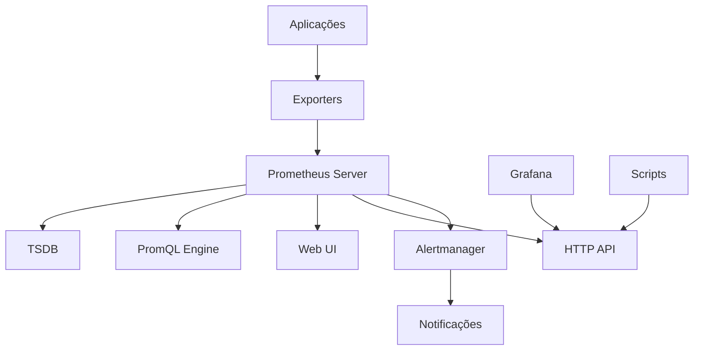

# 📊 MÓDULO 01: INTRODUÇÃO AO PROMETHEUS

> **Objetivo:** Compreender os conceitos fundamentais do Prometheus e sua arquitetura  
> **Duração:** 30 minutos  
> **Nível:** Iniciante

---

## 🎯 O QUE VOCÊ VAI APRENDER

Neste módulo você irá:
- ✅ Entender o que é o Prometheus e por que usá-lo
- ✅ Conhecer a arquitetura e componentes principais
- ✅ Compreender o modelo de dados time-series
- ✅ Aprender sobre o modelo Pull vs Push
- ✅ Identificar casos de uso práticos

---

## 🤔 O QUE É O PROMETHEUS?

### **Definição Simples**
O **Prometheus** é um sistema de monitoramento e alertas open-source que coleta e armazena métricas como dados de séries temporais (time-series).

### **Analogia Prática**
```
🏥 Imagine o Prometheus como um "médico" para sua infraestrutura:

👩‍⚕️ Médico (Prometheus)     →  🖥️ Paciente (Seus Serviços)
📊 Exames regulares         →  📈 Coleta de métricas
🩺 Instrumentos médicos     →  📡 Exporters
📋 Prontuário médico        →  💾 Base de dados TSDB
🚨 Alertas de emergência    →  ⚠️ Sistema de alertas
```

### **Características Principais**

| Característica | Descrição | Benefício |
|----------------|-----------|----------|
| **📈 Time-Series** | Dados organizados por tempo | Análise histórica e tendências |
| **🔍 PromQL** | Linguagem de consulta própria | Queries flexíveis e poderosas |
| **📡 Pull Model** | Coleta ativa de métricas | Controle centralizado |
| **🏷️ Labels** | Metadados dimensionais | Filtragem e agregação |
| **🚨 Alerting** | Sistema de alertas integrado | Notificações proativas |
| **🌐 Service Discovery** | Descoberta automática de targets | Escalabilidade automática |

---

## 🏗️ ARQUITETURA DO PROMETHEUS

### **Visão Geral dos Componentes**



### **1. 🖥️ Prometheus Server**
**O que faz:**
- Coleta métricas dos targets configurados
- Armazena dados na base TSDB
- Executa regras de alerta
- Serve a API HTTP e Web UI

**Exemplo de funcionamento:**
```yaml
# Configuração básica
global:
  scrape_interval: 15s     # Coleta a cada 15 segundos
  evaluation_interval: 15s # Avalia regras a cada 15 segundos

scrape_configs:
  - job_name: 'minha-aplicacao'
    static_configs:
      - targets: ['localhost:8080']
```

### **2. 📡 Exporters**
**O que são:**
Programas que expõem métricas de sistemas/aplicações no formato que o Prometheus entende.

**Tipos principais:**

| Exporter | Monitora | Porta Padrão | Exemplo de Métrica |
|----------|----------|--------------|-------------------|
| **Node Exporter** | Sistema operacional | 9100 | `node_cpu_seconds_total` |
| **cAdvisor** | Containers Docker | 8080 | `container_memory_usage_bytes` |
| **MySQL Exporter** | Banco MySQL | 9104 | `mysql_up` |
| **Blackbox Exporter** | Endpoints HTTP/TCP | 9115 | `probe_success` |
| **SNMP Exporter** | Dispositivos SNMP | 9116 | `snmp_up` |

**Exemplo prático:**
```bash
# Instalando Node Exporter
wget https://github.com/prometheus/node_exporter/releases/download/v1.6.1/node_exporter-1.6.1.linux-amd64.tar.gz
tar xvfz node_exporter-1.6.1.linux-amd64.tar.gz
./node_exporter

# Testando métricas
curl http://localhost:9100/metrics
```

### **3. 💾 TSDB (Time Series Database)**
**Características:**
- Otimizada para dados temporais
- Compressão eficiente
- Retenção configurável
- Consultas rápidas por tempo

**Estrutura de dados:**
```
Metric Name + Labels + Timestamp + Value

Exemplo:
http_requests_total{method="GET", status="200"} 1234 @1640995200
```

### **4. 🔍 PromQL Engine**
**O que faz:**
- Processa consultas PromQL
- Agrega dados de múltiplas séries
- Calcula funções matemáticas
- Retorna resultados em tempo real

**Exemplo de query:**
```promql
# Taxa de requisições por segundo nos últimos 5 minutos
rate(http_requests_total[5m])

# CPU usage médio por instância
avg by (instance) (cpu_usage_percent)
```

### **5. 🌐 Web UI**
**Funcionalidades:**
- Interface para queries PromQL
- Visualização de métricas
- Status de targets e regras
- Configuração básica

**Acesso:**
```
URL: http://localhost:9090
Seções principais:
- Graph: Consultas e gráficos
- Alerts: Alertas ativos
- Status: Estado do sistema
- Configuration: Configuração atual
```

---

## 🔄 MODELO PULL vs PUSH

### **🎯 Pull Model (Prometheus)**

**Como funciona:**
```
Prometheus Server  →  HTTP GET  →  Target (/metrics)
     ↓
  Armazena métricas na TSDB
```

**Vantagens:**
- ✅ **Controle centralizado:** Prometheus decide quando coletar
- ✅ **Detecção de falhas:** Se target não responde, Prometheus sabe
- ✅ **Debugging fácil:** Pode testar endpoints manualmente
- ✅ **Configuração simples:** Apenas URL e porta

**Desvantagens:**
- ❌ **Firewall complexo:** Prometheus precisa acessar todos os targets
- ❌ **Targets dinâmicos:** Precisa de service discovery
- ❌ **Latência de rede:** Pode afetar coleta

### **📤 Push Model (Alternativo)**

**Como funciona:**
```
Aplicação  →  HTTP POST  →  Collector (ex: Pushgateway)
     ↓
Prometheus  →  HTTP GET  →  Pushgateway
```

**Quando usar:**
- 🔄 Jobs batch/cron de curta duração
- 🔒 Aplicações atrás de firewall
- ☁️ Funções serverless/lambda

**Exemplo com Pushgateway:**
```bash
# Enviando métrica via push
echo "job_duration_seconds 45.2" | curl --data-binary @- \
  http://pushgateway:9091/metrics/job/backup_job/instance/server1
```

---

## 🏷️ MODELO DE DADOS: LABELS

### **Estrutura Básica**
```
metric_name{label1="value1", label2="value2"} value timestamp
```

### **Exemplo Prático**
```promql
# Métrica sem labels
http_requests_total 1500

# Métrica com labels (mais útil)
http_requests_total{method="GET", status="200", endpoint="/api/users"} 1200
http_requests_total{method="POST", status="201", endpoint="/api/users"} 150
http_requests_total{method="GET", status="404", endpoint="/api/orders"} 25
```

### **Tipos de Labels**

| Tipo | Descrição | Exemplo |
|------|-----------|--------|
| **Instance** | Identificação única do target | `instance="192.168.1.10:9100"` |
| **Job** | Grupo lógico de targets | `job="web-servers"` |
| **Custom** | Labels específicos da aplicação | `environment="production"` |

### **Boas Práticas para Labels**

```yaml
# ✅ Bom: Labels com cardinalidade baixa
labels:
  environment: production    # 3-4 valores possíveis
  datacenter: us-east-1     # 5-10 valores possíveis
  service: web-api          # 10-50 valores possíveis

# ❌ Ruim: Labels com cardinalidade alta
labels:
  user_id: "12345"          # Milhões de valores possíveis
  request_id: "abc-123"     # Valores únicos
  timestamp: "2025-01-01"   # Muitos valores diferentes
```

---

## 🎯 CASOS DE USO PRÁTICOS

### **1. 🖥️ Monitoramento de Infraestrutura**
```promql
# CPU usage por servidor
100 - (avg by (instance) (rate(node_cpu_seconds_total{mode="idle"}[5m])) * 100)

# Memória disponível
node_memory_MemAvailable_bytes / node_memory_MemTotal_bytes * 100

# Espaço em disco
(node_filesystem_size_bytes - node_filesystem_free_bytes) / node_filesystem_size_bytes * 100
```

### **2. 🌐 Monitoramento de Aplicações**
```promql
# Taxa de requisições HTTP
rate(http_requests_total[5m])

# Latência P95
histogram_quantile(0.95, rate(http_request_duration_seconds_bucket[5m]))

# Taxa de erro
rate(http_requests_total{status=~"5.."}[5m]) / rate(http_requests_total[5m]) * 100
```

### **3. 🐳 Monitoramento de Containers**
```promql
# CPU usage por container
rate(container_cpu_usage_seconds_total[5m]) * 100

# Memória usage por container
container_memory_usage_bytes / container_spec_memory_limit_bytes * 100

# Network I/O
rate(container_network_receive_bytes_total[5m])
```

### **4. 💾 Monitoramento de Banco de Dados**
```promql
# MySQL connections
mysql_global_status_threads_connected

# PostgreSQL query duration
rate(pg_stat_activity_max_tx_duration[5m])

# Redis memory usage
redis_memory_used_bytes / redis_memory_max_bytes * 100
```

---

## ✅ VANTAGENS DO PROMETHEUS

### **🚀 Performance e Escalabilidade**
- **Eficiência:** Coleta milhões de métricas por segundo
- **Compressão:** TSDB otimizada reduz uso de disco
- **Federação:** Múltiplas instâncias para grandes ambientes

### **🔧 Flexibilidade**
- **PromQL:** Linguagem de consulta poderosa
- **Labels:** Dimensionalidade infinita
- **Exporters:** Integração com qualquer sistema

### **🌍 Ecossistema**
- **Open Source:** Gratuito e código aberto
- **CNCF:** Projeto graduado da Cloud Native Computing Foundation
- **Comunidade:** Grande comunidade ativa

### **🔗 Integração**
- **Grafana:** Visualizações avançadas
- **Alertmanager:** Gerenciamento de alertas
- **Kubernetes:** Integração nativa

---

## ⚠️ LIMITAÇÕES E CONSIDERAÇÕES

### **🎯 Não é adequado para:**
- **Logs detalhados:** Use ELK Stack ou similar
- **Tracing distribuído:** Use Jaeger ou Zipkin
- **Dados transacionais:** Use bancos relacionais
- **Eventos únicos:** Use sistemas de eventos

### **🔧 Limitações técnicas:**
- **Cardinalidade alta:** Pode causar problemas de performance
- **Retenção longa:** Requer muito espaço em disco
- **Queries complexas:** Podem ser lentas em grandes datasets

### **💡 Boas práticas:**
```yaml
# Configuração de retenção
storage:
  tsdb:
    retention.time: 30d      # Manter dados por 30 dias
    retention.size: 50GB     # Ou até 50GB

# Configuração de performance
global:
  scrape_interval: 30s       # Não muito frequente
  evaluation_interval: 30s   # Mesma frequência
```

---

## 🎓 RESUMO DO MÓDULO

### **Conceitos Aprendidos:**
- ✅ **Prometheus:** Sistema de monitoramento time-series
- ✅ **Arquitetura:** Server, Exporters, TSDB, PromQL, Web UI
- ✅ **Pull Model:** Coleta ativa de métricas
- ✅ **Labels:** Dimensionalidade para filtragem e agregação
- ✅ **Casos de uso:** Infraestrutura, aplicações, containers, databases

### **Próximos Passos:**
1. 🔧 **[Módulo 02: Configuração Inicial](02-configuracao.md)** - Primeira execução
2. 📝 **[Módulo 03: Arquivo de Configuração](03-arquivo-config.md)** - Entendendo prometheus.yml
3. 📊 **[Módulo 04: Coleta de Métricas](04-coleta-metricas.md)** - Exporters e targets

---

## 🔗 LINKS ÚTEIS

- **[Documentação Oficial](https://prometheus.io/docs/introduction/overview/)**
- **[Exporters Oficiais](https://prometheus.io/docs/instrumenting/exporters/)**
- **[Prometheus no GitHub](https://github.com/prometheus/prometheus)**
- **[CNCF Prometheus](https://www.cncf.io/projects/prometheus/)**

---

**📚 Módulo Anterior:** *Nenhum*  
**📚 Próximo Módulo:** [02 - Configuração Inicial](02-configuracao.md)  
**🏠 Voltar ao:** [README Principal](README.md)

---

*Módulo criado pela comunidade DevOps*  
*Última atualização: Janeiro 2025*